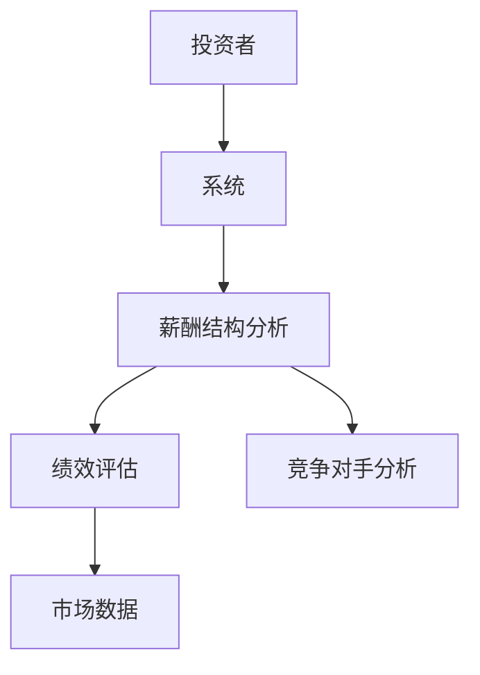
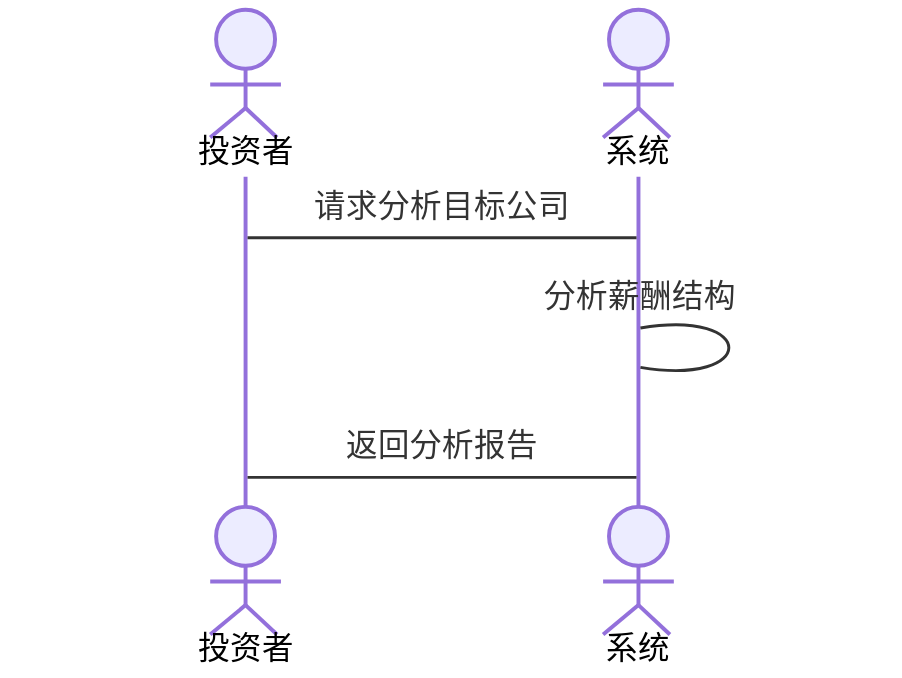

                 


# AI多智能体系统在价值投资中的管理层薪酬结构分析

> 关键词：AI多智能体系统、价值投资、管理层薪酬结构、多智能体系统、薪酬分析、价值投资策略

> 摘要：本文探讨AI多智能体系统在价值投资中的应用，重点分析管理层薪酬结构对投资决策的影响。通过多智能体系统的协作与竞争机制，优化对管理层激励机制的分析，揭示其对股价的影响，为投资者提供科学决策支持。

---

## 第一部分: 背景介绍

### 第1章: 问题背景

#### 1.1 价值投资的核心概念
- 价值投资是一种投资策略，强调以低于内在价值的价格购买优质资产。
- 核心在于识别被市场低估的公司，长期持有以实现收益。
- 管理层薪酬结构影响公司治理和管理层积极性，进而影响公司价值。

#### 1.2 管理层薪酬结构的重要性
- 薪酬结构包括固定工资、奖金、股权激励等，影响管理层决策。
- 股权激励与公司业绩挂钩，激励管理层追求长期价值。
- 现金激励可能引发短期行为，影响公司稳健发展。

#### 1.3 传统分析方法的局限性
- 传统方法依赖财务指标，忽视管理层激励机制的复杂性。
- 管理层行为对公司价值影响难以量化。
- 数据处理复杂，难以实时分析和调整策略。

### 第2章: 问题描述

#### 2.1 管理层薪酬结构的复杂性
- 包括短期和长期激励，涉及股票期权、限制性股票等。
- 不同激励方式对公司业绩的影响差异显著。

#### 2.2 传统分析方法的局限性
- 依赖经验判断，缺乏量化分析。
- 数据处理复杂，难以实时更新和调整。

#### 2.3 引入AI多智能体系统的必要性
- 多智能体系统能够处理多维数据，优化分析效率。
- 通过协作与竞争机制，模拟管理层决策过程，预测其对公司价值的影响。

### 第3章: 问题解决

#### 3.1 AI多智能体系统的核心优势
- 分布式计算能力，处理复杂数据。
- 协作与竞争机制，模拟真实决策过程。
- 实时数据分析，支持动态投资决策。

#### 3.2 多智能体系统在薪酬结构分析中的应用
- 分析不同激励方式对管理层行为的影响。
- 优化激励方案，提升公司价值。

#### 3.3 价值投资中的智能化转型
- 利用AI技术提升分析效率和准确性。
- 结合多智能体系统，优化投资策略。

## 第二部分: 核心概念与联系

### 第4章: 核心概念原理

#### 4.1 多智能体系统的定义与特点
- 分布式智能体，独立决策。
- 协作与竞争机制，实现全局最优。

#### 4.2 价值投资中的多智能体系统应用
- 分析管理层激励机制。
- 预测公司业绩变化。

#### 4.3 管理层薪酬结构的多维度分析
- 股权激励：绑定管理层利益，提升公司价值。
- 现金激励：短期行为风险。
- 绩效考核：激励与约束结合。

### 第5章: 概念属性特征对比

#### 5.1 不同激励方式的特征对比
| 激励方式 | 优点 | 缺点 |
|---------|------|------|
| 股权激励 | 长期激励，绑定利益 | 流动性差，风险高 |
| 现金激励 | 简单易行，短期效果明显 | 可能引发短期行为 |
| 绩效激励 | 综合考量，激励与约束结合 | 实施复杂，考核难度大 |

#### 5.2 管理层薪酬结构的属性分析
- 透明度：公开薪酬结构，增强信任。
- 合理性：激励机制合理，提升效率。
- 竞争性：薪酬水平与市场对标，吸引人才。

#### 5.3 AI多智能体系统的性能指标
- 处理效率：数据处理速度。
- 分析精度：预测准确性。
- 可扩展性：适应不同规模数据。

### 第6章: ER实体关系图

```mermaid
er
    actor 管理层
    actor 投资者
    actor 系统
    entity 薪酬结构
    entity 绩效指标
    entity 市场数据
    entity 竞争对手
    relation 管理层 -> 薪酬结构: 决定
    relation 投资者 -> 系统: 交互
    relation 系统 -> 薪酬结构: 分析
    relation 系统 -> 绩效指标: 评估
    relation 系统 -> 市场数据: 数据源
    relation 系统 -> 竞争对手: 对比
```

## 第三部分: 算法原理讲解

### 第7章: 多智能体系统算法

#### 7.1 分布式多智能体系统
- 各智能体独立决策，通过通信协作达成目标。
- 适用于复杂环境，提升系统鲁棒性。

#### 7.2 协作与竞争机制
- 协作：智能体共享信息，共同优化决策。
- 竞争：智能体之间竞争资源，提升效率。

#### 7.3 联合学习与知识共享
- 各智能体学习经验，共享知识。
- 通过知识共享，提升整体系统性能。

### 第8章: 算法实现

#### 8.1 多智能体协作流程


#### 8.2 Python代码实现
```python
import numpy as np
import pandas as pd

# 示例数据：管理层薪酬结构
data = {
    '公司名称': ['A', 'B', 'C'],
    '固定工资': [100, 200, 150],
    '奖金': [50, 70, 60],
    '股权激励': [20, 30, 25]
}

df = pd.DataFrame(data)

# 计算总薪酬
df['总薪酬'] = df['固定工资'] + df['奖金'] + df['股权激励']

print(df)
```

#### 8.3 数学模型与公式
- 博弈论模型：$v(S) = \sum_{i=1}^{n} v_i(S_i)$，表示各智能体的收益。
- 多智能体协作：$f(x) = \sum_{i=1}^{n} f_i(x_i)$，各智能体优化目标函数。

### 第9章: 数学模型与公式

#### 9.1 博弈论模型
$$v(S) = \sum_{i=1}^{n} v_i(S_i)$$

#### 9.2 多智能体协作
$$f(x) = \sum_{i=1}^{n} f_i(x_i)$$

#### 9.3 协作机制
各智能体协作，通过共享信息优化整体目标函数。

---

## 第四部分: 系统分析与架构设计

### 第10章: 系统分析

#### 10.1 问题场景
- 分析管理层薪酬结构，优化投资决策。
- 数据来源：市场数据、公司财报、行业基准。

### 第11章: 系统架构设计

#### 11.1 功能设计
- 数据采集：获取管理层薪酬数据。
- 数据处理：清洗、转换、分析。
- 智能分析：多智能体系统分析，生成报告。

#### 11.2 系统架构


#### 11.3 接口设计
- 数据接口：连接数据源。
- 分析接口：调用多智能体系统。
- 报告接口：输出分析结果。

### 第12章: 交互设计

#### 12.1 交互流程
- 投资者输入目标公司。
- 系统分析薪酬结构，生成报告。
- 投资者根据报告做出决策。

#### 12.2 交互序列图


---

## 第五部分: 项目实战

### 第13章: 环境配置

#### 13.1 数据源选择
- 公开数据：公司财报、市场数据。
- 第三方数据：行业基准、竞争对手信息。

### 第14章: 核心实现

#### 14.1 Python代码实现
```python
import numpy as np
import pandas as pd

# 数据获取
data = {
    '公司名称': ['A', 'B', 'C'],
    '固定工资': [100, 200, 150],
    '奖金': [50, 70, 60],
    '股权激励': [20, 30, 25]
}

df = pd.DataFrame(data)

# 数据分析
print("股权激励占比最高的公司是：", df[df['股权激励'] == df['股权激励'].max()]['公司名称'].values[0])
```

#### 14.2 算法实现
- 分析薪酬结构，评估管理层激励效果。

### 第15章: 实际案例分析

#### 15.1 案例介绍
- 分析某上市公司薪酬结构，评估投资价值。

#### 15.2 分析过程
- 数据清洗、特征提取、建模分析。
- 多智能体系统模拟管理层决策，预测股价变化。

#### 15.3 结果解读
- 预测公司业绩，评估投资价值。

---

## 第六部分: 最佳实践与总结

### 第16章: 最佳实践

#### 16.1 关键点总结
- 数据质量：确保数据准确可靠。
- 模型优化：定期更新和优化。
- 风险管理：控制投资风险。

#### 16.2 小结
- 多智能体系统在价值投资中的应用前景广阔。
- 管理层薪酬结构分析是优化投资决策的重要工具。

#### 16.3 注意事项
- 数据隐私：保护投资者信息。
- 模型局限：多智能体系统受数据质量和模型假设限制。

### 第17章: 拓展阅读

#### 17.1 推荐书籍
- 《价值投资实战手册》
- 《多智能体系统与分布式计算》

#### 17.2 相关课程
- AI多智能体系统
- 价值投资策略

---

## 作者

作者：AI天才研究院/AI Genius Institute & 禅与计算机程序设计艺术 /Zen And The Art of Computer Programming

---

这篇文章详细探讨了AI多智能体系统在价值投资中的应用，结合理论与实践，为投资者提供了科学的分析工具。希望对您有所帮助！

