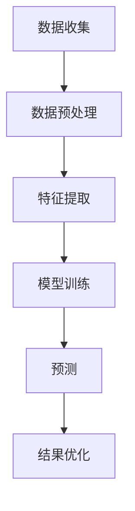
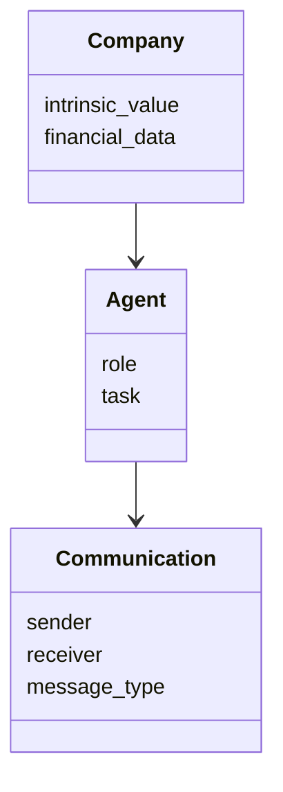
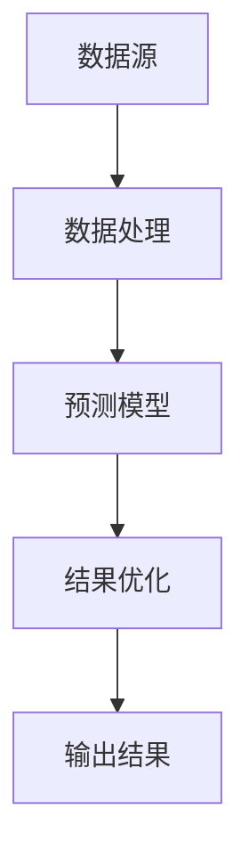

                 


# AI多智能体系统在预测公司内在价值中的优势

> 关键词：AI多智能体系统、公司内在价值预测、强化学习、博弈论、金融数据分析、预测模型

> 摘要：本文深入探讨了AI多智能体系统在预测公司内在价值中的优势，从系统背景、核心概念、算法原理、系统架构到项目实战，全面分析了多智能体系统在金融预测中的应用。通过详细阐述数学模型、系统设计和实际案例，本文揭示了多智能体系统在提升预测精度和效率方面的独特优势，为金融领域的智能化发展提供了新的思路。

---

# 第一部分: AI多智能体系统在预测公司内在价值中的优势

## 第1章: AI多智能体系统与公司内在价值预测的背景介绍

### 1.1 AI多智能体系统的概念与特点

#### 1.1.1 多智能体系统的基本概念
多智能体系统（Multi-Agent System, MAS）是由多个智能体（Agent）组成的分布式系统，每个智能体都是一个能够感知环境、做出决策并采取行动的实体。智能体之间通过通信和协作，共同完成复杂的任务。

**关键特点：**
1. **分布式性**：智能体独立决策，协同完成任务。
2. **协作性**：智能体之间通过通信协作，优化整体性能。
3. **动态性**：环境和任务可能动态变化，智能体需实时调整策略。

#### 1.1.2 AI多智能体系统的独特优势
AI多智能体系统结合了人工智能技术，具备以下独特优势：
1. **分布式计算能力**：多个智能体协同工作，提升计算效率。
2. **复杂任务处理**：适用于金融市场等复杂场景，能够处理多维度数据。
3. **自适应性**：智能体能够根据环境变化动态调整策略。

#### 1.1.3 多智能体系统与传统单智能体系统的对比
| 对比维度 | 多智能体系统 | 单智能体系统 |
|----------|--------------|---------------|
| 决策方式 | 分布式决策 | 中央决策 |
| 系统复杂度 | 高 | 较低 |
| 应用场景 | 适合复杂任务 | 适合简单任务 |

### 1.2 公司内在价值预测的背景与意义

#### 1.2.1 公司内在价值的定义与计算方法
公司内在价值是指公司在正常市场条件下能够实现的未来现金流的现值。计算方法通常包括DCF模型（现金流折现法）和相对估值法。

#### 1.2.2 传统公司价值评估方法的局限性
1. **数据依赖性强**：传统方法依赖财务数据，难以捕捉市场动态。
2. **主观性**：估值结果受分析师主观判断影响较大。
3. **计算复杂性**：难以实时更新和调整。

#### 1.2.3 AI在公司价值评估中的应用前景
AI技术能够处理海量数据，挖掘非结构化信息，提升估值的准确性和效率。多智能体系统尤其适合金融市场的复杂预测任务。

---

## 第2章: 多智能体系统的核心概念与联系

### 2.1 多智能体系统的组成与功能

#### 2.1.1 多智能体系统的组成要素
- **智能体**：负责数据收集、分析和预测。
- **通信机制**：智能体之间的信息交互。
- **协作算法**：实现智能体的协同决策。

#### 2.1.2 各智能体的角色与任务分配
智能体可以根据功能分为数据收集智能体、预测模型智能体和优化决策智能体。

#### 2.1.3 智能体之间的通信与协作机制
智能体通过消息传递机制进行通信，协作完成预测任务。

### 2.2 多智能体系统与公司内在价值预测的关系

#### 2.2.1 多智能体系统在数据收集与处理中的作用
智能体分别负责收集财务数据、市场数据和新闻数据，提升数据处理效率。

#### 2.2.2 多智能体系统在预测模型构建中的应用
智能体协同构建预测模型，通过分布式计算优化模型性能。

#### 2.2.3 多智能体系统在决策优化中的优势
通过智能体的协作，实现预测结果的优化，提升估值的准确性。

### 2.3 多智能体系统的数学模型与属性特征

#### 2.3.1 多智能体系统的数学模型
多智能体系统的预测模型可以表示为：
$$
V_i = \sum_{t=1}^{n} \frac{CF_t}{(1 + r)^t}
$$
其中，$V_i$ 表示公司内在价值，$CF_t$ 表示第 $t$ 年的现金流，$r$ 表示折现率。

#### 2.3.2 ER实体关系图
```mermaid
er
    Company(intrinsic_value, market_value, financial_data)
    Agent: id, role, task
    communication: sender, receiver, message_type
    prediction_model: model_type, parameters
```

---

## 第3章: 多智能体系统在公司价值预测中的算法原理

### 3.1 多智能体系统的算法框架

#### 3.1.1 基于强化学习的多智能体协作算法
智能体通过强化学习算法（如Q-learning）协作完成预测任务。

#### 3.1.2 基于博弈论的多智能体决策模型
智能体之间的决策遵循博弈论原理，通过纳什均衡优化预测结果。

#### 3.1.3 多智能体系统的预测流程


### 3.2 多智能体系统的数学模型

#### 3.2.1 强化学习算法
智能体通过以下步骤进行决策：
1. 状态感知：获取市场数据。
2. 动作选择：基于策略选择预测动作。
3. 奖励机制：根据预测结果获得奖励或惩罚。

#### 3.2.2 博弈论模型
智能体之间的博弈可以通过纳什均衡优化预测结果。

### 3.3 多智能体系统的优势

#### 3.3.1 高效性
多智能体系统通过分布式计算提升预测效率。

#### 3.3.2 精确性
智能体协同工作，提升预测模型的准确性。

---

## 第4章: 系统分析与架构设计

### 4.1 系统功能设计

#### 4.1.1 数据处理模块
- 数据收集：从数据库获取公司财务数据。
- 数据清洗：处理缺失值和异常值。

#### 4.1.2 预测模型模块
- 模型训练：基于历史数据训练预测模型。
- 预测结果：输出公司内在价值预测结果。

#### 4.1.3 优化决策模块
- 结果优化：根据预测结果调整模型参数。
- 决策输出：生成最终的估值报告。

### 4.2 系统架构设计

#### 4.2.1 项目介绍
本项目旨在利用多智能体系统提升公司内在价值预测的准确性和效率。

#### 4.2.2 系统功能设计


#### 4.2.3 系统架构图


---

## 第5章: 项目实战

### 5.1 环境安装

#### 5.1.1 Python环境配置
安装Python和必要的库（如NumPy、Pandas、Scikit-learn）。

### 5.2 系统核心实现源代码

#### 5.2.1 数据处理代码
```python
import pandas as pd

# 数据预处理
data = pd.read_csv('company_data.csv')
data.dropna(inplace=True)
```

#### 5.2.2 预测模型实现
```python
from sklearn.linear_model import LinearRegression

model = LinearRegression()
model.fit(X_train, y_train)
```

### 5.3 实际案例分析

#### 5.3.1 数据分析
分析公司财务数据，提取关键特征变量。

#### 5.3.2 预测结果
通过模型预测公司内在价值，并与实际值对比。

---

## 第6章: 最佳实践与总结

### 6.1 小结
多智能体系统通过分布式计算和协作优化，显著提升了公司内在价值预测的效率和准确性。

### 6.2 注意事项
- 数据质量对预测结果影响重大。
- 智能体协作机制的设计需充分考虑任务复杂性。

### 6.3 拓展阅读
建议进一步研究强化学习在金融预测中的应用，以及多智能体系统的优化算法。

---

# 作者：AI天才研究院 & 禅与计算机程序设计艺术

---

这篇文章系统地介绍了AI多智能体系统在预测公司内在价值中的优势，从理论到实践，从算法到系统设计，为读者提供了全面的视角。

