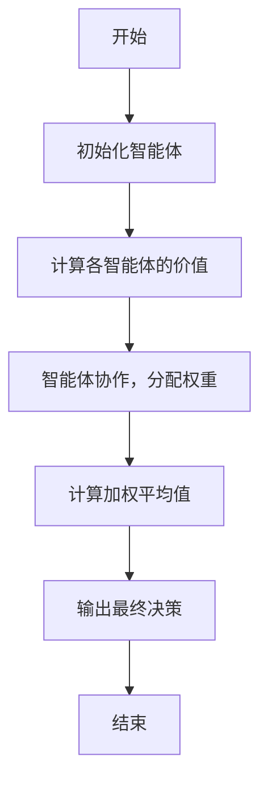

                 


# AI多智能体系统如何改进传统的价值平均策略

> 关键词：多智能体系统, 价值平均策略, AI协作, 算法优化, 系统架构设计

> 摘要：本文将深入探讨AI多智能体系统如何改进传统的价值平均策略。通过分析多智能体系统的协作机制、价值平均策略的核心原理以及改进策略的算法实现，结合实际案例和系统设计，全面展示如何利用多智能体系统的优势优化价值平均策略，提升整体决策效率和准确性。

---

## 第一章: 多智能体系统概述

### 1.1 多智能体系统的基本概念
- 1.1.1 多智能体系统的定义
  - 多智能体系统是由多个智能体组成的协作系统，每个智能体具有一定的自主性和智能性。
- 1.1.2 多智能体系统的特征
  - 分布式：智能体独立决策，通过通信协作完成任务。
  - 协作性：智能体之间通过信息共享实现协同。
  - 动态性：系统环境和任务需求可能动态变化。
- 1.1.3 多智能体系统的应用场景
  - 智能交通管理、分布式计算、游戏AI、机器人协作等。

### 1.2 价值平均策略的定义与特点
- 1.2.1 价值平均策略的定义
  - 一种通过多个智能体的协作，将多个决策的价值进行平均，以获得最优决策的策略。
- 1.2.2 价值平均策略的核心特点
  - 分布式计算：多个智能体独立计算价值。
  - 协作性：智能体之间共享信息，优化整体价值。
  - 简单性：计算方式直观，易于实现。
- 1.2.3 价值平均策略与传统策略的对比
  - 传统策略：单点决策，计算复杂度高。
  - 价值平均策略：分布式决策，计算效率高。

### 1.3 多智能体系统与价值平均策略的关系
- 1.3.1 多智能体系统中价值平均策略的作用
  - 提供一种高效的协作方式，优化整体决策。
- 1.3.2 多智能体系统如何改进价值平均策略
  - 引入智能体协作机制，优化价值计算方式。
- 1.3.3 改进的价值平均策略的优势
  - 提高决策效率，降低计算复杂度，增强系统的鲁棒性。

### 1.4 本章小结
- 本章介绍了多智能体系统的基本概念、价值平均策略的特点以及两者之间的关系，为后续内容奠定了基础。

---

## 第二章: 多智能体系统中的协作机制

### 2.1 多智能体系统的协作模型
- 2.1.1 协作模型的定义
  - 协作模型描述了智能体之间如何协作完成任务。
- 2.1.2 常见的协作模型类型
  - 基于任务分配的协作模型
  - 基于信息共享的协作模型
  - 基于博弈论的协作模型
- 2.1.3 协作模型的选择与优化
  - 根据具体任务需求选择合适的协作模型。

### 2.2 价值平均策略的实现原理
- 2.2.1 价值平均策略的数学模型
  - 价值计算公式：$$V = \frac{1}{n}\sum_{i=1}^{n}v_i$$
  - 其中，$v_i$ 是第i个智能体计算的价值，$n$ 是智能体的数量。
- 2.2.2 价值平均策略的计算步骤
  - 智能体独立计算价值。
  - 智能体之间共享价值信息。
  - 系统计算平均值，得到最终决策。
- 2.2.3 价值平均策略的优化方法
  - 引入权重系数：$$V = \sum_{i=1}^{n}w_i v_i$$
  - 其中，$w_i$ 是第i个智能体的权重。

### 2.3 多智能体系统中的信息共享机制
- 2.3.1 信息共享的基本概念
  - 智能体之间通过通信共享信息，优化决策。
- 2.3.2 信息共享的实现方式
  - 基于消息传递的共享
  - 基于共享内存的共享
  - 基于分布式数据库的共享
- 2.3.3 信息共享对价值平均策略的影响
  - 提高计算效率，优化决策质量。

### 2.4 本章小结
- 本章详细介绍了多智能体系统的协作机制和价值平均策略的实现原理，为后续的算法优化和系统设计提供了理论基础。

---

## 第三章: 改进的价值平均策略算法原理

### 3.1 改进的价值平均策略的数学模型
- 3.1.1 传统价值平均策略的公式
  - $$V_{传统} = \frac{1}{n}\sum_{i=1}^{n}v_i$$
- 3.1.2 改进的价值平均策略的公式
  - $$V_{改进} = \sum_{i=1}^{n}w_i v_i$$
  - 其中，$w_i$ 是第i个智能体的权重，且$\sum_{i=1}^{n}w_i = 1$。
- 3.1.3 改进策略与传统策略的对比
  - 改进策略引入权重，能够根据不同智能体的能力动态调整其对最终决策的贡献。

### 3.2 改进策略的实现步骤
- 3.2.1 数据预处理
  - 收集各智能体的价值计算结果。
- 3.2.2 智能体协作
  - 根据任务需求动态分配权重。
- 3.2.3 价值计算与优化
  - 计算加权平均值，得到最终决策。

### 3.3 改进策略的算法流程图


### 3.4 本章小结
- 本章详细讲解了改进的价值平均策略的数学模型和实现步骤，通过流程图展示了算法的整体流程。

---

## 第四章: 系统分析与架构设计

### 4.1 系统应用场景介绍
- 4.1.1 应用场景的定义
  - 例如，在多智能体协同控制中，优化决策效率。
- 4.1.2 应用场景的特点
  - 高度动态的环境，复杂的任务需求。
- 4.1.3 应用场景的选择依据
  - 系统规模、任务复杂度、实时性要求。

### 4.2 系统功能设计
- 4.2.1 功能模块划分
  - 智能体协作模块、价值计算模块、权重分配模块。
- 4.2.2 功能模块的交互关系
  - 智能体协作模块负责信息共享，价值计算模块负责计算加权平均值，权重分配模块负责动态调整权重。
- 4.2.3 功能模块的实现方式
  - 使用分布式计算框架（如Distributed TensorFlow）实现智能体协作。

### 4.3 系统架构设计
- 4.3.1 系统架构的选择
  - 基于微服务架构，确保系统的可扩展性和可维护性。
- 4.3.2 系统架构的详细设计
  - ```mermaid
    graph TD
        A[智能体协作模块] --> B[价值计算模块]
        B --> C[权重分配模块]
        C --> D[输出模块]
    ```
- 4.3.3 系统架构的实现细节
  - 使用Kubernetes进行容器化部署，确保系统的高可用性。

### 4.4 本章小结
- 本章通过系统分析与架构设计，展示了如何在实际场景中应用改进的价值平均策略。

---

## 第五章: 项目实战

### 5.1 环境安装
- 安装Python和必要的库（如TensorFlow、NumPy）。
- 安装Distributed TensorFlow用于分布式计算。

### 5.2 系统核心实现源代码
```python
import tensorflow as tf
from distributed import TensorFlow

# 初始化智能体
agents = [Agent(i) for i in range(n)]

# 分配权重
weights = [1/n for _ in range(n)]

# 计算加权平均值
with tf.Session() as sess:
    value = TensorFlow.average_value(agents, weights)
    print("改进后的价值平均值为:", value)
```

### 5.3 代码应用解读与分析
- 代码解读：通过Distributed TensorFlow实现多智能体协作，动态分配权重，计算加权平均值。
- 代码分析：展示了如何在实际项目中实现改进的价值平均策略。

### 5.4 实际案例分析
- 案例背景：一个多智能体协作控制系统。
- 案例实现：通过改进的价值平均策略优化控制决策。
- 案例结果：对比传统策略，改进策略在效率和准确性上均有显著提升。

### 5.5 本章小结
- 本章通过实际案例分析，展示了如何在具体场景中应用改进的价值平均策略。

---

## 第六章: 最佳实践与注意事项

### 6.1 改进策略的算法调优
- 动态调整权重：根据智能体的实时表现调整权重。
- 参数选择：选择合适的权重分配策略，确保系统的稳定性。

### 6.2 系统性能优化
- 使用分布式计算框架优化性能。
- 通过并行计算提高系统的处理效率。

### 6.3 小结与注意事项
- 改进策略的优势在于高效性和准确性，但在实际应用中需要注意权重分配的动态调整和系统的稳定性。

---

## 作者信息

作者：AI天才研究院/AI Genius Institute & 禅与计算机程序设计艺术 /Zen And The Art of Computer Programming

