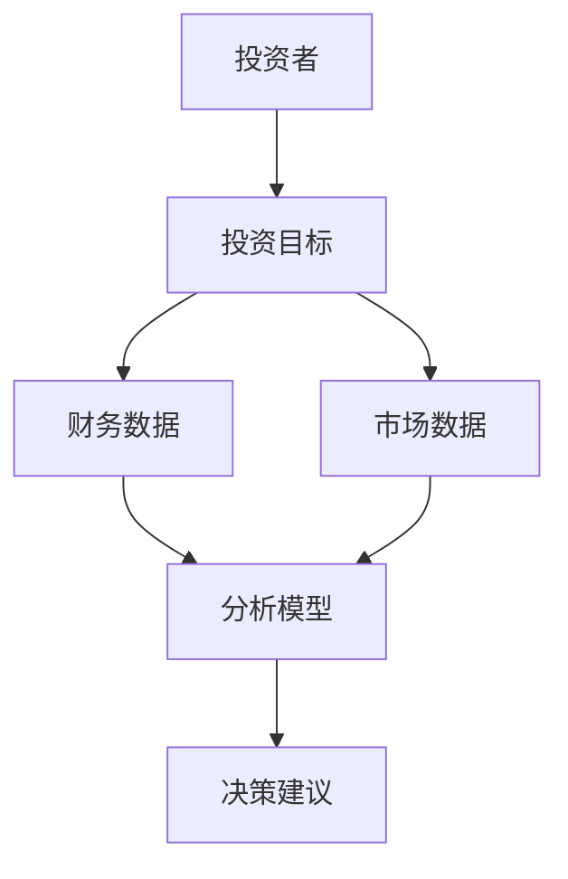
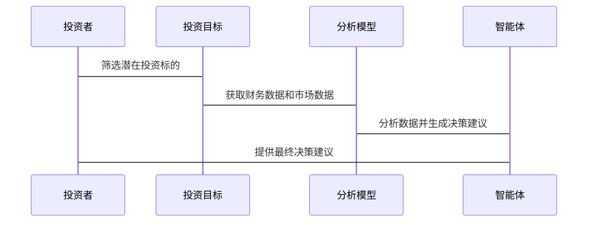

                 


# AI多智能体系统如何改进传统的价值投资尽职调查流程

> 关键词：AI多智能体系统、价值投资、尽职调查、金融分析、分布式计算

> 摘要：本文探讨了AI多智能体系统在改进传统价值投资尽职调查流程中的应用。通过分析多智能体系统的算法原理、系统架构以及实际案例，展示了如何利用AI技术提升尽职调查的效率和准确性。文章还详细讲解了数学模型、系统设计和代码实现，为读者提供了全面的技术解读。

---

## 第一部分: AI多智能体系统与价值投资尽职调查概述

### 第1章: AI多智能体系统与价值投资概述

#### 1.1 价值投资的基本概念

- **1.1.1 价值投资的定义**  
  价值投资是一种以基本面分析为基础的投资策略，旨在通过分析企业的财务状况、行业地位、竞争优势等因素，找到被市场低估的投资标的。其核心理念是“买入并持有”，追求长期稳定的收益。

- **1.1.2 价值投资的核心原则**  
  - 坚持安全边际：投资标的的内在价值应显著高于其市场价格。  
  - 长期视角：关注企业的长期盈利能力，而非短期市场波动。  
  - 集中投资：将资金集中在少数具有竞争优势的企业上。  

- **1.1.3 价值投资的流程与挑战**  
  传统价值投资流程包括以下几个步骤：  
  1. 确定投资目标：根据市场趋势和行业分析，筛选潜在投资标的。  
  2. 财务分析：对目标企业的财务报表进行深入分析，评估其盈利能力、偿债能力等。  
  3. 行业分析：研究企业的行业地位、竞争优势和未来发展前景。  
  4. 风险评估：识别潜在风险，并制定风险管理策略。  
  5. 投资决策：基于综合分析结果，做出投资决策。  

  **挑战**：传统流程依赖人工分析，存在效率低、覆盖面有限、难以处理海量数据等问题。

---

#### 1.2 多智能体系统的基本概念

- **1.2.1 多智能体系统的定义**  
  多智能体系统（Multi-Agent System, MAS）是由多个智能体（Agent）组成的系统，每个智能体能够独立感知环境、自主决策并执行任务。智能体之间通过通信和协作，共同完成复杂任务。

- **1.2.2 多智能体系统的组成与特点**  
  - **组成**：由多个智能体、通信机制、协作协议和环境组成。  
  - **特点**：分布式、协作性、自主性、反应性。  

- **1.2.3 多智能体系统与传统单智能体系统的区别**  
  | 特性 | 单智能体系统 | 多智能体系统 |  
  |------|--------------|--------------|  
  | 决策 | 中央决策 | 分布式决策 |  
  | 通信 | 无 | 智能体之间通信 |  
  | 协作 | 无 | 强调协作 |  

---

#### 1.3 AI多智能体系统在金融领域的应用前景

- **1.3.1 金融领域的多智能体系统应用现状**  
  多智能体系统已在金融领域得到广泛应用，例如高频交易、风险评估、市场预测等。  

- **1.3.2 AI多智能体系统在金融中的优势**  
  - 提高效率：多智能体系统可以同时处理海量数据，显著提升分析效率。  
  - 增强决策能力：通过智能体协作，能够综合考虑多个因素，做出更优决策。  
  - 实时性：多智能体系统能够实时响应市场变化，快速调整策略。  

- **1.3.3 未来发展趋势与挑战**  
  - **趋势**：随着AI技术的进步，多智能体系统将在金融领域发挥更大的作用。  
  - **挑战**：智能体之间的协作优化、系统安全性、数据隐私等问题仍需进一步解决。  

---

#### 1.4 本章小结  
本章介绍了价值投资的基本概念、多智能体系统的组成与特点，以及AI多智能体系统在金融领域的应用前景。通过对比分析，展示了AI多智能体系统在价值投资中的潜力。

---

### 第2章: 价值投资尽职调查流程的背景与问题分析

#### 2.1 传统价值投资尽职调查流程

- **2.1.1 尽职调查的基本流程**  
  1. 初步筛选：根据市场趋势和行业分析，筛选潜在投资标的。  
  2. 财务分析：对目标企业的财务报表进行深入分析。  
  3. 行业分析：研究企业的行业地位和竞争优势。  
  4. 风险评估：识别潜在风险并制定风险管理策略。  
  5. 投资决策：综合分析结果，做出投资决策。  

- **2.1.2 尽职调查的关键环节**  
  - 财务分析：包括收入、利润、现金流等指标的分析。  
  - 行业分析：包括行业趋势、竞争对手分析等。  
  - 风险评估：包括市场风险、财务风险等。  

- **2.1.3 传统尽职调查的局限性**  
  - 数据处理能力有限：传统方法难以处理海量数据。  
  - 分析效率低：人工分析耗时长，效率低。  
  - 风险评估不全面：难以综合考虑多种风险因素。  

---

#### 2.2 AI多智能体系统如何改进尽职调查

- **2.2.1 多智能体系统在尽职调查中的潜在应用**  
  - 数据采集与处理：智能体负责从多个来源采集数据并进行初步处理。  
  - 分析与协作：多个智能体分别负责不同领域的分析任务，并通过协作生成综合报告。  
  - 决策支持：基于分析结果，智能体提供决策建议。  

- **2.2.2 多智能体系统的优势与特点**  
  - 高效性：多智能体系统可以同时处理大量数据，显著提高分析效率。  
  - 全面性：通过智能体协作，能够综合考虑多个因素，做出更全面的分析。  
  - 实时性：系统能够实时响应市场变化，快速调整分析策略。  

- **2.2.3 与传统方法的对比分析**  
  | 特性 | 传统方法 | AI多智能体系统 |  
  |------|-----------|----------------|  
  | 数据处理 | 单一来源，效率低 | 多源数据，高效处理 |  
  | 分析效率 | 人工分析，耗时长 | 多智能体协作，效率高 |  
  | 决策支持 | 依赖人工经验 | 智能体协作，决策支持 |  

---

#### 2.3 问题背景与目标设定

- **2.3.1 问题背景的详细描述**  
  传统价值投资尽职调查流程存在效率低、覆盖面有限、难以处理海量数据等问题。  

- **2.3.2 问题解决的目标**  
  利用AI多智能体系统，改进尽职调查流程，提高分析效率和准确性。  

- **2.3.3 边界与外延的定义**  
  - **边界**：仅关注价值投资领域的尽职调查流程改进。  
  - **外延**：不涉及其他投资策略或非金融领域。  

---

#### 2.4 核心概念与联系

- **2.4.1 核心概念的原理**  
  - 多智能体系统的协作机制：智能体之间通过通信和协作，共同完成任务。  
  - 强化学习算法：通过奖励机制，优化智能体的决策策略。  

- **2.4.2 核心概念的属性特征对比表格**  
  | 属性 | 传统尽职调查 | AI多智能体系统 |  
  |------|---------------|----------------|  
  | 数据来源 | 单一来源 | 多源数据 |  
  | 分析效率 | 低效 | 高效 |  
  | 决策支持 | 依赖人工经验 | 智能决策支持 |  

- **2.4.3 ER实体关系图架构的 Mermaid 流程图**  



---

#### 2.5 本章小结  
本章分析了传统价值投资尽职调查流程的背景、问题及其改进目标，展示了AI多智能体系统在其中的应用潜力。

---

## 第三部分: AI多智能体系统的算法原理与数学模型

### 第3章: AI多智能体系统的算法原理与数学模型

#### 3.1 多智能体系统的算法原理

- **3.1.1 分布式计算的基本原理**  
  分布式计算通过将任务分解到多个节点，利用并行计算提高效率。  

- **3.1.2 强化学习的算法特点**  
  强化学习是一种通过试错机制，学习最优策略的方法。  

- **3.1.3 多智能体协作的机制**  
  多智能体协作通过通信和协作协议，实现任务的分工与协同。  

---

#### 3.2 多智能体系统的核心算法

- **3.2.1 强化学习算法（Q-Learning）**  
  Q-Learning是一种经典的强化学习算法，通过更新Q值表，学习最优策略。  

  $$ Q(s,a) = r + \gamma \max Q(s',a') $$  

  - **参数**：  
    - \( s \): 当前状态  
    - \( a \): 动作  
    - \( r \): 奖励  
    - \( \gamma \): 折扣因子  

- **3.2.2 分布式计算算法（Distributed Computing）**  
  分布式计算通过任务分解和并行处理，提高计算效率。  

- **3.2.3 协作学习算法（Collaborative Learning）**  
  协作学习通过智能体之间的协作，共同优化学习过程。  

---

#### 3.3 数学模型与公式

- **3.3.1 强化学习的基本公式**  
  $$ Q(s,a) = r + \gamma \max Q(s',a') $$  

- **3.3.2 分布式计算的数学模型**  
  $$ \text{Total Reward} = \sum_{i=1}^{n} r_i $$  

---

### 第4章: 价值投资尽职调查的系统架构设计

#### 4.1 问题场景介绍

- **4.1.1 项目介绍**  
  本项目旨在利用AI多智能体系统，改进价值投资尽职调查流程。  

- **4.1.2 问题场景描述**  
  通过多智能体协作，实现高效、全面的尽职调查。  

---

#### 4.2 系统功能设计

- **4.2.1 领域模型（Mermaid 类图）**  


---

#### 4.3 系统架构设计（Mermaid 架构图）  


---

#### 4.4 系统接口设计

- **4.4.1 接口描述**  
  - 智能体之间通过通信模块进行交互。  
  - 分析模型通过接口与智能体连接。  

---

#### 4.5 系统交互（Mermaid 序列图）  



---

### 第5章: 价值投资尽职调查的项目实战

#### 5.1 环境安装

- **5.1.1 环境要求**  
  - Python 3.8+  
  - 依赖库：numpy、pandas、scikit-learn、强化学习库  

---

#### 5.2 系统核心实现源代码

- **5.2.1 强化学习代码示例**  

```python
import numpy as np

class QLearning:
    def __init__(self, state_space, action_space, gamma=0.9):
        self.state_space = state_space
        self.action_space = action_space
        self.gamma = gamma
        self.q_table = np.zeros((state_space, action_space))

    def choose_action(self, state, epsilon=0.1):
        if np.random.random() < epsilon:
            return np.random.randint(self.action_space)
        return np.argmax(self.q_table[state])

    def update_q_table(self, state, action, reward, next_state):
        self.q_table[state, action] = reward + self.gamma * np.max(self.q_table[next_state])
```

---

#### 5.3 代码应用解读与分析

- **5.3.1 代码功能分析**  
  上述代码实现了Q-Learning算法，用于强化学习场景。智能体通过与环境交互，逐步学习最优策略。  

- **5.3.2 代码实现细节**  
  - `choose_action`方法：根据epsilon-greedy策略选择动作。  
  - `update_q_table`方法：更新Q值表，基于当前状态、动作、奖励和下一个状态。  

---

### 第6章: 最佳实践与小结

#### 6.1 最佳实践 tips

- **6.1.1 系统设计注意事项**  
  - 确保智能体之间的通信高效。  
  - 设计合理的奖励机制，避免过拟合。  

- **6.1.2 代码实现建议**  
  - 使用现有强化学习库（如OpenAI Gym）可以简化实现。  
  - 定期监控系统性能，及时优化。  

---

#### 6.2 小结

本文详细探讨了AI多智能体系统在改进价值投资尽职调查流程中的应用。通过算法原理、系统架构设计和项目实战的讲解，展示了如何利用AI技术提升尽职调查的效率和准确性。

---

## 作者：AI天才研究院/AI Genius Institute & 禅与计算机程序设计艺术/Zen And The Art of Computer Programming

---

通过以上目录和内容，我们可以看到，AI多智能体系统在价值投资尽职调查中的应用前景广阔。通过分布式计算、强化学习等技术，可以显著提升分析效率和决策准确性。未来，随着AI技术的进一步发展，AI多智能体系统将在金融领域发挥更大的作用。

