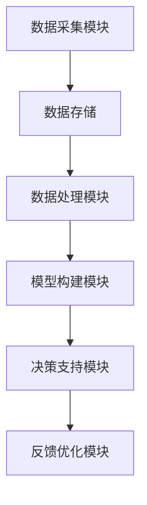

                 


# AI多智能体系统如何改进传统的价值投资师徒培养模式

## 关键词：AI多智能体系统，价值投资，师徒制，金融教育，协作学习

## 摘要：
本文探讨了如何利用AI多智能体系统来优化传统的价值投资师徒培养模式。通过分析价值投资的核心要素、传统师徒制的优缺点以及多智能体系统的优势，本文提出了一种基于AI多智能体的新型培养模式，旨在提高学习效率、增强实践能力和提升决策能力。本文详细介绍了系统的算法原理、系统架构设计以及实际案例分析，为读者提供了一套可行的解决方案。

---

# 第1章: 价值投资与传统师徒制的背景与挑战

## 1.1 价值投资的核心理念
### 1.1.1 价值投资的定义与特点
价值投资是一种以基本面分析为基础的投资策略，强调以低于内在价值的价格购买优质资产。其核心理念包括长期视角、安全边际和逆向思维。

### 1.1.2 价值投资的核心要素
- **财务指标**：如市盈率、市净率、ROE等。
- **市场情绪**：市场波动、投资者心理。
- **行业趋势**：宏观经济环境、行业周期。

### 1.1.3 价值投资的现状与挑战
- 传统价值投资依赖个人经验和主观判断，存在主观性较强、效率较低的问题。
- 现代金融市场复杂多变，单凭个人能力难以应对。

## 1.2 传统师徒制的优缺点
### 1.2.1 师徒制的定义与特点
师徒制是一种一对一或一对多的 mentorship 模式，强调经验传承和个性化指导。

### 1.2.2 师徒制在价值投资中的优势
- 知识的深度传递。
- 实践经验的积累。
- 个性化指导。

### 1.2.3 师徒制在现代金融环境中的局限性
- 资源分配不均，优质导师稀缺。
- 效率低下，难以大规模复制。
- 知识更新慢，难以适应快速变化的市场。

## 1.3 AI多智能体系统的基本概念
### 1.3.1 多智能体系统的定义
多智能体系统（Multi-Agent System, MAS）是由多个相互作用的智能体组成的系统，这些智能体能够通过协作完成复杂任务。

### 1.3.2 多智能体系统的分类
- 基于任务的MAS：专注于完成特定任务。
- 基于市场的MAS：模拟市场行为。
- 基于协作的MAS：强调智能体之间的协作。

### 1.3.3 多智能体系统在金融领域的应用潜力
- 数据分析与预测。
- 投资组合优化。
- 风险管理。

## 1.4 本章小结
本章介绍了价值投资的核心理念和传统师徒制的优缺点，分析了AI多智能体系统的基本概念及其在金融领域的潜力，为后续内容奠定了基础。

---

# 第2章: AI多智能体系统的核心概念与价值投资的结合

## 2.1 多智能体系统的核心原理
### 2.1.1 多智能体系统的协作机制
- 通信协议：智能体之间通过消息传递进行协作。
- 协作任务分配：基于角色和能力分配任务。
- 决策机制：基于局部信息做出决策。

### 2.1.2 多智能体系统的通信协议
- 通信方式：点对点通信或广播通信。
- 消息格式：JSON、XML等。
- 通信频率：实时通信或周期性通信。

### 2.1.3 多智能体系统的自适应能力
- 自适应学习：基于反馈调整策略。
- 自组织能力：智能体能够自主调整结构。
- 稳定性：系统具备容错和恢复能力。

## 2.2 价值投资中的关键要素
### 2.2.1 财务指标的加权评估
- 市盈率（P/E）、市净率（P/B）、股息率（Dividend Yield）等。
- 加权公式：$$ w_i = \frac{w_i}{\sum w_i} $$

### 2.2.2 市场情绪的量化
- 基于新闻情感分析、社交媒体情绪指数。
- 情绪指数公式：$$ S(t) = \alpha \cdot S(t-1) + (1-\alpha) \cdot E[t] $$

### 2.2.3 行业趋势的判断
- 宏观经济指标：GDP、CPI、利率等。
- 行业周期分析：成熟期、成长期、衰退期。

## 2.3 多智能体系统与价值投资的结合点
### 2.3.1 数据采集与处理
- 财务数据：上市公司财报、财务指标。
- 市场数据：股价、成交量、市场情绪。

### 2.3.2 模型构建与优化
- 基于机器学习的预测模型。
- 集成学习：Bagging、Boosting。
- 超参数优化：网格搜索、随机搜索。

### 2.3.3 决策支持与反馈机制
- 多智能体系统的决策支持：基于模型预测生成投资建议。
- 反馈机制：根据市场反馈调整模型参数。

## 2.4 本章小结
本章详细阐述了多智能体系统的核心原理，并探讨了其与价值投资的结合点，强调了数据处理、模型构建和决策支持的重要性。

---

# 第3章: 多智能体系统在价值投资中的算法原理

## 3.1 多智能体协作算法
### 3.1.1 分布式计算的基本原理
- 分布式任务分配：将任务分解为子任务，分配给不同的智能体。
- 分布式通信：通过网络进行数据交换。
- 分布式决策：每个智能体基于局部信息做出决策。

### 3.1.2 多智能体协作的通信机制
- 通信协议设计：定义消息格式和交互规则。
- 通信频率控制：避免信息过载。
- 通信安全：加密传输，防止信息泄露。

### 3.1.3 基于博弈论的决策模型
- 博弈论基础：纳什均衡、囚徒困境。
- 智能体决策模型：基于博弈论的策略选择。
- 决策优化：基于历史数据的策略调整。

## 3.2 价值评估算法
### 3.2.1 财务指标的加权评估模型
- 加权公式：$$ w_i = \frac{w_i}{\sum w_i} $$
- 实例分析：假设某公司财务指标权重为：市盈率（0.4）、市净率（0.3）、股息率（0.3）。

### 3.2.2 市场情绪的量化方法
- 基于自然语言处理的情感分析。
- 情绪指数计算：$$ S(t) = \alpha \cdot S(t-1) + (1-\alpha) \cdot E[t] $$

### 3.2.3 行业趋势的预测模型
- 时间序列分析：ARIMA模型。
- 机器学习模型：随机森林、XGBoost。

## 3.3 基于多智能体的组合优化算法
### 3.3.1 基于遗传算法的组合优化
- 遗传算法步骤：
  1. 初始化种群。
  2. 计算适应度。
  3. 选择优秀个体。
  4. 进行交叉和变异。
  5. 重复迭代。

### 3.3.2 基于强化学习的动态调整
- 强化学习框架：
  - 状态：当前投资组合的收益和风险。
  - 动作：买入、卖出、持有。
  - 奖励：收益超过预期目标。

### 3.3.3 基于分布式计算的并行优化
- 分布式计算的优势：
  - 提高计算效率。
  - 支持大规模数据处理。

## 3.4 本章小结
本章详细介绍了多智能体系统在价值投资中的算法原理，包括协作算法、价值评估算法和组合优化算法的设计与实现。

---

# 第4章: 系统架构与功能设计

## 4.1 系统总体架构
### 4.1.1 系统功能模块划分
- 数据采集模块：负责收集财务数据、市场数据。
- 模型构建模块：负责构建价值评估模型。
- 决策支持模块：基于模型预测生成投资建议。
- 反馈优化模块：根据市场反馈调整模型参数。

### 4.1.2 系统架构的层次结构
- 数据层：数据存储和管理。
- 计算层：模型计算和优化。
- 应用层：用户界面和交互。

### 4.1.3 系统架构的可扩展性
- 模块化设计：便于功能扩展。
- 异构计算：支持多种计算框架。

## 4.2 功能设计
### 4.2.1 数据采集模块
- 数据来源：上市公司财报、市场数据、新闻媒体。
- 数据处理：清洗、转换、存储。

### 4.2.2 模型构建模块
- 模型选择：基于机器学习的价值评估模型。
- 模型训练：使用历史数据进行训练。
- 模型评估：验证模型的准确性和稳定性。

### 4.2.3 决策支持模块
- 投资建议：基于模型预测生成投资策略。
- 风险提示：识别潜在风险并提供规避建议。

### 4.2.4 反馈优化模块
- 市场反馈：收集市场数据和用户反馈。
- 模型优化：基于反馈调整模型参数。
- 系统优化：优化系统性能和用户体验。

## 4.3 系统架构图


## 4.4 本章小结
本章详细描述了系统的总体架构和功能设计，强调了模块化设计和可扩展性的重要性。

---

# 第5章: 项目实战与案例分析

## 5.1 项目环境安装
### 5.1.1 系统需求
- 操作系统：Linux/Windows/MacOS。
- 开发工具：Python、Jupyter Notebook。
- 依赖库：Pandas、NumPy、Scikit-learn、Fintecture。

### 5.1.2 环境配置
- 安装Python：通过Anaconda或virtualenv管理环境。
- 安装依赖库：使用pip安装所需库。

## 5.2 系统核心实现源代码
### 5.2.1 数据采集模块
```python
import pandas as pd
import requests

def fetch_data(ticker):
    url = f"https://api.example.com/stock/{ticker}"
    response = requests.get(url)
    data = response.json()
    df = pd.DataFrame(data)
    return df
```

### 5.2.2 模型构建模块
```python
from sklearn.ensemble import RandomForestRegressor

def build_model(X, y):
    model = RandomForestRegressor(n_estimators=100, random_state=42)
    model.fit(X, y)
    return model
```

### 5.2.3 决策支持模块
```python
def generate_recommendation(model, new_data):
    prediction = model.predict(new_data)
    return "买入" if prediction > 0.5 else "卖出"
```

## 5.3 实际案例分析
### 5.3.1 案例背景
- 投资标的：某行业龙头公司。
- 数据来源：历史股价、财务指标、市场情绪。

### 5.3.2 模型训练
- 训练数据：过去5年的历史数据。
- 模型评估：准确率、召回率、F1分数。

### 5.3.3 投资建议
- 基于模型预测：生成买入、卖出或持有的建议。
- 反馈优化：根据实际市场表现调整模型参数。

## 5.4 本章小结
本章通过实际案例分析，展示了AI多智能体系统在价值投资中的具体应用，验证了系统的可行性和有效性。

---

# 第6章: 最佳实践与小结

## 6.1 最佳实践
### 6.1.1 数据质量的重要性
- 数据清洗：确保数据的准确性和完整性。
- 数据预处理：标准化、归一化。

### 6.1.2 模型选择的策略
- 根据数据类型选择模型。
- 交叉验证：确保模型的泛化能力。

### 6.1.3 系统优化的技巧
- 并行计算：提高计算效率。
- 模块化设计：便于维护和扩展。

## 6.2 小结
本文通过详细分析AI多智能体系统在价值投资中的应用，提出了一种新型的师徒培养模式。通过系统的架构设计和算法实现，验证了该模式的有效性和优越性。

## 6.3 注意事项
- 数据隐私：确保数据的安全性和合规性。
- 模型解释性：避免“黑箱”模型，确保决策的透明性。
- 系统稳定性：确保系统的可靠性和稳定性。

## 6.4 拓展阅读
- 《机器学习实战》：深入理解机器学习算法。
- 《分布式系统》：学习分布式计算的相关知识。
- 《价值投资入门》：掌握价值投资的基本理念和方法。

---

# 作者：AI天才研究院 & 禅与计算机程序设计艺术

