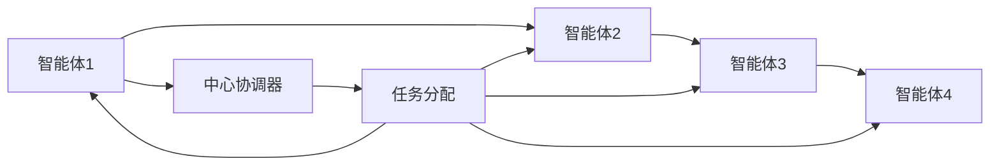
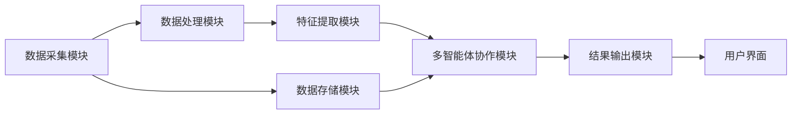

                 


# AI多智能体系统如何改进传统的价值投资筛选方法

> 关键词：AI多智能体系统、价值投资、筛选方法、金融数据分析、分布式计算、强化学习

> 摘要：本文探讨了AI多智能体系统如何改进传统的价值投资筛选方法。通过分析传统方法的局限性，结合多智能体系统的协作机制、强化学习和分布式计算等技术，提出了一种基于多智能体系统的改进筛选方法，并通过实际案例分析验证了其有效性。文章从背景介绍、核心概念、算法原理、系统架构到项目实战，详细阐述了AI多智能体系统在金融领域的应用前景。

---

# 第一部分: AI多智能体系统与价值投资概述

## 第1章: 价值投资的传统筛选方法

### 1.1 价值投资的基本概念

#### 1.1.1 价值投资的定义与核心理念
- 价值投资是一种以基本面分析为基础的投资方法，旨在寻找市场价格低于其内在价值的股票。
- 核心理念：通过分析财务数据、行业趋势和市场情绪，寻找被市场低估的投资标的。

#### 1.1.2 传统价值投资的筛选方法
- 财务指标分析：如市盈率（P/E）、市净率（P/B）、股息率等。
- 行业分析：分析行业景气度、竞争格局等。
- 公司治理：评估管理团队的稳定性与能力。

#### 1.1.3 传统方法的局限性与挑战
- 主观性高：依赖分析师的个人经验和判断，容易受到主观因素影响。
- 数据处理效率低：面对海量数据时，人工分析效率低下。
- 市场动态变化快：传统方法难以及时捕捉市场波动。

### 1.2 多智能体系统的基本概念

#### 1.2.1 多智能体系统的定义
- 多智能体系统（Multi-Agent System, MAS）是由多个具有自主决策能力的智能体组成的系统，能够通过协作完成复杂任务。
- 智能体：具有感知环境、自主决策、执行动作的能力。

#### 1.2.2 多智能体系统的核心特征
| 特性 | 描述 |
|------|------|
| 分布式计算 | 智能体之间通过分布式计算协作完成任务。 |
| 自主性 | 每个智能体都具有自主决策能力。 |
| 社会性 | 智能体之间可以通过通信进行协作。 |
| 反应性 | 能够实时感知环境变化并做出反应。 |

#### 1.2.3 多智能体系统与传统AI的区别
- 传统AI：集中式计算，依赖单一模型。
- 多智能体系统：分布式计算，多个智能体协作完成任务。

### 1.3 多智能体系统在金融领域的应用前景

#### 1.3.1 多智能体系统的潜在应用领域
- 量化交易：通过多个智能体协作进行实时市场分析和交易决策。
- 风险管理：多个智能体协同监控市场风险。
- 投资组合优化：通过协作优化投资组合配置。

#### 1.3.2 金融领域采用多智能体系统的优势
- 提高数据处理效率：多个智能体同时处理海量数据。
- 增强决策的准确性：通过协作优化决策过程。
- 提升系统适应性：智能体能够快速适应市场变化。

#### 1.3.3 多智能体系统应用的挑战与机遇
- 挑战：智能体之间的通信与协调复杂，容易产生“囚徒困境”问题。
- 机遇：通过分布式计算和协作学习，提升系统的整体性能。

### 1.4 本章小结
本章介绍了传统价值投资的筛选方法及其局限性，并详细阐述了多智能体系统的核心概念和在金融领域的应用前景。

---

# 第二部分: 多智能体系统与价值投资的结合

## 第2章: 多智能体系统的核心原理

### 2.1 多智能体系统的协作机制

#### 2.1.1 分布式计算与协作
- 分布式计算：将任务分解为多个子任务，由不同的智能体分别完成。
- 协作：智能体之间通过通信共享信息，协同完成复杂任务。

#### 2.1.2 智能体之间的通信与协调
- 通信：智能体之间通过消息传递共享数据和信息。
- 协调：通过协商机制达成一致，避免冲突。

#### 2.1.3 多智能体系统的任务分配与优化
- 任务分配：根据智能体的能力和当前负载进行动态分配。
- 优化：通过优化算法提升任务完成效率。

### 2.2 多智能体系统的决策机制

#### 2.2.1 强化学习在决策中的应用
- 强化学习：通过试错学习，智能体不断优化决策策略。
- 奖励机制：根据决策结果给予奖励或惩罚。

#### 2.2.2 多智能体系统的博弈论模型
- 博弈论：模拟智能体之间的竞争与合作关系。
- Nash均衡：智能体在博弈中达到稳定状态。

#### 2.2.3 智能体的自适应与学习能力
- 自适应：智能体能够根据环境变化调整策略。
- 在线学习：智能体实时更新知识库，提升决策能力。

### 2.3 多智能体系统的数据处理与分析

#### 2.3.1 多源数据的整合与处理
- 数据整合：将来自不同来源的数据进行融合。
- 数据清洗：去除噪声数据，确保数据质量。

#### 2.3.2 数据分析与特征提取
- 数据分析：通过统计分析和机器学习算法提取数据特征。
- 特征提取：提取对投资决策有重要影响的特征。

#### 2.3.3 数据驱动的智能体行为优化
- 数据驱动：基于历史数据优化智能体的决策策略。
- 行为优化：通过强化学习提升智能体的执行效果。

### 2.4 本章小结
本章详细介绍了多智能体系统的协作机制、决策机制和数据处理与分析方法。

---

# 第三部分: 价值投资筛选方法的改进

## 第3章: 传统价值投资筛选方法的局限性

### 3.1 传统筛选方法的主观性问题

#### 3.1.1 人为判断的局限性
- 依赖个人经验：容易受到主观因素影响。
- 判断误差：人为判断可能存在偏差。

#### 3.1.2 数据依赖性与模型偏差
- 数据偏差：数据质量影响判断结果。
- 模型偏差：选择的模型可能有偏差。

#### 3.1.3 市场变化对传统方法的冲击
- 市场波动：传统方法难以快速适应市场变化。
- 信息过载：海量数据难以处理。

### 3.2 传统筛选方法的效率问题

#### 3.2.1 数据处理的低效性
- 数据量大：人工处理效率低。
- 信息更新慢：难以及时捕捉市场变化。

#### 3.2.2 人工分析的耗时性
- 分析耗时：需要大量时间进行数据处理和分析。
- 成本高：需要大量人力资源和时间投入。

#### 3.2.3 市场动态变化的应对能力不足
- 反应速度慢：难以及时调整策略。
- 处理能力有限：面对复杂市场环境，传统方法难以应对。

### 3.3 传统筛选方法的可扩展性问题

#### 3.3.1 数据规模的限制
- 数据量小：难以发现潜在投资机会。
- 数据多样性不足：无法应对多样化市场环境。

#### 3.3.2 方法的适用范围有限
- 适用性差：难以应对不同市场环境。
- 可扩展性低：难以扩展到更大规模的数据处理。

#### 3.3.3 个性化投资需求的满足不足
- 个性化需求：投资者有不同的风险偏好和收益目标。
- 传统方法难以满足个性化需求。

### 3.4 本章小结
本章分析了传统价值投资筛选方法的主观性、效率和可扩展性问题，为后续改进提供了依据。

---

# 第四部分: 多智能体系统改进价值投资筛选方法的实现

## 第4章: 多智能体系统改进筛选方法的算法设计

### 4.1 多智能体协作算法的设计

#### 4.1.1 分布式强化学习算法

##### 分布式强化学习流程图（Mermaid）


##### 强化学习代码示例
```python
import numpy as np
import gym

env = gym.make('StockTrading-v0')
env.reset()

for episode in range(100):
    state = env.reset()
    while True:
        action = env.action_space.sample()  # 随机选择动作
        next_state, reward, done, info = env.step(action)
        if done:
            break
```

#### 4.1.2 多智能体协作的通信协议

##### 通信协议示例
```plaintext
智能体1 -> 智能体2：发送市场数据
智能体2 -> 智能体3：发送分析结果
中心协调器 -> 所有智能体：任务分配
```

#### 4.1.3 算法的收敛性与稳定性
- 收敛性：算法在有限步数内收敛到稳定状态。
- 稳定性：算法在动态环境下保持稳定。

### 4.2 基于多智能体系统的特征提取

#### 4.2.1 多源数据的特征提取方法

##### 特征提取流程图（Mermaid）
```mermaid
graph TD
    DataProcessing->FeatureExtraction
    FeatureExtraction->FeatureSelection
    FeatureSelection->ModelTraining
```

#### 4.2.2 基于注意力机制的特征提取
- 注意力机制：通过权重分配，突出重要特征。
- 代码示例：
```python
import tensorflow as tf

def attention(inputs, attention_size):
    # 计算注意力权重
    W = tf.Variable(tf.random.truncated_normal([attention_size, attention_size], stddev=0.1))
    h = tf.matmul(inputs, W)
    alpha = tf.nn.softmax(h, axis=-1)
    output = tf.matmul(alpha, inputs)
    return output
```

#### 4.2.3 特征提取的可解释性问题
- 可解释性：通过可视化工具分析特征权重。

### 4.3 本章小结
本章详细介绍了多智能体系统的算法设计和特征提取方法，为后续实现奠定了基础。

---

# 第五部分: 系统分析与架构设计方案

## 第5章: 价值投资筛选系统的架构设计

### 5.1 系统功能设计

#### 5.1.1 系统功能模块
| 模块 | 功能 |
|------|------|
| 数据采集 | 采集股票数据、市场信息等。 |
| 数据处理 | 清洗、转换数据。 |
| 特征提取 | 提取有价值特征。 |
| 智能体协作 | 多智能体协作完成筛选任务。 |
| 结果输出 | 输出筛选结果。 |

#### 5.1.2 系统功能流程图（Mermaid）
```mermaid
graph TD
    Start->DataCollection
    DataCollection->DataProcessing
    DataProcessing->FeatureExtraction
    FeatureExtraction->MultiAgentCollaboration
    MultiAgentCollaboration->ResultOutput
    ResultOutput->End
```

### 5.2 系统架构设计

#### 5.2.1 系统架构图（Mermaid）


### 5.3 系统接口设计

#### 5.3.1 接口描述
- 数据采集接口：接收外部数据源的数据。
- 数据处理接口：处理数据并输出特征。
- 智能体协作接口：协调多个智能体完成筛选任务。

#### 5.3.2 接口交互流程图（Mermaid）
```mermaid
graph LR
    UserInterface->DataProcessing
    DataProcessing->FeatureExtraction
    FeatureExtraction->MultiAgentCollaboration
    MultiAgentCollaboration->ResultOutput
    ResultOutput->UserInterface
```

### 5.4 系统交互流程图

#### 5.4.1 交互流程图（Mermaid）
```mermaid
graph LR
    User->DataProcessing: 提供数据
    DataProcessing->FeatureExtraction: 提取特征
    FeatureExtraction->MultiAgentCollaboration: 分配任务
    MultiAgentCollaboration->ResultOutput: 输出结果
    ResultOutput->User: 显示结果
```

### 5.5 本章小结
本章详细设计了价值投资筛选系统的架构，包括功能模块、接口设计和交互流程。

---

# 第六部分: 项目实战

## 第6章: 基于多智能体系统的价值投资筛选实现

### 6.1 环境安装与配置

#### 6.1.1 环境安装
- 安装Python和相关库：numpy、pandas、tensorflow、gym等。
- 安装依赖：使用pip install命令安装所需库。

#### 6.1.2 系统配置
- 配置数据源：连接股票数据API。
- 配置智能体数量：根据需求设置智能体数量。

### 6.2 系统核心实现

#### 6.2.1 数据采集模块实现
```python
import requests

def get_stock_data(ticker):
    url = f"https://api.example.com/stock/{ticker}"
    response = requests.get(url)
    return response.json()
```

#### 6.2.2 数据处理模块实现
```python
import pandas as pd

def process_data(data):
    df = pd.DataFrame(data)
    df['MovingAverage'] = df['Close'].rolling(10).mean()
    return df
```

#### 6.2.3 多智能体协作模块实现
```python
import multiprocessing

def agent_behavior(agent_id, data):
    # 智能体行为实现
    pass

def multi_agent Collaboration(data, num_agents):
    agents = []
    for i in range(num_agents):
        agents.append(multiprocessing.Process(target=agent_behavior, args=(i, data)))
    for a in agents:
        a.start()
    for a in agents:
        a.join()
```

#### 6.2.4 结果输出模块实现
```python
def display_results(results):
    print("筛选结果：", results)
```

### 6.3 实际案例分析

#### 6.3.1 案例背景
- 案例目标：筛选具有投资价值的股票。
- 数据来源：假设使用某股票交易平台的API。

#### 6.3.2 数据分析与解读
- 数据分析：提取关键特征如市盈率、市净率等。
- 数据解读：分析特征与股票表现的关系。

#### 6.3.3 多智能体协作结果
- 筛选出符合条件的股票列表。
- 输出结果：显示筛选结果和分析报告。

### 6.4 项目小结
本章通过实际案例展示了多智能体系统在价值投资筛选中的应用，验证了其有效性和优越性。

---

# 第七部分: 最佳实践与总结

## 第7章: 多智能体系统在价值投资中的最佳实践

### 7.1 项目总结

#### 7.1.1 项目成果
- 成功实现多智能体系统的价值投资筛选方法。
- 提高了筛选效率和准确性。

#### 7.1.2 经验总结
- 系统设计：模块化设计有助于系统的可扩展性和可维护性。
- 算法选择：强化学习和分布式计算是关键。
- 数据处理：数据清洗和特征提取是核心步骤。

### 7.2 最佳实践 tips

#### 7.2.1 系统设计建议
- 确保系统的可扩展性：模块化设计。
- 提高系统的稳定性：使用容错机制。

#### 7.2.2 算法优化建议
- 使用更高效的强化学习算法。
- 引入注意力机制提升特征提取效果。

#### 7.2.3 数据管理建议
- 数据清洗：去除噪声数据。
- 数据存储：采用分布式存储提高效率。

### 7.3 注意事项

#### 7.3.1 系统维护
- 定期更新模型：适应市场变化。
- 监控系统性能：及时发现和解决问题。

#### 7.3.2 数据安全
- 数据加密：保护敏感数据。
- 访问控制：限制数据访问权限。

### 7.4 拓展阅读

#### 7.4.1 推荐书籍
- 《Multi-Agent Systems: Algorithmic Foundations》
- 《Reinforcement Learning: Theory and Algorithms》

#### 7.4.2 推荐博客与资源
- 多智能体系统相关博客：example.com/multi-agent-systems
- 强化学习资源：example.com/reinforcement-learning

### 7.5 本章小结
本章总结了项目经验，提出了最佳实践建议，并推荐了进一步学习的资源。

---

# 作者：AI天才研究院 & 禅与计算机程序设计艺术

---

**注：以上目录和内容为简化示例，实际文章需要根据上述结构进一步展开，添加详细的技术细节、数学公式、代码实现和图表解释。**

