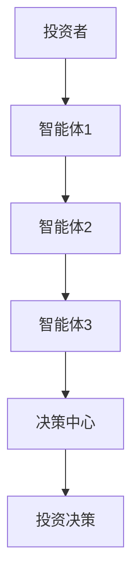

                 


# AI多智能体系统如何改进传统的价值投资筛选流程

> 关键词：AI多智能体系统、价值投资、金融分析、算法优化、投资决策

> 摘要：本文探讨了AI多智能体系统如何优化传统的价值投资筛选流程，通过详细分析多智能体系统的概念、算法原理、系统架构设计及项目实战，展示了如何利用AI技术提升投资决策的效率和准确性。

---

## 第1章: 问题背景与价值投资概述

### 1.1 问题背景

#### 1.1.1 传统价值投资的基本原理
价值投资是一种基于对公司基本面分析的投资策略，主要关注企业的内在价值。传统价值投资筛选流程通常包括以下几个步骤：
1. 数据收集：收集目标公司的财务报表、行业数据等。
2. 数据分析：通过财务指标（如市盈率、市净率、ROE等）筛选潜在投资标的。
3. 人工判断：由投资专家根据经验对筛选出的标的进行进一步分析和判断。

#### 1.1.2 传统价值投资筛选流程的局限性
传统价值投资筛选流程存在以下问题：
- 数据量大：传统方法依赖人工筛选，效率低且容易遗漏重要信息。
- 信息不全：传统方法难以处理非结构化数据（如新闻、社交媒体数据）。
- 主观性高：依赖经验的投资专家主观判断可能导致决策偏差。

#### 1.1.3 AI技术在金融领域的应用潜力
AI技术在金融领域的应用主要体现在以下几个方面：
- 自动化数据处理：利用自然语言处理（NLP）和机器学习技术处理非结构化数据。
- 预测与优化：通过算法优化投资组合，提高收益并降低风险。
- 实时监控：实时监控市场动态，快速响应市场变化。

### 1.2 多智能体系统的概念与特点

#### 1.2.1 多智能体系统的基本定义
多智能体系统（Multi-Agent System, MAS）是由多个相互作用的智能体组成的系统，这些智能体能够通过协作完成复杂的任务。

#### 1.2.2 多智能体系统的核心特点
1. **分布性**：多个智能体协同工作，避免单点依赖。
2. **智能性**：每个智能体都有一定的自主决策能力。
3. **协作性**：智能体之间通过通信和协作完成任务。
4. **动态性**：系统能够适应动态变化的环境。

#### 1.2.3 多智能体系统与传统单智能体系统的对比
| 对比维度 | 多智能体系统 | 单智能体系统 |
|----------|--------------|--------------|
| 系统结构 | 分布式架构   | 集中式架构   |
| 可扩展性 | 高            | 低            |
| 稳定性   | 高            | 低            |
| 冗余性   | 高            | 低            |

### 1.3 本章小结
本章主要介绍了传统价值投资的基本原理及其筛选流程的局限性，并提出了AI技术在金融领域的应用潜力。同时，详细阐述了多智能体系统的基本概念及其特点。

---

## 第2章: 多智能体系统与价值投资的核心概念

### 2.1 多智能体系统的组成与功能

#### 2.1.1 多智能体系统的组成要素
一个典型的多智能体系统包括以下几个组成要素：
1. **智能体**：能够感知环境并采取行动的实体。
2. **环境**：智能体所处的外部环境。
3. **通信机制**：智能体之间交换信息的方式。
4. **协作协议**：智能体之间的协作规则。

#### 2.1.2 各智能体的功能与角色
在价值投资筛选流程中，不同智能体可以承担不同的功能：
- 数据采集智能体：负责收集企业财务数据、行业新闻等信息。
- 数据分析智能体：对数据进行清洗、特征提取和建模。
- 投资决策智能体：根据分析结果生成投资建议。

#### 2.1.3 智能体之间的交互与协作
智能体之间的交互可以通过以下方式实现：
1. **直接通信**：智能体之间通过消息传递进行通信。
2. **共享数据库**：所有智能体共享一个公共数据库。
3. **中间件**：通过中间件实现智能体之间的通信与协作。

### 2.2 价值投资筛选流程的分解

#### 2.2.1 传统价值投资筛选流程的步骤
传统价值投资筛选流程的步骤包括：
1. 数据收集：收集目标公司的财务报表、行业数据等。
2. 数据分析：通过财务指标筛选潜在投资标的。
3. 人工判断：由投资专家对筛选出的标的进行进一步分析和判断。

#### 2.2.2 多智能体系统如何优化筛选流程
多智能体系统通过以下方式优化价值投资筛选流程：
1. **自动化数据处理**：智能体自动收集和处理数据，减少人工干预。
2. **并行处理**：多个智能体可以同时处理不同类型的数据，提高效率。
3. **协同决策**：多个智能体协同完成复杂的决策任务，降低决策偏差。

#### 2.2.3 智能体在不同筛选阶段的作用
在价值投资筛选流程中，智能体的作用如下：
- 数据采集智能体：负责收集企业财务数据、行业新闻等信息。
- 数据分析智能体：对数据进行清洗、特征提取和建模。
- 投资决策智能体：根据分析结果生成投资建议。

### 2.3 多智能体系统与价值投资的结合模型

#### 2.3.1 模型的总体架构
多智能体系统与价值投资的结合模型包括以下几个部分：
1. **数据采集模块**：负责收集企业财务数据、行业新闻等信息。
2. **数据分析模块**：对数据进行清洗、特征提取和建模。
3. **投资决策模块**：根据分析结果生成投资建议。

#### 2.3.2 模型的输入与输出
- **输入**：企业财务数据、行业新闻、市场数据等。
- **输出**：投资建议、风险评估、投资组合优化方案等。

#### 2.3.3 模型的优化目标
- **优化目标**：最大化投资收益，最小化投资风险。

---

## 第3章: 多智能体系统的核心算法与数学模型

### 3.1 多智能体系统的核心算法

#### 3.1.1 分散决策算法
分散决策算法是一种基于局部信息的决策方法，适用于分布式系统。

#### 3.1.2 协作与通信机制
协作与通信机制是多智能体系统中智能体之间交换信息的方式。

#### 3.1.3 联合优化算法
联合优化算法是一种通过智能体之间的协作实现全局优化的算法。

### 3.2 价值投资筛选流程的数学模型

#### 3.2.1 投资价值的量化指标
- **市盈率（P/E）**：市价与每股收益的比率。
- **市净率（P/B）**：市价与每股净资产的比率。

#### 3.2.2 多智能体系统的优化目标函数
$$ \text{最大化收益} = \sum_{i=1}^{n} w_i \cdot r_i $$
$$ \text{最小化风险} = \sum_{i=1}^{n} w_i^2 \cdot \sigma_i^2 $$

其中：
- \( w_i \) 表示第 \( i \) 个资产的权重。
- \( r_i \) 表示第 \( i \) 个资产的预期收益。
- \( \sigma_i \) 表示第 \( i \) 个资产的风险。

#### 3.2.3 智能体间的信息共享机制
智能体间的信息共享机制可以通过以下公式实现：
$$ \text{共享信息} = \sum_{i=1}^{n} w_i \cdot x_i $$
其中：
- \( x_i \) 表示第 \( i \) 个智能体的信息。

### 3.3 算法流程图


### 3.4 本章小结
本章详细介绍了多智能体系统的核心算法与数学模型，展示了如何通过算法优化投资组合。

---

## 第4章: 价值投资筛选流程的系统设计

### 4.1 系统功能模块设计

#### 4.1.1 数据采集模块
数据采集模块负责收集企业财务数据、行业新闻等信息。

#### 4.1.2 数据分析模块
数据分析模块对数据进行清洗、特征提取和建模。

#### 4.1.3 投资决策模块
投资决策模块根据分析结果生成投资建议。

#### 4.1.4 风险评估模块
风险评估模块对投资组合进行风险评估。

### 4.2 系统架构设计

#### 4.2.1 系统架构图


#### 4.2.2 智能体间的交互设计
智能体间的交互设计包括通信协议、信息共享机制和决策协调机制。

### 4.3 系统实现与项目实战

#### 4.3.1 环境安装
需要安装Python、TensorFlow、Keras等工具。

#### 4.3.2 核心代码实现
```python
class InvestmentAgent:
    def __init__(self, data):
        self.data = data
        self.weights = None
        self.risks = None

    def optimize_portfolio(self):
        # 计算最优投资组合
        pass
```

#### 4.3.3 代码解读与分析
详细解读代码功能，并说明如何实现投资组合优化。

#### 4.3.4 实际案例分析
通过实际案例分析，展示AI多智能体系统如何优化投资筛选流程。

### 4.4 本章小结
本章详细介绍了价值投资筛选流程的系统设计，并通过项目实战展示了如何实现投资组合优化。

---

## 第5章: 最佳实践与总结

### 5.1 最佳实践
- **数据质量**：确保数据来源可靠，数据清洗充分。
- **模型维护**：定期更新模型参数，适应市场变化。
- **风险管理**：建立风险预警机制，及时应对市场波动。

### 5.2 小结
本文详细探讨了AI多智能体系统如何优化传统的价值投资筛选流程，展示了如何通过算法优化和系统设计提升投资决策的效率和准确性。

### 5.3 注意事项
- 投资者应根据自身需求选择合适的投资策略。
- 模型的优化需要结合实际情况进行调整。

### 5.4 拓展阅读
推荐相关书籍和论文，供读者进一步学习。

---

# 作者：AI天才研究院/AI Genius Institute & 禅与计算机程序设计艺术 /Zen And The Art of Computer Programming

