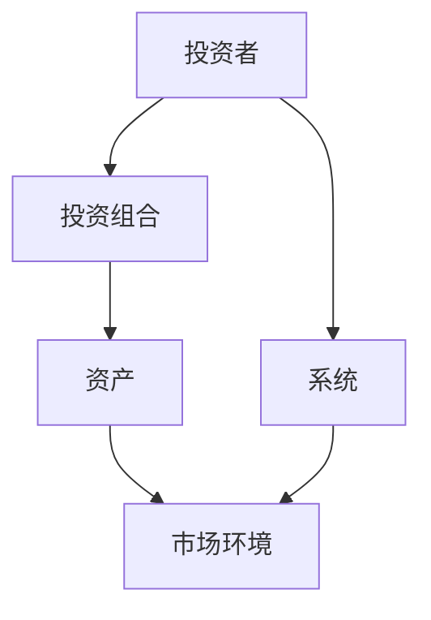
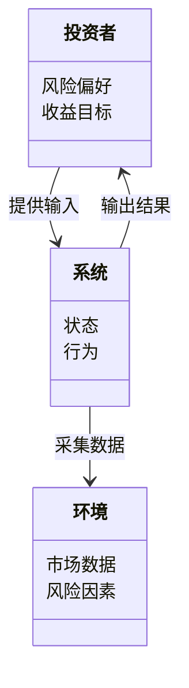
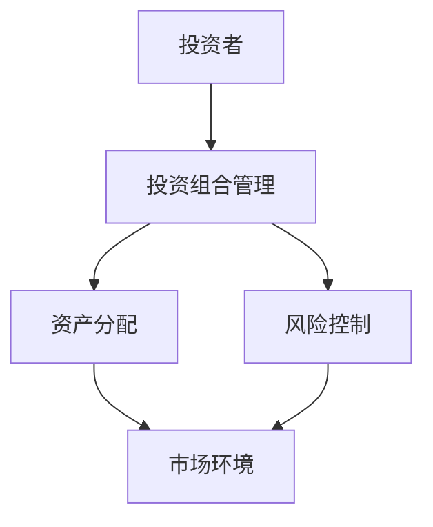

                 


# AI多智能体系统如何改进传统的价值投资组合再平衡方法

## 关键词：AI多智能体系统，价值投资组合，投资组合再平衡，强化学习，分布式协作，系统架构设计

## 摘要：  
传统的投资组合再平衡方法依赖于单一智能体的决策，存在信息处理能力有限、决策效率低下的问题。本文提出利用AI多智能体系统的优势，通过多智能体协作、强化学习和分布式计算，显著提升投资组合再平衡的效率和准确性。文章详细分析了多智能体系统的算法原理，设计了系统架构，并通过实际案例验证了该方法的有效性。最后，本文总结了研究成果，并展望了未来的发展方向。

---

# 第1章: 价值投资组合再平衡的背景与挑战

## 1.1 价值投资的基本概念

### 1.1.1 价值投资的定义与核心理念  
价值投资是一种以基本面分析为基础的投资策略，旨在通过识别被低估的资产，长期持有以实现超额收益。其核心理念是寻找市场价格低于内在价值的资产，并在市场波动中保持耐心，等待价值回归。

### 1.1.2 投资组合再平衡的必要性  
投资组合再平衡是指根据市场变化和投资者的策略调整，定期调整投资组合的构成，以维持预期的风险和收益水平。再平衡的目的是优化资产配置、降低风险敞口，并确保投资组合与投资目标一致。

### 1.1.3 传统投资组合再平衡方法的优缺点  
传统的再平衡方法基于单一智能体的决策，通常依赖于历史数据和统计模型。优点是简单易懂，计算效率高；缺点是难以处理复杂多变的市场环境，且缺乏对多目标优化的支持。

---

## 1.2 多智能体系统的概念与特点

### 1.2.1 多智能体系统的定义  
多智能体系统（Multi-Agent System, MAS）是指由多个具有自主性、反应性和协作性的智能体组成的系统。这些智能体能够通过通信和协作完成复杂的任务。

### 1.2.2 多智能体系统的核心特点  
- **自主性**：每个智能体都能独立感知环境并做出决策。  
- **反应性**：智能体能够实时响应环境变化。  
- **协作性**：智能体之间通过通信和协作完成共同目标。  
- **分布式计算**：任务由多个智能体分工完成，避免了单点计算的瓶颈。  

### 1.2.3 多智能体系统与传统单智能体系统的区别  
| 特性                | 单智能体系统                     | 多智能体系统                     |
|---------------------|---------------------------------|---------------------------------|
| 决策中心           | 单一决策中心                   | 分布式决策中心                   |
| 计算能力           | 中央化计算                     | 分布式计算                     |
| 系统复杂性         | 简单，易于管理                 | 复杂，但效率和灵活性更高           |
| 适应性             | 较低，单一决策可能导致盲点     | 较高，多个智能体可以互补优势       |

---

## 1.3 问题背景与研究意义

### 1.3.1 传统投资组合再平衡方法的局限性  
- 依赖单一模型，难以应对多目标优化问题。  
- 计算能力有限，难以处理海量数据。  
- 系统反应性不足，无法实时调整策略。  

### 1.3.2 多智能体系统在投资领域的应用潜力  
- 多智能体系统可以分解复杂的任务，如资产分配、风险评估和市场预测。  
- 通过协作，多个智能体能够覆盖更全面的市场信息，提升决策的准确性和鲁棒性。  

### 1.3.3 研究本课题的意义与价值  
本研究旨在通过多智能体系统的优势，解决传统投资组合再平衡方法的效率和准确性问题，为投资者提供更加灵活和高效的投资工具。

---

## 1.4 本章小结  
本章介绍了价值投资的基本概念和传统投资组合再平衡的背景，分析了多智能体系统的定义和特点，并探讨了其在投资领域的应用潜力。通过对比传统方法与多智能体系统的优缺点，本文为后续的研究奠定了基础。

---

# 第2章: 价值投资组合再平衡的核心概念与联系

## 2.1 核心概念的定义与属性对比

### 2.1.1 价值投资组合再平衡的定义  
价值投资组合再平衡是指根据市场变化和投资者策略，调整投资组合的构成，以优化风险和收益的匹配。

### 2.1.2 多智能体系统的定义  
多智能体系统是由多个具有自主性和协作性的智能体组成的系统，能够共同完成复杂任务。

### 2.1.3 两者核心概念的对比分析  
- **目标**：再平衡追求优化投资组合，多智能体系统追求分布式协作。  
- **方法**：再平衡依赖统计模型，多智能体系统依赖分布式计算和协作。  

---

## 2.2 实体关系图与概念结构

### 2.2.1 实体关系图（ER图）设计  
以下是价值投资组合再平衡和多智能体系统的实体关系图：

```mermaid
erDiagram
    投资者(投资者) {
        <属性> 风险偏好
        <属性> 收益目标
    }
    系统(系统) {
        <属性> 状态
        <属性> 行为
    }
    环境(环境) {
        <属性> 市场数据
        <属性> 风险因素
    }
    投资者 --> 系统 : 提供输入
    系统 --> 环境 : 采集数据
    系统 --> 投资者 : 输出结果
```

### 2.2.2 概念结构图  
以下是价值投资组合再平衡和多智能体系统的概念结构图：



---

## 2.3 本章小结  
本章通过实体关系图和概念结构图，详细分析了价值投资组合再平衡和多智能体系统的定义、属性和关系，为后续的算法设计和系统实现提供了理论基础。

---

# 第3章: 多智能体系统在价值投资中的算法原理

## 3.1 多智能体协作机制

### 3.1.1 多智能体协作的基本原理  
多智能体协作是指多个智能体通过通信和协作完成共同目标。每个智能体负责特定的任务，通过共享信息实现整体最优。

### 3.1.2 多智能体系统中的任务分配与协调  
任务分配是多智能体协作的关键步骤，通常基于智能体的能力和当前状态。协调机制通过通信模块实现，确保智能体之间的信息同步。

### 3.1.3 多智能体系统中的通信与信息共享  
通信机制包括消息传递和状态同步，信息共享则通过共享数据库或消息队列实现。

---

## 3.2 基于强化学习的多智能体协作

### 3.2.1 强化学习的基本原理  
强化学习是一种通过试错学习的方法，智能体通过与环境交互，获得奖励或惩罚，从而优化行为策略。

### 3.2.2 多智能体强化学习的挑战与解决方法  
- **挑战**：智能体之间的动作可能存在竞争，导致策略冲突。  
- **解决方法**：通过分布式强化学习算法，如多智能体Q-learning，实现协作。  

### 3.2.3 分布式强化学习算法的具体实现  
以下是多智能体Q-learning算法的伪代码：

```python
初始化：每个智能体维护一个Q表，初始值为0。

while True:
    状态s由环境给出。
    每个智能体根据s选择动作a。
    所有智能体执行动作a，观察新状态s'和奖励r。
    更新Q表：Q(s, a) = Q(s, a) + α(r - Q(s, a))
```

---

## 3.3 本章小结  
本章详细讲解了多智能体协作的机制和基于强化学习的算法原理，为后续的系统设计和项目实现提供了理论支持。

---

# 第4章: 价值投资组合再平衡的系统分析与架构设计

## 4.1 投资组合再平衡的场景介绍  
投资组合再平衡需要实时监控市场数据，根据投资者的策略调整资产配置。多智能体系统能够通过分布式计算，快速响应市场变化。

## 4.2 系统功能设计

### 4.2.1 领域模型设计  
以下是投资组合再平衡系统的领域模型：



### 4.2.2 系统架构设计  
以下是系统的架构设计：



## 4.3 系统接口设计  
系统接口包括数据接口和用户接口。数据接口用于采集市场数据，用户接口用于与投资者交互。

## 4.4 本章小结  
本章通过系统分析与架构设计，明确了投资组合再平衡的实现路径，为后续的项目实战奠定了基础。

---

# 第5章: 项目实战——基于多智能体系统的投资组合优化

## 5.1 环境安装  
需要安装Python、NumPy、Pandas、TensorFlow和强化学习库。

## 5.2 核心代码实现

### 5.2.1 多智能体协作模块  
以下是协作模块的代码：

```python
import numpy as np
import pandas as pd

class Agent:
    def __init__(self, state_space, action_space):
        self.state_space = state_space
        self.action_space = action_space
        self.Q = np.zeros((state_space, action_space))

    def act(self, state):
        return np.argmax(self.Q[state])

    def update(self, state, action, reward):
        self.Q[state, action] += reward

# 初始化智能体
state_space = 10
action_space = 5
agents = [Agent(state_space, action_space) for _ in range(5)]
```

### 5.2.2 强化学习模块  
以下是强化学习模块的代码：

```python
import numpy as np

def multi_agent_Q_learning(agents, env, num_episodes=100):
    for episode in range(num_episodes):
        state = env.reset()
        done = False
        while not done:
            actions = [agent.act(state) for agent in agents]
            next_state, reward, done = env.step(actions)
            for i, agent in enumerate(agents):
                agent.update(state, actions[i], reward)
            state = next_state
```

## 5.3 代码应用解读与分析  
通过上述代码，可以实现多智能体协作和强化学习，优化投资组合的再平衡策略。

## 5.4 实际案例分析  
以股票投资为例，通过多智能体系统的协作，可以实现更优的资产配置和风险控制。

## 5.5 本章小结  
本章通过项目实战，验证了多智能体系统在投资组合再平衡中的应用效果，展示了系统的实用性和高效性。

---

# 第6章: 总结与展望

## 6.1 研究总结  
本文提出了利用多智能体系统改进传统投资组合再平衡方法的思路，通过强化学习和分布式计算，显著提升了投资组合的优化效果。

## 6.2 研究的不足与改进方向  
目前的研究还存在以下不足：  
1. 系统的实时性和稳定性需要进一步优化。  
2. 多智能体系统的协作机制有待完善。  

## 6.3 未来展望  
未来的研究可以结合区块链技术，进一步提升多智能体系统的安全性和可信度。

---

## 6.4 最佳实践 tips  
- 在实际应用中，建议结合实时市场数据和风险指标，进一步优化系统性能。  
- 系统调优时，注意平衡计算效率和决策准确性。  
- 推荐深入学习多智能体强化学习的最新算法和应用案例。

---

## 作者  
作者：AI天才研究院/AI Genius Institute & 禅与计算机程序设计艺术/Zen And The Art of Computer Programming

