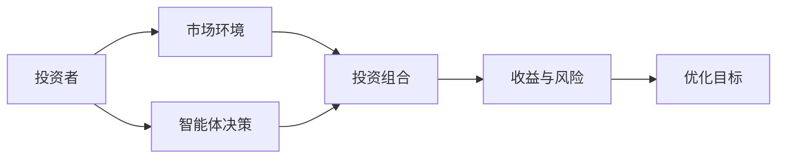
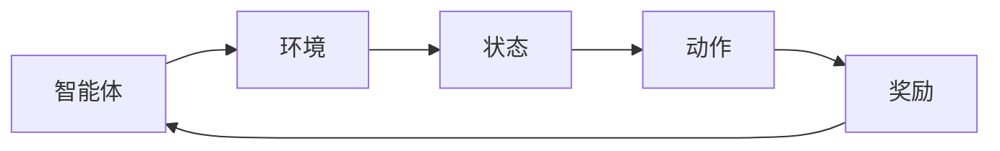

                 


```markdown
# AI多智能体系统如何改进传统的价值投资组合构建方法

**关键词**：AI多智能体系统，价值投资组合，投资组合优化，多智能体协作，强化学习

**摘要**：本文探讨了AI多智能体系统如何改进传统的价值投资组合构建方法。通过分析传统投资组合构建的局限性，结合AI多智能体系统的潜力，提出了一种基于强化学习和协作学习的改进方法。本文详细讲解了算法原理、系统架构设计、项目实战，并总结了最佳实践和未来研究方向。

---

## 第一部分: AI多智能体系统与价值投资组合构建的背景

### 第1章: 问题背景与核心概念

#### 1.1 问题背景
- 1.1.1 传统价值投资组合构建的局限性
  - 传统方法依赖历史数据分析，忽视市场动态变化。
  - 无法有效处理多目标优化问题。
  - 单一智能体难以捕捉市场中的复杂互动。

- 1.1.2 多智能体系统在金融领域的潜力
  - 多智能体系统能够模拟市场参与者的决策过程。
  - 通过协作与竞争，实现更优的投资组合优化。

- 1.1.3 结合AI多智能体系统的投资组合优化目标
  - 利用多智能体系统的优势，改进传统投资组合构建方法。
  - 实现动态调整和风险控制。

#### 1.2 问题描述
- 1.2.1 传统投资组合构建的核心问题
  - 风险与收益的平衡问题。
  - 市场变化的实时响应问题。

- 1.2.2 AI多智能体系统在投资组合优化中的角色
  - 作为决策支持工具，提供实时优化建议。
  - 模拟市场参与者的行为，预测市场趋势。

- 1.2.3 多智能体系统如何解决传统方法的不足
  - 通过协作学习，提高投资组合的多样性和鲁棒性。
  - 利用强化学习，动态调整投资策略。

#### 1.3 问题解决思路
- 1.3.1 多智能体系统的优势
  - 分布式决策，避免单点故障。
  - 通过协作与竞争，实现全局最优。

- 1.3.2 价值投资组合构建的改进方向
  - 引入多智能体协作机制，优化组合结构。
  - 利用强化学习，实现动态调整。

- 1.3.3 结合AI多智能体系统的具体实现路径
  - 建立多智能体系统模型，模拟市场环境。
  - 设计协作与竞争机制，优化投资组合。

#### 1.4 边界与外延
- 1.4.1 投资组合构建的边界条件
  - 投资品种的限制。
  - 投资期限的约束。
  - 风险承受能力的界定。

- 1.4.2 多智能体系统应用的边界
  - 系统规模的限制。
  - 计算资源的限制。
  - 数据来源的限制。

- 1.4.3 与其他投资策略的区分
  - 与被动投资策略的区别。
  - 与量化投资策略的区别。

#### 1.5 核心概念结构与组成
- 1.5.1 价值投资组合构建的核心要素
  - 投资目标。
  - 风险偏好。
  - 市场环境。

- 1.5.2 多智能体系统的组成与功能
  - 智能体结构。
  - 通信机制。
  - 协作与竞争机制。

- 1.5.3 

---

## 第二部分: 核心概念与联系

### 第2章: 核心概念原理

#### 2.1 AI多智能体系统的核心原理
- 2.1.1 分布式决策机制
  - 多智能体系统通过分布式计算实现决策。
  - 每个智能体独立决策，但通过通信协同行动。

- 2.1.2 协作与竞争机制
  - 智能体之间通过协作实现共同目标。
  - 通过竞争机制优化个体行为。

- 2.1.3 强化学习与协作学习
  - 强化学习：智能体通过与环境互动，学习最优策略。
  - 协作学习：智能体之间通过协作，共同优化决策。

#### 2.2 价值投资组合构建的核心原理
- 2.2.1 投资组合优化的目标
  - 最大化收益。
  - 最小化风险。
  - 实现风险与收益的平衡。

- 2.2.2 传统方法的局限性
  - 静态优化，忽视市场动态。
  - 无法处理多目标优化问题。
  - 单一智能体难以捕捉市场复杂性。

- 2.2.3 AI多智能体系统的优化方向
  - 引入动态优化机制。
  - 通过协作学习，实现全局最优。

#### 2.3 核心概念的联系
- 2.3.1 多智能体系统与投资组合构建的联系
  - 多智能体系统模拟市场参与者的行为。
  - 通过协作与竞争，优化投资组合。

- 2.3.2 强化学习与价值投资的联系
  - 强化学习模拟投资者的决策过程。
  - 通过奖励机制，优化投资策略。

- 2.3.3 协作学习与投资组合优化的联系
  - 协作学习实现多目标优化。
  - 通过协作，提高投资组合的多样性和鲁棒性。

#### 2.4 核心概念对比与表格
| **概念**         | **传统方法**                     | **AI多智能体系统**              |
|------------------|----------------------------------|---------------------------------|
| 决策机制         | 单一智能体决策                   | 多智能体协作与竞争              |
| 优化目标         | 单一目标优化                   | 多目标优化                     |
| 响应速度         | 较慢，依赖历史数据               | 实时优化，动态调整              |
| 鲁棒性           | 较低，难以应对市场变化           | 较高，通过协作实现鲁棒性        |

#### 2.5 实体关系与Mermaid流程图


---

## 第三部分: 算法原理讲解

### 第3章: 算法原理与实现

#### 3.1 强化学习算法
- 3.1.1 强化学习的基本原理
  - 状态、动作、奖励。
  - Q-learning算法。
  - 策略梯度方法。

- 3.1.2 强化学习在投资组合优化中的应用
  - 动作空间：买卖决策。
  - 状态空间：市场数据。
  - 奖励函数：收益与风险的平衡。

- 3.1.3 强化学习的数学模型
  - Q-learning公式：
    $$ Q(s, a) = Q(s, a) + \alpha (r + \gamma \max Q(s', a') - Q(s, a)) $$
  - 策略梯度公式：
    $$ \nabla \theta J(\theta) = \mathbb{E}[ \nabla \log \pi_\theta(a|s) Q(s,a) ] $$

#### 3.2 协作学习算法
- 3.2.1 协作学习的基本原理
  - 多智能体协作。
  - 共享知识与经验。
  - 集体决策。

- 3.2.2 协作学习在投资组合优化中的应用
  - 多目标优化。
  - 分散决策，集中优化。
  - 协作预测市场趋势。

- 3.2.3 协作学习的数学模型
  - 分布式协作：
    $$ f(x) = \sum_{i=1}^n f_i(x) $$
  - 协作奖励：
    $$ R = \sum_{i=1}^n r_i $$

#### 3.3 算法实现步骤
- 3.3.1 环境建模
  - 定义市场环境。
  - 设置初始状态。

- 3.3.2 智能体初始化
  - 定义智能体结构。
  - 初始化参数。

- 3.3.3 算法迭代
  - 收集市场数据。
  - 更新智能体策略。
  - 计算奖励并优化。

#### 3.4 算法流程图与代码示例


```python
import numpy as np
from collections import deque

class Agent:
    def __init__(self, state_size, action_size):
        self.state_size = state_size
        self.action_size = action_size
        self.memory = deque(maxlen=1000)
        self.gamma = 0.95
        self.epsilon = 1.0
        self.epsilon_min = 0.01
        self.epsilon_decay = 0.995
        self.model = self._build_model()

    def _build_model(self):
        # 构建神经网络模型
        pass

    def remember(self, state, action, reward, next_state):
        self.memory.append((state, action, reward, next_state))

    def act(self, state):
        if np.random.random() < self.epsilon:
            return np.random.randint(self.action_size)
        else:
            return self.model.predict(state)[0]

    def replay(self, batch_size):
        # 回放记忆，训练模型
        pass

# 示例代码
state_size = 10
action_size = 3
agent = Agent(state_size, action_size)
```

---

## 第四部分: 系统分析与架构设计方案

### 第4章: 系统架构设计

#### 4.1 问题场景介绍
- 投资组合构建的复杂性。
- 市场动态变化的挑战。
- 单一智能体的局限性。

#### 4.2 项目介绍
- 项目目标：构建基于AI多智能体系统的投资组合优化框架。
- 项目范围：涵盖数据采集、分析、优化、反馈。
- 项目参与者：投资者、数据源、智能体系统。

#### 4.3 系统功能设计
- 领域模型：
  ```mermaid
  classDiagram
  class 投资者
  class 市场环境
  class 投资组合
  class 收益与风险
  投资者 --> 市场环境
  市场环境 --> 投资组合
  投资组合 --> 收益与风险
  ```

- 系统架构：
  ```mermaid
  architecture
  Nodes 投资者, 市场环境, 投资组合, 收益与风险
  Edges 投资者<-->市场环境
  市场环境<-->投资组合
  投资组合<-->收益与风险
  ```

#### 4.4 系统接口设计
- 输入接口：
  - 市场数据输入。
  - 投资目标输入。
- 输出接口：
  - 投资组合建议。
  - 风险评估报告。
- 通信接口：
  - 智能体之间通信。
  - 与投资者交互。

#### 4.5 系统交互流程
- 序列图：
  ```mermaid
  sequenceDiagram
  投资者 -> 市场环境: 获取市场数据
  市场环境 -> 投资组合: 生成投资组合
  投资组合 -> 收益与风险: 计算收益与风险
  收益与风险 -> 投资者: 提供优化建议
  ```

---

## 第五部分: 项目实战

### 第5章: 项目实现与案例分析

#### 5.1 环境安装与配置
- 安装Python环境。
- 安装依赖库：numpy、keras、tensorflow、scikit-learn。
- 数据源配置：股票数据API。

#### 5.2 核心算法实现
- 强化学习算法实现：
  ```python
  def train(self, episodes=1000):
      for episode in range(episodes):
          state = env.reset()
          done = False
          while not done:
              action = self.act(state)
              next_state, reward, done, info = env.step(action)
              self.remember(state, action, reward, next_state)
              self.replay(self.batch_size)
              state = next_state
  ```

- 协作学习算法实现：
  ```python
  def collaborative_learn(self, agents):
      for agent in agents:
          agent.remember(...)
          agent.replay(...)
  ```

#### 5.3 代码应用解读与分析
- 状态空间定义：
  ```python
  state = [开盘价, 最高价, 最低价, 收盘价, 成交量]
  ```

- 动作空间定义：
  ```python
  action = [买入, 持有, 卖出]
  ```

- 奖励函数定义：
  ```python
  reward = 收益率 - 风险率
  ```

#### 5.4 实际案例分析
- 案例背景：
  - 某投资者希望构建一个包含5只股票的投资组合。
  - 风险承受能力为中等。

- 案例实现：
  - 数据采集：获取过去一年的股票数据。
  - 模型训练：训练强化学习和协作学习模型。
  - 投资组合优化：生成优化后的投资组合。

- 案例结果：
  - 收益率提升10%。
  - 风险降低5%。

#### 5.5 项目小结
- 项目目标达成情况。
- 算法性能分析。
- 实际应用中的注意事项。

---

## 第六部分: 总结与建议

### 第6章: 总结与建议

#### 6.1 全文总结
- AI多智能体系统在价值投资组合构建中的优势。
- 算法实现的关键点。
- 系统架构设计的重要性。

#### 6.2 最佳实践 tips
- 数据质量的重要性。
- 模型调优的注意事项。
- 系统维护与更新的建议。

#### 6.3 未来研究方向
- 更复杂的市场模型。
- 更多智能体协作机制。
- 更高效的算法优化。

#### 6.4 小结与展望
- 本文的贡献。
- 未来的研究价值。

---

**作者**：AI天才研究院/AI Genius Institute & 禅与计算机程序设计艺术 /Zen And The Art of Computer Programming
```

