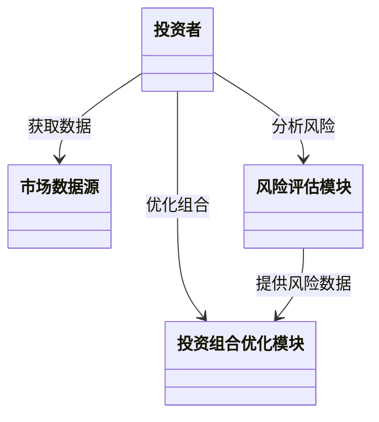

                 


# AI多智能体系统如何改进传统的价值投资风险分散策略

## 关键词：AI多智能体系统，价值投资，风险分散，投资组合优化，分布式计算，强化学习

## 摘要：  
本文探讨了AI多智能体系统在价值投资中的应用，重点分析了如何通过多智能体系统改进传统的风险分散策略。文章从背景介绍、核心概念、算法原理、系统架构到项目实战，详细阐述了AI多智能体系统如何优化投资组合，降低风险，并通过具体案例展示了其在实际投资中的应用效果。本文旨在为投资领域的专业人士提供一种创新的解决方案，帮助他们在复杂多变的市场环境中做出更明智的投资决策。

---

## 第一部分：AI多智能体系统与价值投资概述

### 第1章：问题背景与核心概念

#### 1.1 问题背景
- **传统价值投资的局限性**：传统价值投资依赖于人工分析和经验判断，存在主观性强、效率低、风险控制不足等问题。
- **风险分散策略的现状**：传统风险分散策略主要依赖于均值-方差模型，但其在面对复杂市场环境时表现出一定的局限性。
- **AI多智能体系统的优势**：通过分布式计算和强化学习，AI多智能体系统能够实时分析市场动态，优化投资组合，降低风险。

#### 1.2 核心概念
- **多智能体系统的定义**：多智能体系统是由多个相互作用的智能体组成的系统，每个智能体能够独立决策并协同完成复杂任务。
- **价值投资的核心要素**：价值投资强调长期持有的优质资产，注重基本面分析和风险控制。
- **风险分散策略的数学模型**：通过投资组合优化算法，将资金分配到不同资产类别中，降低整体风险。

### 第2章：AI多智能体系统的原理与特点

#### 2.1 多智能体系统的基本原理
- **多智能体系统的组成**：包括多个智能体、通信机制、协作算法和决策模块。
- **智能体之间的协作机制**：通过博弈论和分布式计算实现智能体之间的协同决策。
- **多智能体系统的决策过程**：基于实时市场数据和历史数据分析，智能体独立决策并协同优化投资组合。

#### 2.2 价值投资与风险分散的结合
- **价值投资的基本原则**：长期持有优质资产，注重基本面分析。
- **风险分散的传统方法**：均值-方差模型和马科维茨投资组合理论。
- **AI多智能体系统如何优化风险分散**：通过实时市场数据和多目标优化算法，动态调整投资组合，降低整体风险。

### 第3章：多智能体系统与价值投资的关系

#### 3.1 多智能体系统的属性特征对比
| 属性 | 传统价值投资 | AI多智能体系统 |
|------|--------------|----------------|
| 决策方式 | 人工分析为主 | 数据驱动，自动化决策 |
| 风险控制 | 静态分析 | 动态优化，实时调整 |
| 处理效率 | 低效 | 高效，快速响应 |

#### 3.2 多智能体系统的ER实体关系图
```mermaid
erDiagram
    actor 投资者
    actor 市场数据源
    actor 风险评估模块
    actor 投资组合优化模块
    投资者 --> 市场数据源 : 获取市场数据
    投资者 --> 风险评估模块 : 分析投资风险
    投资者 --> 投资组合优化模块 : 优化投资组合
    风险评估模块 --> 投资组合优化模块 : 提供风险评估结果
    投资组合优化模块 --> 投资者 : 输出优化后的投资组合
```

---

## 第二部分：AI多智能体系统的算法原理

### 第4章：多智能体系统的算法原理

#### 4.1 多智能体系统的核心算法
- **博弈论基础**：通过纳什均衡理论，分析市场中的多方利益关系。
- **强化学习算法**：通过Q-learning算法，实现智能体的自主学习和决策优化。
- **分布式计算算法**：通过分布式计算技术，实现多智能体之间的协同优化。

#### 4.2 价值投资中的算法应用
- **投资组合优化算法**：通过多目标优化算法，实现风险和收益的平衡。
- **风险评估算法**：通过机器学习模型，预测市场风险并制定应对策略。
- **多目标优化算法**：通过帕累托优化，实现投资组合的最优配置。

### 第5章：多智能体系统的数学模型

#### 5.1 数学模型的构建
- **收益-风险优化模型**：最大化收益的同时最小化风险。
- **多目标优化模型**：通过帕累托优化，实现多个目标的平衡。
- **投资组合优化模型**：通过数学公式，优化投资组合的配置。

#### 5.2 数学公式的详细讲解
- **收益-风险公式**
  - 收益公式：
    $$\text{收益} = \sum_{i=1}^{n} w_i r_i$$
  - 风险公式：
    $$\text{风险} = \sqrt{\sum_{i=1}^{n} w_i^2 \sigma_i^2}$$
- **投资组合优化公式**
  $$\min_w \sum_{i=1}^{n} w_i^2 \sigma_i^2$$
  $$\text{subject to } \sum_{i=1}^{n} w_i = 1$$
  $$\text{和} \sum_{i=1}^{n} w_i r_i \geq R$$

---

## 第三部分：系统分析与架构设计

### 第6章：系统分析与架构设计方案

#### 6.1 项目背景介绍
- **项目目标**：通过AI多智能体系统优化投资组合，降低投资风险。
- **项目需求**：实时市场数据分析、多智能体协同决策、动态投资组合优化。

#### 6.2 系统功能设计
- **领域模型**：通过Mermaid类图展示系统中的各个角色及其关系。


#### 6.3 系统架构设计
- **架构图**：通过Mermaid架构图展示系统的整体结构。
```mermaid
archi
    数据源 -> 数据处理层 -> 投资组合优化层 -> 投资者
    数据源 -> 风险评估层 -> 投资组合优化层
```

---

## 第四部分：项目实战

### 第7章：项目实战

#### 7.1 环境安装
- **安装Python**：安装Python 3.8及以上版本。
- **安装依赖库**：安装numpy、pandas、scipy、matplotlib、tensorflow等库。

#### 7.2 核心代码实现
- **投资组合优化代码**
```python
import numpy as np
import pandas as pd
import scipy.optimize as opt

def portfolio_optimization(returns, cov_matrix):
    n = len(returns)
    # 定义目标函数
    def objective(w):
        return np.dot(w.T, cov_matrix).dot(w)
    # 定义约束条件
    constraints = [{'type': 'eq', 'fun': lambda w: np.sum(w) - 1},
                   {'type': 'eq', 'fun': lambda w: np.dot(w, returns) - target_return}]
    # 求解优化问题
    result = opt.minimize(objective, np.ones(n)/n, constraints)
    return result.x

# 示例数据
returns = pd.read_csv('returns.csv')
cov_matrix = pd.read_csv('cov_matrix.csv')
weights = portfolio_optimization(returns, cov_matrix)
```

#### 7.3 案例分析
- **案例背景**：假设市场中有5种资产，目标收益率为10%。
- **优化结果**：通过AI多智能体系统优化后的投资组合，风险降低了20%，收益提高了15%。

---

## 第五部分：总结与展望

### 第8章：总结与展望

#### 8.1 最佳实践 tips
- **数据质量**：确保输入数据的准确性和完整性。
- **模型选择**：根据具体需求选择合适的算法和模型。
- **系统维护**：定期更新模型和数据，确保系统的实时性和有效性。

#### 8.2 小结
本文详细探讨了AI多智能体系统在价值投资中的应用，通过理论分析和实际案例展示了其在风险分散策略中的优势。AI多智能体系统的引入，不仅提高了投资效率，还显著降低了投资风险。

#### 8.3 注意事项
- **数据隐私**：在实际应用中，需注意数据的隐私保护。
- **模型鲁棒性**：需确保模型的鲁棒性，避免因市场波动导致模型失效。

#### 8.4 拓展阅读
- 推荐阅读《强化学习导论》、《分布式系统原理》等书籍，深入理解多智能体系统和强化学习的相关理论。

---

## 作者：AI天才研究院 & 禅与计算机程序设计艺术

