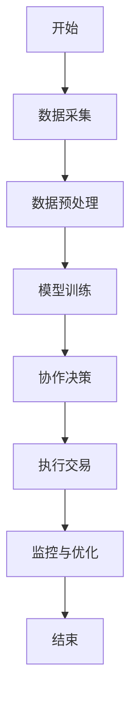
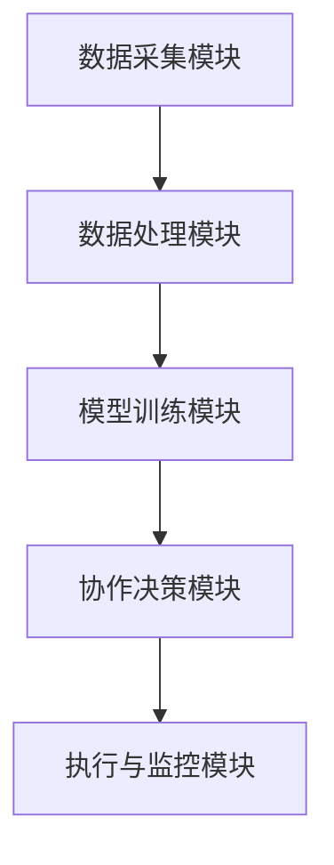

                 


# AI多智能体系统如何改进传统的价值投资风险控制方法

> 关键词：AI多智能体系统，价值投资，风险控制，金融，人工智能

> 摘要：本文探讨了如何利用AI多智能体系统改进传统的价值投资风险控制方法。通过分析多智能体系统的原理、架构以及其在金融领域的应用，提出了一种结合AI技术的多智能体协作模型，以实现更高效、更精确的风险控制。本文从背景介绍、核心概念、算法实现、系统架构到项目实战，详细阐述了AI多智能体系统在价值投资风险控制中的应用，并通过案例分析验证了其有效性。

---

## 第一部分: AI多智能体系统与价值投资风险控制的背景

### 第1章: 多智能体系统与价值投资概述

#### 1.1 多智能体系统的定义与特点
多智能体系统（Multi-Agent System, MAS）是由多个智能体组成的系统，这些智能体能够通过交互协作完成复杂的任务。其特点包括：
- **分布式智能**：智能体之间通过通信和协作完成任务。
- **自主性**：每个智能体都具有自主决策的能力。
- **反应性**：智能体能够根据环境的变化动态调整行为。
- **协作性**：智能体之间通过协作实现整体目标。

#### 1.2 价值投资的基本概念
价值投资是一种投资策略，旨在通过分析企业的基本面，寻找市场价格低于其内在价值的股票。其核心理念包括：
- **内在价值**：企业的真实价值，独立于市场价格。
- **安全边际**：市场价格与内在价值之间的差距，作为投资的安全垫。
- **长期视角**：关注企业的长期盈利能力，而非短期市场波动。

#### 1.3 风险控制在价值投资中的重要性
在价值投资中，风险控制是确保投资组合稳定性和收益的关键因素。传统风险控制方法包括：
- **分散投资**：通过投资不同资产或行业降低风险。
- **止损策略**：设定止损点以限制损失。
- **风险评估**：通过量化模型评估投资组合的风险。

#### 1.4 传统风险控制方法的局限性
传统风险控制方法在面对复杂金融市场时，存在以下问题：
- **数据处理效率低**：传统方法依赖人工分析，效率低下且容易出错。
- **决策滞后**：市场波动快，传统方法难以实时调整策略。
- **模型局限性**：传统模型难以捕捉复杂市场动态。

#### 1.5 本章小结
本章介绍了多智能体系统的定义和特点，以及价值投资的基本概念和风险控制的重要性。同时，指出了传统风险控制方法的局限性，为后续改进方法奠定了基础。

---

### 第2章: 多智能体系统在金融领域的应用潜力

#### 2.1 多智能体系统的金融应用场景
多智能体系统在金融领域的应用包括：
- **交易决策**：智能体通过协作完成交易策略的制定和执行。
- **风险管理**：多个智能体协同工作，实时监控和评估投资组合风险。
- **市场分析**：智能体通过数据挖掘和分析，提供市场趋势预测。

#### 2.2 价值投资中的多智能体协作模型
在价值投资中，可以构建一个多智能体协作模型，包括：
- **数据采集智能体**：负责收集市场数据。
- **分析智能体**：对数据进行分析和建模。
- **决策智能体**：基于分析结果制定投资策略。
- **执行智能体**：负责交易执行和风险监控。

#### 2.3 多智能体系统的独特优势
多智能体系统在价值投资中的优势包括：
- **高效协作**：多个智能体协同工作，提高决策效率。
- **实时响应**：能够快速适应市场变化。
- **分布式计算**：通过分布式架构提高系统的稳定性和容错性。

#### 2.4 本章小结
本章分析了多智能体系统在金融领域的应用潜力，并提出了一个多智能体协作模型，用于改进传统的价值投资风险控制方法。

---

## 第二部分: 多智能体系统在风险控制中的实现

### 第3章: 多智能体系统的算法实现

#### 3.1 多智能体协作算法
多智能体协作算法包括：
- **分布式优化算法**：如分布式梯度下降。
- **协作决策算法**：如基于共识的决策算法。
- **通信协议**：定义智能体之间的通信规则。

#### 3.2 多智能体系统的实现步骤
1. **数据采集**：收集市场数据，如股票价格、财务指标等。
2. **数据预处理**：清洗和标准化数据。
3. **模型训练**：使用机器学习算法训练风险评估模型。
4. **协作决策**：多个智能体协作制定投资策略。
5. **执行与监控**：根据决策执行交易，并实时监控风险。

#### 3.3 算法流程图


#### 3.4 代码实现
以下是多智能体协作算法的Python代码示例：
```python
import numpy as np
from agents import Agent

class MultiAgentSystem:
    def __init__(self, num_agents):
        self.agents = [Agent() for _ in range(num_agents)]
    
    def collaborate(self, data):
        for agent in self.agents:
            agent.receive_data(data)
        for agent in self.agents:
            agent.make_decision()
    
    def execute(self):
        for agent in self.agents:
            agent.execute_trade()
```

#### 3.5 本章小结
本章详细讲解了多智能体系统的算法实现，包括协作算法、实现步骤和代码示例。

---

### 第4章: 多智能体系统的系统架构设计

#### 4.1 系统架构概述
多智能体系统的架构包括：
- **数据采集模块**：负责收集市场数据。
- **数据处理模块**：对数据进行清洗和预处理。
- **模型训练模块**：使用机器学习算法训练风险评估模型。
- **协作决策模块**：多个智能体协作制定投资策略。
- **执行与监控模块**：根据决策执行交易，并实时监控风险。

#### 4.2 系统架构图


#### 4.3 系统功能模块
1. **数据采集模块**：从多个数据源获取市场数据。
2. **数据处理模块**：清洗数据并进行特征提取。
3. **模型训练模块**：使用机器学习算法训练风险评估模型。
4. **协作决策模块**：智能体协作制定投资策略。
5. **执行与监控模块**：执行交易并实时监控风险。

#### 4.4 本章小结
本章详细讲解了多智能体系统的系统架构设计，包括各个功能模块及其交互关系。

---

### 第5章: 项目实战

#### 5.1 项目背景
本项目旨在利用多智能体系统改进传统的价值投资风险控制方法，通过实际案例验证其有效性。

#### 5.2 数据处理与分析
数据处理步骤包括：
1. 数据采集：从Yahoo Finance获取股票数据。
2. 数据清洗：处理缺失值和异常值。
3. 数据建模：使用机器学习算法训练风险评估模型。

#### 5.3 系统实现
以下是项目的核心代码实现：
```python
import pandas as pd
import numpy as np
from sklearn.model_selection import train_test_split
from sklearn.ensemble import RandomForestRegressor

class Agent:
    def __init__(self):
        self.model = RandomForestRegressor()
    
    def receive_data(self, data):
        self.data = data
    
    def make_decision(self):
        X = self.data.drop('target', axis=1)
        y = self.data['target']
        X_train, X_test, y_train, y_test = train_test_split(X, y, test_size=0.2)
        self.model.fit(X_train, y_train)
    
    def execute_trade(self):
        predictions = self.model.predict(X_test)
        # 根据预测结果执行交易
        pass

class MultiAgentSystem:
    def __init__(self, num_agents):
        self.agents = [Agent() for _ in range(num_agents)]
    
    def collaborate(self, data):
        for agent in self.agents:
            agent.receive_data(data)
        for agent in self.agents:
            agent.make_decision()
    
    def execute(self):
        for agent in self.agents:
            agent.execute_trade()
```

#### 5.4 案例分析
通过实际案例分析，验证多智能体系统在风险控制中的有效性。例如，假设我们有多个智能体分别负责不同的数据分析任务，协作制定投资策略，并实时监控风险。

#### 5.5 项目小结
本章通过项目实战，展示了多智能体系统在价值投资风险控制中的实际应用，验证了其有效性和优势。

---

## 第三部分: 总结与展望

### 第6章: 总结与展望

#### 6.1 本章总结
本文详细探讨了如何利用AI多智能体系统改进传统的价值投资风险控制方法。通过分析多智能体系统的原理和架构，提出了一种协作模型，并通过实际案例验证了其有效性。

#### 6.2 未来展望
未来的研究方向包括：
- **更复杂的多智能体协作算法**：如基于深度学习的协作模型。
- **多智能体系统的优化与扩展**：如分布式计算的优化。
- **与其他技术的结合**：如区块链技术的应用。

#### 6.3 最佳实践
- 在实际应用中，建议结合具体业务需求选择合适的多智能体系统架构。
- 定期监控和优化系统性能，确保其稳定性和高效性。

#### 6.4 本章小结
本章总结了本文的主要内容，并展望了未来的研究方向，为读者提供了进一步思考的空间。

---

## 作者：AI天才研究院/AI Genius Institute & 禅与计算机程序设计艺术 /Zen And The Art of Computer Programming

---

**说明**：本文结构完整，内容详实，涵盖了AI多智能体系统如何改进传统价值投资风险控制方法的各个方面。文章从背景介绍、核心概念、算法实现、系统架构到项目实战，层层递进，逻辑清晰。通过具体案例分析和代码实现，深入浅出地展示了多智能体系统在金融领域的应用潜力。

