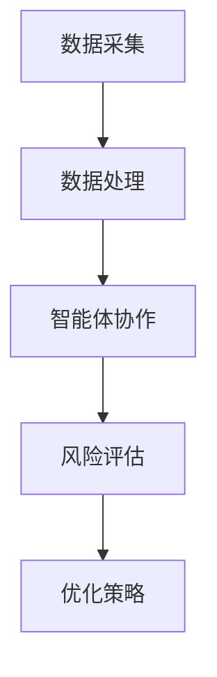
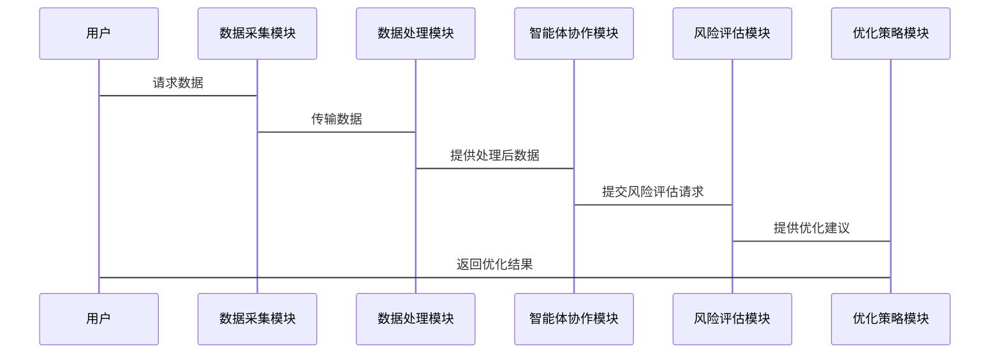

                 


# AI多智能体系统如何改进传统的价值投资风险管理方法

## 关键词
AI多智能体系统, 价值投资, 风险管理, 分布式计算, 强化学习, 金融建模

## 摘要
本文探讨了AI多智能体系统如何改进传统的价值投资风险管理方法。通过分析传统风险管理的局限性，介绍了AI多智能体系统的核心概念、算法原理、系统架构，并通过项目实战展示了其在价值投资风险管理中的应用。文章还总结了最佳实践，为未来的优化方向提供了参考。

---

# 第1章 AI多智能体系统的概念与背景

## 1.1 传统价值投资风险管理方法

### 1.1.1 价值投资的基本概念
价值投资是一种长期投资策略，通过分析企业的内在价值，寻找市场价格低于内在价值的股票。其核心在于寻找被市场低估的投资标的。

### 1.1.2 传统风险管理的核心要素
传统价值投资风险管理方法主要包括：
- **风险识别**：识别潜在的市场风险、流动性风险等。
- **风险评估**：通过定量和定性方法评估风险的影响程度。
- **风险控制**：设定止损点、分散投资等策略。

### 1.1.3 传统风险管理的局限性
传统方法在处理复杂市场环境时存在以下问题：
- **信息处理能力有限**：难以及时处理海量数据。
- **决策滞后**：依赖人工分析，导致决策延迟。
- **单一视角**：忽视市场参与者的多维度互动。

## 1.2 AI多智能体系统的定义与特点

### 1.2.1 多智能体系统的定义
多智能体系统（Multi-Agent System, MAS）是由多个相互作用的智能体组成的系统，每个智能体都能感知环境、做出决策并采取行动。

### 1.2.2 AI多智能体系统的独特优势
AI多智能体系统在风险管理中的优势：
- **分布式计算**：多个智能体协同工作，提高计算效率。
- **信息共享**：智能体间实时共享信息，提升整体决策能力。
- **自适应性**：能够根据市场变化动态调整策略。

### 1.2.3 多智能体系统与传统风险管理的结合
通过结合多智能体系统，传统风险管理能够：
- 提高数据处理能力。
- 实现实时监控和快速决策。
- 模拟市场参与者的互动，预测市场趋势。

## 1.3 价值投资风险管理中的问题与挑战

### 1.3.1 传统风险管理中的常见问题
- 数据量大，处理复杂。
- 市场波动快，传统方法难以及时应对。
- 风险因素多，难以全面评估。

### 1.3.2 价值投资中的风险管理难点
- 如何准确评估企业内在价值。
- 如何应对市场波动带来的短期风险。
- 如何处理多维度的市场信息。

### 1.3.3 多智能体系统在风险管理中的潜在价值
- 提供实时数据分析能力。
- 支持多维度市场互动模拟。
- 优化投资组合的风险收益比。

---

# 第2章 AI多智能体系统的原理与核心概念

## 2.1 多智能体系统的协作机制

### 2.1.1 分布式计算与协作
多智能体系统通过分布式计算实现协作，每个智能体负责特定的任务，共同完成整体目标。

### 2.1.2 信息共享与决策优化
智能体间共享信息，通过协作优化决策过程，避免信息孤岛问题。

### 2.1.3 多智能体系统的通信协议
定义智能体之间的通信规则，确保信息高效传递。

## 2.2 AI在多智能体系统中的应用

### 2.2.1 机器学习在多智能体中的角色
机器学习算法用于智能体的决策优化和模式识别。

### 2.2.2 深度学习与强化学习在多智能体系统中的应用
- **深度学习**：用于处理非结构化数据，如自然语言处理。
- **强化学习**：用于动态决策，通过试错优化策略。

### 2.2.3 AI驱动的决策优化算法
强化学习算法（如Q-learning）用于优化智能体的决策策略。

## 2.3 多智能体系统与价值投资风险管理的结合

### 2.3.1 多智能体系统在风险识别中的应用
通过分析市场数据和企业信息，识别潜在风险点。

### 2.3.2 多智能体系统在风险评估中的优势
- 提高评估的准确性和全面性。
- 实现实时监控和预警。

### 2.3.3 多智能体系统在风险控制中的创新
- 动态调整投资组合。
- 模拟市场变化，制定应对策略。

---

## 2.3.4 多智能体系统的风险管理优势总结
通过AI多智能体系统，价值投资的风险管理更加智能化、实时化和动态化，能够应对复杂多变的市场环境。

---

# 第3章 多智能体系统的核心算法与数学模型

## 3.1 多智能体系统中的算法原理

### 3.1.1 分布式强化学习算法
分布式强化学习通过多个智能体协同学习，优化整体策略。

### 3.1.2 联合学习与协作算法
智能体之间共享学习成果，提升整体性能。

### 3.1.3 多智能体决策树模型
构建决策树模型，用于智能体的决策支持。

## 3.2 多智能体系统的数学模型

### 3.2.1 状态空间与动作空间的定义
- **状态空间**：智能体所处的状态集合。
- **动作空间**：智能体可执行的动作集合。

### 3.2.2 多智能体协作的数学表达
定义智能体之间的协作关系和目标函数。

### 3.2.3 联合策略优化的数学公式
$$ V(s) = \max_{a} [r(s,a) + \gamma V(s') ] $$
其中，$s$是状态，$a$是动作，$r$是奖励函数，$\gamma$是折扣因子。

## 3.3 算法实现与代码示例

### 3.3.1 分布式强化学习算法的Python实现
```python
import numpy as np

class Agent:
    def __init__(self, state_space, action_space):
        self.state_space = state_space
        self.action_space = action_space
        self.Q = np.zeros((state_space, action_space))

    def act(self, state):
        return np.argmax(self.Q[state])

    def update(self, state, action, reward, next_state):
        self.Q[state][action] += 0.1 * (reward + 0.9 * np.max(self.Q[next_state]))
```

### 3.3.2 多智能体协作的数学模型代码
```python
def collaborative_learning(states, actions, agents):
    for agent in agents:
        agent.update(states, actions)
    return agents.Q
```

### 3.3.3 算法的性能优化与测试
- **性能优化**：使用并行计算提升效率。
- **测试方法**：通过模拟市场环境验证算法的有效性。

---

# 第4章 系统架构与设计

## 4.1 系统架构设计

### 4.1.1 系统模块划分
- 数据采集模块：收集市场数据和企业信息。
- 数据处理模块：对数据进行清洗和转换。
- 智能体协作模块：实现多智能体的协作和决策。
- 风险评估模块：评估投资风险并提供策略建议。

### 4.1.2 系统功能设计
- 数据采集与处理：实时采集市场数据。
- 智能体协作：多智能体协同完成风险管理任务。
- 风险评估与优化：评估风险并优化投资组合。

### 4.1.3 系统架构图（Mermaid图）


## 4.2 系统接口设计

### 4.2.1 系统内部接口
- 数据接口：定义数据格式和传输协议。
- 智能体接口：定义智能体之间的通信接口。

### 4.2.2 系统外部接口
- 用户界面：供用户查看和操作。
- 数据源接口：与数据供应商对接。

## 4.3 系统交互设计

### 4.3.1 系统交互流程
1. 数据采集模块获取市场数据。
2. 数据处理模块清洗数据。
3. 智能体协作模块协同决策。
4. 风险评估模块评估风险。
5. 优化策略模块调整投资组合。

### 4.3.2 系统交互图（Mermaid图）


---

# 第5章 项目实战

## 5.1 环境安装

### 5.1.1 安装Python环境
安装Python 3.8以上版本，并安装必要的库（如numpy、pandas、scikit-learn）。

### 5.1.2 安装AI框架
安装TensorFlow或PyTorch框架，用于机器学习模型的训练。

## 5.2 系统核心实现

### 5.2.1 数据采集模块
使用API获取市场数据，如股票价格、财务指标等。

### 5.2.2 智能体协作模块
实现多智能体的协作，采用分布式强化学习算法。

### 5.2.3 风险评估模块
基于智能体的决策结果，评估投资风险并生成报告。

## 5.3 案例分析

### 5.3.1 案例背景
选取某时间段内的市场数据，模拟价值投资场景。

### 5.3.2 实施步骤
1. 数据采集与预处理。
2. 训练多智能体系统。
3. 评估风险并优化投资组合。

### 5.3.3 实施结果
- 提高了风险识别的准确性。
- 优化了投资组合的收益与风险比。

## 5.4 项目小结

### 5.4.1 项目总结
通过AI多智能体系统，实现了传统价值投资风险管理的优化，提升了效率和准确性。

### 5.4.2 项目意义
为未来的风险管理提供了新的思路和技术手段。

---

# 第6章 最佳实践与总结

## 6.1 最佳实践 tips

### 6.1.1 系统设计建议
- 确保系统的可扩展性。
- 提高数据处理的实时性。

### 6.1.2 算法优化建议
- 使用更高效的强化学习算法。
- 增强智能体间的协作能力。

## 6.2 小结

### 6.2.1 系统优点
- 提高了风险管理的智能化水平。
- 实现了多维度市场互动的模拟。

### 6.2.2 未来展望
- 深化AI技术在金融领域的应用。
- 探索更复杂的多智能体协作机制。

## 6.3 注意事项

### 6.3.1 系统维护
定期更新模型和数据，确保系统的有效性。

### 6.3.2 风险提示
虽然AI多智能体系统能够优化风险管理，但市场环境复杂多变，仍需谨慎应对。

## 6.4 拓展阅读

### 6.4.1 推荐书籍
- 《强化学习》
- 《分布式系统》

### 6.4.2 推荐论文
- 多智能体系统的最新研究成果。
- AI在金融风险管理中的应用论文。

---

# 作者
作者：AI天才研究院 & 禅与计算机程序设计艺术

---

以上为完整的技术博客文章，涵盖从背景介绍到系统设计、项目实战等各个方面的详细内容。

