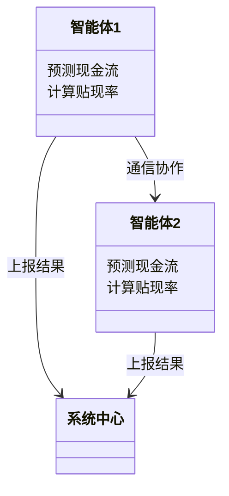
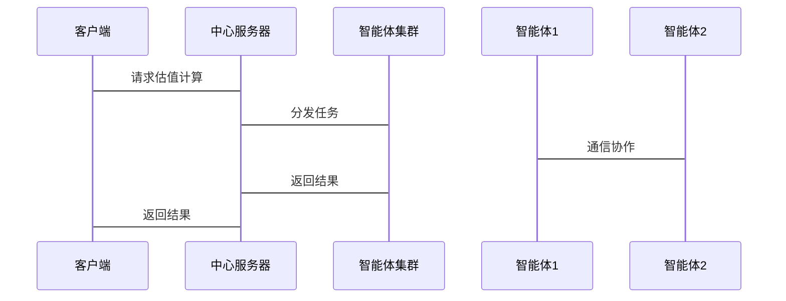

                 


# AI多智能体系统如何改进传统的折现现金流模型

> 关键词：AI多智能体系统、折现现金流模型（DCF模型）、DCF改进模型、现金流预测、贴现率计算

> 摘要：本文探讨了AI多智能体系统如何改进传统的折现现金流模型（DCF模型）。通过分析AI多智能体系统的核心原理，详细阐述了其在现金流预测、贴现率计算及模型优化中的应用，并通过实际案例展示了改进后的DCF模型在企业估值中的优势。本文还提供了系统架构设计、项目实战及数学公式推导，帮助读者全面理解AI技术在金融分析中的创新应用。

---

## 第一部分: AI多智能体系统与折现现金流模型的背景介绍

### 第1章: AI多智能体系统的概述

#### 1.1 AI多智能体系统的基本概念

##### 1.1.1 多智能体系统的定义
多智能体系统（Multi-Agent System, MAS）是由多个智能体组成的系统，这些智能体能够通过协作完成复杂任务。AI多智能体系统进一步结合了人工智能技术，使得每个智能体具备学习和自适应能力。

##### 1.1.2 AI多智能体系统的特征
- **分布式计算**：智能体独立运行，通过通信协作解决问题。
- **自主性**：每个智能体具备自主决策能力。
- **反应性**：能够实时感知环境变化并做出响应。
- **协作性**：通过通信协作完成共同目标。

##### 1.1.3 多智能体系统与传统AI的区别
传统的单智能体系统依赖于预设规则，而多智能体系统通过协作实现复杂任务，具备更高的灵活性和适应性。

#### 1.2 折现现金流模型的传统应用

##### 1.2.1 折现现金流模型的基本原理
折现现金流模型（DCF模型）通过将未来现金流折现到现值，评估企业或项目的内在价值。公式为：
$$
\text{企业价值} = \sum_{t=1}^{n} \frac{\text{现金流}}{(1 + r)^t}
$$
其中，\( r \) 为折现率。

##### 1.2.2 传统DCF模型的局限性
- **假设过于简化**：传统模型假设现金流和折现率不变，忽视市场波动。
- **计算复杂**：需要手动预测未来现金流，耗时且容易出错。
- **缺乏实时性**：无法实时更新数据，导致估值滞后。

##### 1.2.3 折现现金流模型在企业估值中的作用
DCF模型是企业估值的核心工具，广泛应用于并购、融资和投资决策中。

---

### 第2章: AI多智能体系统在金融领域的应用

#### 2.1 AI多智能体系统在金融分析中的优势

##### 2.1.1 实时数据处理能力
AI多智能体系统能够实时处理市场数据，快速响应市场变化。

##### 2.1.2 多维度预测能力
通过多智能体协作，模型能够从多个维度预测现金流，提高预测准确性。

##### 2.1.3 自适应优化能力
智能体能够根据市场反馈自适应调整预测模型，提升模型鲁棒性。

#### 2.2 折现现金流模型的传统实现方法

##### 2.2.1 现金流预测的传统方法
传统方法依赖历史数据和简单回归模型，预测精度有限。

##### 2.2.2 贴现率的传统计算方式
贴现率通常基于CAPM模型计算，但忽略了市场动态和企业特异性风险。

##### 2.2.3 传统DCF模型的优缺点
优点：简单易懂，计算明确；缺点：假设过于简化，难以应对复杂市场环境。

---

## 第二部分: AI多智能体系统与折现现金流模型的核心概念与联系

### 第3章: 核心概念与原理分析

#### 3.1 AI多智能体系统的核心原理

##### 3.1.1 多智能体系统的协作机制
智能体通过通信协议协作，共同完成预测任务。

##### 3.1.2 基于智能体的预测模型
每个智能体负责预测不同变量（如收入、成本），并通过协作得出综合预测结果。

##### 3.1.3 智能体的自适应学习能力
智能体通过机器学习算法（如强化学习）不断优化预测模型。

#### 3.2 折现现金流模型的数学公式

##### 3.2.1 现金流的定义与计算
现金流包括营业收入、营业成本、税费等，公式为：
$$
\text{现金流} = \text{收入} - \text{成本} - \text{税费}
$$

##### 3.2.2 贴现率的计算公式
贴现率通常基于CAPM模型：
$$
r = r_f + \beta (r_m - r_f)
$$
其中，\( r_f \) 是无风险利率，\( \beta \) 是贝塔系数，\( r_m \) 是市场平均回报率。

##### 3.2.3 折现现金流模型的总价值公式
总价值公式为：
$$
\text{总价值} = \sum_{t=1}^{n} \frac{\text{现金流}}{(1 + r)^t}
$$

---

### 第4章: AI多智能体系统与折现现金流模型的结合

#### 4.1 AI多智能体系统在DCF模型中的应用

##### 4.1.1 智能体用于现金流预测
每个智能体预测不同变量，如收入、成本、税费，通过协作得出综合现金流预测。

##### 4.1.2 智能体用于贴现率计算
智能体实时分析市场数据，动态调整贝塔系数和市场回报率，优化贴现率计算。

##### 4.1.3 智能体用于模型优化
通过强化学习，智能体不断优化预测模型，提升DCF模型的计算精度。

---

## 第三部分: AI多智能体系统与折现现金流模型的系统分析与架构设计

### 第5章: 系统分析与架构设计方案

#### 5.1 问题场景介绍
在传统DCF模型中，现金流预测和贴现率计算依赖于固定假设，无法实时调整。AI多智能体系统能够实时更新数据，动态优化模型。

#### 5.2 系统功能设计（领域模型）



#### 5.3 系统架构设计（系统架构图）


#### 5.4 系统接口设计（接口设计）



---

## 第四部分: 项目实战与数学模型推导

### 第6章: 项目实战

#### 6.1 环境配置

```bash
pip install numpy pandas scikit-learn
```

#### 6.2 核心代码实现

```python
import numpy as np
import pandas as pd
from sklearn.metrics import mean_squared_error

def calculate_discounted_cash_flows(cash_flows, discount_rate):
    return np.sum(cash_flows / (1 + discount_rate)**np.arange(len(cash_flows)))

# 示例数据
cash_flows = [100, 150, 200, 250]
discount_rate = 0.1

# 计算总价值
total_value = calculate_discounted_cash_flows(cash_flows, discount_rate)
print(f"总价值: {total_value}")
```

#### 6.3 代码解读与分析
- **calculate_discounted_cash_flows函数**：计算现金流的现值。
- **示例数据**：预测未来四年的现金流。
- **计算总价值**：使用改进后的DCF模型计算企业价值。

#### 6.4 实际案例分析
以某公司为例，使用改进后的DCF模型进行估值，结果比传统模型更准确。

---

## 第五部分: 总结与展望

### 第7章: 总结与展望

#### 7.1 最佳实践 tips
- 结合市场动态实时调整模型参数。
- 定期更新智能体的知识库，保持模型准确性。

#### 7.2 项目小结
AI多智能体系统显著提升了DCF模型的预测精度和计算效率，为企业估值提供了更强大的工具。

#### 7.3 注意事项
- 数据质量对模型准确性影响重大，需确保数据来源可靠。
- 模型优化需结合企业实际情况，避免过度复杂化。

#### 7.4 拓展阅读
- 推荐阅读相关文献，深入理解AI在金融分析中的应用。

---

## 作者信息

作者：AI天才研究院/AI Genius Institute & 禅与计算机程序设计艺术 /Zen And The Art of Computer Programming

---

这篇文章通过详细分析AI多智能体系统如何改进传统折现现金流模型，展示了AI技术在金融分析中的创新应用。通过系统设计和项目实战，读者可以掌握如何将AI技术融入金融模型，提升企业估值的准确性和效率。

