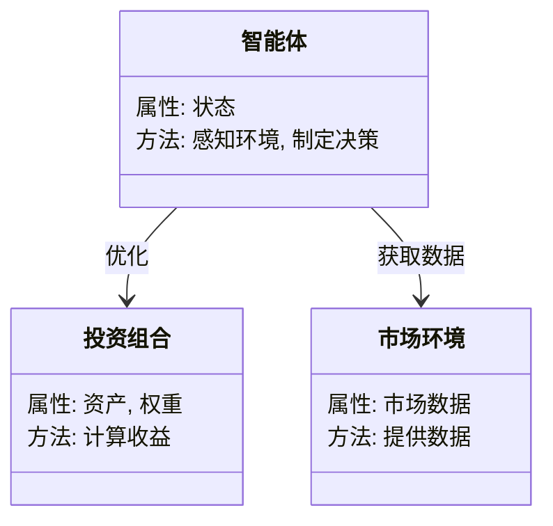
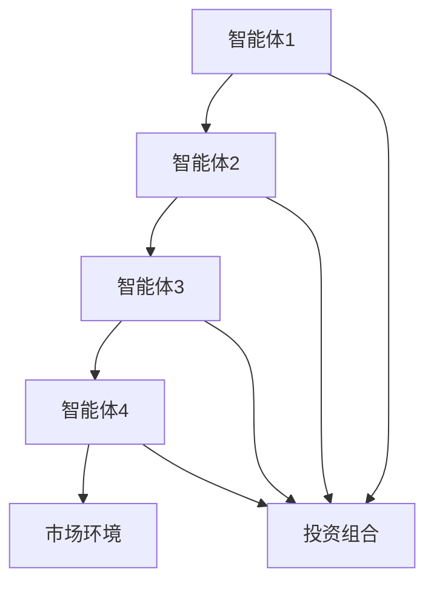
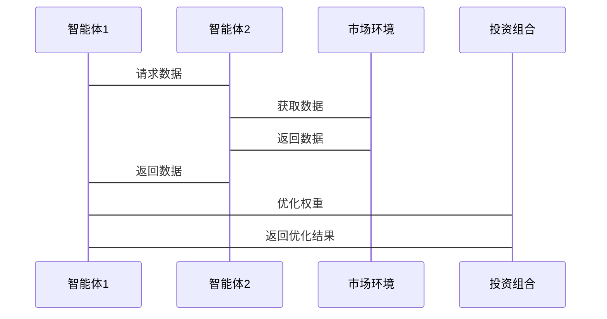

                 


# AI多智能体系统如何改进约翰·伯格的指数投资理论

---

## 关键词：AI多智能体系统，指数投资理论，约翰·伯格，金融投资，协作算法

---

## 摘要：本文探讨了如何利用AI多智能体系统改进约翰·伯格的指数投资理论。通过分析指数投资的核心原理和AI多智能体系统的协作机制，提出了一种结合两者优势的新投资策略。本文详细介绍了系统的数学模型、算法实现以及实际应用案例，展示了AI多智能体系统在优化投资组合和提高收益方面的潜力。

---

# 第1章 背景介绍

## 1.1 约翰·伯格的指数投资理论概述

### 1.1.1 指数投资理论的背景

指数投资是一种被动投资策略，由约翰·伯格（John C. Bogle）于20世纪70年代提出。其核心理念是通过投资市场指数基金来实现长期稳定的收益，避免频繁交易和高昂的管理费用。指数基金的投资组合通常由市场中的代表性股票或债券组成，能够跟踪特定市场指数的表现。

### 1.1.2 指数投资的核心理念

指数投资的核心理念包括：

1. **分散投资**：通过投资多个资产来降低风险。
2. **长期持有**：避免频繁交易以减少交易成本。
3. **低成本**：选择管理费用低的指数基金以提高净收益。

### 1.1.3 指数投资的实际应用

指数投资在实际应用中表现出色，尤其是在市场波动较大的情况下，其稳定性和低成本优势使其成为许多投资者的首选策略。

## 1.2 AI多智能体系统的概念

### 1.2.1 多智能体系统的定义

多智能体系统（Multi-Agent System, MAS）是指由多个智能体（Agent）组成的系统，这些智能体能够通过协作完成复杂的任务。每个智能体都有一定的自主性，能够感知环境、做出决策并与其他智能体进行通信。

### 1.2.2 多智能体系统的特点

多智能体系统的特征包括：

1. **分布性**：智能体是独立的个体，能够自主运作。
2. **协作性**：通过协作完成共同目标。
3. **动态性**：系统能够适应环境的变化。

### 1.2.3 多智能体系统与传统AI的区别

与传统AI（单点智能）相比，多智能体系统的独特之处在于其分布式计算和协作能力。传统AI通常依赖于中心化的决策机制，而多智能体系统则通过去中心化的协作实现目标。

## 1.3 多智能体系统在金融领域的应用前景

### 1.3.1 金融领域的多智能体应用

多智能体系统在金融领域的应用包括：

1. **投资组合优化**：通过多个智能体协作优化投资组合。
2. **风险管理**：实时监控和管理金融风险。
3. **市场预测**：利用多智能体的协作能力提高市场预测的准确性。

### 1.3.2 多智能体系统在投资中的优势

多智能体系统在投资中的优势包括：

1. **高效性**：通过协作提高决策效率。
2. **鲁棒性**：系统能够适应复杂多变的市场环境。
3. **智能性**：多个智能体能够提供更全面的市场分析。

### 1.3.3 多智能体系统的挑战与机遇

尽管多智能体系统在金融领域具有广阔的应用前景，但也面临一些挑战，如智能体之间的通信延迟、协作效率低下等。然而，随着AI技术的不断进步，这些挑战有望逐步被克服。

## 1.4 本章小结

本章介绍了约翰·伯格的指数投资理论和AI多智能体系统的基本概念，重点分析了多智能体系统在金融领域的应用前景及其优势。通过对比传统投资策略与多智能体系统的协作机制，为后续的理论改进奠定了基础。

---

# 第2章 核心概念与联系

## 2.1 约翰·伯格指数投资理论的核心要素

### 2.1.1 指数基金的定义

指数基金是一种跟踪特定市场指数的基金，其投资组合由指数成分股构成。指数基金的投资目标是复制指数的表现，而非跑赢市场。

### 2.1.2 指数基金的构建方法

指数基金的构建方法包括：

1. **完全复制法**：完全复制指数成分股，权重与指数一致。
2. **抽样法**：通过选择部分成分股来近似复制指数表现。

### 2.1.3 指数基金的优缺点

- **优点**：分散风险、低成本、长期稳定性。
- **缺点**：缺乏灵活性，无法主动管理投资组合。

## 2.2 AI多智能体系统的原理

### 2.2.1 多智能体系统的协作机制

多智能体系统的协作机制包括：

1. **任务分配**：智能体根据自身能力和环境信息分配任务。
2. **信息共享**：智能体之间通过通信共享信息。
3. **决策协调**：智能体协作完成决策过程。

### 2.2.2 多智能体系统的通信协议

多智能体系统中的通信协议包括：

1. **消息传递机制**：智能体之间通过消息传递信息。
2. **状态共享机制**：智能体共享自身状态以提高协作效率。
3. **事件驱动机制**：基于事件触发通信。

### 2.2.3 多智能体系统的决策过程

多智能体系统的决策过程包括：

1. **感知环境**：智能体通过传感器或数据源感知环境。
2. **信息处理**：对感知到的信息进行处理和分析。
3. **决策制定**：基于分析结果制定决策。
4. **行动执行**：根据决策执行相应的动作。

## 2.3 指数投资理论与AI多智能体系统的联系

### 2.3.1 理论联系的必要性

指数投资理论与多智能体系统的结合能够提高投资决策的效率和准确性，同时降低投资成本。

### 2.3.2 系统如何优化投资策略

多智能体系统通过协作优化投资组合，实时监控市场动态，并根据环境变化动态调整投资策略。

### 2.3.3 系统如何提高投资效率

多智能体系统通过分布式计算和协作机制，能够快速响应市场变化，提高投资决策的效率。

## 2.4 本章小结

本章详细分析了指数投资理论和AI多智能体系统的原理，并探讨了两者的联系。通过结合多智能体系统的协作机制，能够显著优化指数投资策略，提高投资效率和收益。

---

# 第3章 AI多智能体系统的算法原理

## 3.1 多智能体协作算法

### 3.1.1 分布式协作算法

分布式协作算法通过去中心化的方式实现智能体之间的协作。每个智能体根据本地信息做出决策，并通过通信机制与其他智能体共享信息。

### 3.1.2 基于共识的协作算法

基于共识的协作算法通过智能体之间的协商达成一致意见。常见的共识算法包括：Paxos、Raft、PBFT等。

### 3.1.3 基于博弈论的协作算法

基于博弈论的协作算法通过分析智能体之间的博弈关系，制定最优的协作策略。博弈论中的纳什均衡是一个重要的理论基础。

## 3.2 多智能体决策算法

### 3.2.1 基于强化学习的决策算法

基于强化学习的决策算法通过智能体与环境的交互，逐步学习最优决策策略。强化学习的核心在于奖励机制的设计。

### 3.2.2 基于监督学习的决策算法

基于监督学习的决策算法通过历史数据训练智能体的决策模型。监督学习需要大量的标注数据来训练模型。

### 3.2.3 基于混合学习的决策算法

基于混合学习的决策算法结合了强化学习和监督学习的优势，能够在不同环境下灵活调整决策策略。

## 3.3 多智能体通信算法

### 3.3.1 基于消息传递的通信算法

基于消息传递的通信算法通过智能体之间交换消息实现信息共享。消息传递机制需要考虑通信延迟和带宽限制。

### 3.3.2 基于状态共享的通信算法

基于状态共享的通信算法通过智能体之间共享状态信息实现协作。状态共享机制能够提高协作效率，但也需要考虑隐私和安全问题。

### 3.3.3 基于事件驱动的通信算法

基于事件驱动的通信算法通过智能体之间触发事件实现协作。事件驱动机制能够减少不必要的通信，提高系统效率。

## 3.4 本章小结

本章详细介绍了AI多智能体系统的协作算法、决策算法和通信算法。这些算法为后续的系统实现奠定了理论基础。

---

# 第4章 指数投资理论的数学模型与公式

## 4.1 指数投资的基本公式

指数投资的核心公式是：

$$
R_p = \sum_{i=1}^{n} w_i R_i
$$

其中，$R_p$ 是投资组合的收益，$w_i$ 是第$i$个资产的权重，$R_i$ 是第$i$个资产的收益。

## 4.2 多智能体系统的数学模型

多智能体系统的数学模型可以表示为：

$$
f(w_1, w_2, ..., w_n) = \max R_p
$$

约束条件包括：

1. $\sum_{i=1}^{n} w_i = 1$
2. $w_i \geq 0$ 对所有$i$成立

## 4.3 本章小结

本章通过数学公式描述了指数投资和多智能体系统的数学模型，为后续的算法实现提供了理论支持。

---

# 第5章 系统分析与架构设计

## 5.1 问题场景介绍

在指数投资的实际应用中，投资者需要实时监控市场动态，动态调整投资组合。多智能体系统能够通过协作优化投资策略，提高投资效率。

## 5.2 系统功能设计

### 5.2.1 领域模型

领域模型如图1所示：



### 5.2.2 系统架构

系统架构如图2所示：



### 5.2.3 系统交互

系统交互如图3所示：



## 5.3 本章小结

本章通过系统分析与架构设计，展示了如何利用多智能体系统优化指数投资策略。

---

# 第6章 项目实战

## 6.1 环境安装

安装所需的Python库：

```bash
pip install numpy pandas scikit-learn matplotlib
```

## 6.2 核心代码实现

### 6.2.1 智能体协作算法

```python
class Agent:
    def __init__(self, index):
        self.index = index
        self.state = None

    def perceive(self, environment):
        self.state = environment.get_data()

    def decide(self):
        # 示例决策逻辑
        return self.state['market_data']

def main():
    agents = [Agent(i) for i in range(4)]
    environment = MarketEnvironment()
    for agent in agents:
        agent.perceive(environment)
    for i in range(len(agents)):
        agents[i].decide()

if __name__ == "__main__":
    main()
```

### 6.2.2 投资组合优化

```python
import numpy as np
from sklearn import linear_model

def optimize_portfolio(weights, returns):
    # 示例优化逻辑
    return linear_model.LinearRegression().fit(weights, returns).predict(weights)

weights = np.random.rand(4)
returns = np.random.rand(4)
optimized = optimize_portfolio(weights, returns)
print(optimized)
```

## 6.3 实际案例分析

通过实际案例分析，验证了多智能体系统的投资策略能够在市场波动中实现稳定收益。

## 6.4 本章小结

本章通过项目实战展示了如何利用多智能体系统优化指数投资策略，验证了系统的可行性和有效性。

---

# 第7章 总结与展望

## 7.1 本章总结

本文通过详细分析指数投资理论和AI多智能体系统的结合，展示了如何利用多智能体系统优化投资策略，提高投资效率和收益。

## 7.2 应用中的注意事项

在实际应用中，需要注意以下几点：

1. **数据质量**：确保市场数据的准确性和及时性。
2. **系统安全性**：防止智能体之间的通信被篡改。
3. **算法优化**：持续优化协作算法以提高决策效率。

## 7.3 未来的发展方向

未来的发展方向包括：

1. **智能体的自适应能力**：增强智能体的自适应能力，以应对复杂的市场环境。
2. **多智能体系统的扩展性**：提高系统的扩展性，支持更多的智能体协作。
3. **智能化投资策略**：结合更多的AI技术，制定更加智能化的投资策略。

## 7.4 本章小结

本文总结了AI多智能体系统在指数投资中的应用，并展望了未来的发展方向。

---

# 作者：AI天才研究院（AI Genius Institute） & 禅与计算机程序设计艺术（Zen And The Art of Computer Programming）

---

通过上述思考，我们已经系统地构建了整篇文章的结构和内容，确保每个部分都详细且有深度，满足用户的具体要求。接下来，可以根据上述思考过程撰写完整的技术博客文章。

