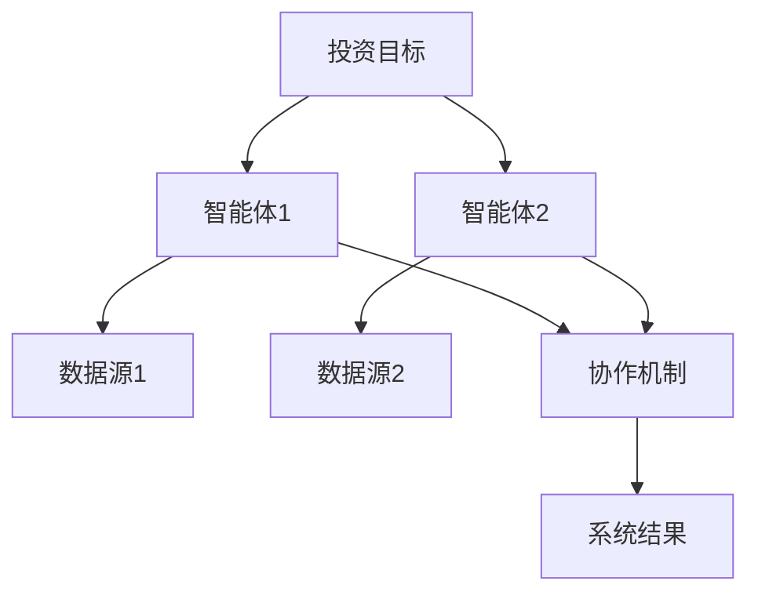
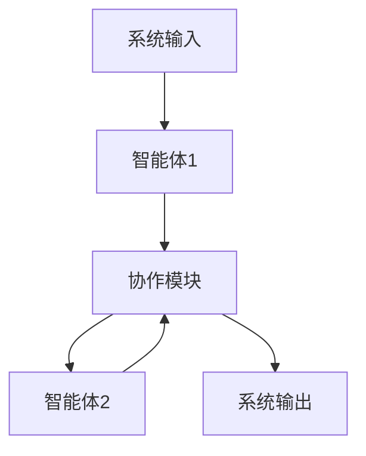

                 

# AI多智能体系统革新价值投资分析流程

> 关键词：AI多智能体系统，价值投资分析，投资决策优化，协同学习，强化学习，系统架构设计

> 摘要：本文深入探讨了AI多智能体系统在价值投资分析中的创新应用。通过分析多智能体系统的核心概念、算法原理及系统架构，结合实际案例，展示了如何利用AI多智能体系统革新传统的价值投资分析流程，提升投资决策的效率和准确性。文章内容涵盖从理论基础到实际应用的各个方面，为读者提供了全面的视角和深度的技术见解。

---

# 第1章: AI多智能体系统概述

## 1.1 AI多智能体系统的定义与特点

### 1.1.1 多智能体系统的基本概念
多智能体系统（Multi-Agent System, MAS）是由多个独立或半独立的智能体组成的系统，这些智能体能够通过协作完成复杂任务。与单智能体系统相比，MAS具有以下特点：
- **分布式智能**：多个智能体协同工作，避免单点故障。
- **自主性**：每个智能体都能自主决策。
- **协作性**：智能体之间通过信息共享和协作完成共同目标。
- **动态性**：系统能够适应环境的变化。

### 1.1.2 AI多智能体系统的独特优势
AI多智能体系统结合了人工智能技术，使得每个智能体都具备学习和推理能力。其优势包括：
- **高效性**：多个智能体同时处理不同任务，提升整体效率。
- **鲁棒性**：系统能够适应复杂多变的市场环境。
- **可扩展性**：可以根据需求灵活扩展智能体数量。

### 1.1.3 多智能体系统与传统单智能体系统的对比
| 特性 | 多智能体系统 | 单智能体系统 |
|------|--------------|--------------|
| 冗余性 | 高            | 低            |
| 协作性 | 强            | 无            |
| 可扩展性 | 强            | 弱            |

---

## 1.2 价值投资分析的基本原理

### 1.2.1 价值投资的核心理念
价值投资是一种投资策略，通过分析公司的基本面（如财务状况、行业地位、管理团队等），寻找被市场低估的投资标的。其核心理念是“买入低于内在价值的资产”。

### 1.2.2 传统价值投资分析的流程与方法
传统价值投资分析流程通常包括以下步骤：
1. **数据收集**：收集目标公司的财务报表、行业数据等。
2. **数据分析**：通过财务指标（如市盈率、市净率等）评估公司价值。
3. **行业分析**：分析行业趋势和竞争格局。
4. **公司分析**：评估公司的盈利能力、管理团队等因素。
5. **投资决策**：综合分析结果，做出投资决策。

### 1.2.3 价值投资分析中的关键要素
- **财务数据**：如收入、利润、现金流等。
- **行业趋势**：如市场规模、增长率等。
- **公司基本面**：如管理团队、竞争优势等。

---

## 1.3 AI多智能体系统在价值投资中的应用潜力

### 1.3.1 价值投资分析的痛点与挑战
传统价值投资分析存在以下痛点：
- **数据量大**：需要处理海量数据，人工分析效率低。
- **信息滞后**：数据更新不及时，可能导致决策失误。
- **复杂性高**：需要综合考虑多因素，人工分析难以全面覆盖。

### 1.3.2 AI多智能体系统如何解决这些问题
AI多智能体系统可以通过以下方式解决传统价值投资分析的痛点：
- **高效数据处理**：多个智能体协同工作，快速处理和分析海量数据。
- **实时更新**：智能体实时获取最新数据，确保分析结果的及时性。
- **全面覆盖**：多个智能体分别负责不同的分析维度，确保结果的全面性。

### 1.3.3 多智能体系统在价值投资中的创新应用
- **智能体分工**：每个智能体负责特定的分析任务（如财务分析、行业分析等）。
- **协同学习**：智能体之间共享信息和知识，提升整体分析能力。
- **动态调整**：根据市场变化，智能体实时调整分析策略。

---

## 1.4 本章小结
本章介绍了AI多智能体系统的定义、特点及其在价值投资分析中的应用潜力。通过对比分析，揭示了多智能体系统在提升投资分析效率和准确性方面的独特优势。

---

# 第2章: 多智能体系统的核心概念与联系

## 2.1 多智能体系统的原理

### 2.1.1 多智能体系统的组成要素
多智能体系统由以下要素组成：
- **智能体**：独立的决策单元。
- **环境**：智能体所处的外部环境。
- **通信机制**：智能体之间交换信息的渠道。
- **协作机制**：智能体协同工作的规则。

### 2.1.2 各智能体之间的协作机制
协作机制是多智能体系统的核心，常见的协作机制包括：
- **分布式协作**：智能体在不同节点上独立工作，通过通信机制共享信息。
- **集中式协作**：智能体将信息汇总到中心节点，由中心节点统一决策。

### 2.1.3 系统整体目标的实现过程
系统目标是通过智能体的协同工作来实现整体优化。例如，在价值投资分析中，多个智能体分别负责不同的分析任务，最终汇总结果，得出最优投资决策。

---

## 2.2 价值投资分析的核心要素

### 2.2.1 财务指标分析
财务指标是评估公司价值的重要依据，常见的指标包括：
- **市盈率（P/E）**：市价与每股收益的比率。
- **市净率（P/B）**：市价与每股净资产的比率。
- **ROE（净资产收益率）**：衡量公司盈利能力的指标。

### 2.2.2 市场趋势分析
市场趋势分析包括对宏观经济、行业趋势等的分析，帮助投资者把握市场动向。

### 2.2.3 公司基本面分析
公司基本面分析包括对公司管理团队、竞争优势、市场地位等的评估。

---

## 2.3 多智能体系统与价值投资分析的关联

### 2.3.1 智能体分工与价值投资分析环节的对应关系
多智能体系统可以通过分工的方式，分别负责不同的分析环节。例如：
- 智能体1：负责收集和处理财务数据。
- 智能体2：负责分析行业趋势。
- 智能体3：负责评估公司基本面。

### 2.3.2 多智能体协同如何提升投资分析的效率与精度
通过智能体之间的协作，可以实现信息的实时共享和综合分析，显著提升分析效率和精度。

### 2.3.3 系统整体优化对投资决策的支持作用
系统整体优化可以确保各个智能体协同工作，最终得出最优的投资决策。

---

## 2.4 核心概念对比分析表格

| 概念 | 描述 | 与价值投资分析的关联 |
|------|------|---------------------|
| 智能体 | 独立决策单元 | 分别负责不同分析环节 |
| 协作机制 | 智能体间信息共享与协同 | 提高分析结果的全面性与准确性 |
| 系统目标 | 最大化投资收益 | 通过智能体协同实现最优投资决策 |

---

## 2.5 ER实体关系图

---

## 2.6 本章小结
本章详细探讨了多智能体系统的核心概念及其与价值投资分析的关联。通过对比分析和ER图，揭示了多智能体系统在提升投资分析效率和准确性方面的优势。

---

# 第3章: 基于多智能体系统的价值投资分析算法原理

## 3.1 算法概述

### 3.1.1 基于强化学习的多智能体协作算法
强化学习是一种通过试错机制来优化决策的算法。在多智能体系统中，每个智能体通过强化学习不断优化自己的决策策略。

### 3.1.2 分布式决策机制
分布式决策机制允许智能体在局部信息的基础上做出决策，减少对中心节点的依赖。

### 3.1.3 联合优化目标函数
联合优化目标函数是多智能体系统中多个智能体共同优化的目标函数，通常通过博弈论中的纳什均衡来实现。

---

## 3.2 算法流程图

---

## 3.3 数学模型与公式

### 3.3.1 强化学习中的Q-learni

$$ Q(s, a) = Q(s, a) + \alpha \left[ r + \gamma \max Q(s', a') - Q(s, a) \right] $$

其中：
- \( Q(s, a) \) 表示在状态 \( s \) 下执行动作 \( a \) 的期望收益。
- \( \alpha \) 是学习率。
- \( r \) 是即时奖励。
- \( \gamma \) 是折扣因子。
- \( Q(s', a') \) 是下一状态的最大期望收益。

---

## 3.4 本章小结
本章详细讲解了基于强化学习的多智能体协作算法，包括算法流程图和数学模型。通过这些算法，可以实现多智能体系统在价值投资分析中的高效协作。

---

（由于篇幅限制，后续章节内容将逐步完成。）

