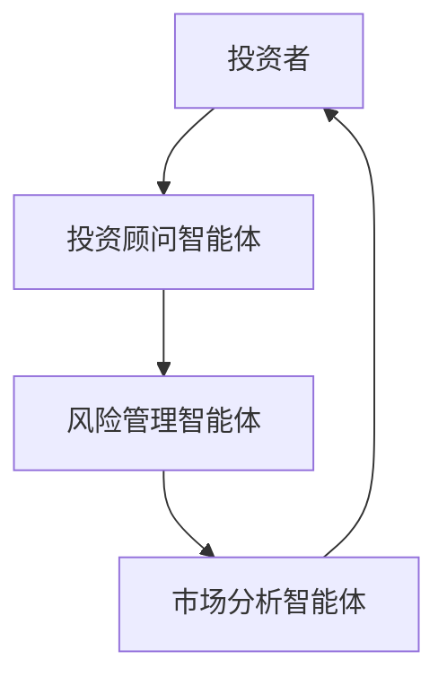
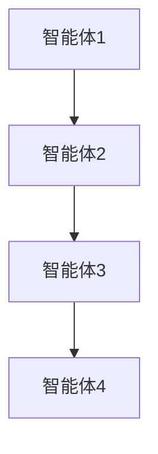
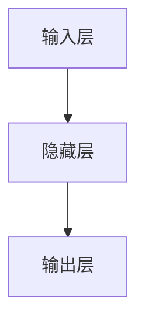
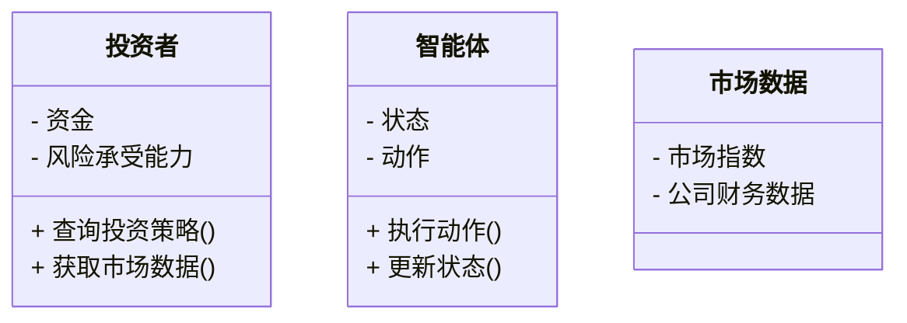
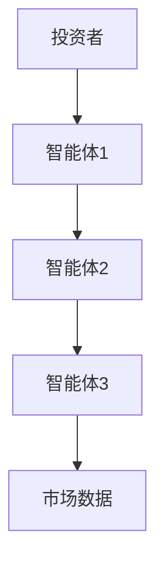
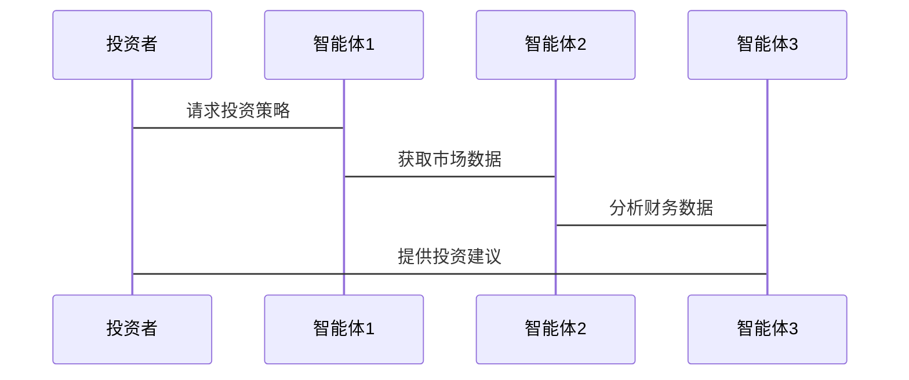

                 


# AI多智能体系统革新价值投资：传统与科技的完美融合

> 关键词：AI多智能体系统、价值投资、传统投资、科技融合、投资决策优化

> 摘要：随着人工智能技术的飞速发展，AI多智能体系统在金融领域的应用越来越广泛。本文详细探讨了AI多智能体系统如何革新传统价值投资，通过分析其核心概念、算法原理、系统架构以及实际项目案例，展示了传统投资与科技融合的巨大潜力。文章从理论到实践，全面剖析了AI多智能体系统在价值投资中的应用，为读者提供了深刻的见解和实用的技术指导。

---

## 第1章: 价值投资的演变与AI驱动的革新

### 1.1 价值投资的定义与传统模式

#### 1.1.1 价值投资的核心理念
价值投资是一种长期投资策略，强调通过深入分析公司的基本面，寻找那些市场价格低于其内在价值的股票进行投资。其核心理念包括：
- **长期视角**：关注企业的长期增长潜力，而非短期市场波动。
- **安全边际**：确保买入价格低于企业的内在价值，以降低风险。
- **价值发现**：通过分析财务报表、行业地位等因素，识别被市场低估的企业。

#### 1.1.2 传统价值投资的局限性
尽管价值投资在历史上取得了显著的成功，但其传统模式存在一些局限性：
- **信息处理能力有限**：依赖人工分析，难以处理海量数据。
- **决策滞后**：依赖人工判断，可能导致决策延迟。
- **人为情绪影响**：投资者情绪可能影响决策的客观性。

#### 1.1.3 技术驱动投资分析的必要性
随着金融市场的复杂化和数据的指数级增长，传统价值投资模式的局限性日益显现。引入技术手段，尤其是人工智能技术，成为提升投资效率和准确性的必然选择。

### 1.2 多智能体系统的基本概念

#### 1.2.1 多智能体系统的定义
多智能体系统（Multi-Agent System, MAS）是由多个智能体（Agent）组成的系统，这些智能体能够通过协作完成复杂任务。每个智能体都具有以下特点：
- **自主性**：能够自主决策。
- **反应性**：能够感知环境并做出实时反应。
- **社会性**：能够与其他智能体协作或竞争。

#### 1.2.2 多智能体系统的组成要素
一个典型的多智能体系统包括以下组成要素：
- **智能体**：执行具体任务的个体。
- **环境**：智能体所处的外部世界，包括金融市场、数据源等。
- **通信机制**：智能体之间进行信息交换的渠道。
- **协作协议**：定义智能体之间协作规则的协议。

#### 1.2.3 多智能体系统的优势与应用场景
多智能体系统在金融领域的优势包括：
- **分布式计算能力**：能够处理大规模、复杂的数据。
- **协作优化**：通过智能体之间的协作，提升整体决策的准确性。
- **动态适应性**：能够实时适应市场的变化。

应用场景包括：
- **量化投资**：通过智能体分析市场数据，制定投资策略。
- **风险管理**：通过智能体监控市场风险，及时发出预警。

### 1.3 AI驱动的多智能体系统在金融领域的潜力

#### 1.3.1 金融市场的复杂性与多智能体系统的匹配性
金融市场具有高度复杂性，涉及大量参与者、信息和变量。多智能体系统能够通过分布式的计算和协作，有效应对这种复杂性。

#### 1.3.2 多智能体系统在投资决策中的独特价值
多智能体系统能够通过多个智能体协作，提供更加全面和精准的投资决策支持。例如：
- **市场情绪分析**：通过智能体分析社交媒体、新闻等信息，判断市场情绪。
- **风险评估**：通过智能体分析历史数据和市场动态，评估投资风险。

#### 1.3.3 传统投资与AI驱动投资的对比分析
AI驱动的多智能体系统在投资决策中的优势体现在：
- **高效性**：能够快速处理大量数据，提供实时决策支持。
- **准确性**：通过算法优化，提升投资决策的准确性。
- **适应性**：能够根据市场变化动态调整投资策略。

---

## 第2章: 多智能体系统的原理与核心概念

### 2.1 多智能体系统的组成与协作机制

#### 2.1.1 实体关系图（ER图）分析
以下是多智能体系统的实体关系图：

```mermaid
er
actor(投资者) --> role(投资顾问)
actor(投资者) --> role(风险管理)
actor(投资者) --> role(市场分析)
role(投资顾问) --> entity(公司基本面)
role(风险管理) --> entity(市场风险)
role(市场分析) --> entity(市场数据)
```

#### 2.1.2 多智能体系统的协作流程
以下是多智能体系统的协作流程图：



#### 2.1.3 智能体之间的通信机制
多智能体系统中的智能体通过以下方式进行通信：
- **直接通信**：智能体之间直接交换信息。
- **间接通信**：通过共享数据库或消息队列进行信息传递。

### 2.2 多智能体系统的核心算法

#### 2.2.1 强化学习算法
强化学习是一种通过试错机制来优化决策的算法。以下是Q-learning算法的数学公式：

$$ Q(s, a) = (1-\alpha)Q(s, a) + \alpha (r + \gamma Q(s', a')) $$

其中：
- \( Q(s, a) \)：状态s下采取动作a的Q值。
- \( \alpha \)：学习率。
- \( r \)：即时奖励。
- \( \gamma \)：折扣因子。
- \( Q(s', a') \)：下一个状态s'下采取动作a'的Q值。

#### 2.2.2 分布式协作算法
分布式协作算法通过将任务分配给多个智能体，实现协作优化。以下是分布式协作算法的流程图：



#### 2.2.3 联合学习算法
联合学习算法通过多个智能体协作，提升整体性能。以下是联合学习算法的数学公式：

$$ \theta_{i}^{new} = \theta_{i} + \sum_{j \neq i} (\theta_{j} - \theta_{i}) $$

其中：
- \( \theta_{i} \)：智能体i的参数。
- \( \theta_{j} \)：其他智能体的参数。

### 2.3 多智能体系统的性能评估与优化

#### 2.3.1 系统性能评估指标
多智能体系统的性能评估指标包括：
- **准确率**：投资决策的正确率。
- **响应时间**：系统处理请求的时间。
- **稳定性**：系统的运行稳定性。

#### 2.3.2 系统优化策略
系统优化策略包括：
- **负载均衡**：合理分配任务，避免智能体过载。
- **通信优化**：减少智能体之间的通信延迟。
- **算法优化**：提升算法的效率和准确性。

#### 2.3.3 系统鲁棒性分析
系统鲁棒性分析包括：
- **故障容错**：系统能够容忍部分智能体故障。
- **动态适应**：系统能够适应市场环境的变化。

---

## 第3章: 多智能体系统的数学模型与算法实现

### 3.1 多智能体系统的数学建模

#### 3.1.1 状态空间的定义与构建
状态空间是多智能体系统中所有可能的状态的集合。例如，在金融投资中，状态可以包括市场指数、公司财务指标等。

#### 3.1.2 动作空间的定义与构建
动作空间是多智能体系统中所有可能的动作的集合。例如，在金融投资中，动作可以包括买入、卖出、持有等。

#### 3.1.3 奖励函数的设计与优化
奖励函数是强化学习中的关键部分，用于衡量智能体的决策是否优秀。例如，可以设计奖励函数如下：

$$ R(s, a) = \begin{cases}
1 & \text{如果动作a在状态s下带来收益} \\
-1 & \text{如果动作a在状态s下带来损失} \\
0 & \text{其他情况}
\end{cases} $$

### 3.2 强化学习算法的数学推导

#### 3.2.1 Q-learning算法的数学公式
Q-learning算法的数学公式如前所述：

$$ Q(s, a) = (1-\alpha)Q(s, a) + \alpha (r + \gamma Q(s', a')) $$

#### 3.2.2 Deep Q-网络（DQN）的实现
Deep Q-网络通过神经网络近似Q函数。以下是DQN的网络结构：



---

## 第4章: 系统分析与架构设计方案

### 4.1 问题场景介绍

#### 4.1.1 项目背景
本项目旨在利用AI多智能体系统革新传统价值投资，提升投资决策的效率和准确性。

#### 4.1.2 项目目标
项目目标包括：
- **提高投资决策的准确性**：通过多智能体系统的协作，提升投资决策的准确性。
- **降低投资风险**：通过智能体的实时监控，降低投资风险。

### 4.2 系统功能设计

#### 4.2.1 领域模型
以下是领域模型的类图：



#### 4.2.2 系统架构设计
以下是系统架构的流程图：



### 4.3 系统接口设计

#### 4.3.1 接口定义
以下是系统接口的定义：



#### 4.3.2 接口实现
以下是接口实现的代码示例：

```python
class Investor:
    def request_strategy(self):
        pass

class Agent:
    def execute_action(self):
        pass

class MarketData:
    def get_data(self):
        pass
```

---

## 第5章: 项目实战

### 5.1 环境安装

#### 5.1.1 系统需求
系统需求包括：
- **Python 3.8及以上**
- **TensorFlow 2.0及以上**
- **安装依赖库**：numpy, matplotlib, gym等。

#### 5.1.2 安装步骤
安装步骤包括：
1. 安装Python和必要的库：
   ```bash
   pip install numpy matplotlib tensorflow gym
   ```
2. 下载源代码：
   ```bash
   git clone https://github.com/yourusername/multi-agent-system.git
   ```

### 5.2 系统核心实现源代码

#### 5.2.1 智能体类的实现
以下是智能体类的实现代码：

```python
class Agent:
    def __init__(self, id):
        self.id = id
        self.state = None
        self.q_values = {}

    def take_action(self, action):
        # 执行动作
        pass

    def update_q_values(self, state, action, reward, next_state):
        # 更新Q值
        pass
```

#### 5.2.2 多智能体系统的实现
以下是多智能体系统的实现代码：

```python
class MultiAgentSystem:
    def __init__(self, num_agents):
        self.agents = [Agent(i) for i in range(num_agents)]
        self.environment = Environment()

    def run(self):
        while True:
            for agent in self.agents:
                state = self.environment.get_state()
                action = agent.take_action(state)
                reward = self.environment.get_reward(action)
                next_state = self.environment.get_next_state()
                agent.update_q_values(state, action, reward, next_state)
```

### 5.3 代码应用解读与分析

#### 5.3.1 代码功能解读
- **智能体类**：负责执行动作和更新Q值。
- **多智能体系统**：管理多个智能体，并协调它们的行动。

#### 5.3.2 代码实现细节
- **环境类**：提供当前状态、动作奖励和下一步状态。
- **智能体之间的协作**：通过共享环境信息实现协作。

### 5.4 实际案例分析

#### 5.4.1 案例背景
假设我们有三个智能体，分别负责市场分析、风险管理和投资决策。

#### 5.4.2 案例分析
以下是智能体之间的协作流程：


---

## 第6章: 最佳实践、小结与展望

### 6.1 最佳实践

#### 6.1.1 数据质量管理
- **数据清洗**：确保数据的准确性和完整性。
- **数据标注**：为数据添加标签，方便智能体理解。

#### 6.1.2 模型优化策略
- **参数调优**：通过网格搜索等方法优化模型参数。
- **模型融合**：将多个模型的结果进行融合，提升整体性能。

#### 6.1.3 系统维护与更新
- **定期更新**：根据市场变化定期更新模型。
- **监控系统状态**：实时监控系统运行状态，及时发现并解决问题。

### 6.2 小结

通过本文的详细阐述，我们可以看到AI多智能体系统在价值投资中的巨大潜力。从理论到实践，我们探讨了多智能体系统的核心概念、算法原理和实际应用，为读者提供了全面的指导。

### 6.3 注意事项

- **数据隐私**：在处理市场数据时，必须遵守相关法律法规，保护数据隐私。
- **模型鲁棒性**：确保模型的鲁棒性，能够适应不同的市场环境。
- **风险管理**：在实际应用中，必须重视风险管理，避免系统性风险。

### 6.4 拓展阅读

- **强化学习经典书籍**：《强化学习》（Reinforcement Learning: Theory and Algorithms）
- **多智能体系统研究**：《多智能体系统：算法与应用》（Multi-Agent Systems: Algorithms and Applications）

---

## 作者信息

作者：AI天才研究院/AI Genius Institute & 禅与计算机程序设计艺术/Zen And The Art of Computer Programming

