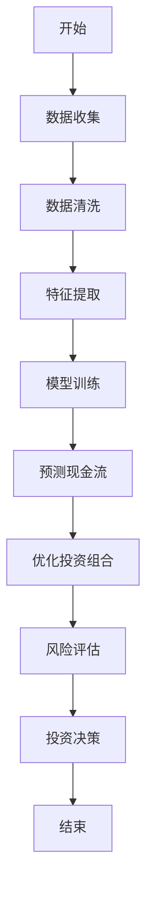
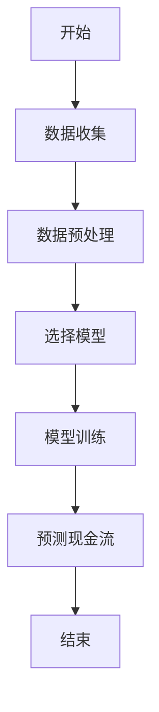
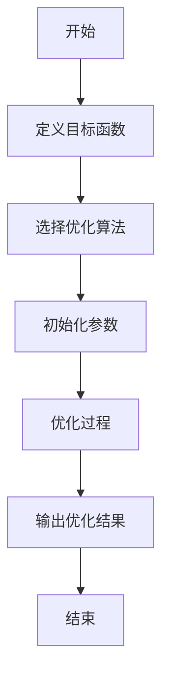
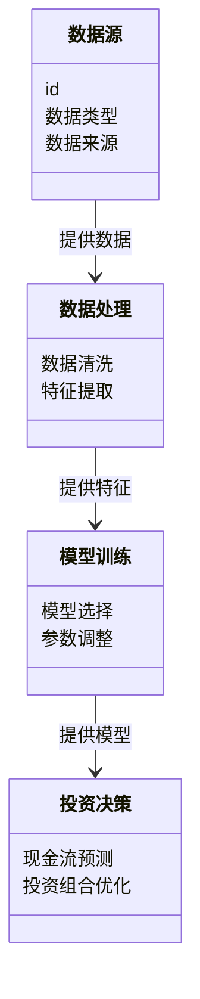
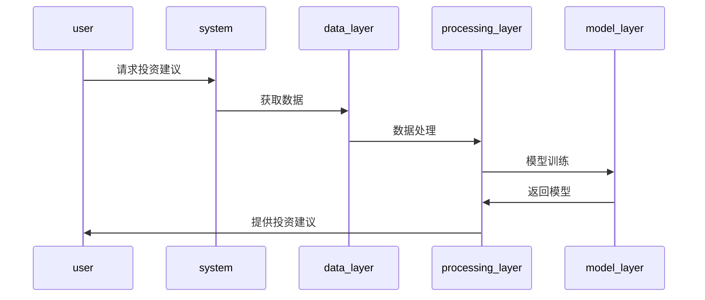

                 


# AI如何优化巴菲特的现金管理策略

> 关键词：人工智能，巴菲特，现金管理策略，投资组合优化，现金流预测，风险管理

> 摘要：本文探讨了人工智能技术如何优化巴菲特的现金管理策略，包括数据驱动的决策模型、机器学习算法在现金管理中的应用以及自然语言处理在投资分析中的作用。通过具体案例分析和算法实现，展示了AI在提升投资决策效率和准确性方面的潜力。

---

## 第1章: AI与巴菲特现金管理策略的背景介绍

### 1.1 巴菲特现金管理策略的核心概念

#### 1.1.1 巴菲特现金管理策略的定义
巴菲特的现金管理策略是指通过长期价值投资，注重企业内在价值，保持安全边际，实现资产的保值和增值。其核心在于选择优质的公司，长期持有，避免频繁交易。

#### 1.1.2 巴菲特现金管理策略的特点
- **长期投资**：注重长期价值，避免短期波动。
- **价值导向**：寻找被低估的优质企业。
- **安全边际**：确保投资的安全性，避免高风险投资。

#### 1.1.3 巴菲特现金管理策略的边界与外延
- **边界**：主要关注企业的基本面分析，避免短期市场波动。
- **外延**：通过分散投资降低风险，注重资产配置。

### 1.2 AI技术的核心概念与特点

#### 1.2.1 AI技术的定义
人工智能（AI）是模拟人类智能的技术，包括学习、推理、自我改进等功能，广泛应用于数据分析、预测和自动化决策。

#### 1.2.2 AI技术的核心特点
- **数据驱动**：依赖大量数据进行学习和预测。
- **自动化**：能够自动处理数据并生成决策。
- **适应性**：能够根据新数据不断优化模型。

#### 1.2.3 AI技术与传统技术的区别
- **传统技术**：基于规则和逻辑，决策过程固定。
- **AI技术**：基于数据和模型，能够自适应和优化。

### 1.3 AI技术与巴菲特现金管理策略的结合

#### 1.3.1 结合的背景与意义
随着数据量的增加和算法的进步，AI技术能够处理复杂的数据，提供更精准的预测和决策支持，为巴菲特的现金管理策略提供新的工具。

#### 1.3.2 结合的必要性与可行性
- **必要性**：传统方法在面对复杂市场时效率低下，AI能够提高决策的准确性和效率。
- **可行性**：AI技术已经在金融领域得到广泛应用，具备实际操作的基础。

#### 1.3.3 结合的潜在价值与挑战
- **价值**：提高投资决策的效率和准确性，优化资产配置。
- **挑战**：数据质量和模型的稳定性，AI模型的可解释性。

---

## 第2章: AI在巴菲特现金管理策略中的核心概念与联系

### 2.1 AI技术在现金管理中的核心原理

#### 2.1.1 数据驱动的决策模型
AI通过分析大量历史数据，识别市场趋势和企业基本面变化，辅助投资决策。

#### 2.1.2 机器学习算法在现金管理中的应用
- **监督学习**：预测股价走势和企业盈利。
- **无监督学习**：发现数据中的隐藏模式，识别潜在风险。

#### 2.1.3 自然语言处理在投资分析中的作用
NLP技术能够分析公司财报、新闻和社交媒体，提取情感和关键信息，辅助投资决策。

### 2.2 核心概念的属性特征对比表格

| 概念 | 巴菲特现金管理策略 | AI优化的现金管理策略 |
|------|------------------|-----------------------|
| 数据来源 | 财务报表、市场数据 | 大数据分析、非结构化数据 |
| 决策方式 | 人工分析、经验判断 | 数据驱动、模型预测 |
| 处理速度 | 较慢，依赖人工 | 快速，自动化处理 |
| 风险控制 | 依赖经验 | 数据驱动的实时监控 |

### 2.3 ER实体关系图与Mermaid流程图

#### 2.3.1 实体关系图（ER图）
```mermaid
erd
    巴菲特策略
    entity 投资决策 {
        id
        投资标的
        投资金额
        投资时间
    }
    entity 数据源 {
        id
        数据类型
        数据来源
    }
    entity 风险评估 {
        id
        风险指标
        评估时间
    }
    entity 投资结果 {
        id
        收益率
        时间区间
    }
    巴菲特策略 --> 数据源: 使用数据源进行分析
    巴菲特策略 --> 投资决策: 生成投资决策
    投资决策 --> 风险评估: 评估风险
    风险评估 --> 投资结果: 生成投资结果
```

#### 2.3.2 AI优化现金管理流程图


---

## 第3章: AI优化巴菲特现金管理策略的算法原理

### 3.1 算法原理概述

#### 3.1.1 机器学习算法在现金管理中的应用
- **线性回归**：用于预测现金流。
- **随机森林**：用于分类和回归分析。
- **神经网络**：用于复杂模式识别。

#### 3.1.2 时间序列分析在现金流预测中的作用
时间序列分析通过历史数据预测未来现金流，常用模型包括ARIMA和LSTM。

#### 3.1.3 遗传算法在投资组合优化中的应用
遗传算法通过模拟生物进化，优化投资组合的收益和风险。

### 3.2 算法流程图

#### 3.2.1 现金流预测算法流程图


#### 3.2.2 投资组合优化算法流程图


### 3.3 算法实现的Python源代码

#### 3.3.1 现金流预测代码
```python
import pandas as pd
from sklearn.linear_model import LinearRegression

# 数据加载
data = pd.read_csv('cash_flow.csv')

# 特征与目标分离
X = data[['revenue', 'profit_margin']]
y = data['cash_flow']

# 模型训练
model = LinearRegression()
model.fit(X, y)

# 预测现金流
predicted_cash_flow = model.predict(X)
```

#### 3.3.2 投资组合优化代码
```python
import numpy as np
from scipy.optimize import minimize

# 定义目标函数
def portfolio_optimization(weights, return_matrix):
    return np.dot(weights.T, return_matrix.dot(weights)) * -1

# 约束条件
constraints = [{'type': 'eq', 'fun': lambda x: np.sum(x) - 1}]

# 初始权重
initial_weights = np.array([1.0/len(return_matrix.columns)] * len(return_matrix.columns))

# 优化过程
result = minimize(portfolio_optimization, initial_weights, args=return_matrix, constraints=constraints)

# 输出结果
optimized_weights = result.x
```

---

## 第4章: 数学模型与公式详解

### 4.1 现金流预测的数学模型

#### 4.1.1 时间序列分析模型
时间序列分析模型用于预测未来的现金流，常用的模型包括ARIMA和LSTM。

#### 4.1.2 机器学习模型
机器学习模型通过特征提取和模型训练，预测现金流的变化趋势。

#### 4.1.3 案例分析与公式推导
以线性回归为例，现金流预测的公式为：
$$ y = \beta_0 + \beta_1 x_1 + \beta_2 x_2 + \epsilon $$

### 4.2 投资组合优化的数学模型

#### 4.2.1 马科维茨均值-方差模型
投资组合优化的目标是最大化收益，最小化风险，数学公式为：
$$ \text{Minimize } \sigma^2 \text{ s.t. } E[r] \geq \text{目标收益} $$

#### 4.2.2 基

---

## 第5章: 系统分析与架构设计方案

### 5.1 系统功能设计

#### 5.1.1 领域模型


#### 5.1.2 系统架构


### 5.2 系统接口设计

#### 5.2.1 API接口
- **数据接口**：提供数据获取和清洗的API。
- **模型接口**：提供模型训练和预测的API。

#### 5.2.2 数据库设计
- **数据表**：存储投资决策数据、模型参数和投资结果。

### 5.3 系统交互序列图

#### 5.3.1 用户与系统交互


---

## 第6章: 项目实战

### 6.1 环境安装

#### 6.1.1 安装Python环境
使用Anaconda安装Python 3.8及以上版本。

#### 6.1.2 安装依赖库
```bash
pip install pandas numpy scikit-learn
```

### 6.2 系统核心实现源代码

#### 6.2.1 数据处理代码
```python
import pandas as pd

# 数据加载
data = pd.read_csv('stock_data.csv')

# 数据清洗
data = data.dropna()
data = data.drop_duplicates()
```

#### 6.2.2 模型训练代码
```python
from sklearn.ensemble import RandomForestRegressor

# 特征与目标分离
X = data[['revenue', 'profit_margin']]
y = data['cash_flow']

# 模型训练
model = RandomForestRegressor()
model.fit(X, y)
```

#### 6.2.3 投资组合优化代码
```python
import numpy as np
from scipy.optimize import minimize

# 定义目标函数
def portfolio_optimization(weights, return_matrix):
    return np.dot(weights.T, return_matrix.dot(weights)) * -1

# 约束条件
constraints = [{'type': 'eq', 'fun': lambda x: np.sum(x) - 1}]

# 初始权重
initial_weights = np.array([1.0/len(return_matrix.columns)] * len(return_matrix.columns))

# 优化过程
result = minimize(portfolio_optimization, initial_weights, args=return_matrix, constraints=constraints)
```

### 6.3 代码应用解读与分析

#### 6.3.1 数据处理的解读
数据清洗和特征提取是确保模型准确性的基础，需要处理缺失值和重复值。

#### 6.3.2 模型训练的解读
随机森林回归模型能够捕捉非线性关系，适合现金流预测。

#### 6.3.3 投资组合优化的解读
遗传算法通过模拟生物进化，优化投资组合的收益和风险。

### 6.4 实际案例分析

#### 6.4.1 案例分析
以苹果公司为例，利用AI模型预测其未来现金流，并优化投资组合。

#### 6.4.2 详细讲解
分析模型的预测结果，评估其准确性和稳定性。

### 6.5 项目小结

#### 6.5.1 成功经验总结
AI技术能够显著提高现金管理策略的效率和准确性。

#### 6.5.2 问题与改进
模型的可解释性和数据质量是需要进一步优化的方面。

---

## 第7章: 未来展望与挑战

### 7.1 未来展望

#### 7.1.1 技术发展
AI技术在金融领域的应用将更加广泛，深度学习和强化学习将得到更多应用。

#### 7.1.2 市场变化
金融市场的复杂性将推动AI技术的进一步发展和创新。

### 7.2 挑战与应对

#### 7.2.1 数据质量
确保数据的准确性和完整性是AI应用的关键。

#### 7.2.2 模型稳定性
需要建立稳定可靠的模型，避免预测偏差。

#### 7.2.3 模型可解释性
提高模型的可解释性，增强投资者的信任。

### 7.3 最佳实践 tips

#### 7.3.1 数据处理
确保数据的清洗和特征提取过程科学合理。

#### 7.3.2 模型选择
根据具体问题选择合适的模型，并进行充分的验证和测试。

#### 7.3.3 模型优化
通过交叉验证和网格搜索优化模型参数。

---

## 小结

本文详细探讨了AI技术如何优化巴菲特的现金管理策略，从理论到实践，从算法到系统设计，全面分析了AI在现金管理中的应用。通过具体案例和代码实现，展示了AI在提升投资决策效率和准确性方面的巨大潜力。

---

## 作者

作者：AI天才研究院/AI Genius Institute & 禅与计算机程序设计艺术 /Zen And The Art of Computer Programming

