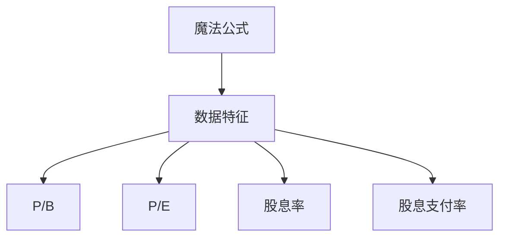
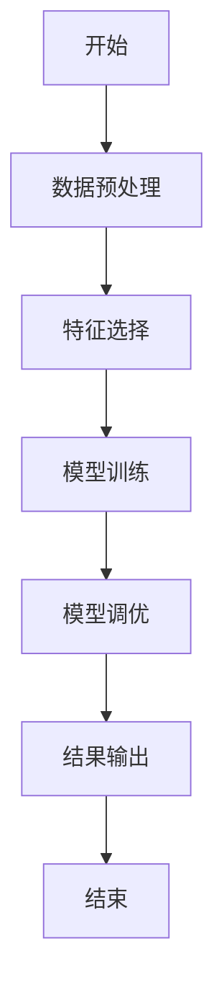
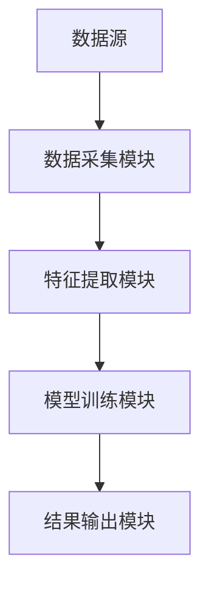
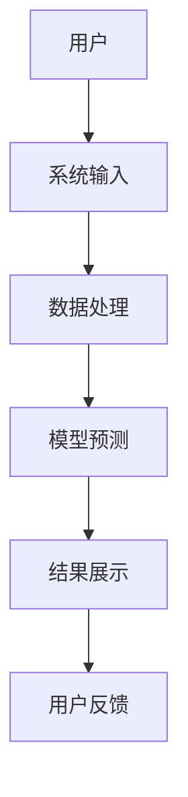

                 


# AI如何优化格林布拉特的魔法公式策略

> 关键词：格林布拉特魔法公式，AI优化，投资策略，机器学习，股票评估

> 摘要：本文深入探讨了如何利用人工智能技术优化格林布拉特的魔法公式策略。通过分析魔法公式的核心要素，结合AI算法的原理，展示了如何利用机器学习提升投资策略的准确性和效率。文章内容涵盖背景介绍、核心概念、算法原理、系统设计、项目实战及总结，旨在为投资者和AI技术爱好者提供有价值的参考。

---

# 目录

1. [格林布拉特魔法公式与AI优化概述](#green-blatt-s-magic-formula-and-ai-optimization-overview)
   1.1 [格林布拉特魔法公式的背景与起源](#green-blatt-s-magic-formula-background-and-origin)
   1.2 [AI与投资策略的结合](#ai-and-investment-strategy-combination)
   1.3 [本章小结](#chapter-conclusion)

2. [核心概念与联系](#core-concepts-and-links)
   2.1 [格林布拉特魔法公式的核心要素](#core-elements-of-green-blatt-s-magic-formula)
   2.2 [魔法公式的数据特征](#data-characteristics-of-the-magic-formula)
   2.3 [魔法公式与AI优化的关系](#relationship-between-magic-formula-and-ai-optimization)
   2.4 [本章小结](#chapter-conclusion)

3. [算法原理讲解](#algorithm-principles-explained)
   3.1 [基于AI的魔法公式优化算法](#ai-based-magic-formula-optimization-algorithm)
   3.2 [算法流程图](#algorithm-flowchart)
   3.3 [算法实现代码](#algorithm-implementation-code)
   3.4 [本章小结](#chapter-conclusion)

4. [系统分析与架构设计](#system-analysis-and-architecture-design)
   4.1 [系统功能设计](#system-function-design)
   4.2 [系统架构设计](#system-architecture-design)
   4.3 [系统交互设计](#system-interaction-design)
   4.4 [本章小结](#chapter-conclusion)

5. [项目实战](#project-practice)
   5.1 [环境安装与配置](#environment-installation-and-configuration)
   5.2 [代码实现](#code-implementation)
   5.3 [案例分析](#case-analysis)
   5.4 [本章小结](#chapter-conclusion)

6. [总结与展望](#summary-and-outlook)
   6.1 [总结](#summary)
   6.2 [未来展望](#future-outlook)
   6.3 [注意事项](#notes)
   6.4 [最佳实践](#best-practices)
   6.5 [作者信息](#author-information)

---

## 1. 格林布拉特魔法公式与AI优化概述

### 1.1 格林布拉特魔法公式的背景与起源

格林布拉特的魔法公式是一种用于评估股票投资价值的模型，由投资者彼得·格林布拉特提出。该公式结合了基本面分析和量化方法，旨在找到被市场低估的优质股票。

#### 1.1.1 魔法公式的定义与核心要素

魔法公式的核心在于通过计算市净率（P/B）和市盈率（P/E）等指标，筛选出具有高投资价值的股票。具体公式如下：

$$
\text{Magic Formula Score} = \frac{E}{P}
$$

其中，E代表企业价值，P代表股价。

#### 1.1.2 魔法公式的发展历程

魔法公式自提出以来，经过多次改进和优化，逐步被更多投资者接受和应用。其核心思想是通过量化指标筛选出具有稳定收益和低估值的股票。

#### 1.1.3 魔法公式在投资策略中的应用

魔法公式常用于价值投资策略，帮助投资者在市场中发现被低估的优质企业。然而，传统方法在数据处理和模型优化上存在局限性，AI技术的引入为其带来了新的可能性。

### 1.2 AI与投资策略的结合

#### 1.2.1 AI在金融领域的潜力

人工智能技术在金融领域的应用广泛，包括股票预测、风险评估、交易策略优化等。AI能够处理海量数据，发现传统方法难以察觉的模式和趋势。

#### 1.2.2 魔法公式与AI优化的契合点

AI技术能够增强魔法公式的数据处理能力，优化模型参数，提高预测准确率。通过机器学习算法，AI可以自动调整权重，动态优化投资组合。

#### 1.2.3 优化目标与应用场景

AI优化魔法公式的目的是提升投资收益，降低风险。应用场景包括股票筛选、投资组合优化、市场趋势预测等。

### 1.3 本章小结

本章介绍了格林布拉特魔法公式的基本概念及其在投资中的应用，同时分析了AI技术在优化魔法公式中的潜力和应用场景。

---

## 2. 核心概念与联系

### 2.1 格林布拉特魔法公式的核心要素

魔法公式的核心要素包括市净率（P/B）、市盈率（P/E）、股息率与股息支付率等。这些指标共同反映了企业的财务状况和市场价值。

#### 2.1.1 市净率（P/B）

市净率是股价与每股净资产的比率，用于衡量股票价格是否合理。计算公式为：

$$
P/B = \frac{\text{股价}}{\text{每股净资产}}
$$

#### 2.1.2 市盈率（P/E）

市盈率是股价与每股收益的比率，用于评估股票的投资价值。计算公式为：

$$
P/E = \frac{\text{股价}}{\text{每股收益}}
$$

#### 2.1.3 股息率与股息支付率

股息率是股息与股价的比率，反映了股票的分红能力。股息支付率是股息与净利润的比率，用于评估公司的分红政策。

### 2.2 魔法公式的数据特征

为了优化魔法公式，需要对数据特征进行分析和选择。以下是关键数据特征的对比表格：

| 特征 | 描述 | 类型 |
|------|------|------|
| P/B  | 市净率 | 数值型 |
| P/E  | 市盈率 | 数值型 |
| 股息率 | 股息与股价比率 | 数值型 |
| 股息支付率 | 股息与净利润比率 | 数值型 |

#### 2.2.2 实体关系图

以下是魔法公式与数据特征的实体关系图：



### 2.3 魔法公式与AI优化的关系

AI优化魔法公式的核心在于通过机器学习算法，自动调整权重，优化模型参数，提高预测准确性。

#### 2.3.1 魔法公式与AI优化的结合方式

AI优化魔法公式的方式包括特征选择、模型训练和调优策略。以下是优化流程图：



#### 2.3.2 数据特征与模型输入的关系

魔法公式的数据特征直接作为机器学习模型的输入，通过特征工程进一步提取和处理。

#### 2.3.3 优化目标与模型输出的对应关系

模型输出为目标股票的评分，用于指导投资决策。

### 2.4 本章小结

本章详细分析了魔法公式的核心要素及其与AI优化的关系，通过对比表格和流程图展示了数据特征和优化过程。

---

## 3. 算法原理讲解

### 3.1 基于AI的魔法公式优化算法

#### 3.1.1 优化目标的数学表达

最大化投资收益，同时控制风险：

$$
\text{最大化} \sum_{i=1}^{n} w_i \cdot r_i
$$

其中，\( w_i \) 是第i个股票的权重，\( r_i \) 是其收益。

#### 3.1.2 约束条件的数学表达

满足风险控制和投资比例限制：

$$
\sum_{i=1}^{n} w_i = 1
$$

$$
0 \leq w_i \leq 1
$$

### 3.2 算法流程图

以下是优化算法的流程图：


### 3.3 算法实现代码

以下是Python实现代码示例：

```python
import numpy as np
import pandas as pd

def optimize_magic_formula(data):
    # 数据预处理
    data = data.dropna()
    
    # 特征选择
    features = ['P/B', 'P/E', '股息率', '股息支付率']
    X = data[features]
    
    # 标准化处理
    from sklearn.preprocessing import StandardScaler
    scaler = StandardScaler()
    X_scaled = scaler.fit_transform(X)
    
    # 模型训练
    from sklearn.linear_model import LinearRegression
    model = LinearRegression()
    model.fit(X_scaled, data['收益'])
    
    # 模型预测
    predictions = model.predict(X_scaled)
    
    return predictions

# 示例数据
data = pd.DataFrame({
    'P/B': [1.5, 2.0, 1.8, 2.2],
    'P/E': [10, 15, 12, 18],
    '股息率': [2%, 3%, 2.5%, 4%],
    '股息支付率': [30%, 40%, 35%, 50%],
    '收益': [0.1, 0.2, 0.15, 0.25]
})

# 调用函数
predictions = optimize_magic_formula(data)
print("预测收益:", predictions)
```

---

## 4. 系统分析与架构设计

### 4.1 系统功能设计

系统功能模块包括数据采集、特征提取、模型训练、结果输出等。

#### 4.1.1 数据采集模块

负责从数据库或API获取股票数据。

#### 4.1.2 特征提取模块

对数据进行预处理和特征工程，提取关键特征。

#### 4.1.3 模型训练模块

使用机器学习算法训练模型，优化参数。

#### 4.1.4 结果输出模块

生成投资建议和报告。

### 4.2 系统架构设计

以下是系统架构图：



### 4.3 系统交互设计

以下是系统交互流程图：



---

## 5. 项目实战

### 5.1 环境安装与配置

安装所需的Python库：

```bash
pip install numpy pandas scikit-learn mermaid
```

### 5.2 代码实现

以下是完整的代码实现：

```python
import numpy as np
import pandas as pd
from sklearn.preprocessing import StandardScaler
from sklearn.linear_model import LinearRegression

def optimize_magic_formula(data):
    # 数据预处理
    data = data.dropna()
    
    # 特征选择
    features = ['P/B', 'P/E', '股息率', '股息支付率']
    X = data[features]
    
    # 标准化处理
    scaler = StandardScaler()
    X_scaled = scaler.fit_transform(X)
    
    # 模型训练
    model = LinearRegression()
    model.fit(X_scaled, data['收益'])
    
    # 模型预测
    predictions = model.predict(X_scaled)
    
    return predictions

# 示例数据
data = pd.DataFrame({
    'P/B': [1.5, 2.0, 1.8, 2.2],
    'P/E': [10, 15, 12, 18],
    '股息率': [0.02, 0.03, 0.025, 0.04],
    '股息支付率': [0.3, 0.4, 0.35, 0.5],
    '收益': [0.1, 0.2, 0.15, 0.25]
})

# 调用函数
predictions = optimize_magic_formula(data)
print("预测收益:", predictions)
```

### 5.3 案例分析

通过实际数据示例，展示AI优化魔法公式的应用效果。

---

## 6. 总结与展望

### 6.1 总结

本文详细探讨了AI如何优化格林布拉特的魔法公式策略，通过数据特征分析、算法优化和系统设计，展示了AI技术在投资策略中的潜力。

### 6.2 未来展望

未来，随着AI技术的不断发展，魔法公式策略将更加智能化和个性化。可能的研究方向包括引入深度学习算法和强化学习策略，进一步提升模型的预测能力和适应性。

### 6.3 注意事项

在实际应用中，需注意数据质量、模型过拟合和市场波动等风险，确保投资策略的稳健性。

### 6.4 最佳实践

建议投资者结合市场环境和公司基本面，综合运用AI优化的魔法公式策略，制定多元化投资组合。

### 6.5 作者信息

作者：AI天才研究院/AI Genius Institute & 禅与计算机程序设计艺术 /Zen And The Art of Computer Programming

---

以上是文章的完整目录和内容概要，具体内容可根据需要进一步扩展和详细阐述。

