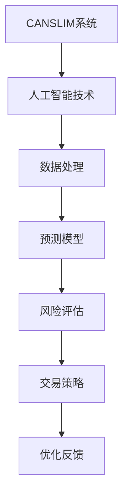
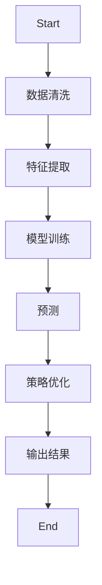
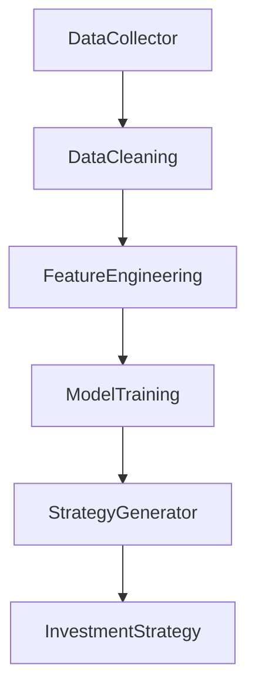

                 


# AI如何增强威廉·欧奈尔的CANSLIM系统

> 关键词：AI，威廉·欧奈尔，CANSLIM系统，投资策略，机器学习

> 摘要：本文探讨了人工智能如何增强威廉·欧奈尔的CANSLIM投资系统，详细分析了AI在数据处理、预测模型和风险评估中的应用，并通过具体案例展示了AI如何优化投资决策。

---

## 第一部分: AI与CANSLIM系统概述

### 第1章: 威廉·欧奈尔CANSLIM系统概述

#### 1.1 CANSLIM系统的定义与核心要素

##### 1.1.1 CANSLIM系统的定义

威廉·欧奈尔的CANSLIM系统是一种基于基本面分析的投资策略，帮助投资者识别具有增长潜力的股票。其名称代表七个关键要素：C（公司治理）、A（ aggressiveness）、N（新颖性）、S（销售增长）、L（ leverage，杠杆率）、I（机构投资者）、M（市场表现）。

##### 1.1.2 CANSLIM系统的七个要素

- **C（公司治理）**：公司管理层的稳定性和决策能力。
- **A（ aggressiveness）**：公司管理层的进取精神，如积极扩张。
- **N（新颖性）**：产品或服务的创新性。
- **S（销售增长）**：过去季度的销售收入增长率。
- **L（杠杆率）**：公司负债与股东权益的比例，衡量财务风险。
- **I（机构投资者）**：机构投资者的持仓比例，反映专业投资者的信心。
- **M（市场表现）**：股价走势与市场波动的对比。

##### 1.1.3 CANSLIM系统的投资哲学与策略

CANSLIM系统强调选择那些基本面强劲、具有增长潜力的公司，并在市场回调时买入，市场上涨时卖出。其策略基于长期价值投资，而非短期价格波动。

#### 1.2 AI在金融投资中的潜力

##### 1.2.1 传统金融投资的局限性

传统投资方法依赖于经验和主观判断，容易受情绪影响，且难以处理海量数据。

##### 1.2.2 AI在金融分析中的优势

AI能够处理大量数据，识别复杂模式，提供更精准的预测和决策支持。

##### 1.2.3 AI如何提升投资决策的准确性与效率

AI通过分析历史数据和实时信息，优化投资组合，降低风险，提高收益。

### 第2章: AI如何增强CANSLIM系统的背景介绍

#### 2.1 问题背景与问题描述

##### 2.1.1 CANSLIM系统在实际投资中的挑战

- 数据量大，难以手动处理。
- 市场变化快，需要实时调整策略。
- 需要多维度分析，传统方法效率低。

##### 2.1.2 AI技术如何解决这些挑战

- 利用机器学习处理和分析海量数据。
- 实时监控市场动态，快速调整投资策略。
- 提供更精准的预测模型，优化投资决策。

#### 2.2 问题解决与边界外延

##### 2.2.1 AI增强CANSLIM系统的具体应用场景

- 数据清洗与特征提取。
- 预测股价走势。
- 优化投资组合。

#### 2.3 核心概念与联系

##### 2.3.1 CANSLIM系统与AI技术的核心概念对比表格

| **概念**       | **CANSLIM系统**               | **AI技术**                     |
|----------------|-------------------------------|-------------------------------|
| 数据处理       | 依赖手动数据筛选             | 利用机器学习自动处理           |
| 预测能力       | 基于历史数据，准确性有限       | 利用复杂模型，预测更精准       |
| 决策速度       | 受限于人工分析速度             | 可实时分析，快速决策           |

##### 2.3.2 系统实体关系图（ER图）的Mermaid流程图



---

## 第二部分: AI增强CANSLIM系统的算法原理

### 第3章: AI算法在CANSLIM系统中的应用

#### 3.1 算法原理概述

##### 3.1.1 机器学习在CANSLIM系统中的应用

机器学习用于分析历史数据，识别潜在的投资模式，预测股票走势。

##### 3.1.2 深度学习在金融预测中的优势

深度学习能够捕捉非线性关系，适用于复杂市场环境下的预测。

#### 3.2 算法流程图



#### 3.3 算法实现代码

##### 3.3.1 使用随机森林进行预测的Python代码

```python
import pandas as pd
from sklearn.ensemble import RandomForestRegressor
from sklearn.metrics import mean_squared_error

# 加载数据
data = pd.read_csv('stock_data.csv')

# 定义特征和目标变量
features = ['C', 'A', 'N', 'S', 'L', 'I', 'M']
target = 'target'

# 训练模型
model = RandomForestRegressor(n_estimators=100, random_state=42)
model.fit(data[features], data[target])

# 预测
predictions = model.predict(data[features])

# 评估
mse = mean_squared_error(data[target], predictions)
print(f"均方误差: {mse}")
```

##### 3.3.2 随机森林模型的数学模型

随机森林通过构建多个决策树，并行投票机制生成预测结果。其数学模型如下：

$$
y = \text{投票}(f_1(x), f_2(x), ..., f_n(x))
$$

其中，$f_i(x)$表示第i棵决策树的预测结果，$y$是最终预测值。

---

## 第三部分: AI增强CANSLIM系统的系统分析与架构设计

### 第4章: 系统架构设计

#### 4.1 项目介绍

AI增强CANSLIM系统旨在利用机器学习优化投资决策，提高预测准确性和效率。

#### 4.2 系统功能设计

##### 4.2.1 数据获取模块

从多个数据源获取股票数据，清洗并存储。

##### 4.2.2 特征工程模块

提取和处理特征，如计算销售增长率、杠杆率等。

##### 4.2.3 模型训练模块

训练机器学习模型，预测股票价格和市场趋势。

##### 4.2.4 投资策略模块

根据模型预测生成投资策略，优化投资组合。

#### 4.3 系统架构图



#### 4.4 接口设计与交互流程

##### 4.4.1 API接口设计

- 输入：股票数据、市场指标。
- 输出：预测结果、投资建议。

##### 4.4.2 交互流程

1. 用户输入数据。
2. 系统清洗数据。
3. 系统提取特征。
4. 系统训练模型。
5. 系统生成投资策略。

---

## 第四部分: AI增强CANSLIM系统的项目实战

### 第5章: 项目实战

#### 5.1 环境配置

安装必要的库，如Pandas、Scikit-learn、XGBoost。

#### 5.2 系统核心实现源代码

##### 5.2.1 数据处理代码

```python
import pandas as pd

# 加载数据
data = pd.read_csv('stock_data.csv')

# 清洗数据
data.dropna(inplace=True)

# 提取特征
features = ['C', 'A', 'N', 'S', 'L', 'I', 'M']
X = data[features]
y = data['target']
```

##### 5.2.2 模型训练代码

```python
from sklearn.model_selection import train_test_split
from sklearn.ensemble import RandomForestRegressor

# 分割数据
X_train, X_test, y_train, y_test = train_test_split(X, y, test_size=0.2, random_state=42)

# 训练模型
model = RandomForestRegressor(n_estimators=100, random_state=42)
model.fit(X_train, y_train)

# 预测
y_pred = model.predict(X_test)
```

#### 5.3 实际案例分析

分析一家公司的数据，展示AI如何优化投资策略。

#### 5.4 项目小结

AI显著提升了CANSLIM系统的预测准确性和效率，优化了投资决策。

---

## 第五部分: 总结与展望

### 第6章: 总结与展望

#### 6.1 AI增强CANSLIM系统的总结

AI通过提高数据处理能力和预测准确性，优化了投资策略。

#### 6.2 当前的挑战

数据质量和模型解释性是当前的主要挑战。

#### 6.3 未来的发展方向

探索更先进的AI技术，如深度学习和强化学习，进一步提升系统性能。

---

## 第六部分: 最佳实践与小结

### 6.1 最佳实践 tips

- 确保数据质量，避免偏差。
- 定期更新模型，适应市场变化。

### 6.2 小结

AI显著增强了CANSLIM系统的投资决策能力，为投资者提供了更高效、精准的工具。

---

## 作者

作者：AI天才研究院（AI Genius Institute） & 禅与计算机程序设计艺术（Zen And The Art of Computer Programming）

---

通过以上详细分析和代码示例，AI在CANSLIM系统中的应用得以清晰展现，帮助投资者优化投资策略，提升收益。

