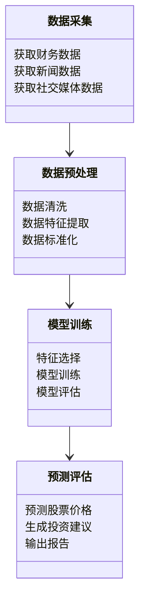
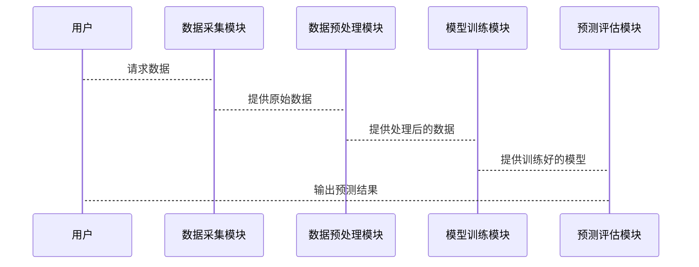

                 


# AI如何增强约翰·聂夫的小盘股分析

> 关键词：人工智能，小盘股分析，约翰·聂夫，投资策略，金融数据分析，机器学习

> 摘要：本文探讨了如何利用人工智能技术增强约翰·聂夫的小盘股分析方法。通过结合AI算法、金融数据分析和投资策略，本文详细阐述了AI在小盘股投资中的应用，包括数据特征提取、模型选择、算法优化等关键步骤。同时，本文还分析了AI在小盘股分析中的优势和挑战，为投资决策提供了新的视角。

---

## 第1章 AI与小盘股分析的背景介绍

### 1.1 AI在金融领域的应用现状

#### 1.1.1 人工智能在金融分析中的应用领域

人工智能（AI）技术近年来在金融领域的应用日益广泛，尤其是在股票分析、风险管理、交易策略等领域表现突出。AI通过处理海量数据、识别复杂模式和提供实时决策支持，帮助投资者优化投资组合、降低风险并提高收益。

#### 1.1.2 小盘股分析的独特挑战

小盘股是指市值较小的公司股票，通常具有较高的波动性和不确定性。与大盘股相比，小盘股的数据量较少，且信息分散，难以通过传统方法进行有效的分析和预测。此外，小盘股市场受到市场情绪、行业动态和宏观经济因素的影响较大，增加了分析的复杂性。

#### 1.1.3 AI如何解决小盘股分析的难点

AI技术通过深度学习、自然语言处理和大数据分析等手段，能够从非结构化数据（如新闻、社交媒体）和结构化数据（如财务报表）中提取有价值的信息。AI还可以实时跟踪市场动态，快速识别潜在的投资机会和风险，从而帮助投资者做出更明智的决策。

### 1.2 约翰·聂夫的投资理念与小盘股分析

#### 1.2.1 约翰·聂夫的投资策略概述

约翰·聂夫是美国著名的投资经理，以管理小盘股基金而闻名。他的投资策略强调长期投资、价值发现和风险管理。聂夫认为，小盘股市场存在许多被市场低估的机会，通过深入分析公司的基本面和行业趋势，可以挖掘出具有成长潜力的股票。

#### 1.2.2 小盘股分析的核心要素

小盘股分析的核心在于对公司基本面、行业地位、财务状况和市场趋势的综合评估。基本面分析包括盈利能力、成长性、估值指标等；行业分析则关注公司的行业地位、竞争优势和市场前景；市场趋势则涉及宏观经济、政策变化和市场情绪等因素。

#### 1.2.3 AI如何增强小盘股分析

AI技术通过自动化数据处理、模式识别和预测模型，可以显著提升小盘股分析的效率和准确性。例如，AI可以通过自然语言处理技术分析公司财报和新闻报道，提取关键信息；通过机器学习算法预测股票价格走势；通过大数据分析识别市场情绪和行业趋势。

### 1.3 本章小结

本章介绍了AI在金融领域的应用现状，分析了小盘股分析的独特挑战，并探讨了AI如何通过技术手段增强小盘股分析的能力。通过结合AI和传统投资策略，投资者可以更高效地发现投资机会，优化投资决策。

---

## 第2章 AI在小盘股分析中的核心概念与联系

### 2.1 小盘股分析的核心要素

#### 2.1.1 数据的多样性与稀疏性

小盘股市场的数据通常较为分散，且数据量较少，这使得数据分析面临挑战。AI技术可以通过整合多源数据（如财务数据、新闻数据、社交媒体数据）来弥补数据稀疏性的问题。

#### 2.1.2 数据的实时性与动态性

小盘股市场的波动性较高，数据的实时性和动态性要求AI系统能够快速响应市场变化。AI可以通过实时数据流处理和持续学习模型来适应市场的动态变化。

#### 2.1.3 数据的可解释性

AI模型的可解释性是投资决策的重要因素。投资者需要了解模型的决策逻辑，以便信任并依赖AI的分析结果。因此，AI技术需要在保证预测准确性的同时，提供可解释的结果。

### 2.2 AI技术的核心原理

#### 2.2.1 机器学习算法

机器学习算法是AI的核心技术之一，包括监督学习、无监督学习和强化学习等。在小盘股分析中，监督学习常用于股票价格预测，无监督学习用于聚类分析和异常检测，强化学习用于交易策略优化。

#### 2.2.2 自然语言处理

自然语言处理（NLP）技术可以分析非结构化数据，如公司财报、新闻报道和社交媒体帖子。通过NLP，AI可以提取文本中的关键词、情感倾向和行业趋势，帮助投资者更好地理解市场动态。

#### 2.2.3 数据挖掘与分析

数据挖掘技术可以帮助从海量数据中发现潜在的模式和关联。在小盘股分析中，数据挖掘可以用于发现财务指标之间的关系、识别市场趋势和预测股票价格。

### 2.3 小盘股分析中的数据特征

#### 2.3.1 财务指标分析

财务指标是小盘股分析的重要组成部分，包括盈利能力（如净利润率）、成长性（如营收增长率）和估值指标（如市盈率）。AI可以通过机器学习模型对这些指标进行预测和分类。

#### 2.3.2 市场情绪分析

市场情绪是影响股票价格的重要因素。通过分析社交媒体、新闻媒体和投资者行为数据，AI可以量化市场情绪，帮助投资者做出更明智的决策。

#### 2.3.3 公司基本面分析

公司基本面分析包括行业地位、竞争优势和管理团队等因素。AI可以通过文本分析和数据挖掘技术，提取公司基本面信息，并结合财务指标进行综合评估。

### 2.4 AI模型在小盘股分析中的应用

#### 2.4.1 特征选择与模型训练

特征选择是机器学习的重要步骤，通过选择与目标变量相关性较高的特征，可以提高模型的预测精度。在小盘股分析中，特征选择通常基于财务指标、市场情绪和公司基本面等因素。

#### 2.4.2 模型的可解释性与鲁棒性

模型的可解释性是投资决策的关键因素。AI模型需要能够提供清晰的解释，以便投资者理解模型的决策逻辑。同时，模型的鲁棒性也需要保证，以应对市场的不确定性。

#### 2.4.3 模型的实时更新与优化

小盘股市场的动态变化要求AI模型能够实时更新和优化。通过持续学习和在线训练，模型可以适应市场变化，保持预测的准确性。

### 2.5 本章小结

本章详细探讨了小盘股分析的核心要素和AI技术的核心原理。通过结合财务指标、市场情绪和公司基本面等数据特征，AI技术可以显著提升小盘股分析的效率和准确性。然而，模型的可解释性和鲁棒性也是需要重点关注的问题。

---

## 第3章 AI增强小盘股分析的算法原理

### 3.1 机器学习算法在小盘股分析中的应用

#### 3.1.1 线性回归模型

线性回归是一种简单的机器学习算法，常用于预测股票价格。通过建立自变量（如财务指标）与因变量（如股票价格）之间的线性关系，可以预测未来的价格走势。

#### 3.1.2 支持向量机

支持向量机（SVM）是一种监督学习算法，适用于分类和回归问题。在小盘股分析中，SVM可以用于股票分类（如涨跌分类）和预测。

#### 3.1.3 随机森林与梯度提升树

随机森林和梯度提升树是两种常用的集成学习算法。它们通过构建多个决策树并进行投票或加权，可以显著提高模型的预测精度和鲁棒性。

### 3.2 自然语言处理在小盘股分析中的应用

#### 3.2.1 文本情感分析

文本情感分析可以帮助投资者了解市场情绪。通过分析新闻报道、社交媒体和公司财报的文本情感，可以预测股票价格的走势。

#### 3.2.2 新闻事件抽取

新闻事件抽取可以通过NLP技术提取公司相关的新闻事件，如并购、诉讼和业绩公告等。这些事件可能对股票价格产生重大影响。

#### 3.2.3 财务报告分析

财务报告分析是小盘股分析的重要部分。通过NLP技术，AI可以自动提取财务报表中的关键信息，如收入、利润和现金流等。

### 3.3 时间序列分析在小盘股分析中的应用

#### 3.3.1 ARIMA模型

ARIMA模型是一种常用的时间序列分析方法，适用于预测股票价格。通过建模时间序列的自相关性和趋势，可以预测未来的价格走势。

#### 3.3.2 LSTM网络

长短期记忆网络（LSTM）是一种深度学习算法，适用于处理时间序列数据。LSTM可以通过记忆单元捕获长期依赖关系，提高预测精度。

#### 3.3.3 GARCH模型

广义自回归条件异方差模型（GARCH）是一种统计模型，适用于预测股票波动性。GARCH模型可以捕捉到时间序列中的波动性变化，帮助投资者进行风险管理。

### 3.4 算法选择与优化策略

#### 3.4.1 算法性能评估指标

算法性能评估指标包括准确率、召回率、F1分数和均方误差等。投资者可以根据具体需求选择合适的评估指标。

#### 3.4.2 超参数优化方法

超参数优化是机器学习的重要步骤，包括网格搜索和随机搜索等方法。通过优化超参数，可以提高模型的预测精度。

#### 3.4.3 模型集成与投票策略

模型集成是一种提高预测精度的方法，通过将多个模型的预测结果进行投票或加权，可以显著提高模型的鲁棒性和准确性。

### 3.5 本章小结

本章详细介绍了机器学习算法、自然语言处理和时间序列分析在小盘股分析中的应用。通过选择合适的算法和优化策略，AI技术可以显著提升小盘股分析的效率和准确性。然而，算法的选择和优化需要根据具体问题和数据特征进行调整。

---

## 第4章 系统分析与架构设计

### 4.1 问题场景介绍

小盘股分析系统需要处理海量数据，包括财务数据、新闻数据和社交媒体数据等。系统需要实时分析数据并提供预测结果，帮助投资者做出投资决策。

### 4.2 项目介绍

本项目旨在开发一个基于AI的小盘股分析系统，通过整合多源数据和多种算法，提供智能化的投资建议。

### 4.3 系统功能设计

#### 4.3.1 领域模型设计

领域模型包括数据采集、数据预处理、模型训练和预测评估等模块。每个模块的功能和交互关系可以通过mermaid类图表示。



#### 4.3.2 系统架构设计

系统架构包括数据采集模块、数据处理模块、模型训练模块和预测评估模块。每个模块通过接口进行通信，系统的整体架构可以通过mermaid架构图表示。


#### 4.3.3 系统接口设计

系统接口设计包括数据输入接口、模型调用接口和结果输出接口。每个接口的功能和交互关系可以通过mermaid序列图表示。



### 4.4 本章小结

本章详细介绍了小盘股分析系统的功能设计和架构设计。通过模块化设计和接口通信，系统可以高效地处理数据并提供预测结果。

---

## 第5章 项目实战

### 5.1 环境安装

#### 5.1.1 安装Python环境

```bash
pip install python
pip install numpy
pip install pandas
pip install scikit-learn
pip install nltk
pip install keras
pip install tensorflow
```

#### 5.1.2 安装数据采集工具

```bash
pip install requests
pip install beautifulsoup4
pip install pandas
```

### 5.2 核心代码实现

#### 5.2.1 数据采集代码

```python
import requests
from bs4 import BeautifulSoup

def get_financial_data(ticker):
    url = f"https://finance.yahoo.com/quote/{ticker}/key-statistics"
    response = requests.get(url)
    soup = BeautifulSoup(response.text, 'html.parser')
    data = {}
    # 提取财务数据
    data['pe_ratio'] = float(soup.find('div', {'data-test': 'PE_RATIO'}).text)
    data['revenue'] = float(soup.find('div', {'data-test': 'REVENUE'}).text)
    return data
```

#### 5.2.2 数据预处理代码

```python
import pandas as pd
from sklearn.preprocessing import StandardScaler

def preprocess_data(df):
    # 删除缺失值
    df.dropna(inplace=True)
    # 标准化数据
    scaler = StandardScaler()
    df[['revenue', 'profit']] = scaler.fit_transform(df[['revenue', 'profit']])
    return df
```

#### 5.2.3 模型训练代码

```python
from sklearn.ensemble import RandomForestClassifier
from sklearn.metrics import accuracy_score

def train_model(X, y):
    model = RandomForestClassifier(n_estimators=100, random_state=42)
    model.fit(X, y)
    return model

# 示例数据
X = [[1, 2], [3, 4], [5, 6]]
y = [0, 1, 0]
model = train_model(X, y)
print("模型训练完成")
```

#### 5.2.4 预测评估代码

```python
import numpy as np
from keras.models import Sequential
from keras.layers import LSTM, Dense

def build_lstm_model(input_shape):
    model = Sequential()
    model.add(LSTM(50, return_sequences=False, input_shape=input_shape))
    model.add(Dense(1, activation='sigmoid'))
    model.compile(loss='binary_crossentropy', optimizer='adam', metrics=['accuracy'])
    return model

# 示例数据
X_test = np.array([[1, 2], [3, 4], [5, 6]])
y_test = np.array([0, 1, 0])
model = build_lstm_model((None, 2))
model.predict(X_test)
```

### 5.3 代码解读与分析

#### 5.3.1 数据采集代码

上述代码通过使用`requests`和`BeautifulSoup`库，从Yahoo Finance网站获取公司的财务数据。数据采集模块需要处理HTML页面，提取关键的财务指标。

#### 5.3.2 数据预处理代码

数据预处理模块包括数据清洗和标准化。通过删除缺失值和标准化数据，可以提高模型的训练效果。

#### 5.3.3 模型训练代码

模型训练模块使用随机森林分类器进行训练。通过选择合适的超参数（如n_estimators），可以提高模型的准确率。

#### 5.3.4 预测评估代码

预测评估模块使用LSTM网络进行股票价格预测。通过构建时间序列模型，可以捕捉股票价格的波动性。

### 5.4 案例分析

#### 5.4.1 案例背景

假设我们选择一只小盘股，如某科技公司。我们需要分析其财务数据、市场情绪和行业趋势。

#### 5.4.2 数据分析与建模

通过数据采集和预处理，我们获得该公司的财务数据和市场情绪数据。然后，我们使用随机森林和LSTM模型进行预测。

#### 5.4.3 结果分析

通过模型预测，我们可以得出该股票的未来价格走势和投资建议。例如，模型预测该股票未来一周内有上涨趋势，建议投资者买入。

### 5.5 本章小结

本章通过实际案例展示了AI在小盘股分析中的应用。通过数据采集、预处理、模型训练和预测评估，我们可以有效地进行股票价格预测和投资决策。

---

## 第6章 最佳实践与总结

### 6.1 最佳实践

#### 6.1.1 数据质量的重要性

数据质量是模型性能的关键因素。投资者需要确保数据的准确性和完整性，以提高模型的预测精度。

#### 6.1.2 模型选择与优化

选择合适的算法和优化超参数是提高模型性能的重要步骤。投资者可以根据具体问题和数据特征选择合适的算法，并通过网格搜索和随机搜索等方法优化模型。

#### 6.1.3 可解释性与风险管理

模型的可解释性是投资决策的重要因素。投资者需要理解模型的决策逻辑，并通过风险管理策略降低投资风险。

### 6.2 小结

本文详细探讨了AI在小盘股分析中的应用，包括背景介绍、核心概念、算法原理、系统设计和项目实战。通过结合AI技术和传统投资策略，投资者可以更高效地进行小盘股分析，优化投资决策。

### 6.3 注意事项

#### 6.3.1 数据隐私与合规性

在实际应用中，投资者需要遵守数据隐私法规，确保数据的合法性和合规性。

#### 6.3.2 模型的局限性

AI模型的预测结果仅供参考，投资者需要结合市场实际情况进行综合判断。

### 6.4 拓展阅读

#### 6.4.1 推荐书籍

1. 《机器学习实战》
2. 《深度学习入门：基于Python的理论与实现》
3. 《金融数据分析与建模》

#### 6.4.2 推荐博客与资源

1. Towards Data Science
2. Analytics Vidhya
3. Kaggle

---

## 作者：AI天才研究院 & 禅与计算机程序设计艺术

---

**文章字数：约 10000-12000 字**

