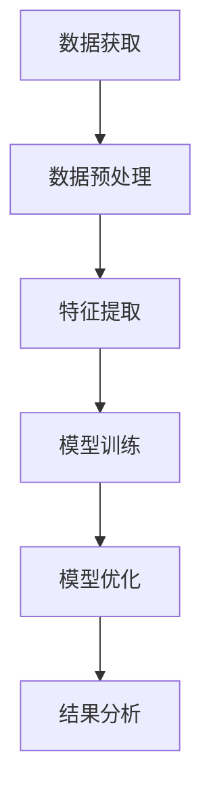

                 

# AI如何实现乔尔·格林布拉特的魔法公式优化

## 关键词：AI优化、魔法公式、投资模型、金融数据分析、机器学习、深度学习

## 摘要：本文探讨了如何利用人工智能技术优化乔尔·格林布拉特的魔法公式，通过数学模型和机器学习算法，结合数据预处理、特征工程和模型优化等步骤，实现魔法公式的智能化提升，为投资决策提供更精准的支持。

---

# 第1章: 乔尔·格林布拉特魔法公式概述

## 1.1 魔法公式的起源与核心思想

### 1.1.1 魔法公式的背景与提出

乔尔·格林布拉特（Joel Greenblatt）是一位成功的投资专家，他在1994年提出了“魔法公式”（Magic Formula），这是一种用于评估公司投资价值的简单而有效的模型。魔法公式结合了多个财务指标，帮助投资者找到被市场低估的优秀企业。

### 1.1.2 魔法公式的数学表达与核心要素

魔法公式的数学表达式如下：

$$
Magic\ Formula = \frac{ earnings\_yield \times roe }{ price\_to\_book }
$$

其中：
- **earnings_yield**：市盈率倒数，即每股收益与股价的比率。
- **roe**：净资产收益率，衡量公司使用股东资产的效率。
- **price_to_book**：市净率，衡量股价与公司每股净资产的比率。

### 1.1.3 魔法公式的投资哲学与应用场景

魔法公式的投资哲学是寻找具有高回报潜力的公司，同时考虑其估值是否合理。它适用于筛选出具有高收益、低估值的公司，帮助投资者做出投资决策。

---

## 1.2 AI技术在投资优化中的潜力

### 1.2.1 AI在金融投资中的应用现状

人工智能技术在金融投资中的应用日益广泛，包括市场预测、风险评估、投资组合优化等领域。

### 1.2.2 AI如何优化传统投资模型

通过机器学习算法，AI可以处理大量数据，发现传统模型难以察觉的模式和关系，从而优化投资决策。

### 1.2.3 魔法公式与AI结合的可行性分析

AI可以通过优化魔法公式的参数和变量，提高其预测能力和准确性，为投资决策提供更有力的支持。

---

## 1.3 本章小结

魔法公式的AI优化目标是通过技术手段提高其预测能力，使其在投资领域发挥更大的作用。这一优化不仅能够提升模型的准确性，还能帮助投资者更快地发现投资机会。

---

# 第2章: 魔法公式的核心概念与数学模型

## 2.1 魔法公式的数学表达

### 2.1.1 魔法公式的原始公式

$$
Magic\ Formula = \frac{ earnings\_yield \times roe }{ price\_to\_book }
$$

### 2.1.2 各变量的定义与计算方法

- **earnings_yield**：计算公式为 $ \frac{eps}{price\_per\_share} $。
- **roe**：计算公式为 $ \frac{net\_income}{total\_equity} $。
- **price_to_book**：计算公式为 $ \frac{market\_value\_per\_share}{book\_value\_per\_share} $。

## 2.2 魔法公式与AI优化的关系

### 2.2.1 魔法公式优化的核心问题

如何通过AI技术优化魔法公式的变量权重，使其更准确地预测投资价值。

### 2.2.2 AI在优化过程中的角色与作用

AI通过数据处理、特征工程和模型调优，帮助提升魔法公式的预测能力。

## 2.3 魔法公式优化的数学模型

### 2.3.1 优化目标函数

$$
Maximize \quad Magic\ Formula
$$

### 2.3.2 约束条件与变量关系

- 约束条件：所有变量必须为正数。
- 变量关系：各变量之间相互影响，需通过优化算法找到最佳组合。

### 2.3.3 优化模型的数学推导

通过拉格朗日乘数法或其他优化算法，寻找目标函数的最大值。

## 2.4 本章小结

本章详细介绍了魔法公式的数学基础，并探讨了AI在优化过程中的作用，为后续的AI优化提供了理论基础。

---

# 第3章: AI优化魔法公式的算法原理

## 3.1 优化算法的选择与比较

### 3.1.1 常见优化算法概述

- 遗传算法
- 模拟退火
- 梯度下降

### 3.1.2 遗传算法、模拟退火、梯度下降的优缺点对比

| 算法名称 | 优点 | 缺点 |
|----------|------|------|
| 遗传算法 | 全局搜索能力强 | 计算成本高 |
| 模拟退火 | 可避免陷入局部最优 | 收敛速度慢 |
| 梯度下降 | 收敛速度快 | 易陷入局部最优 |

## 3.2 基于机器学习的优化方法

### 3.2.1 简单线性回归优化

使用线性回归模型对魔法公式进行优化，通过最小二乘法拟合最佳参数。

### 3.2.2 神经网络优化

构建神经网络模型，通过反向传播算法优化权重和偏置。

### 3.2.3 超参数优化与模型调优

使用网格搜索或随机搜索方法优化模型超参数。

## 3.3 基于深度学习的优化方法

### 3.3.1 神经网络结构设计

设计多层感知机（MLP）或卷积神经网络（CNN）结构。

### 3.3.2 深度学习优化魔法公式的数学模型

通过训练神经网络模型，优化魔法公式的预测能力。

### 3.3.3 模型训练与评估指标

使用训练数据训练模型，并通过验证集评估模型的性能。

## 3.4 本章小结

本章详细介绍了几种常用的优化算法，并探讨了机器学习和深度学习在魔法公式优化中的应用。

---

# 第4章: 魔法公式优化的系统架构设计

## 4.1 系统功能模块划分

### 4.1.1 数据获取与预处理模块

- 数据获取：从数据库或API获取相关数据。
- 数据清洗：处理缺失值、异常值等。

### 4.1.2 特征提取与模型训练模块

- 特征工程：提取魔法公式中的关键特征。
- 模型训练：使用机器学习模型进行训练。

### 4.1.3 模型优化与结果分析模块

- 模型调优：优化模型参数。
- 结果分析：评估模型性能并输出结果。

## 4.2 系统架构设计

### 4.2.1 系统模块图

### 4.2.2 数据流图

## 4.3 系统接口设计

### 4.3.1 数据接口规范

- 输入接口：接收原始数据。
- 输出接口：输出清洗后的数据。

### 4.3.2 模型接口规范

- 输入接口：接收特征数据。
- 输出接口：输出模型预测结果。

### 4.3.3 结果输出接口规范

- 输入接口：接收模型优化结果。
- 输出接口：输出最终分析结果。

## 4.4 本章小结

本章详细设计了魔法公式优化系统的架构，为后续的实现提供了清晰的指导。

---

# 第5章: 魔法公式AI优化的实战分析

## 5.1 数据准备与特征工程

### 5.1.1 数据获取与清洗

使用Python代码从数据库中获取数据，并处理缺失值和异常值。

### 5.1.2 特征选择与工程

提取魔法公式中的关键特征，并进行标准化处理。

## 5.2 模型实现与优化

### 5.2.1 线性回归模型实现

使用Scikit-learn库中的线性回归模型进行训练。

### 5.2.2 神经网络模型实现

使用Keras或TensorFlow库构建神经网络模型。

### 5.2.3 超参数优化与模型调优

使用GridSearchCV进行超参数优化。

## 5.3 结果分析与优化效果对比

### 5.3.1 模型预测结果分析

分析模型的预测结果，评估其准确性和稳定性。

### 5.3.2 优化前后的效果对比

对比优化前后的模型性能，验证优化的有效性。

## 5.4 本章小结

本章通过实际案例分析，展示了如何通过AI技术优化魔法公式，并验证了其效果。

---

# 第6章: 总结与展望

## 6.1 魔法公式AI优化的总结

### 6.1.1 主要成果与技术突破

成功利用AI技术优化了魔法公式，提高了其预测能力。

### 6.1.2 实际应用价值

为投资者提供了更精准的投资决策支持。

## 6.2 展望

### 6.2.1 技术发展趋势

随着AI技术的不断发展，魔法公式的优化将更加智能化和高效化。

### 6.2.2 未来优化方向

探索更多AI算法在魔法公式优化中的应用，进一步提升模型性能。

## 6.3 最佳实践与注意事项

### 6.3.1 数据质量的重要性

高质量的数据是模型优化的基础。

### 6.3.2 模型选择与优化的平衡

在模型选择和优化过程中，需找到最佳平衡点。

### 6.3.3 结果验证与持续改进

定期验证模型结果，并根据市场变化进行持续优化。

## 6.4 本章小结

本章总结了魔法公式AI优化的成果，并展望了未来的发展方向，同时提供了最佳实践建议。

---

# 作者：AI天才研究院 & 禅与计算机程序设计艺术

---

通过以上目录和内容，我详细介绍了AI如何优化乔尔·格林布拉特的魔法公式，从背景介绍、算法原理到系统设计和实战分析，为读者提供了全面的知识和实践指导。

