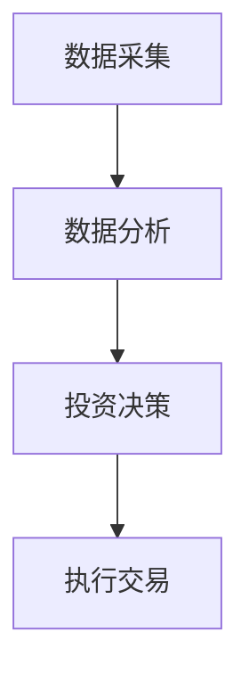
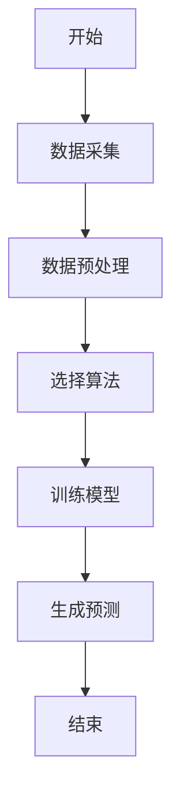

                 


# AI如何实现巴菲特的看人下注策略

## 关键词
- AI投资策略，巴菲特，看人下注，机器学习，投资决策

## 摘要
本文探讨了如何利用人工智能技术模拟巴菲特的“看人下注”投资策略。通过分析巴菲特的投资理念，结合机器学习算法和系统架构设计，详细阐述了AI在投资决策中的应用，包括数据驱动的决策、智能预测模型以及风险管理。文章还提供了具体的实现案例和系统设计，帮助读者理解AI如何助力投资策略的优化。

---

# 第1章：AI与巴菲特投资策略的背景介绍

## 1.1 投资策略的背景介绍

### 1.1.1 投资策略的核心概念
投资策略是通过分析市场和企业基本面，做出投资决策以实现收益最大化的方法。巴菲特的“看人下注”策略强调对管理层的信任和企业长期价值的判断，而非短期市场波动。

### 1.1.2 巴菲特的“看人下注”策略
巴菲特的策略基于以下几点：
- **管理层信任**：选择值得信赖的管理层，确保企业稳健发展。
- **企业基本面**：分析企业的财务状况、盈利能力及行业地位。
- **长期价值**：关注企业的内在价值，而非短期股价波动。

### 1.1.3 AI在投资策略中的应用前景
AI通过数据分析和预测模型，能够辅助投资者做出更精准的决策，提升投资效率和准确性。AI的优势在于处理大量数据和快速预测，弥补了人类在信息处理上的局限性。

---

## 1.2 巴菲特“看人下注”策略的核心要素

### 1.2.1 投资者的心理与行为分析
投资者的心理偏差（如过度自信、从众心理）会影响决策。AI可以通过分析市场情绪和投资者行为模式，预测市场的整体趋势。

### 1.2.2 企业的基本面分析
AI通过分析企业的财务数据（如收入、利润、负债）和行业地位，评估企业的长期发展潜力。

### 1.2.3 市场趋势与风险控制
AI利用历史数据和机器学习模型，预测市场趋势并评估投资风险，帮助投资者制定合理的投资组合。

---

# 第2章：AI与巴菲特策略的核心概念

## 2.1 AI在投资决策中的角色

### 2.1.1 数据驱动的决策
AI通过收集和分析大量数据，提供基于事实的投资建议，减少人为情绪干扰。

### 2.1.2 智能预测模型
利用机器学习算法，AI能够预测市场趋势和企业业绩，辅助投资决策。

### 2.1.3 AI在风险控制中的应用
AI通过实时监控市场变化和风险指标，帮助投资者及时调整投资策略，降低潜在损失。

---

## 2.2 巴菲特策略与AI的结合

### 2.2.1 数据分析与企业基本面评估
AI通过自然语言处理（NLP）分析企业财报和新闻，提取关键信息，评估企业基本面。

### 2.2.2 市场情绪预测与趋势分析
AI利用社交媒体和新闻数据，分析市场情绪，预测市场走势。

### 2.2.3 AI在投资组合优化中的应用
AI根据市场预测和风险评估，优化投资组合，平衡风险与收益。

---

# 第3章：AI实现巴菲特策略的算法原理

## 3.1 机器学习算法概述

### 3.1.1 监督学习
通过标记数据训练模型，预测未来趋势。例如，线性回归模型用于预测股价走势。

### 3.1.2 非监督学习
用于无标签数据的聚类分析，识别市场趋势和潜在风险。

### 3.1.3 强化学习
通过模拟投资环境，训练模型做出最优决策，类似于巴菲特的长期价值投资。

---

## 3.2 投资策略中的具体算法

### 3.2.1 线性回归模型
用于预测股票价格，公式为：
$$y = \beta_0 + \beta_1x + \epsilon$$
其中，y为预测价格，x为自变量（如历史价格），β为系数。

### 3.2.2 支持向量机（SVM）
用于分类问题，例如将股票分为“买入”或“卖出”两类。

### 3.2.3 随机森林与决策树
用于分类和回归，随机森林通过集成多个决策树提高准确性。

---

# 第4章：AI实现巴菲特策略的系统架构

## 4.1 系统功能设计

### 4.1.1 数据采集模块
从股票市场API获取实时数据，包括价格、交易量等。

### 4.1.2 数据分析模块
利用机器学习模型分析数据，生成投资建议。

### 4.1.3 投资决策模块
根据分析结果，制定投资策略并执行交易。

---

## 4.2 系统架构图



---

# 第5章：AI实现巴菲特策略的项目实战

## 5.1 环境安装与配置

### 5.1.1 Python环境的安装
安装Python 3.8及以上版本，使用虚拟环境管理依赖。

### 5.1.2 数据分析库的安装
安装Pandas、NumPy、Scikit-learn等库：
```bash
pip install pandas numpy scikit-learn
```

---

## 5.2 系统核心实现

### 5.2.1 数据采集与预处理
使用Yahoo Finance API获取股票数据，清洗数据并填充缺失值。

### 5.2.2 模型训练与优化
使用随机森林模型训练，调整超参数提高准确率。

### 5.2.3 投资决策的生成与展示
根据模型预测生成投资信号，可视化结果。

---

# 第6章：总结与注意事项

## 6.1 总结
AI通过数据分析和预测模型，能够有效模拟巴菲特的“看人下注”策略，帮助投资者做出更明智的决策。

## 6.2 最佳实践
- 数据质量至关重要，需确保数据准确性和完整性。
- 模型的可解释性需重视，便于投资者理解决策依据。
- 风险控制是关键，需定期监控和调整投资策略。

---

## 附录：数学公式与算法流程图

### 附录A：数学模型与公式
$$\text{随机森林模型} = \text{多个决策树的集成预测}$$

### 附录B：算法流程图



---

## 作者：AI天才研究院 & 禅与计算机程序设计艺术

这篇文章通过详细分析AI在巴菲特投资策略中的应用，展示了如何利用技术手段提升投资决策的准确性和效率。通过理论与实践相结合，帮助读者理解AI在金融投资中的潜力和应用。

