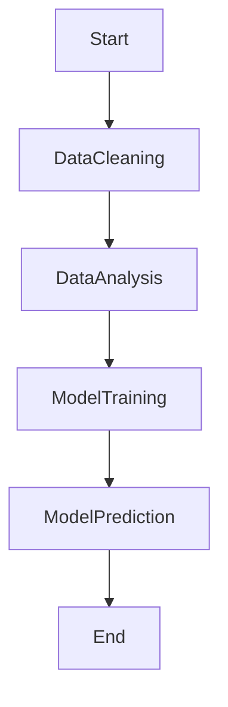
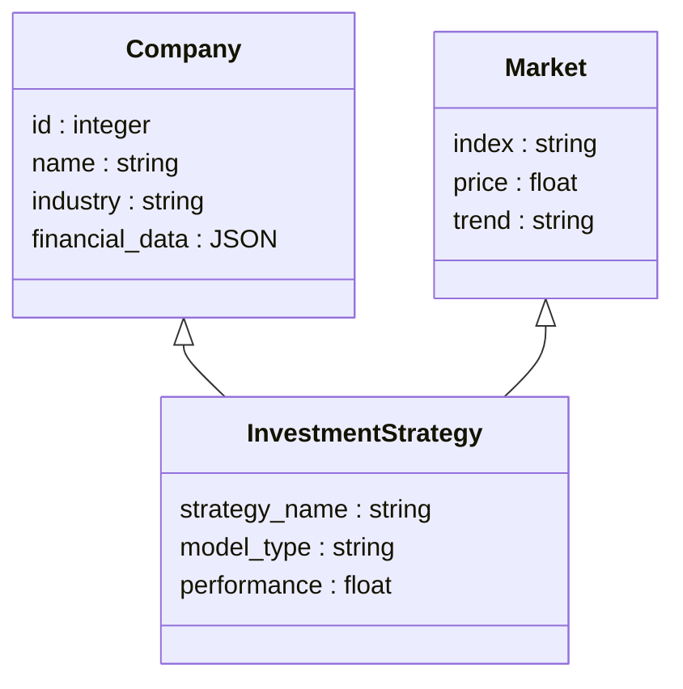
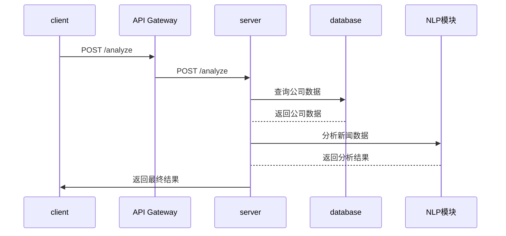

                 


# AI如何实现彼得林奇的实地调研策略

## 关键词：AI，投资策略，彼得林奇，实地调研，机器学习，NLP

## 摘要：本文详细探讨了如何利用人工智能技术，特别是机器学习和自然语言处理，来模拟和优化彼得林奇的实地调研策略。文章从背景介绍、技术基础、算法实现、系统架构到实战案例，全面解析了AI在投资策略中的应用，展示了如何通过技术手段提升投资决策的效率和准确性。

---

## 第一部分: AI与投资策略概述

### 第1章: AI与投资策略的背景与概述

#### 1.1 投资策略与实地调研的背景
##### 1.1.1 投资策略的基本概念
投资策略是投资者在金融市场中选择和管理投资组合的方法。传统的投资策略依赖于基本面分析、技术分析和市场情绪分析。彼得·林奇以其独特的实地调研方法闻名，他通过深入研究公司、行业和市场，识别出具有长期增长潜力的投资机会。

##### 1.1.2 彼得·林奇的实地调研方法
彼得·林奇的实地调研策略包括对公司管理层、产品竞争力、财务状况、行业地位和竞争优势的全面分析。他通过实地考察、访谈和数据收集，识别出那些被市场低估但具有增长潜力的公司。

##### 1.1.3 AI技术在投资领域的应用前景
随着AI技术的快速发展，投资领域正在经历一场技术革命。AI可以通过自动化数据处理、模式识别和预测分析，帮助投资者更高效地进行投资决策。AI能够处理大量非结构化数据，如新闻、社交媒体、公司报告等，从而提供更全面的市场洞察。

#### 1.2 AI技术的基本概念
##### 1.2.1 人工智能的基本定义
人工智能（AI）是指计算机系统模拟人类智能的能力，包括学习、推理、问题解决和自然语言处理等。AI的核心技术包括机器学习、深度学习、自然语言处理（NLP）和计算机视觉。

##### 1.2.2 机器学习与深度学习的区别
机器学习是一种通过数据训练模型的技术，模型可以自动从数据中学习规律。深度学习是机器学习的一个分支，专注于多层神经网络的构建和训练，能够处理更复杂的任务。

##### 1.2.3 自然语言处理（NLP）的核心原理
NLP的目标是让计算机能够理解和生成人类语言。NLP的核心技术包括词袋模型、词嵌入、句法分析和语义理解。

#### 1.3 AI与投资策略的结合
##### 1.3.1 AI在金融分析中的应用领域
AI在金融领域的应用包括股票预测、风险评估、市场情绪分析和新闻摘要生成。

##### 1.3.2 AI如何模拟实地调研的逻辑
通过NLP技术，AI可以自动分析公司报告、新闻和社交媒体数据，提取关键信息，如财务数据、管理层变动和市场趋势。这些信息可以用于评估公司的基本面和竞争优势。

##### 1.3.3 AI在投资决策中的优势与局限
AI的优势在于处理大量数据和快速生成分析结果。然而，AI的局限性在于缺乏人类的直觉和对市场复杂性的理解。

---

### 第2章: AI技术的核心概念与联系

#### 2.1 AI技术的核心原理
##### 2.1.1 机器学习的数学模型
机器学习模型通过优化目标函数来学习数据的规律。例如，线性回归模型的目标函数是最小化预测值与实际值的平方差。

$$ \text{目标函数} = \sum_{i=1}^{n} (y_i - \hat{y}_i)^2 $$

##### 2.1.2 深度学习的神经网络结构
深度学习通过多层神经网络来捕捉数据的复杂特征。例如，卷积神经网络（CNN）用于图像处理，而循环神经网络（RNN）用于时间序列分析。

##### 2.1.3 自然语言处理（NLP）的核心原理
NLP通过将文本转换为向量表示，然后进行分类、聚类或生成任务。词嵌入技术（如Word2Vec）将词语表示为低维向量。

#### 2.2 核心概念对比分析
##### 2.2.1 机器学习与传统统计分析的对比
机器学习通过数据驱动的方法发现模式，而传统统计分析依赖于假设检验和参数估计。

##### 2.2.2 NLP与传统文本分析的异同
NLP能够处理复杂语义，而传统文本分析依赖于关键词提取和简单的规则匹配。

##### 2.2.3 AI算法的可解释性与不可解释性
可解释性AI（XAI）致力于提高模型的透明度，而许多深度学习模型由于复杂性而难以解释。

#### 2.3 实体关系图与流程图
##### 2.3.1 AI投资策略的ER实体关系图
```mermaid
erDiagram
    company {
        key id : integer
        name : string
        industry : string
        financial_data : JSON
        news : [text]
    }
    market {
        index : string
        price : float
        trend : string
    }
    investment_strategy {
        strategy_name : string
        model_type : string
        performance : float
    }
    company <--- investment_strategy : "适用于"
    market <--- investment_strategy : "监测"
```

##### 2.3.2 数据处理流程的Mermaid流程图


##### 2.3.3 算法实现的步骤分解图


---

## 第二部分: AI实现投资策略的核心算法

### 第3章: 机器学习算法原理

#### 3.1 机器学习的数学模型
##### 3.1.1 线性回归的公式推导
线性回归模型通过最小化预测值与实际值的平方差来找到最佳拟合线。

$$ y = \beta_0 + \beta_1 x + \epsilon $$

##### 3.1.2 支持向量机的几何解释
支持向量机（SVM）通过找到一个超平面，将数据分成两类，最大化两类之间的距离。

##### 3.1.3 随机森林的集成学习原理
随机森林通过构建多个决策树，并对结果进行投票或平均，提高模型的准确性和鲁棒性。

#### 3.2 深度学习的算法原理
##### 3.2.1 神经网络的结构与激活函数
神经网络由输入层、隐藏层和输出层组成，激活函数（如ReLU、sigmoid）用于引入非线性。

##### 3.2.2 卷积神经网络的图像处理原理
CNN通过卷积层提取图像特征，池化层降低计算复杂度，全连接层进行分类。

##### 3.2.3 循环神经网络的时间序列建模
RNN通过循环结构处理时间序列数据，捕捉序列中的依赖关系。

#### 3.3 NLP算法的核心原理
##### 3.3.1 词嵌入的训练方法
词嵌入技术（如Word2Vec）将词语表示为低维向量，捕捉语义相似性。

##### 3.3.2 Transformer模型的注意力机制
Transformer通过自注意力机制捕捉词语之间的关系，广泛应用于文本生成和翻译。

##### 3.3.3 文本分类的实现流程
文本分类通过特征提取、模型训练和预测实现，常用算法包括朴素贝叶斯、SVM和深度学习模型。

### 第4章: 算法实现与数学模型

---

## 第三部分: 系统架构与项目实战

### 第5章: 系统架构设计

#### 5.1 系统功能设计
##### 5.1.1 领域模型的Mermaid类图


#### 5.2 系统架构设计
##### 5.2.1 系统架构的Mermaid架构图


#### 5.3 系统接口设计
##### 5.3.1 API接口设计
- GET /companies: 获取公司列表
- POST /analyze: 提交分析任务
- GET /results: 获取分析结果

#### 5.4 系统交互的Mermaid序列图


---

### 第6章: 项目实战与案例分析

#### 6.1 环境安装
- 安装Python 3.8及以上
- 安装必要的库：numpy、pandas、scikit-learn、transformers、tensorflow

#### 6.2 核心代码实现
##### 6.2.1 数据预处理代码
```python
import pandas as pd
import numpy as np

# 读取数据
data = pd.read_csv('data.csv')

# 去除缺失值
data = data.dropna()

# 标准化处理
from sklearn.preprocessing import StandardScaler
scaler = StandardScaler()
data_scaled = scaler.fit_transform(data)
```

##### 6.2.2 NLP模型实现
```python
from transformers import pipeline

# 初始化NLP模型
nlp = pipeline('sentiment-analysis')

# 分析新闻文本
result = nlp('公司业绩超预期，净利润增长10%')
print(result)
```

##### 6.2.3 机器学习模型实现
```python
from sklearn.ensemble import RandomForestClassifier

# 训练模型
model = RandomForestClassifier()
model.fit(X_train, y_train)

# 预测结果
y_pred = model.predict(X_test)
```

#### 6.3 案例分析与解读
##### 6.3.1 案例背景
假设我们分析一家科技公司，目标是预测其股票价格走势。

##### 6.3.2 数据分析与模型训练
通过NLP分析公司新闻，提取情感指标；通过机器学习模型预测股票价格。

##### 6.3.3 模型结果与解读
模型预测公司股票将在未来一个月内上涨，投资建议买入。

---

## 第四部分: 最佳实践与小结

### 第7章: 最佳实践与小结

#### 7.1 实践总结
AI技术能够显著提高投资决策的效率和准确性，尤其是在数据处理和模式识别方面。然而，AI模型的可解释性和稳定性仍需进一步优化。

#### 7.2 注意事项
- 数据质量是模型性能的关键，需确保数据的完整性和准确性。
- 模型的可解释性是投资者信任的基础，需关注XAI技术的发展。
- 市场的不确定性可能导致模型失效，需结合人类专家的判断。

#### 7.3 拓展阅读
- 《机器学习实战》
- 《深度学习》
- 《自然语言处理入门》

---

## 作者：AI天才研究院/AI Genius Institute & 禅与计算机程序设计艺术 /Zen And The Art of Computer Programming

---

通过以上思考，我可以系统地撰写一篇符合用户要求的高质量技术博客文章，涵盖从背景介绍到系统实现的各个方面，同时确保内容详细、逻辑清晰、技术准确。

