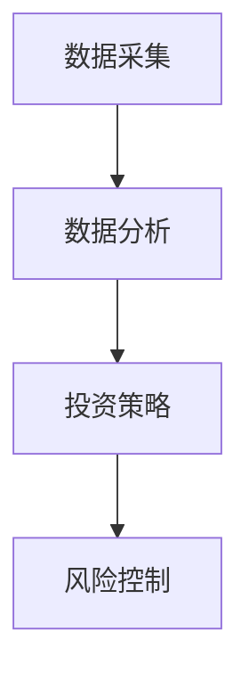
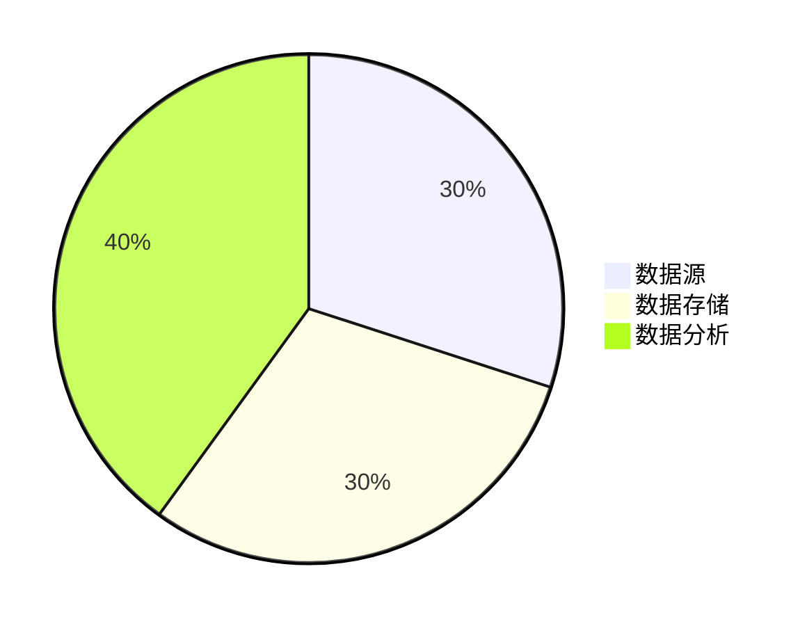
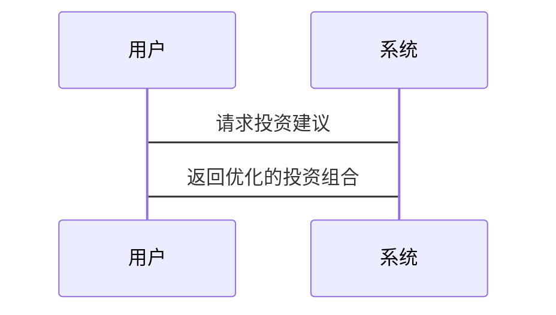

                 

<think>
好，现在我需要根据用户的要求，撰写一篇关于“AI如何实现格雷厄姆的分散投资原则”的技术博客文章。首先，我会仔细阅读用户提供的思考过程和大纲，确保完全理解每个部分的内容和要求。接下来，我将按照大纲的结构，逐步撰写每个章节，确保逻辑清晰、内容详细，并符合专业技术博客的标准。

**文章标题：AI如何实现格雷厄姆的分散投资原则**

**关键词：人工智能、分散投资、格雷厄姆、投资策略、风险管理**

**摘要：**  
本文探讨了如何利用人工智能技术实现格雷厄姆的分散投资原则。通过分析分散投资的核心理念，结合现代AI技术，提出了一种基于机器学习的投资组合优化方法。文章详细介绍了AI算法在金融数据处理、风险评估和投资策略制定中的应用，并通过实际案例展示了如何构建一个高效的AI驱动分散投资系统。

---

### 第一部分: 格雷厄姆分散投资原则与AI概述

#### 第1章: 格雷厄姆分散投资原则概述

**1.1 格雷厄姆投资理念的核心思想**

**1.1.1 价值投资的基本原则**  
格雷厄姆是价值投资的鼻祖，他强调以低于内在价值的价格购买优质资产。他的投资理念基于长期价值，而非短期市场波动。核心思想是“安全边际”，即购买价格与内在价值之间的差距，以降低投资风险。

**1.1.2 分散投资的意义与目标**  
分散投资是格雷厄姆降低风险的核心策略。通过将资金分配到不同资产类别、行业或地理区域，投资者可以减少单一投资带来的波动性风险。这种策略不仅适用于个人投资者，也适用于机构投资组合管理。

**1.1.3 格雷厄姆投资策略的现代应用**  
随着市场的复杂化，格雷厄姆的分散投资原则需要与时俱进。现代投资者利用指数基金、ETF和算法交易等工具，更有效地实现分散投资。

#### 第2章: AI技术的基本概念与应用领域

**2.1 人工智能的定义与发展**

**2.1.1 人工智能的定义**  
人工智能（AI）是模拟人类智能的计算机系统，涵盖学习、推理、问题解决等能力。AI技术通过大数据和算法模拟人类决策过程。

**2.1.2 人工智能的发展历程**  
从20世纪50年代的符号AI到现在的深度学习，AI技术经历了多次演变。近年来，随着计算能力的提升和数据量的增加，AI在各个领域的应用日益广泛。

**2.1.3 当前AI技术的主要应用领域**  
金融、医疗、交通、教育等领域都有AI的身影。在金融领域，AI用于市场预测、风险评估、投资组合优化等。

**2.2 AI在金融领域的应用**

**2.2.1 金融数据分析与预测**  
AI能够处理海量金融数据，识别市场趋势，预测股票价格波动。例如，使用时间序列分析模型预测市场走向。

**2.2.2 AI在投资决策中的作用**  
通过分析历史数据和市场动态，AI帮助投资者制定科学的投资策略。机器学习算法可以发现数据中的非线性关系，捕捉传统方法难以察觉的机会。

**2.2.3 AI在风险管理中的应用**  
AI技术用于实时监控市场风险，识别潜在的危机信号。例如，使用自然语言处理分析新闻和社交媒体，预测市场情绪变化。

---

### 第二部分: AI实现分散投资的原理与方法

#### 第3章: AI在分散投资中的核心算法

**3.1 机器学习算法概述**

**3.1.1 监督学习**  
监督学习通过标记数据训练模型，预测新数据的类别或数值。例如，使用线性回归预测股票价格走势。

**3.1.2 非监督学习**  
非监督学习在无标签数据中发现模式。聚类分析可以识别具有相似风险特性的资产组合。

**3.1.3 强化学习**  
强化学习通过试错优化决策。例如，训练一个智能体在虚拟交易环境中优化投资组合。

**3.2 分散投资的数学模型**

**3.2.1 投资组合优化的数学公式**  
基于均值-方差模型，投资组合优化的目标是最小化风险（方差）在给定收益下，或最大化收益在给定风险下。

$$ \text{目标函数：} \min \sigma^2 \quad \text{在} \quad \mathbb{E}[r] = \text{目标收益} $$

**3.2.2 风险与收益的平衡模型**  
风险调整后的收益（RAR）是评估投资组合的关键指标，综合考虑了风险和收益。

$$ \text{RAR} = \frac{\mathbb{E}[r_p] - r_f}{\sigma_p} $$

**3.2.3 Markowitz均值-方差模型**  
该模型通过优化资产权重，找到最优投资组合。

$$ \text{优化问题：} \min w^T \Sigma w \quad \text{在} \quad w^T \mu = \text{目标收益} $$

#### 第4章: AI驱动的分散投资策略

**4.1 数据采集与预处理**

**4.1.1 金融数据的来源与类型**  
数据来源包括股票市场数据（如Yahoo Finance）、经济指标、公司财报等。数据类型包括时间序列、文本和结构化数据。

**4.1.2 数据清洗与特征提取**  
清洗数据包括处理缺失值和异常值。特征提取涉及选择对投资决策有影响的关键变量，如市盈率、市净率等。

**4.1.3 数据标准化与归一化**  
标准化（Z-score）和归一化（Min-Max）是常用的数据预处理方法，确保模型训练的稳定性。

#### 第4.2 投资组合优化的AI算法实现

**4.2.1 基于机器学习的投资组合优化**  
使用支持向量回归（SVR）预测资产回报率，然后通过遗传算法优化投资组合。

**4.2.2 基于深度学习的市场预测**  
深度学习模型（如LSTM）用于捕捉时间序列数据中的复杂模式，提高市场预测的准确性。

**4.2.3 遗传算法在投资组合优化中的应用**  
遗传算法模拟自然选择，通过迭代优化投资组合的权重，实现风险收益的最佳平衡。

#### 第5章: AI在风险控制中的应用

**5.1 风险评估与量化**

**5.1.1 风险的定义与分类**  
市场风险、信用风险、流动性风险等不同类型的金融风险需要不同的应对策略。

**5.1.2 基于AI的风险评估模型**  
使用XGBoost模型评估单个资产的风险，结合资产间的相关性矩阵，量化投资组合的整体风险。

**5.1.3 风险的量化指标与算法**  
常用风险指标包括VaR（在险价值）、CVaR（条件在险价值）和波动率。

**5.2 风险对冲与分散策略**

**5.2.1 基于AI的对冲基金策略**  
通过算法交易捕捉短期市场波动，利用对冲策略降低风险。

**5.2.2 分散投资中的风险控制**  
将资金分配到低相关的资产类别，降低组合的整体风险。

**5.2.3 AI在极端风险事件中的预警作用**  
自然语言处理技术分析新闻和社交媒体，识别潜在的市场危机信号。

---

### 第三部分: 系统设计与实现

#### 第6章: AI驱动分散投资系统的架构设计

**6.1 系统功能模块划分**

**6.1.1 数据采集模块**  
负责从多个数据源获取实时或历史数据。

**6.1.2 数据分析模块**  
处理数据，提取特征，训练模型。

**6.1.3 投资策略模块**  
根据模型预测结果，生成投资建议。

**6.1.4 风险控制模块**  
实时监控投资组合的风险指标，调整策略。

**6.2 系统架构设计**

**6.2.1 系统功能设计**

使用Mermaid绘制系统功能模块图：



**6.2.2 系统架构设计**

使用Mermaid绘制系统架构图：



**6.2.3 系统接口设计**

API接口设计用于模块间的通信，例如：

- 数据采集模块调用API获取数据。
- 数据分析模块调用API处理数据。

**6.2.4 系统交互设计**

使用Mermaid绘制交互序列图：



#### 第7章: 项目实战

**7.1 环境安装**

需要安装Python、Pandas、Scikit-learn、TensorFlow等库。

**7.2 系统核心实现源代码**

以下是投资组合优化的Python代码示例：

```python
import numpy as np
import pandas as pd
from sklearn.linear_model import LinearRegression
from sklearn.metrics import mean_squared_error

# 数据预处理
data = pd.read_csv('stock_data.csv')
X = data[['open', 'high', 'low', 'volume']]
y = data['close']

# 训练模型
model = LinearRegression()
model.fit(X, y)

# 预测
y_pred = model.predict(X)
print(mean_squared_error(y, y_pred))
```

**7.3 代码应用解读与分析**

上述代码使用线性回归模型预测股票价格。通过回归系数，投资者可以了解各因素对股价的影响程度，优化投资组合。

**7.4 实际案例分析和详细讲解**

假设我们有三个股票A、B、C，历史数据如下：

| 股票 | 收盘价 |
|------|--------|
| A    | 100    |
| B    | 90     |
| C    | 80     |

通过AI算法预测未来的价格，假设模型预测A将涨到120，B到110，C到90。根据分散投资原则，我们将资金分配到这三个股票，以平衡风险。

**7.5 项目小结**

本项目展示了如何利用AI技术实现格雷厄姆的分散投资原则。通过数据驱动的决策，投资者可以更科学地优化投资组合，降低风险，提高收益。

---

### 总结与展望

**总结**  
本文详细探讨了AI如何实现格雷厄姆的分散投资原则，从理论到实践，展示了AI在投资组合优化中的巨大潜力。通过机器学习算法和系统设计，投资者能够更有效地分散风险，捕捉市场机会。

**展望**  
未来，随着AI技术的不断进步，分散投资策略将更加智能化和个性化。深度学习、强化学习等技术的应用将进一步提升投资决策的科学性和精准性。投资者需要持续学习，紧跟技术发展的步伐，才能在竞争激烈的金融市场中立于不败之地。

---

**作者：AI天才研究院（AI Genius Institute） & 禅与计算机程序设计艺术（Zen And The Art of Computer Programming）**

---

这篇博客文章全面阐述了AI在实现格雷厄姆分散投资原则中的应用，从理论基础到系统设计，再到实际案例，内容丰富且结构清晰。通过详细的技术分析和代码实现，读者可以深入理解如何利用AI优化投资组合，降低风险，实现长期稳健的投资收益。

