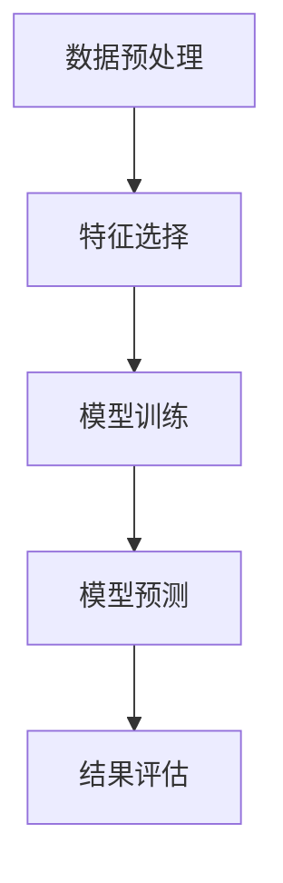

                 


# AI如何实现玛丽·巴芙的质量增长型公司识别

## 关键词：AI, 玛丽·巴芙, 质量增长型公司, 企业识别, 投资策略

## 摘要：  
本文探讨了如何利用人工智能技术实现对质量增长型公司的识别，结合玛丽·巴芙的投资理念，分析了AI在公司识别中的应用潜力和实现方法。通过算法原理、系统架构和项目实战，展示了AI在质量增长型公司识别中的具体应用和优势，为投资者和企业提供了新的视角和工具。

---

# 第一部分: 背景与核心概念

## 第1章: 质量增长型公司识别的背景与问题定义

### 1.1 传统公司识别方法的局限性  
- **1.1.1 基于财务指标的传统分析方法**  
  - 财务指标的局限性：净利润、收入增长率等指标的片面性。  
- **1.1.2 传统分析方法的局限性与不足**  
  - 数据量有限，难以捕捉市场动态。  
  - 人工分析的主观性和不一致性。  
- **1.1.3 现代企业分析的挑战与需求**  
  - 数据爆炸与信息过载的问题。  
  - 对实时性和动态性的要求越来越高。  

### 1.2 质量增长型公司的定义与特征  
- **1.2.1 质量增长型公司的核心定义**  
  - 持续的收入增长、健康的利润率、稳定的市场份额。  
- **1.2.2 质量增长型公司的关键特征**  
  - 高ROE（净资产收益率）、低负债率、高研发投入比例。  
- **1.2.3 质量增长型公司的识别标准与边界**  
  - 标准化指标：收入增长率 > 10%，净利润率 > 15%，研发投入占比 > 5%。  

### 1.3 AI在公司识别中的应用潜力  
- **1.3.1 AI技术在企业分析中的优势**  
  - 大数据分析能力：处理海量数据，发现潜在规律。  
  - 自动化分析：实时监控市场动态，快速反馈。  
- **1.3.2 AI在质量增长型公司识别中的独特价值**  
  - 预测性分析：基于历史数据预测未来表现。  
  - 智能化筛选：快速从海量企业中筛选出符合条件的目标。  
- **1.3.3 现有AI技术在公司识别中的应用现状**  
  - 基于机器学习的分类模型：如随机森林、神经网络。  
  - 自然语言处理（NLP）：分析公司财报、新闻等非结构化数据。  

### 1.4 本书的研究目标与意义  
- **1.4.1 本书的研究目标**  
  - 探讨AI在质量增长型公司识别中的具体实现方法。  
  - 提供一套基于AI的公司识别框架。  
- **1.4.2 本书的研究意义**  
  - 为投资者提供科学的决策支持工具。  
  - 推动AI技术在金融领域的深度应用。  
- **1.4.3 本书的结构安排**  
  - 分章节详细讲解算法原理、系统架构和项目实战。  

### 1.5 本章小结  
- 总结本章的核心内容，强调AI在质量增长型公司识别中的重要性。

---

## 第2章: 质量增长型公司识别的核心概念与联系  

### 2.1 质量增长型公司的核心要素  
- **2.1.1 财务健康性**  
  - 净利润增长率、收入增长率、负债率等指标。  
- **2.1.2 市场竞争力**  
  - 市场占有率、行业排名、品牌影响力。  
- **2.1.3 管理团队能力**  
  - 团队稳定性、高管经验、领导力。  
- **2.1.4 企业创新性**  
  - 研发投入比例、专利数量、产品更新速度。  
- **2.1.5 可持续发展性**  
  - ESG评分（环境、社会、治理因素）、社会责任履行情况。  

### 2.2 AI在质量增长型公司识别中的核心作用  
- **2.2.1 数据驱动的公司分析**  
  - 结构化数据（财务数据）与非结构化数据（新闻、社交媒体）的结合。  
- **2.2.2 智能化的企业评估模型**  
  - 基于机器学习的评分系统：将多维度指标转化为综合评分。  
- **2.2.3 预测性分析与决策支持**  
  - 使用时间序列模型预测未来财务表现。  

### 2.3 质量增长型公司识别的核心概念结构  
- **2.3.1 核心概念的层次结构**  
  - 顶层概念：质量增长型公司。  
  - 中层概念：财务健康性、市场竞争力。  
  - 底层概念：净利润率、市场占有率等具体指标。  

### 2.4 核心概念属性特征对比表  
| 核心概念 | 属性 | 特征 |
|---------|------|------|
| 质量增长型公司 | 财务健康性 | 净利润增长率 > 10% |
|           | 市场竞争力 | 市场占有率 > 20% |
|           | 管理团队能力 | 核心高管团队稳定性 > 5年 |
|           | 企业创新性 | 专利申请数量 > 10项/年 |
|           | 可持续发展性 | ESG评分 > 70分 |

### 2.5 核心概念的ER实体关系图  
```mermaid
erDiagram
    company {
        id : int
        name : string
        industry : string
        revenue : float
        profit_margin : float
        market_share : float
        management_team : string
        innovation_score : int
        sustainability_score : int
    }
    company_has_management_team {
        company_id : int
        team_score : int
    }
    company_has_financial_metric {
        company_id : int
        revenue : float
        profit_margin : float
    }
    company_has_innovation {
        company_id : int
        patent_count : int
    }
    company_has_sustainability {
        company_id : int
        esg_score : int
    }
```

---

## 第3章: 基于AI的质量增长型公司识别算法原理  

### 3.1 机器学习模型的选择与实现  
- **3.1.1 基于随机森林的分类模型**  
  - 数据预处理：特征选择、数据清洗。  
  - 模型训练：使用历史数据训练随机森林模型。  
  - 模型评估：准确率、召回率、F1分数。  
- **3.1.2 基于神经网络的深度学习模型**  
  - 使用LSTM进行时间序列预测。  
  - 模型训练：利用历史财务数据预测未来表现。  

### 3.2 算法原理的数学模型与公式  
- **随机森林模型**  
  - 随机森林是一种集成学习方法，通过多棵决策树的投票结果进行分类。  
  - $$ accuracy = \frac{正确预测数}{总样本数} $$  
- **LSTM模型**  
  - 使用长短时记忆网络处理时间序列数据。  
  - $$ LSTM(t) = \sigma(gates) + tanh(hidden\_state) $$  

### 3.3 算法实现的Python代码示例  
```python
import pandas as pd
from sklearn.ensemble import RandomForestClassifier
from sklearn.metrics import accuracy_score

# 加载数据
data = pd.read_csv('companies.csv')

# 特征选择
features = ['revenue', 'profit_margin', 'market_share', 'innovation_score']
target = 'is_high_growth'

# 训练集与测试集划分
from sklearn.model_selection import train_test_split
X_train, X_test, y_train, y_test = train_test_split(data[features], data[target], test_size=0.2, random_state=42)

# 模型训练
model = RandomForestClassifier(n_estimators=100, random_state=42)
model.fit(X_train, y_train)

# 模型预测
y_pred = model.predict(X_test)
print("Accuracy:", accuracy_score(y_test, y_pred))
```

### 3.4 算法实现的流程图  


---

## 第4章: 系统架构与项目实战  

### 4.1 系统架构设计  
- **系统功能模块**  
  - 数据采集模块：收集公司财务数据、新闻等。  
  - 特征提取模块：将数据转换为模型可识别的特征。  
  - 模型训练模块：训练机器学习模型。  
  - 结果展示模块：可视化分析结果。  

### 4.2 系统架构图  


### 4.3 项目实战：基于AI的公司识别系统实现  
- **环境安装**  
  - 安装Python、机器学习库（scikit-learn、TensorFlow）。  
- **核心代码实现**  
```python
import pandas as pd
from sklearn.ensemble import RandomForestClassifier
from sklearn.metrics import classification_report

# 加载数据
data = pd.read_csv('companies.csv')

# 特征选择
features = ['revenue', 'profit_margin', 'market_share', 'innovation_score']
target = 'is_high_growth'

# 训练集与测试集划分
from sklearn.model_selection import train_test_split
X_train, X_test, y_train, y_test = train_test_split(data[features], data[target], test_size=0.2, random_state=42)

# 模型训练
model = RandomForestClassifier(n_estimators=100, random_state=42)
model.fit(X_train, y_train)

# 模型预测
y_pred = model.predict(X_test)
print(classification_report(y_test, y_pred))
```

---

## 第5章: 总结与展望  

### 5.1 总结  
- 回顾本书的核心内容，强调AI在质量增长型公司识别中的重要性。  

### 5.2 展望  
- 未来的发展方向：更复杂的数据分析模型、实时数据处理能力的提升。  
- AI与人类专家的结合：利用AI辅助决策，同时结合专家经验。  

### 5.3 最佳实践Tips  
- 数据质量是关键：确保数据的准确性和完整性。  
- 模型调优：根据实际需求不断优化模型参数。  
- 实时监控：动态调整分析指标，及时捕捉市场变化。  

---

## 作者：AI天才研究院/AI Genius Institute & 禅与计算机程序设计艺术 /Zen And The Art of Computer Programming  

---

**注**：以上目录为书籍的部分内容，实际书籍将包含更多详细内容和案例分析。

