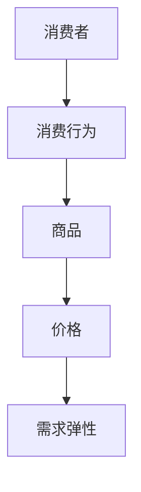
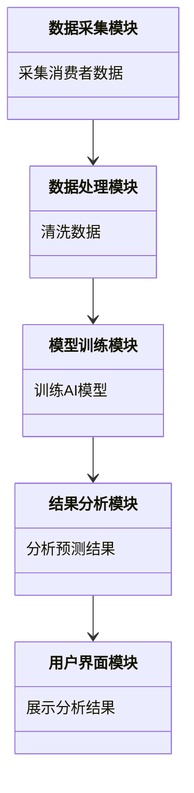
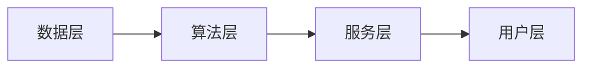
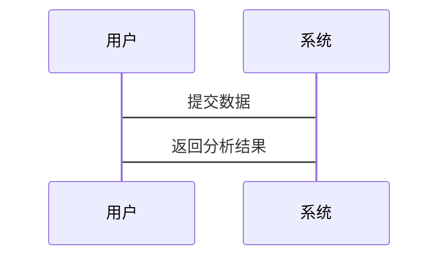

                 


# AI如何实现费雪的消费者行为研究

> 关键词：消费者行为、AI技术、费雪理论、机器学习、需求预测、数据分析

> 摘要：本文探讨如何利用人工智能技术实现费雪的消费者行为研究，从理论基础到算法实现，从系统架构到项目实战，深入剖析AI在消费者行为分析中的应用，结合数学模型与实际案例，提供详细的技术实现方案。

---

# 第一部分: 费雪消费者行为理论与AI技术的结合背景

## 第1章: 费雪消费者行为理论概述

### 1.1 费雪消费者行为理论的核心概念

#### 1.1.1 消费者效用理论
消费者效用理论是费雪理论的核心，认为消费者在购买商品或服务时，追求的是效用的最大化。效用是指消费者从消费中获得的满足感或价值，可以用数学公式表示：
$$ U = U(x_1, x_2, ..., x_n) $$
其中，$x_i$ 表示第$i$种商品的数量。

#### 1.1.2 需求函数与价格弹性
需求函数描述了消费者在不同价格下的购买数量，可以用需求函数表示为：
$$ Q = Q(p) $$
其中，$Q$ 表示需求量，$p$ 表示价格。价格弹性是用来衡量需求量对价格变化的敏感程度，公式为：
$$ E_p = \frac{dQ}{dp} \times \frac{p}{Q} $$

#### 1.1.3 费雪的消费理论与现代经济学的联系
费雪的消费理论为现代经济学奠定了基础，尤其是消费者行为研究。现代经济学中，效用函数和需求函数被广泛应用于市场分析和政策制定。

### 1.2 AI技术的基本概念与应用领域

#### 1.2.1 人工智能的定义与核心特征
人工智能（AI）是指计算机系统模拟人类智能的技术，核心特征包括学习、推理、自我优化等。

#### 1.2.2 机器学习与深度学习的基本原理
机器学习是AI的核心技术，通过数据训练模型，使其能够从经验中学习。深度学习是机器学习的一种，利用多层神经网络进行特征提取和模式识别。

#### 1.2.3 AI在经济学与消费者行为研究中的应用潜力
AI技术可以用于消费者行为预测、市场趋势分析、个性化推荐等，极大提升了传统经济学研究的效率和精度。

### 1.3 费雪理论与AI技术的结合背景

#### 1.3.1 消费者行为研究的现状与挑战
传统消费者行为研究依赖于问卷调查和统计分析，耗时且成本高。AI技术的引入，可以利用大数据和机器学习算法，实现实时、动态的消费者行为分析。

#### 1.3.2 AI技术如何解决传统消费者行为研究的局限性
AI技术可以处理海量数据，发现隐藏的模式和趋势，帮助研究者更深入地理解消费者行为。

#### 1.3.3 费雪理论与AI结合的可行性分析
费雪理论提供了消费者行为的理论框架，而AI技术提供了实现这一框架的工具和方法，两者结合具有互补性和可行性。

---

## 第2章: 费雪消费者行为理论与AI技术的核心概念

### 2.1 费雪理论中的关键概念

#### 2.1.1 消费者效用函数
效用函数描述了消费者从商品消费中获得的效用，可以用数学公式表示：
$$ U = \sum_{i=1}^{n} \beta_i x_i $$
其中，$\beta_i$ 是商品$x_i$的效用系数。

#### 2.1.2 需求曲线与价格弹性
需求曲线展示了价格与需求量的关系，价格弹性衡量了需求量对价格变化的敏感程度。

#### 2.1.3 消费者剩余与市场均衡
消费者剩余是指消费者在购买商品时愿意支付的最高价格与实际支付价格之间的差额。

### 2.2 AI技术的核心算法与模型

#### 2.2.1 机器学习算法概述
机器学习算法包括监督学习、无监督学习和强化学习。监督学习用于分类和回归，无监督学习用于聚类和降维，强化学习用于决策优化。

#### 2.2.2 神经网络与深度学习模型
深度学习模型如卷积神经网络（CNN）和循环神经网络（RNN）在图像识别和自然语言处理中表现优异。

#### 2.2.3 自然语言处理与计算机视觉技术
自然语言处理（NLP）用于分析消费者评论，计算机视觉技术用于分析产品图像。

### 2.3 费雪理论与AI技术的关联性分析

#### 2.3.1 费雪理论中的变量关系与AI模型的输入输出
费雪理论中的变量（如价格、需求量）可以作为AI模型的输入，模型输出为消费者行为预测。

#### 2.3.2 数据驱动与理论驱动的结合
AI技术通过数据驱动的方法，与费雪理论的理论驱动方法相结合，实现更准确的消费者行为预测。

#### 2.3.3 AI技术在消费者行为预测中的应用
AI技术可以用于预测消费者需求、优化定价策略、制定市场推广计划等。

### 2.4 核心概念对比分析

#### 2.4.1 费雪理论与AI技术的核心概念对比表格
| 费雪理论概念        | AI技术概念          |
|---------------------|---------------------|
| 消费者效用函数       | 机器学习模型        |
| 需求曲线与价格弹性   | 数据挖掘与预测模型   |
| 消费者剩余与市场均衡 | 系统优化与反馈机制  |

#### 2.4.2 费雪理论与AI技术的ER实体关系图


---

## 第3章: 基于AI的消费者行为分析算法原理

### 3.1 线性回归算法

#### 3.1.1 线性回归的基本原理
线性回归是一种简单而强大的回归算法，用于预测连续型变量。其数学公式为：
$$ y = \beta_0 + \beta_1 x_1 + \beta_2 x_2 + ... + \beta_n x_n + \epsilon $$
其中，$\beta_0$ 是截距，$\beta_i$ 是回归系数，$\epsilon$ 是误差项。

#### 3.1.2 线性回归的应用场景
线性回归适用于消费者需求量与价格、收入等变量之间的线性关系分析。

#### 3.1.3 线性回归的实现步骤
1. 数据预处理：收集和清洗数据。
2. 模型训练：使用最小二乘法拟合回归系数。
3. 模型评估：计算R²值和残差分析。
4. 模型应用：进行需求预测和政策模拟。

### 3.2 机器学习算法

#### 3.2.1 机器学习算法的数学模型
机器学习算法的核心是优化目标函数，如支持向量机（SVM）的目标函数：
$$ \min_{\theta} \frac{1}{2} ||\theta||^2 + C \sum_{i=1}^{n} \xi_i $$
其中，$\theta$ 是模型参数，$\xi_i$ 是松弛变量。

#### 3.2.2 机器学习算法的实现步骤
1. 数据预处理：特征提取和标准化。
2. 模型训练：选择算法并训练模型。
3. 模型评估：交叉验证和性能指标计算。
4. 模型优化：超参数调优和特征选择。

### 3.3 深度学习算法

#### 3.3.1 深度学习算法的基本原理
深度学习通过多层神经网络进行特征提取和非线性关系建模，数学公式为：
$$ y = \sigma(w_2 \sigma(w_1 x + b_1) + b_2) $$
其中，$\sigma$ 是激活函数，$w_1$ 和 $w_2$ 是权重矩阵，$b_1$ 和 $b_2$ 是偏置项。

#### 3.3.2 深度学习算法的应用场景
深度学习适用于消费者行为的复杂模式识别，如图像识别和自然语言处理。

#### 3.3.3 深度学习算法的实现步骤
1. 数据准备：收集和标注数据。
2. 模型构建：设计神经网络架构。
3. 模型训练：使用梯度下降优化权重。
4. 模型评估：计算准确率和F1分数。
5. 模型部署：集成到实际系统中。

---

## 第4章: 费雪理论与AI技术的系统架构设计

### 4.1 系统功能设计

#### 4.1.1 系统功能模块划分
系统功能模块包括数据采集、数据处理、模型训练、结果分析和用户界面。

#### 4.1.2 系统功能模块的类图


### 4.2 系统架构设计

#### 4.2.1 系统架构的层次结构
系统架构分为数据层、算法层、服务层和用户层，形成一个完整的AI消费者行为分析系统。

#### 4.2.2 系统架构的架构图


### 4.3 系统接口设计

#### 4.3.1 系统接口的定义
系统接口包括数据输入接口、模型调用接口和结果输出接口。

#### 4.3.2 系统接口的交互流程
1. 用户输入数据。
2. 系统调用模型进行分析。
3. 系统输出分析结果。

### 4.4 系统交互设计

#### 4.4.1 系统交互的流程图


---

## 第5章: 项目实战——基于AI的消费者行为分析系统

### 5.1 环境安装与配置

#### 5.1.1 开发环境的安装
安装Python、Jupyter Notebook和必要的机器学习库（如scikit-learn、TensorFlow）。

#### 5.1.2 数据集的准备
收集消费者行为数据，包括价格、需求量、消费者特征等。

### 5.2 系统核心实现

#### 5.2.1 数据预处理代码
```python
import pandas as pd
import numpy as np

# 读取数据
data = pd.read_csv('consumer_behavior.csv')

# 数据清洗
data = data.dropna()
data = pd.get_dummies(data)
```

#### 5.2.2 模型训练代码
```python
from sklearn.linear_model import LinearRegression
from sklearn.metrics import mean_squared_error

# 训练线性回归模型
model = LinearRegression()
model.fit(X_train, y_train)

# 模型评估
y_pred = model.predict(X_test)
print('均方误差:', mean_squared_error(y_test, y_pred))
```

#### 5.2.3 模型优化代码
```python
from sklearn.ensemble import RandomForestRegressor
from sklearn.model_selection import GridSearchCV

# 参数调优
param_grid = {'n_estimators': [10, 20, 30]}
grid_search = GridSearchCV(RandomForestRegressor(), param_grid)
grid_search.fit(X_train, y_train)
best_model = grid_search.best_estimator_
```

### 5.3 实际案例分析

#### 5.3.1 数据分析与结果展示
使用Python的Matplotlib库绘制需求曲线和价格弹性分布图。

#### 5.3.2 模型预测与结果解读
解读模型预测结果，分析消费者行为变化趋势。

### 5.4 项目总结与经验分享

#### 5.4.1 项目总结
总结项目的实施过程和取得的成果，分析模型的优缺点。

#### 5.4.2 经验分享
分享项目中遇到的问题及解决方法，强调数据质量和模型选择的重要性。

---

## 第6章: 最佳实践与注意事项

### 6.1 最佳实践 tips

#### 6.1.1 数据预处理
确保数据的完整性和准确性，进行特征工程和标准化处理。

#### 6.1.2 模型选择
根据数据特征和业务需求选择合适的算法，避免过度复杂。

#### 6.1.3 结果验证
使用交叉验证和实际业务指标验证模型的准确性和适用性。

### 6.2 小结

#### 6.2.1 AI技术在消费者行为研究中的优势
AI技术能够高效处理海量数据，发现传统方法难以察觉的模式和趋势。

#### 6.2.2 费雪理论与AI结合的前景
费雪理论与AI技术的结合将推动消费者行为研究进入新的发展阶段。

### 6.3 注意事项

#### 6.3.1 数据隐私问题
在实际应用中，需注意保护消费者数据隐私，遵守相关法律法规。

#### 6.3.2 模型的泛化能力
避免模型过拟合，确保模型在不同数据集上的表现稳定。

### 6.4 拓展阅读

#### 6.4.1 推荐书籍
- 《消费者行为学》
- 《机器学习实战》
- 《深度学习》

#### 6.4.2 推荐博客
- [Towards Data Science](https://towardsdatascience.com/)
- [Medium AI](https://medium.com/ai)

---

# 第七部分: 结语

AI技术正在 revolutionize 消费者行为研究，通过结合费雪理论，我们可以更深入地理解消费者行为，制定更有效的市场策略。未来，随着AI技术的不断发展，消费者行为研究将更加精准和智能化。

---

作者：AI天才研究院/AI Genius Institute & 禅与计算机程序设计艺术/Zen And The Art of Computer Programming

