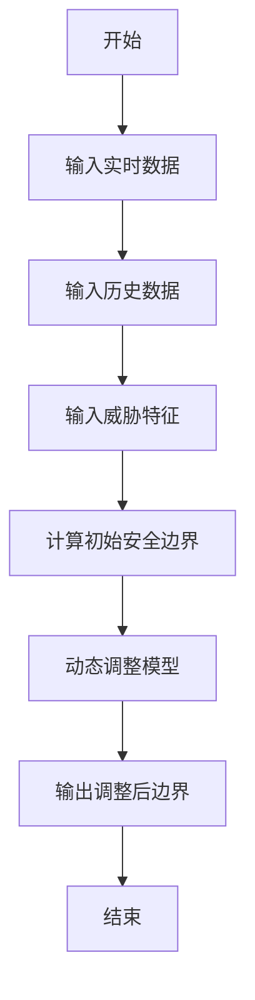
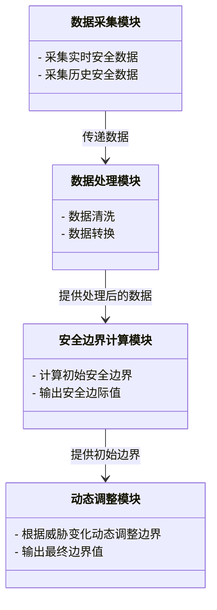
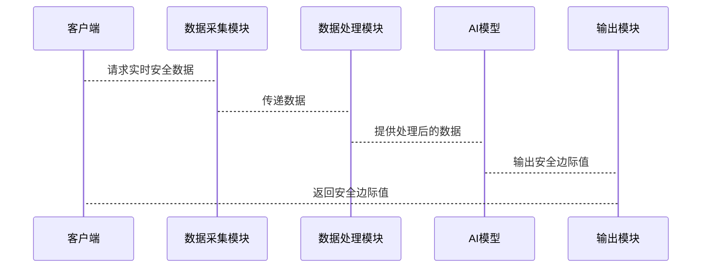

                 


# 《AI实现的自适应安全边际计算模型》

> 关键词：自适应安全边际计算，人工智能，安全边界，动态调整，模型算法

> 摘要：本文详细介绍了基于人工智能的自适应安全边际计算模型，从问题背景、核心概念、算法原理到系统架构，再到项目实战和最佳实践，全面阐述了该模型的设计思路、实现方法和应用价值。

---

# 第1章: 背景介绍

## 1.1 问题背景

### 1.1.1 当前网络安全面临的挑战

随着数字化转型的深入，网络安全威胁日益复杂化和多样化。传统的静态安全边界计算方法难以应对动态变化的威胁环境，导致安全防护能力不足。企业需要一种能够实时调整的安全计算模型，以应对不断变化的安全威胁。

### 1.1.2 安全边际计算的定义与目标

安全边际计算是一种通过动态调整安全策略和边界范围来保护系统和数据的技术。其目标是在保证安全的前提下，最大化资源利用率，同时降低误报率和漏报率。

### 1.1.3 自适应安全边际计算的必要性

传统的静态安全计算模型无法应对动态变化的安全威胁。自适应安全边际计算通过引入人工智能技术，能够实时分析安全数据，动态调整安全边界，从而提高安全防护能力。

## 1.2 问题描述

### 1.2.1 安全边际计算的核心问题

如何在动态变化的环境中，实时计算和调整安全边界，以应对未知的安全威胁。

### 1.2.2 自适应性在安全边际计算中的作用

通过自适应调整安全边界，模型能够根据实时的安全数据，动态优化安全策略，从而提高安全防护能力。

### 1.2.3 当前技术的局限性与改进方向

传统技术无法实时动态调整安全边界，且缺乏对复杂安全威胁的分析能力。引入人工智能技术可以弥补这些不足。

## 1.3 问题解决

### 1.3.1 自适应安全边际计算的解决方案

通过构建基于AI的自适应安全边际计算模型，实时分析安全数据，动态调整安全边界。

### 1.3.2 AI在安全边际计算中的应用价值

AI技术能够提供实时数据分析、动态调整和智能决策能力，显著提升安全边际计算的效率和准确性。

### 1.3.3 自适应模型的优势与创新点

自适应模型能够实时调整安全边界，适应动态变化的安全威胁，具有更高的安全防护能力和更低的误报率。

## 1.4 模型的边界与外延

### 1.4.1 自适应安全边际的动态调整范围

模型能够根据实时的安全数据，动态调整安全边界，适应不同的安全威胁场景。

### 1.4.2 模型的适用场景与限制

适用于需要动态调整安全边界的场景，如企业网络、云服务等。模型的限制包括对实时数据的依赖和对复杂场景的适应能力。

### 1.4.3 模型与其他安全技术的关系

模型可以与其他安全技术（如入侵检测、防火墙等）协同工作，形成完整的安全防护体系。

## 1.5 本章小结

本章从问题背景、核心概念、问题解决等方面，详细介绍了自适应安全边际计算模型的必要性和基本原理。

---

# 第2章: 核心概念与联系

## 2.1 核心概念原理

### 2.1.1 自适应安全边际的计算原理

模型通过实时分析安全数据，利用AI算法计算出当前的安全边际，并根据威胁的变化动态调整安全边界。

### 2.1.2 AI在模型中的作用机制

AI算法通过分析历史和实时数据，识别安全威胁模式，动态优化安全边界计算模型。

### 2.1.3 动态调整的数学模型

$$\text{安全边界} = f(\text{实时数据}, \text{历史数据}, \text{威胁特征})$$

---

## 2.2 概念属性特征对比

### 2.2.1 模型属性对比表格

| 模型属性 | 描述 |
|----------|------|
| 输入     | 安全数据 |
| 输出     | 安全边际值 |
| 自适应性 | 动态调整 |
| 计算方式 | AI算法驱动 |

---

## 2.3 ER实体关系图

```mermaid
erd
  entity 安全数据 {
    key: id
    attrs: 时间戳, 数据类型, 安全级别
  }
  entity 安全边际 {
    key: id
    attrs: 边界值, 时间戳, 自适应参数
  }
  entity AI模型 {
    key: id
    attrs: 模型版本, 训练数据, 模型参数
  }
  安全数据 --> 安全边际: 计算边界
  AI模型 --> 安全边际: 动态调整
```

## 2.4 本章小结

本章通过核心概念和ER图，详细阐述了自适应安全边际计算模型的基本原理和组成部分。

---

# 第3章: 算法原理讲解

## 3.1 算法概述

### 3.1.1 自适应安全边际计算的核心算法

模型采用基于AI的动态调整算法，通过实时数据和历史数据，计算出当前的安全边际。

### 3.1.2 算法的输入输出定义

输入：实时安全数据、历史安全数据、威胁特征。

输出：动态调整后的安全边界值。

### 3.1.3 算法的优化目标

最小化误报率和漏报率，最大化安全防护能力。

---

## 3.2 算法流程



---

## 3.3 算法实现代码

```python
import numpy as np
from sklearn import linear_model

# 示例：基于线性回归的简单实现
def adaptive_security_margin(X, y):
    model = linear_model.LinearRegression()
    model.fit(X, y)
    return model.predict(X)
```

---

## 3.4 数学模型和公式

### 3.4.1 动态调整模型

$$y = \beta_0 + \beta_1x_1 + \beta_2x_2 + \dots + \beta_nx_n$$

### 3.4.2 调整系数更新公式

$$\beta_i = \beta_i + \alpha(\text{实际值} - \text{预测值})$$

其中，$\alpha$ 是学习率。

---

## 3.5 本章小结

本章详细讲解了自适应安全边际计算模型的核心算法及其实现过程。

---

# 第4章: 系统分析与架构设计

## 4.1 系统分析

### 4.1.1 问题场景介绍

企业网络中的动态安全防护需求，需要实时调整安全边界。

### 4.1.2 项目介绍

本项目旨在构建一个基于AI的自适应安全边际计算系统，实现动态调整安全边界。

## 4.2 系统功能设计

### 4.2.1 功能模块划分

- 数据采集模块
- 数据处理模块
- 安全边界计算模块
- 动态调整模块

### 4.2.2 系统功能设计图



---

## 4.3 系统架构设计

### 4.3.1 系统架构图

```mermaid
archi
  component 安全数据源 {
    提供实时安全数据
  }
  component 数据处理模块 {
    数据清洗和转换
  }
  component AI模型 {
    动态调整边界计算
  }
  component 输出模块 {
    输出安全边际值
  }
  安全数据源 --> 数据处理模块
  数据处理模块 --> AI模型
  AI模型 --> 输出模块
```

---

## 4.4 系统接口设计

### 4.4.1 接口描述

- 数据接口：实时安全数据输入接口
- 模型接口：AI模型调用接口
- 输出接口：安全边际值输出接口

### 4.4.2 接口交互图



---

## 4.5 本章小结

本章通过系统分析与架构设计，详细阐述了自适应安全边际计算系统的实现方案。

---

# 第5章: 项目实战

## 5.1 环境安装

### 5.1.1 安装Python环境

```bash
python --version
pip install numpy scikit-learn
```

### 5.1.2 安装依赖库

```bash
pip install mermaid
```

---

## 5.2 核心代码实现

### 5.2.1 数据采集模块

```python
import pandas as pd

def collect_data():
    # 示例：从CSV文件中读取数据
    data = pd.read_csv('security_data.csv')
    return data
```

### 5.2.2 数据处理模块

```python
def process_data(data):
    # 示例：数据清洗和转换
    data = data.dropna()
    data = data.astype(float)
    return data
```

### 5.2.3 AI模型实现

```python
from sklearn.linear_model import LinearRegression

def adaptive_model(X_train, y_train):
    model = LinearRegression()
    model.fit(X_train, y_train)
    return model
```

### 5.2.4 动态调整模块

```python
def adjust_boundary(model, X_new):
    # 示例：动态调整边界
    y_pred = model.predict(X_new)
    return y_pred
```

---

## 5.3 代码应用解读与分析

### 5.3.1 代码功能解读

- 数据采集模块：从数据源获取实时安全数据。
- 数据处理模块：清洗和转换数据，确保模型输入数据的准确性。
- AI模型实现：构建线性回归模型，训练模型参数。
- 动态调整模块：利用训练好的模型，预测新的安全边际值。

---

## 5.4 实际案例分析和详细讲解

### 5.4.1 案例分析

假设我们有以下安全数据：

| 时间戳 | 数据类型 | 安全级别 |
|--------|----------|----------|
| 1      | 0.5      | 0.6      |
| 2      | 0.6      | 0.7      |
| 3      | 0.7      | 0.8      |

通过模型训练，我们可以预测下一个时间点的安全边界值。

---

## 5.5 本章小结

本章通过实际案例，详细讲解了自适应安全边际计算模型的实现过程。

---

# 第6章: 最佳实践

## 6.1 小结

自适应安全边际计算模型通过动态调整安全边界，显著提升了安全防护能力。

---

## 6.2 注意事项

- 确保实时数据的准确性和及时性
- 定期更新模型参数，保持模型的有效性
- 注意模型的可解释性和透明度

---

## 6.3 拓展阅读

- 《自适应安全边界计算技术》
- 《基于AI的安全防护系统设计》

---

# 作者：AI天才研究院/AI Genius Institute & 禅与计算机程序设计艺术 /Zen And The Art of Computer Programming

