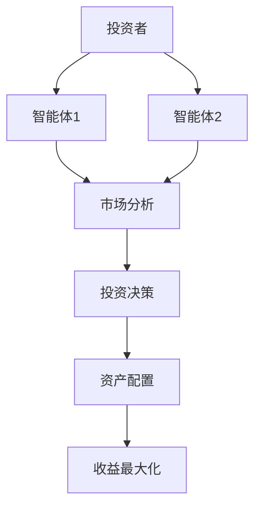
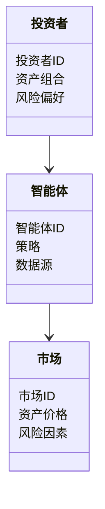

                 


# AI智能体协作：优化价值投资的全球产业布局策略

> 关键词：AI智能体协作，价值投资，全球产业布局，多智能体协作算法，投资优化，产业策略

> 摘要：本文探讨了AI智能体协作如何优化价值投资策略，并在全球产业布局中发挥关键作用。通过分析AI智能体协作的核心概念、算法原理、系统架构及实战案例，本文为投资者和产业布局者提供了理论支持和实践指导，展示了AI技术在金融投资和产业优化中的广泛应用。

---

## 第1章: AI智能体协作与价值投资概述

### 1.1 AI智能体协作的基本概念

#### 1.1.1 什么是AI智能体协作
AI智能体协作是指多个AI智能体通过信息共享和协同决策，共同完成复杂任务的过程。这些智能体可以是软件程序、算法模型或其他智能系统，它们通过通信和协调，优化决策过程。

#### 1.1.2 价值投资的背景与意义
价值投资是一种长期投资策略，强调购买价格低于内在价值的资产。其核心在于识别市场低估的机会，通过长期持有实现收益。在全球化背景下，价值投资需要结合多样化的产业布局，以分散风险并捕捉增长机会。

#### 1.1.3 AI智能体协作与价值投资的结合
AI智能体协作通过数据挖掘、模式识别和决策优化，帮助投资者发现潜在机会，评估风险，并制定最优投资策略。这种结合不仅提高了投资效率，还优化了全球产业布局。

---

### 1.2 AI智能体协作的核心概念与联系

#### 1.2.1 AI智能体协作的原理
AI智能体协作基于强化学习和博弈论，通过多智能体间的通信和协调，优化决策过程。每个智能体都有特定的目标，通过协作实现整体目标的最优。

#### 1.2.2 价值投资与AI智能体协作的对比分析
| **属性**       | **价值投资**                     | **AI智能体协作**                 |
|----------------|----------------------------------|----------------------------------|
| 理论基础         | 格雷厄姆的价值投资理论           | 博弈论、强化学习                 |
| 决策方式         | 主观判断与分析                   | 数据驱动、算法优化               |
| 优化目标         | 最大化内在价值                   | 最大化整体协作收益               |

#### 1.2.3 ER实体关系图
```mermaid
er
    %% ER图展示实体关系
    %% 实体：投资者、资产、市场、智能体
    %% 关系：投资者拥有智能体，智能体分析市场数据，市场影响资产价值
    %% 属性：智能体ID, 投资者ID, 资产ID, 市场ID
    %% 关键字：主键, 外键
    %% 外键约束：投资者ID引用投资者表，资产ID引用资产表，市场ID引用市场表
```

---

### 1.3 算法原理与优化策略

#### 1.3.1 多智能体协作算法
多智能体协作算法基于强化学习，通过不断试验和反馈优化决策。每个智能体都有自己的策略，通过通信和协作实现全局最优。

#### 1.3.2 价值投资优化算法
价值投资优化算法结合AI技术，通过数据挖掘和模式识别，识别市场低估的机会，优化资产配置。

#### 1.3.3 算法实现与优化


---

## 第2章: 系统分析与架构设计方案

### 2.1 项目背景与目标

#### 2.1.1 项目背景
随着AI技术的发展，投资领域需要更高效的方法来优化价值投资策略和全球产业布局。

#### 2.1.2 项目目标
通过AI智能体协作，优化价值投资策略，实现全球产业布局的最优配置。

### 2.2 系统功能设计

#### 2.2.1 领域模型类图


#### 2.2.2 系统架构设计


---

## 第3章: 项目实战与案例分析

### 3.1 环境安装与配置

#### 3.1.1 开发环境
推荐使用Python和相关库（如TensorFlow、PyTorch）进行开发。

### 3.2 核心代码实现

#### 3.2.1 多智能体协作算法实现
```python
def multi_agent Collaboration():
    for each agent in agents:
        update strategy based on market data
    make decision based on agents' strategies
```

---

## 第4章: 最佳实践与总结

### 4.1 小结
通过AI智能体协作，优化价值投资策略，实现全球产业布局的最优配置。

### 4.2 注意事项
确保数据质量和算法的鲁棒性，避免过度依赖AI系统。

### 4.3 拓展阅读
建议阅读《强化学习入门》和《价值投资经典案例分析》。

---

作者：AI天才研究院 & 禅与计算机程序设计艺术

