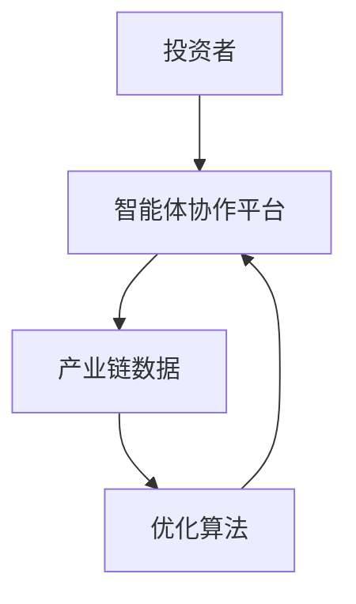
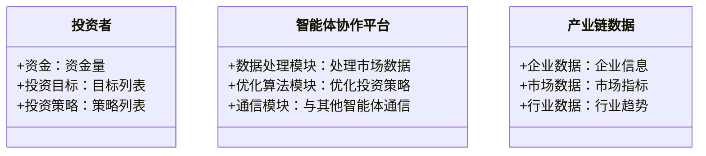
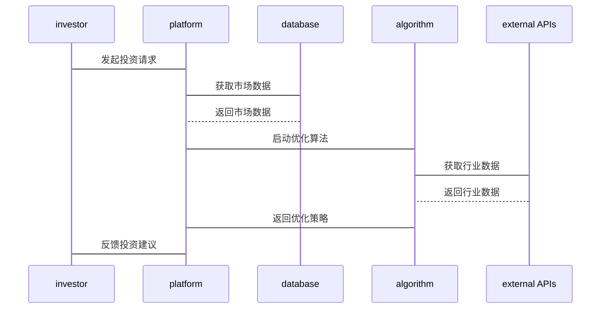

                 


# AI智能体协作：优化价值投资的全球产业链布局策略

## 关键词：AI智能体协作、价值投资、全球产业链、优化策略、分布式强化学习、博弈论模型

## 摘要：  
本文将深入探讨AI智能体协作在优化价值投资和全球产业链布局中的应用策略。通过分析AI智能体协作的核心原理、算法模型、系统架构及实际案例，本文旨在为投资机构和企业在全球化竞争中提供智能化、数据驱动的优化策略，以实现产业链的高效协同与价值最大化。

---

## 第一部分：AI智能体协作的背景与概念

### 第1章：AI智能体协作的背景与问题背景

#### 1.1 问题背景

- **1.1.1 传统投资策略的局限性**  
  传统价值投资依赖于人工分析和经验判断，难以应对全球化背景下数据量大、信息复杂度高的挑战。投资决策往往存在滞后性、主观性和片面性。

- **1.1.2 全球化产业链的复杂性**  
  全球产业链的分工与协同日益复杂，企业需要在全球范围内优化资源配置，但传统的线性思维和单一模型难以捕捉多维度的变量关系。

- **1.1.3 AI技术在投资领域的应用潜力**  
  AI技术的快速发展为投资领域带来了革命性的变化。通过AI智能体协作，可以实现多维度数据的实时分析、动态优化和智能决策。

#### 1.2 问题描述

- **1.2.1 价值投资中的信息不对称问题**  
  投资者难以获取全面、准确的企业数据，导致决策失误。

- **1.2.2 产业链布局中的协同效应不足**  
  企业间的协同合作效率低下，难以实现资源的最优配置。

- **1.2.3 现有投资模型的局限性**  
  传统投资模型难以应对复杂多变的市场环境，缺乏灵活性和适应性。

#### 1.3 问题解决

- **1.3.1 AI智能体协作的优势**  
  AI智能体可以通过分布式协作，实时处理海量数据，提供动态优化的投资策略。

- **1.3.2 全球产业链布局的优化策略**  
  通过AI智能体协作，可以实现产业链上下游的高效协同，优化资源配置。

- **1.3.3 价值投资的智能化转型**  
  AI技术的应用可以提升投资决策的科学性和准确性，实现价值投资的智能化。

#### 1.4 边界与外延

- **1.4.1 AI智能体协作的适用范围**  
  适用于全球化、数据驱动的复杂投资环境。

- **1.4.2 与其他投资策略的对比**  
  AI智能体协作相比传统策略，具有更高的灵活性和适应性。

- **1.4.3 产业链布局的边界条件**  
  需考虑市场环境、政策法规、企业战略等多方面因素。

#### 1.5 核心要素组成

- **1.5.1 数据驱动**  
  数据是AI智能体协作的基础，包括市场数据、企业数据、行业数据等。

- **1.5.2 智能体协作机制**  
  通过智能体之间的协作，实现资源优化和决策优化。

- **1.5.3 优化算法**  
  使用分布式强化学习、博弈论模型等算法优化投资策略。

---

## 第二部分：AI智能体协作的核心概念与联系

### 第2章：AI智能体协作的原理与机制

#### 2.1 核心概念原理

- **2.1.1 智能体的定义与特征**  
  智能体（Agent）是指能够感知环境、自主决策并采取行动的实体。

- **2.1.2 协作机制的类型**  
  包括分布式协作、集中式协作、混合协作等。

- **2.1.3 多智能体协作的数学模型**  
  基于博弈论的多智能体协作模型，通过纳什均衡实现最优决策。

#### 2.2 核心概念属性对比

| 概念 | 定义 | 特征 | 优缺点 |
|------|------|------|--------|
| 智能体 | 能感知环境并采取行动的实体 | 自主性、反应性、协作性 | 高效性、灵活性、依赖性强 |
| 协作机制 | 智能体之间的协作方式 | 分布式协作、集中式协作 | 分布式协作：去中心化，抗单点故障；集中式协作：高效但依赖中心节点 |

#### 2.3 ER实体关系图架构



---

## 第三部分：算法原理与数学模型

### 第3章：AI智能体协作的算法原理

#### 3.1 算法原理

- **3.1.1 分布式强化学习**  
  分布式强化学习（Distributed Reinforcement Learning）通过多个智能体协作，实现全局最优策略。每个智能体在局部环境中学习，并通过通信共享信息。

- **3.1.2 博弈论模型**  
  基于博弈论的多智能体协作模型，通过纳什均衡实现最优决策。每个智能体在博弈中选择最优策略，确保整体收益最大化。

#### 3.2 数学模型

- **分布式强化学习模型**  
  假设存在多个智能体，每个智能体的收益函数为：  
  $$ R_i = \sum_{j=1}^n a_{ij} \cdot R_j $$  
  其中，$a_{ij}$ 表示智能体 $i$ 对智能体 $j$ 的影响权重，$R_j$ 表示智能体 $j$ 的收益。

- **博弈论模型**  
  纳什均衡的定义为：对于每个智能体，其策略在给定其他智能体策略的情况下，无法通过单方面改变策略而提高自身收益。数学表达式为：  
  $$ \forall i, u_i(a_i, a_{-i}) \geq u_i(a_i', a_{-i}) $$  
  其中，$u_i$ 表示智能体 $i$ 的效用函数，$a_i$ 表示当前策略，$a_i'$ 表示改变后的策略。

#### 3.3 实际案例分析

- **案例：股票投资组合优化**  
  通过分布式强化学习，AI智能体协作可以实时分析市场数据，动态调整投资组合，实现收益最大化。

---

## 第四部分：系统分析与架构设计

### 第4章：AI智能体协作的系统架构设计

#### 4.1 问题场景介绍

- **全球化投资环境**  
  全球化背景下，投资者需要实时分析全球市场数据，优化投资组合。

- **产业链协同优化**  
  企业需要在全球产业链中实现高效协同，优化资源配置。

#### 4.2 系统功能设计

- **领域模型设计**  
  使用Mermaid类图展示领域模型，包括投资者、智能体协作平台、产业链数据等核心组件。



- **系统架构设计**  
  使用Mermaid架构图展示系统架构，包括前端、后端、数据层、算法层等。


- **系统接口设计**  
  定义智能体协作平台的接口，包括数据接口、算法接口、通信接口等。

- **系统交互设计**  
  使用Mermaid序列图展示系统交互流程，包括投资者发起请求、平台处理数据、算法优化策略、结果反馈等。



---

## 第五部分：项目实战

### 第5章：AI智能体协作的项目实战

#### 5.1 环境安装

- **安装Python环境**  
  使用Anaconda或Miniconda安装Python 3.8及以上版本。

- **安装依赖库**  
  安装numpy、pandas、scikit-learn、tensorflow等库。

#### 5.2 系统核心实现

- **代码实现：分布式强化学习模型**  
  使用Python实现简单的分布式强化学习算法，展示智能体协作的基本原理。

```python
import numpy as np
import random

class Agent:
    def __init__(self, state_size, action_size):
        self.state_size = state_size
        self.action_size = action_size
        self.model = self.build_model()

    def build_model(self):
        # 简单的线性模型
        return np.random.rand(self.state_size, self.action_size)

    def act(self, state):
        return np.argmax(self.model.dot(state))

# 初始化多个智能体
agents = [Agent(2, 2) for _ in range(3)]

# 分布式协作过程
for agent in agents:
    state = np.random.rand(2)
    action = agent.act(state)
    print(f"Agent {agent} 采取动作：{action}")
```

#### 5.3 代码应用解读

- **代码功能分析**  
  上述代码展示了简单的分布式强化学习模型，每个智能体根据状态采取动作，实现协作优化。

- **代码优化建议**  
  可以进一步优化模型结构，引入通信机制，实现更复杂的协作策略。

#### 5.4 案例分析

- **案例：优化投资组合**  
  通过AI智能体协作，优化投资组合，实现收益最大化。

---

## 第六部分：最佳实践

### 第6章：AI智能体协作的最佳实践

#### 6.1 小结

- **AI智能体协作的核心优势**  
  数据驱动、动态优化、高效协作。

#### 6.2 注意事项

- **数据质量的重要性**  
  数据是AI智能体协作的基础，数据质量直接影响决策的准确性。

- **算法的选择与优化**  
  根据具体场景选择合适的算法，并不断优化模型。

#### 6.3 拓展阅读

- **推荐书籍**  
  《分布式人工智能》、《博弈论与经济行为》。

---

## 作者：AI天才研究院/AI Genius Institute & 禅与计算机程序设计艺术/Zen And The Art of Computer Programming

