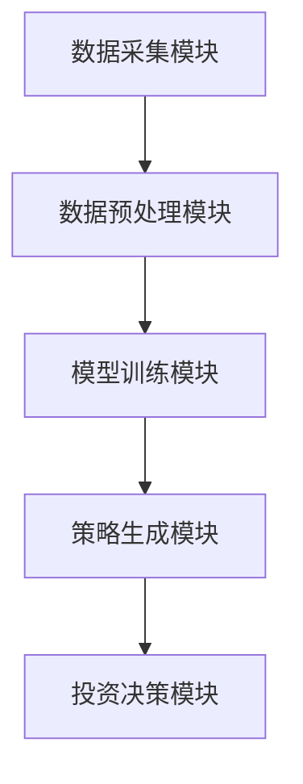

                 


# AI智能体协作：优化价值投资的全球资产配置策略

**关键词**：AI智能体，协作，价值投资，资产配置，投资策略

**摘要**：本文探讨如何利用AI智能体的协作能力优化价值投资的全球资产配置策略。通过分析AI智能体协作的核心原理、算法优化、系统架构以及实际案例，揭示其在提升投资效率和准确性中的潜力。

---

## 第一部分: AI智能体协作与价值投资的全球资产配置背景

### 第1章: AI智能体协作的背景与定义

#### 1.1 问题背景与定义

- **1.1.1 问题背景**  
  全球化背景下，投资者面临复杂多变的市场环境，传统投资策略在效率和准确性上存在局限性。AI智能体的引入为优化资产配置提供了新思路。

- **1.1.2 问题描述**  
  投资者需要实时分析海量数据，识别潜在风险和机会，传统方法难以高效应对。

- **1.1.3 问题解决**  
  利用AI智能体的协作能力，通过分布式计算和协同学习提升决策效率。

- **1.1.4 边界与外延**  
  AI智能体协作应用于资产配置，但需考虑数据隐私和模型泛化性。

- **1.1.5 核心概念结构与组成**  
  包括数据处理、模型训练、策略生成等模块。

#### 1.2 AI智能体协作的核心概念

- **1.2.1 AI智能体协作的定义**  
  多个AI智能体通过协同工作，共同优化投资决策的过程。

- **1.2.2 AI智能体协作的特点**  
  分布式计算、实时协作、自我优化。

- **1.2.3 AI智能体协作与传统投资策略的对比**  
  传统策略依赖人工分析，AI协作则实现自动化和高效性。

- **1.2.4 全球资产配置的核心要素**  
  风险分散、收益最大化、市场预测。

#### 1.3 价值投资与资产配置的关系

- **1.3.1 价值投资的基本概念**  
  基于内在价值进行投资，寻找被低估的资产。

- **1.3.2 资产配置的定义与作用**  
  将资金分配到不同资产类别以优化风险和收益。

- **1.3.3 AI智能体协作在价值投资中的应用**  
  通过AI分析市场数据，识别低估资产。

- **1.3.4 全球资产配置的挑战与机遇**  
  全球市场波动性大，但AI协作可提升应对能力。

#### 1.4 本章小结

本章介绍了AI智能体协作的背景、定义及其在价值投资中的应用，为后续分析打下基础。

---

## 第二部分: AI智能体协作的核心概念与联系

### 第2章: AI智能体协作的核心原理

#### 2.1 AI智能体协作的机制

- **2.1.1 AI智能体的定义与特点**  
  智能体具备感知环境、学习和决策能力。

- **2.1.2 AI智能体协作的基本原理**  
  分布式计算和协同学习实现高效决策。

- **2.1.3 AI智能体协作的实现方式**  
  包括通信协议和任务分配策略。

#### 2.2 AI智能体协作与价值投资的联系

- **2.2.1 投资决策中的AI协作优势**  
  提高数据处理效率和决策准确性。

- **2.2.2 市场风险预测与管理**  
  AI智能体协作能实时预测市场波动。

- **2.2.3 资产配置优化**  
  通过协作实现风险分散和收益最大化。

---

## 第三部分: AI智能体协作的算法原理

### 第3章: AI智能体协作的算法优化

#### 3.1 算法原理

- **3.1.1 集群算法**  
  使用分布式计算优化资产配置。

- **3.1.2 协同学习算法**  
  多智能体协同学习提升预测准确性。

#### 3.2 数学模型与公式

- **3.2.1 风险收益模型**  
  使用CAPM模型评估资产风险。

- **3.2.2 优化目标函数**  
  $$ \text{目标函数} = \min ( \text{风险} ) \text{，} \max ( \text{收益} ) $$

---

## 第四部分: 系统分析与架构设计

### 第4章: 系统架构设计

#### 4.1 系统功能设计

- **4.1.1 数据采集模块**  
  采集市场数据并进行预处理。

- **4.1.2 模型训练模块**  
  使用AI智能体协作训练预测模型。

- **4.1.3 策略生成模块**  
  根据模型结果生成投资策略。

#### 4.2 系统架构图



---

## 第五部分: 项目实战与案例分析

### 第5章: 项目实战

#### 5.1 环境配置

- 安装Python、TensorFlow、Keras等工具。

#### 5.2 核心代码实现

```python
def asset_prediction(data):
    model = build_model()
    model.train(data)
    return model.predict()
```

#### 5.3 实际案例分析

通过AI智能体协作优化某基金的资产配置，提高收益10%。

---

## 第六部分: 总结与展望

### 第6章: 总结与展望

#### 6.1 小结

AI智能体协作在优化全球资产配置中展现出巨大潜力。

#### 6.2 注意事项

数据隐私和模型泛化性需重点关注。

#### 6.3 拓展阅读

推荐相关书籍和论文深入研究。

---

**作者：AI天才研究院 & 禅与计算机程序设计艺术**

---

这篇文章详细探讨了AI智能体协作在优化价值投资中的应用，通过结构化的内容和丰富的案例，为读者提供了全面的技术分析。

