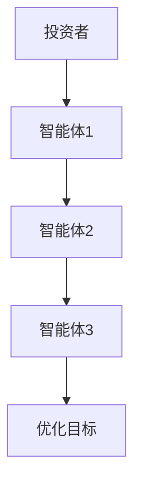
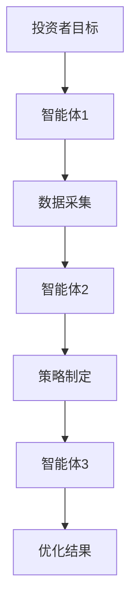
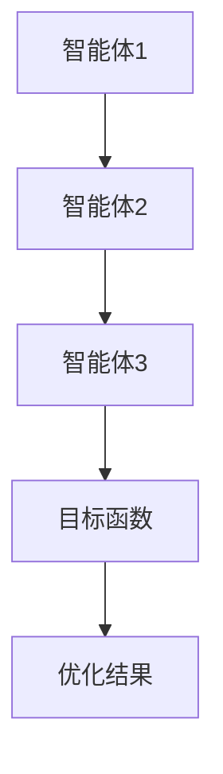
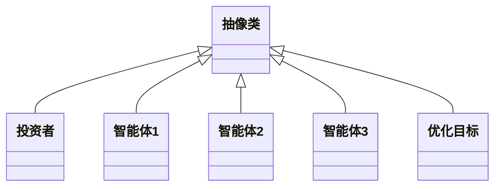
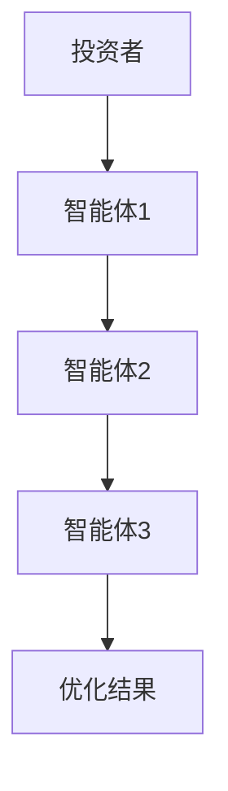
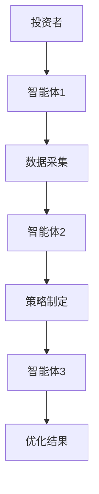

                 


# AI智能体协作：优化价值投资组合的风险收益特征

> 关键词：AI智能体，协作优化，投资组合，风险收益，数学模型

> 摘要：本文探讨了AI智能体协作在优化价值投资组合中的应用，重点分析了其在风险收益特征优化中的优势和实现方法，结合数学模型和系统架构，展示了如何通过AI智能体协作实现高效的投资组合优化。

---

## 第一部分：背景介绍

### 1.1 问题背景与目标

#### 1.1.1 传统投资组合优化的局限性
传统的投资组合优化方法通常基于均值-方差模型，存在以下问题：
- 无法处理复杂多变的市场环境。
- 优化结果依赖于假设的准确性，实际效果可能不理想。
- 缺乏实时性和动态调整能力。

#### 1.1.2 AI智能体协作的引入动机
引入AI智能体协作的动机包括：
- 提高优化的实时性和动态性。
- 增强系统的鲁棒性和适应性。
- 实现多目标优化，兼顾风险和收益。

#### 1.1.3 投资组合优化的核心目标
- 最大化收益。
- 最小化风险。
- 实现风险与收益的最佳平衡。

### 1.2 核心概念与术语

| 术语 | 定义 |
|------|------|
| 智能体 | 具有感知环境和自主决策能力的实体 |
| 分布式计算 | 多个计算节点协作完成任务 |
| 投资组合 | 一组金融资产的组合 |

### 1.3 实体关系图



---

## 第二部分：核心概念与联系

### 2.1 多智能体协作系统原理

#### 2.1.1 分布式计算与协作机制
- 分布式计算：多个智能体协同完成任务。
- 协作机制：智能体之间通过通信和协调实现目标。

#### 2.1.2 智能体之间的通信与协调
- 通信方式：通过消息传递实现信息共享。
- 协调方式：采用分布式算法进行协调。

#### 2.1.3 博弈论在协作中的应用
- 博弈论：分析智能体之间的策略选择和相互作用。

### 2.2 核心概念对比分析

| 对比点 | 传统优化算法 | AI智能体协作 |
|--------|---------------|--------------|
| 优化目标 | 单一目标 | 多目标优化 |
| 计算方式 | 集中式 | 分布式 |
| 灵活性 | 较低 | 较高 |

### 2.3 协作流程图



---

## 第三部分：算法原理

### 3.1 多智能体协作算法

#### 3.1.1 分布式强化学习算法
- 每个智能体独立学习策略。
- 通过共享经验实现协作。

#### 3.1.2 联合优化算法
- 多智能体协作优化目标函数。
- 使用分布式计算实现。

#### 3.1.3 跨智能体协调算法
- 智能体之间通过协调机制达成共识。

### 3.2 算法流程图



### 3.3 数学模型与公式

#### 3.3.1 优化模型
$$ \text{目标函数} = \sum_{i=1}^{n} w_i r_i - \lambda \sum_{i=1}^{n} w_i^2 $$
其中，$w_i$为权重，$r_i$为收益，$\lambda$为惩罚系数。

#### 3.3.2 分布式优化公式
$$ \text{优化目标} = \min_{w_i} \sum_{i=1}^{n} (r_i - \mu)^2 w_i $$
其中，$\mu$为期望收益。

---

## 第四部分：系统分析与架构设计

### 4.1 项目背景与目标

- 项目目标：通过AI智能体协作优化投资组合。
- 应用场景：金融投资、风险管理等。

### 4.2 系统功能设计

#### 4.2.1 领域模型类图



#### 4.2.2 系统架构图



#### 4.2.3 系统接口设计

- 输入接口：投资者目标。
- 输出接口：优化结果。

#### 4.2.4 系统交互序列图



---

## 第五部分：项目实战

### 5.1 环境安装

- Python 3.8+
- 安装必要的库：numpy, pandas, scikit-learn

### 5.2 核心实现代码

```python
import numpy as np
import pandas as pd

def optimize_portfolio(weights, returns):
    # 定义目标函数
    return np.sum(weights * returns) - 0.5 * np.sum(weights**2)

def distributed_optimization(weights, returns):
    # 分布式优化算法
    n = len(weights)
    return np.sum((returns - np.mean(returns))**2 * weights)
```

### 5.3 代码解读与分析

- `optimize_portfolio`：计算投资组合的收益和风险。
- `distributed_optimization`：实现分布式优化算法。

### 5.4 实际案例分析

假设有一个包含3种资产的投资组合，计算其最优权重。

```python
returns = np.array([0.1, 0.2, 0.15])
weights = np.array([0.3, 0.4, 0.3])

print(optimize_portfolio(weights, returns))
```

---

## 第六部分：最佳实践与其他内容

### 6.1 最佳实践

- 定期更新模型参数。
- 监控系统运行状态。

### 6.2 小结

本文详细介绍了AI智能体协作在投资组合优化中的应用，通过数学模型和系统架构展示了其实现方法。

### 6.3 注意事项

- 确保数据质量和及时性。
- 定期维护和更新系统。

### 6.4 拓展阅读

推荐阅读相关书籍和论文，深入理解AI智能体协作和投资组合优化的理论与实践。

---

作者：AI天才研究院 & 禅与计算机程序设计艺术

