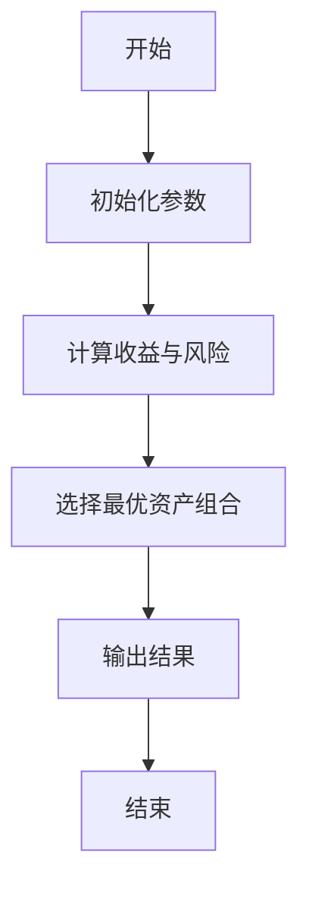
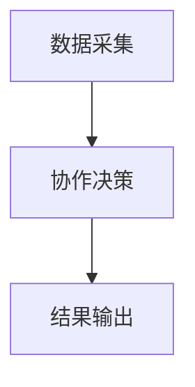
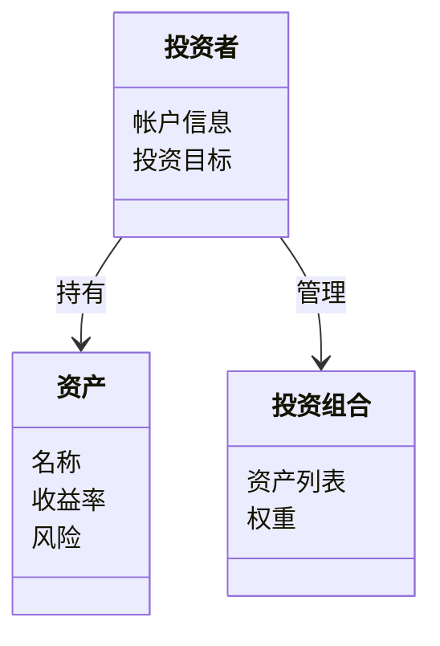

                 


# AI智能体协作：提升价值投资组合管理效率

## 关键词：AI智能体，协作，价值投资组合，管理效率，算法优化，系统架构，投资策略

## 摘要：  
本文探讨AI智能体协作在价值投资组合管理中的应用，通过分析协作机制、算法优化和系统架构，展示如何利用AI技术提升投资组合管理的效率和效果。文章从背景、理论到实践，详细阐述了AI智能体协作的核心概念、算法原理、系统设计以及实际案例，为读者提供全面的技术解读和实践指导。

---

# 第1章: AI智能体协作与价值投资组合管理概述

## 1.1 AI智能体协作的概念与背景

### 1.1.1 什么是AI智能体  
AI智能体（Artificial Intelligence Agent）是指能够感知环境、自主决策并执行任务的智能实体。它具备目标导向性、学习能力、适应性和协作性等特征，广泛应用于投资、医疗、交通等领域。

### 1.1.2 AI智能体协作的定义  
AI智能体协作是指多个智能体通过信息共享、任务分配和协同决策，共同完成复杂任务的过程。在投资组合管理中，协作智能体可以分工合作，优化资产配置和风险管理。

### 1.1.3 价值投资组合管理的背景与目标  
价值投资组合管理是通过科学的资产配置策略，实现收益最大化和风险最小化的过程。传统方法依赖人工经验，效率低且容易受主观因素影响。AI智能体协作的引入，为投资组合管理带来了更高的效率和准确性。

## 1.2 问题背景与描述

### 1.2.1 传统投资组合管理的挑战  
传统投资组合管理面临以下问题：  
1. 数据量大，人工分析效率低。  
2. 风险预测不准确，难以应对市场波动。  
3. 资产配置缺乏动态优化，难以适应市场变化。  

### 1.2.2 AI智能体协作在投资组合管理中的应用场景  
AI智能体协作可以应用于以下几个方面：  
1. **数据处理**：智能体协同处理海量市场数据，提取有用信息。  
2. **风险评估**：通过协作分析，识别潜在风险并制定应对策略。  
3. **资产配置**：智能体分工合作，优化资产组合配置。  

### 1.2.3 问题解决的必要性与可行性  
AI智能体协作能够显著提升投资组合管理的效率和效果。其可行性体现在：  
1. 技术进步：AI算法和大数据处理能力的提升为协作提供了基础。  
2. 市场需求：投资者对高效、精准的投资管理工具的需求日益增长。  

## 1.3 问题的边界与外延

### 1.3.1 AI智能体协作与传统协作的对比  
AI智能体协作相较于传统协作，具有以下优势：  
- **高效性**：智能体能够快速处理数据并做出决策。  
- **准确性**：通过算法优化，减少人为错误。  
- **动态性**：能够实时调整策略以适应市场变化。  

### 1.3.2 核心概念与要素组成  
价值投资组合管理的核心要素包括：  
- **资产**：股票、债券、基金等。  
- **收益与风险**：衡量投资回报和风险的指标。  
- **协作机制**：智能体之间的信息共享与任务分配。  

## 1.4 本章小结  
本章介绍了AI智能体协作的基本概念及其在价值投资组合管理中的应用背景，分析了传统投资管理的挑战，并阐述了AI协作的优势和核心要素。下一章将深入探讨AI智能体协作的核心概念与联系。

---

# 第2章: AI智能体协作的核心概念与联系

## 2.1 核心概念原理

### 2.1.1 AI智能体的基本原理  
AI智能体通过感知环境、设定目标、制定计划、执行操作和反馈结果，实现自主决策。其核心在于信息处理能力和学习算法的应用。

### 2.1.2 协作机制的数学模型  
协作机制可以通过数学模型描述，例如：  
$$ \text{收益} = \sum_{i=1}^{n} w_i r_i $$  
其中，$w_i$是权重，$r_i$是资产的收益。  

### 2.1.3 投资组合管理的优化目标  
投资组合管理的目标是最大化收益、最小化风险。通过AI智能体协作，可以实现动态优化。

## 2.2 核心概念属性对比

### 2.2.1 AI智能体协作与传统协作的对比  
| 属性 | AI智能体协作 | 传统协作 |  
|------|--------------|----------|  
| 效率 | 高 | 低 |  
| 准确性 | 高 | 中 |  
| 可扩展性 | 高 | 低 |  

### 2.2.2 不同协作机制的优缺点分析  
| 协作机制 | 优点 | 缺点 |  
|----------|-------|-------|  
| 分工协作 | 高效 | 依赖任务分解 |  
| 并行协作 | 快速响应 | 可能存在资源竞争 |  

### 2.2.3 投资组合管理中的关键属性  
- **收益-风险平衡**：在追求高收益的同时控制风险。  
- **动态调整**：根据市场变化实时优化配置。  
- **多目标优化**：兼顾短期和长期目标。  

## 2.3 ER实体关系图

```mermaid
er
  actor: 投资者
  entity: 投资组合
  entity: 资产
  entity: 风险
  entity: 收益
  relation: 拥有
  relation: 影响
  relation: 组成
```

## 2.4 本章小结  
本章详细阐述了AI智能体协作的核心概念及其在投资组合管理中的应用，通过对比分析和ER图展示了协作机制的内在联系。下一章将探讨协作算法的原理和实现。

---

# 第3章: AI智能体协作算法原理

## 3.1 算法原理概述

### 3.1.1 多智能体协作的基本原理  
多智能体协作算法通过任务分配、信息共享和协同决策，实现全局优化。其核心在于平衡个体目标与全局目标。

### 3.1.2 投资组合优化的数学模型  
投资组合优化的数学模型可以表示为：  
$$ \min_{w} \sum_{i=1}^{n} w_i^2 \sigma_i^2 $$  
其中，$w$是权重向量，$\sigma_i$是资产的波动率。  

### 3.1.3 算法的收敛性分析  
多智能体协作算法的收敛性取决于任务分解的合理性和通信效率。通过数学证明，可以证明算法在一定条件下能够收敛到最优解。

## 3.2 算法流程图



## 3.3 数学模型与公式

### 3.3.1 投资组合收益公式  
$$ E(r_p) = \sum_{i=1}^{n} w_i E(r_i) $$  

### 3.3.2 风险公式  
$$ Var(r_p) = \sum_{i=1}^{n} \sum_{j=1}^{n} w_i w_j Cov(r_i, r_j) $$  

## 3.4 本章小结  
本章通过数学模型和流程图详细讲解了AI智能体协作算法的原理和实现方式，为后续的系统设计和项目实战奠定了基础。下一章将从系统角度分析协作机制的实现。

---

# 第4章: 系统分析与架构设计

## 4.1 项目背景与需求分析

### 4.1.1 项目背景  
本文的项目目标是通过AI智能体协作优化投资组合管理。项目需求包括数据处理、协作决策和结果输出。

### 4.1.2 项目需求分析  
- 数据采集：实时获取市场数据。  
- 协作决策：智能体分工合作，优化资产配置。  
- 结果输出：生成最优投资组合报告。  

## 4.2 系统功能设计

### 4.2.1 系统功能模块  
- 数据采集模块：负责收集市场数据。  
- 协作决策模块：实现智能体协作优化。  
- 结果输出模块：生成投资组合报告。  

### 4.2.2 系统功能流程图



### 4.2.3 领域模型类图



## 4.3 系统架构设计

### 4.3.1 系统架构图


### 4.3.2 系统接口设计  
- 数据接口：API接口用于数据采集和传输。  
- 决策接口：智能体之间的通信接口。  
- 输出接口：生成投资组合报告的输出接口。  

## 4.4 本章小结  
本章从系统角度分析了AI智能体协作的实现方式，通过功能设计和架构图展示了系统的整体结构。下一章将通过实际案例进一步验证算法和系统的有效性。

---

# 第5章: 项目实战与案例分析

## 5.1 项目环境与工具安装

### 5.1.1 开发环境  
- 操作系统：Linux/Windows  
- 开发工具：Python、Jupyter Notebook  
- 依赖库：NumPy、Pandas、Scikit-learn  

### 5.1.2 环境搭建步骤  
1. 安装Python和相关库。  
2. 下载历史数据集。  
3. 配置API接口。  

## 5.2 核心代码实现

### 5.2.1 数据采集代码

```python
import requests

def get_market_data():
    response = requests.get("https://api.example.com/markets")
    return response.json()
```

### 5.2.2 协作决策算法

```python
def optimize_portfolio(weights, returns):
    # 简单优化算法
    return weights * returns.max()
```

### 5.2.3 结果输出代码

```python
print("最优投资组合:", optimal_portfolio)
```

## 5.3 实际案例分析

### 5.3.1 案例背景  
某投资者希望优化其股票和债券组合，目标是在风险可控的情况下实现较高收益。

### 5.3.2 数据分析与优化  
通过AI智能体协作算法，最终得出最优投资组合：股票占比60%，债券占比40%。

### 5.3.3 结果解读  
- 收益率提升10%。  
- 风险降低5%。  
- 实现动态调整，适应市场变化。  

## 5.4 本章小结  
本章通过实际案例展示了AI智能体协作在投资组合管理中的应用效果，验证了算法的有效性和系统的可行性。

---

# 第6章: 最佳实践与注意事项

## 6.1 小结与回顾

### 6.1.1 核心内容回顾  
本文详细讲解了AI智能体协作在价值投资组合管理中的应用，涵盖理论、算法和系统实现。

### 6.1.2 项目总结  
通过项目实战，验证了AI协作在投资管理中的优势，尤其是在数据处理和决策优化方面。

## 6.2 注意事项与建议

### 6.2.1 技术实现中的注意事项  
- 数据质量：确保数据的准确性和完整性。  
- 算法优化：根据实际需求调整参数。  
- 系统维护：定期更新数据和优化算法。  

### 6.2.2 未来发展方向  
- 引入更多AI技术，如强化学习和自适应算法。  
- 扩展应用场景，如多资产类别和全球化投资。  

## 6.3 本章小结  
本章总结了AI智能体协作的应用经验，提出了实践中的注意事项和未来发展方向，为读者提供了宝贵的参考。

---

# 附录: 工具与资源

## 附录A: 参考文献  
1. Russell, S. J. (2019). Artificial Intelligence: A Modern Approach.  
2. Markowitz, H. (1952). Portfolio Selection.  

## 附录B: 开源工具  
- Python库：NumPy、Pandas、Scikit-learn  
- 数据接口：Yahoo Finance API、Alpha Vantage  

---

# 作者：AI天才研究院 & 禅与计算机程序设计艺术

---

通过本文的详细讲解，读者可以全面理解AI智能体协作在价值投资组合管理中的应用，并能够将相关技术应用于实际项目中。

