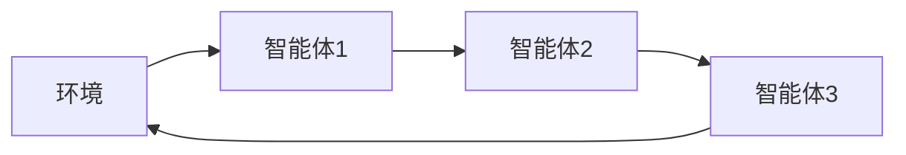
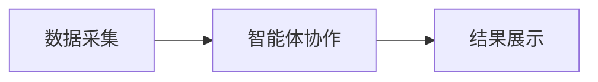
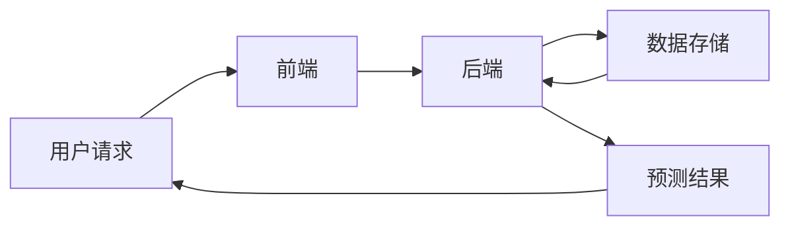

                 


# AI智能体协作：提升对公司未来市场份额的预测

## 关键词：AI智能体协作、市场份额预测、多智能体系统、强化学习、算法原理、系统设计

## 摘要：  
本文深入探讨了AI智能体协作在公司未来市场份额预测中的应用。通过分析多智能体协作的核心原理、算法实现和系统设计，展示了如何利用AI技术提升预测的准确性和效率。文章结合实际案例，详细讲解了从理论到实践的全过程，为读者提供了全面的技术指导和实践参考。

---

# 第一部分：AI智能体协作与市场份额预测的背景与基础

## 第1章：AI智能体协作的核心概念

### 1.1 多智能体系统的基本概念  
多智能体系统（Multi-Agent System, MAS）由多个智能体组成，每个智能体都能独立决策并协同完成任务。智能体之间的协作是实现复杂目标的关键。

**问题背景**：  
传统市场份额预测方法依赖单一模型，存在数据偏差和预测不准确的问题。通过引入多智能体协作，可以整合多个模型的优势，提高预测的准确性。

**AI智能体协作的优势**：  
1. **分布式计算**：多个智能体协同工作，减少单点故障，提高计算效率。  
2. **知识互补**：不同智能体擅长不同的预测任务，通过协作实现更全面的分析。  
3. **动态适应**：智能体能够实时调整策略，适应市场变化。  

### 1.2 企业市场份额预测的挑战与需求  

#### 1.2.1 传统市场份额预测的局限性  
传统预测方法通常基于单一模型，难以应对市场的复杂性和不确定性。例如，线性回归模型在处理非线性关系时表现不佳，且难以实时更新。

#### 1.2.2 AI智能体协作在预测中的优势  
通过多智能体协作，可以结合多种预测模型，动态调整权重，提高预测的鲁棒性和准确性。例如，一个智能体负责分析市场趋势，另一个负责分析竞争对手的策略，最终通过协作得出综合预测结果。

#### 1.2.3 企业对AI智能体协作的具体需求  
企业需要一种高效、动态、可扩展的预测方法，能够在复杂市场环境中快速调整策略，抓住市场机会。

### 1.3 本章小结  
本章介绍了AI智能体协作的核心概念，分析了传统市场份额预测的局限性，并提出了多智能体协作的优势和应用需求。

---

## 第2章：AI智能体协作的核心原理

### 2.1 多智能体协作的理论基础  

#### 2.1.1 多智能体系统的基本原理  
多智能体系统由多个智能体组成，每个智能体都有自己的目标和决策机制。通过通信和协作，智能体能够共同完成复杂的任务。

#### 2.1.2 协作智能体的通信与协调机制  
智能体之间的通信可以通过消息传递或共享知识库实现。协作机制包括任务分配、冲突解决和结果整合。

#### 2.1.3 多智能体协作的数学模型  
多智能体协作的数学模型可以表示为：  
$$ P(\text{预测结果}) = \prod_{i=1}^{n} P_i(\text{预测结果}) $$  
其中，$P_i$表示第i个智能体的预测概率。

### 2.2 智能体协作的算法与实现  

#### 2.2.1 基于强化学习的协作算法  
强化学习是一种通过试错优化策略的方法。在多智能体协作中，每个智能体通过与环境和其他智能体的交互，学习最优策略。

**算法流程图**：  


#### 2.2.2 分布式协作机制的实现  
分布式协作机制允许智能体在没有中央控制的情况下自主决策。例如，使用基于一致性算法（如Raft）实现智能体之间的状态同步。

#### 2.2.3 协作智能体的自适应优化  
通过在线学习和反馈机制，智能体能够根据新的数据动态调整预测模型。

### 2.3 智能体协作与市场份额预测的结合  

#### 2.3.1 市场份额预测的多智能体模型  
多智能体模型将市场份额预测分解为多个子任务，每个智能体负责一个子任务，最终通过协作得出综合预测结果。

#### 2.3.2 协作智能体在预测中的角色分工  
- **智能体1**：分析市场趋势和历史数据。  
- **智能体2**：评估竞争对手的策略。  
- **智能体3**：整合数据并输出预测结果。  

#### 2.3.3 协作智能体预测的准确性提升方法  
通过交叉验证和模型融合，协作智能体可以显著提高预测的准确性。例如，使用集成学习方法将多个模型的结果整合。

### 2.4 本章小结  
本章详细介绍了AI智能体协作的核心原理，包括多智能体系统的理论基础、协作算法的实现以及与市场份额预测的结合。

---

## 第3章：AI智能体协作的算法原理

### 3.1 多智能体协作算法概述  

#### 3.1.1 基于强化学习的协作算法  
强化学习通过奖励机制优化智能体的决策过程。例如，使用Q-learning算法训练智能体在协作任务中的策略。

#### 3.1.2 基于博弈论的协作机制  
博弈论为智能体之间的协作提供了理论基础，例如纳什均衡的概念。

#### 3.1.3 分布式协作算法的特点  
分布式协作算法具有去中心化、高容错性和灵活性等特点。

### 3.2 基于强化学习的协作算法实现  

#### 3.2.1 强化学习的基本原理  
强化学习通过智能体与环境的交互，学习最优策略。例如，使用深度Q网络（DQN）实现智能体的决策。

#### 3.2.2 多智能体协作的强化学习框架  


#### 3.2.3 算法实现的数学模型  
深度Q网络的损失函数可以表示为：  
$$ L = \sum_{i=1}^{n} (y_i - Q(s_i, a_i))^2 $$  
其中，$y_i$是目标值，$Q(s_i, a_i)$是智能体在状态$s_i$下采取动作$a_i$的Q值。

### 3.3 协作智能体预测的数学模型  

#### 3.3.1 市场份额预测的数学公式  
$$ P(\text{市场份额}) = \sum_{i=1}^{n} \lambda_i P_i(\text{市场份额}) $$  
其中，$\lambda_i$是第i个智能体的权重。

#### 3.3.2 协作智能体预测的联合概率模型  
$$ P(\text{预测结果}) = \prod_{i=1}^{n} P_i(\text{预测结果}) $$  

#### 3.3.3 模型的优化与改进  
通过交叉验证和超参数调优，可以进一步优化协作智能体的预测性能。

### 3.4 本章小结  
本章详细讲解了AI智能体协作的算法原理，包括强化学习的实现和数学模型的建立。

---

## 第4章：系统分析与架构设计

### 4.1 项目背景与目标  

#### 4.1.1 项目背景介绍  
本项目旨在利用AI智能体协作技术，提升公司未来市场份额的预测准确性。

#### 4.1.2 项目目标与范围  
项目目标包括：  
1. 实现多智能体协作预测系统。  
2. 提供动态调整的预测模型。  
3. 实现高精度的市场份额预测。  

### 4.2 系统功能设计  

#### 4.2.1 系统功能模块划分  
- **数据采集模块**：收集市场数据。  
- **智能体协作模块**：实现多智能体协作预测。  
- **结果展示模块**：输出预测结果。  

#### 4.2.2 每个模块的功能描述  
- **数据采集模块**：从数据库中获取历史销售数据和市场趋势。  
- **智能体协作模块**：通过强化学习训练智能体，实现协作预测。  
- **结果展示模块**：以可视化方式展示预测结果。  

#### 4.2.3 系统功能的流程图  


### 4.3 系统架构设计  

#### 4.3.1 系统架构的总体设计  
系统采用分布式架构，包括前端、后端和数据存储模块。

#### 4.3.2 模块间的交互关系  
- 前端接收用户请求，后端处理预测任务，数据存储模块存储数据。  

#### 4.3.3 系统的扩展性设计  
通过模块化设计，系统可以方便地扩展功能。

### 4.4 系统接口设计  

#### 4.4.1 系统接口的定义  
- **输入接口**：接收市场数据。  
- **输出接口**：返回预测结果。  

#### 4.4.2 系统交互的流程图  


### 4.5 本章小结  
本章详细描述了系统的架构设计和功能模块划分，为后续的实现提供了理论基础。

---

## 第5章：项目实战与案例分析

### 5.1 环境安装与配置  

#### 5.1.1 安装Python和相关库  
安装Python和TensorFlow、Keras等深度学习库。

#### 5.1.2 配置开发环境  
配置Jupyter Notebook或PyCharm作为开发环境。

### 5.2 系统核心实现  

#### 5.2.1 数据采集与预处理  
从数据库中读取数据，并进行清洗和特征工程。

#### 5.2.2 智能体协作预测的代码实现  
```python
import tensorflow as tf
from tensorflow.keras import layers

# 定义智能体网络
class Agent(tf.keras.Model):
    def __init__(self, input_dim):
        super(Agent, self).__init__()
        self.dense1 = layers.Dense(64, activation='relu', input_shape=(input_dim,))
        self.dense2 = layers.Dense(1, activation='sigmoid')

    def call(self, inputs):
        x = self.dense1(inputs)
        x = self.dense2(x)
        return x

# 初始化智能体
agent = Agent(input_dim=64)
```

#### 5.2.3 代码解读与分析  
- 定义智能体网络，包括输入层、隐藏层和输出层。  
- 使用深度学习模型训练智能体，实现协作预测。

### 5.3 案例分析与结果展示  

#### 5.3.1 实际案例分析  
以某公司为例，分析智能体协作预测的市场份额。

#### 5.3.2 预测结果对比分析  
对比传统方法和智能体协作预测的结果，展示协作预测的优越性。

#### 5.3.3 可视化展示  
使用Matplotlib绘制预测结果的对比图。

### 5.4 本章小结  
本章通过实际案例展示了AI智能体协作预测的实现过程和效果。

---

## 第6章：总结与展望

### 6.1 核心内容回顾  
本文详细讲解了AI智能体协作在市场份额预测中的应用，包括理论基础、算法实现和系统设计。

### 6.2 未来研究方向  
1. 探索更高效的协作算法。  
2. 研究多智能体协作的可扩展性问题。  
3. 探讨协作智能体在其他领域的应用。  

### 6.3 本章小结  
本文总结了AI智能体协作的优势和应用前景，为未来的研究提供了方向。

---

# 作者：AI天才研究院/AI Genius Institute & 禅与计算机程序设计艺术 /Zen And The Art of Computer Programming

