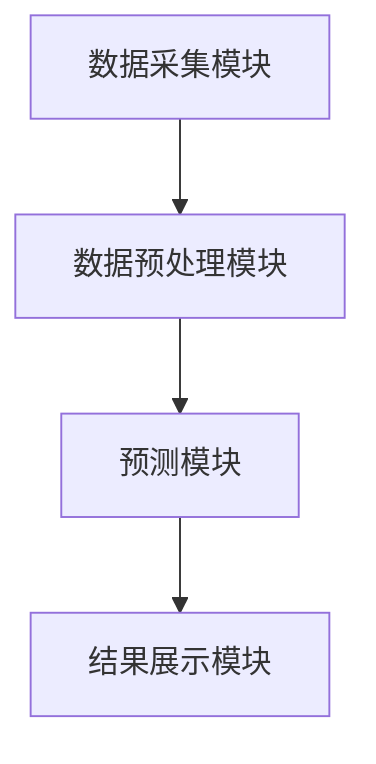
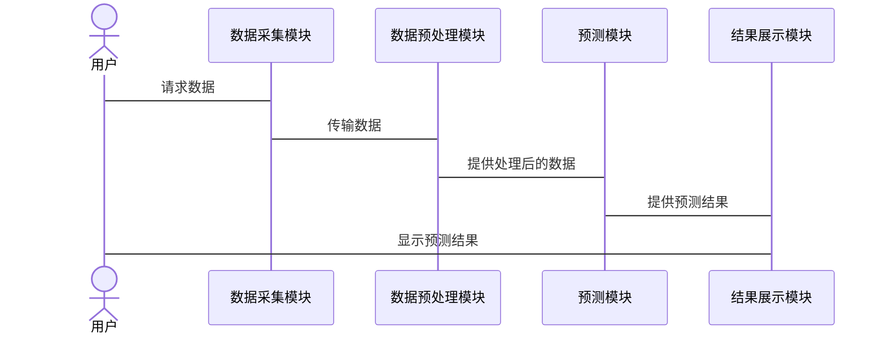

                 


# AI智能体协作：提升对公司未来现金流稳定性的预测

> 关键词：AI智能体协作，现金流预测，多智能体系统，时间序列分析，机器学习模型，深度学习模型

> 摘要：本文深入探讨了AI智能体协作在提升公司未来现金流预测稳定性中的应用。通过分析多智能体协作系统的核心概念、数学模型与算法，结合实际项目案例，展示了如何利用AI技术优化现金流预测，为企业稳健发展提供支持。

---

# 第一部分: AI智能体协作与现金流预测概述

## 第1章: 现金流预测的背景与挑战

### 1.1 现金流预测的重要性

#### 1.1.1 现金流预测在企业财务管理中的地位
现金流是企业的生命线，准确预测现金流可以帮助企业优化资金分配、降低财务风险，并确保企业的稳健运营。现金流预测不仅是财务规划的基础，也是企业战略决策的重要依据。

#### 1.1.2 传统现金流预测方法的局限性
传统现金流预测方法通常依赖于历史数据和简单的统计模型，存在以下问题：
- 数据维度有限，难以捕捉复杂市场环境中的多因素影响。
- 预测结果的准确性和稳定性较差，特别是在市场波动较大的情况下。
- 缺乏实时更新和自适应能力，难以应对快速变化的市场条件。

#### 1.1.3 现金流预测对企业稳健发展的意义
现金流预测的准确性直接影响企业的财务健康和市场竞争力。通过引入AI智能体协作技术，可以显著提升预测的精度和稳定性，为企业提供更可靠的财务决策支持。

### 1.2 AI智能体协作的概念

#### 1.2.1 多智能体协作的基本定义
多智能体协作是指多个智能体（Agent）通过协同工作，共同完成特定任务或目标。每个智能体都有自己的目标、知识和能力，并通过通信和协调机制实现协作。

#### 1.2.2 AI智能体协作的核心特征
- 分布式：多个智能体独立运行，协同完成任务。
- 协作性：智能体之间通过通信和协调机制实现协作。
- 自适应性：能够根据环境变化动态调整协作策略。

#### 1.2.3 智能体协作与现金流预测的结合
通过多智能体协作，可以将现金流预测任务分解为多个子任务，由不同的智能体分别负责，从而提高预测的准确性和稳定性。

### 1.3 本章小结

#### 1.3.1 现金流预测的关键作用
现金流预测是企业财务管理的核心环节，直接影响企业的资金流动和战略决策。

#### 1.3.2 AI智能体协作的优势
AI智能体协作技术能够显著提高现金流预测的准确性和稳定性，为企业提供更可靠的财务支持。

---

# 第二部分: AI智能体协作的核心概念与原理

## 第2章: 多智能体协作系统的核心概念

### 2.1 多智能体系统的定义与特点

#### 2.1.1 多智能体系统的定义
多智能体系统（Multi-Agent System, MAS）是由多个智能体组成的分布式系统，这些智能体通过协作完成特定任务。

#### 2.1.2 多智能体系统的特征
- 分布式：智能体独立运行，共享目标。
- 协作性：智能体之间通过通信和协调完成任务。
- 智能性：每个智能体具备问题解决和自适应能力。

#### 2.1.3 多智能体系统与单智能体系统的区别
| 特性 | 单智能体系统 | 多智能体系统 |
|------|-------------|-------------|
| 结构  | 单一中心    | 分布式      |
| 智能性 | 有限        | 高          |
| 协作性 | 无          | 有          |

### 2.2 智能体协作机制

#### 2.2.1 协作目标的设定
智能体协作的目标是通过分解任务，将整体预测任务分配给多个智能体完成。

#### 2.2.2 协作过程中的通信与协调
智能体之间需要通过通信协议进行信息交换和协调，确保协作过程顺利进行。

#### 2.2.3 协作结果的评估与反馈
通过评估协作结果，智能体可以调整协作策略，提高预测的准确性。

### 2.3 智能体协作中的通信协议

#### 2.3.1 通信协议的定义
通信协议是智能体之间进行信息交换的规则和格式。

#### 2.3.2 常见的通信协议类型
- 基于消息队列的通信：如Kafka、RabbitMQ。
- 基于RPC的通信：如gRPC、Thrift。

#### 2.3.3 通信协议在现金流预测中的应用
智能体之间需要实时交换市场数据、预测结果等信息，通信协议的选择直接影响协作效率。

### 2.4 本章小结

#### 2.4.1 多智能体协作的核心要素
- 分布式结构
- 协作机制
- 通信协议

#### 2.4.2 智能体协作在现金流预测中的潜在价值
通过多智能体协作，可以提高预测的准确性和稳定性，为企业提供更可靠的现金流预测结果。

---

## 第3章: 多智能体协作算法

### 3.1 联邦学习（Federated Learning）

#### 3.1.1 联邦学习的基本原理
联邦学习是一种分布式机器学习方法，多个智能体在本地数据上训练模型，然后通过通信协议交换模型参数，最终得到一个全局模型。

#### 3.1.2 联邦学习的优势
- 数据隐私保护：数据无需集中，模型参数在传输。
- 联合优化：多个智能体共同优化模型，提高预测精度。

#### 3.1.3 联邦学习在现金流预测中的应用
适用于多机构、多数据源的现金流预测任务，可以在保护数据隐私的前提下，联合优化预测模型。

### 3.2 分布式计算

#### 3.2.1 分布式计算的基本原理
将任务分解为多个子任务，分配给不同的计算节点完成，最后汇总结果。

#### 3.2.2 分布式计算的优势
- 计算效率高：通过并行计算提高任务处理速度。
- 高可用性：单节点故障不影响整体任务完成。

#### 3.2.3 分布式计算在现金流预测中的应用
适用于大规模数据处理和复杂模型训练任务。

### 3.3 多智能体强化学习

#### 3.3.1 多智能体强化学习的基本原理
多个智能体在同一个环境中通过强化学习算法协作完成任务，每个智能体根据环境反馈调整策略。

#### 3.3.2 多智能体强化学习的优势
- 能够处理复杂环境中的协作问题。
- 智能体之间通过策略优化实现高效协作。

#### 3.3.3 多智能体强化学习在现金流预测中的应用
适用于动态环境中的预测任务，能够快速适应市场变化。

### 3.4 本章小结

#### 3.4.1 多智能体协作算法的核心原理
- 联邦学习：分布式模型训练。
- 分布式计算：任务分解与并行处理。
- 多智能体强化学习：协作策略优化。

#### 3.4.2 算法选择的关键因素
- 数据隐私要求
- 计算资源限制
- 预测任务的复杂性

---

## 第4章: 现金流预测的数学模型与算法

### 4.1 时间序列分析模型

#### 4.1.1 ARIMA模型
ARIMA（Autoregressive Integrated Moving Average）模型是一种常用的时间序列预测模型，适用于具有趋势和周期性的数据。

#### 4.1.2 LSTM模型
LSTM（Long Short-Term Memory）是一种循环神经网络（RNN）变体，能够有效捕捉时间序列中的长期依赖关系。

#### 4.1.3 Prophet模型
Prophet是由Facebook开源的时间序列预测模型，适用于具有较强趋势和周期性的数据。

### 4.2 机器学习模型

#### 4.2.1 线性回归模型
线性回归模型适用于线性关系明显的数据，但在现金流预测中表现有限。

#### 4.2.2 支持向量回归模型
支持向量回归（Support Vector Regression, SVR）通过构建支持向量来拟合数据，适用于非线性关系。

#### 4.2.3 随机森林模型
随机森林（Random Forest）是一种基于决策树的集成学习方法，能够处理高维数据，适合现金流预测。

### 4.3 深度学习模型

#### 4.3.1 卷积神经网络（CNN）
CNN通过卷积操作捕捉空间关系，适用于图像数据，但在时间序列数据上的应用有限。

#### 4.3.2 循环神经网络（RNN）
RNN通过循环结构捕捉序列关系，适合时间序列数据的预测。

#### 4.3.3 Transformer模型
Transformer模型通过自注意力机制捕捉全局关系，适用于长序列预测。

### 4.4 模型的优缺点对比

| 模型类型       | 优点                     | 缺点                     |
|----------------|--------------------------|--------------------------|
| 时间序列模型   | 捕捉趋势和周期性          | 对异常值敏感             |
| 机器学习模型   | 高维数据处理能力强        | 需要大量数据              |
| 深度学习模型   | 高精度                   | 训练时间长，资源消耗大    |

### 4.5 本章小结

#### 4.5.1 各种模型的适用场景
- 时间序列模型：适合具有明确趋势和周期性的数据。
- 机器学习模型：适合高维数据和非线性关系。
- 深度学习模型：适合长序列和复杂模式。

#### 4.5.2 模型选择的关键因素
- 数据特性：线性、非线性、周期性等。
- 数据量：小样本适合简单模型，大数据适合深度学习。
- 计算资源：深度学习需要更多资源。

---

## 第5章: 系统架构设计与实现

### 5.1 系统功能设计

#### 5.1.1 系统功能模块
- 数据采集模块：收集市场数据、财务数据等。
- 预测模块：基于多智能体协作算法进行预测。
- 结果展示模块：可视化预测结果和分析报告。

#### 5.1.2 系统功能流程
1. 数据采集：从多个数据源获取现金流相关数据。
2. 数据预处理：清洗、标准化数据。
3. 模型训练：基于多智能体协作算法训练预测模型。
4. 预测结果：生成现金流预测结果。
5. 结果展示：可视化预测结果和分析报告。

### 5.2 系统架构设计

#### 5.2.1 系统架构图


#### 5.2.2 系统接口设计
- 数据接口：与数据源对接，获取实时数据。
- 模型接口：与其他智能体协作，交换模型参数。
- 展示接口：向用户展示预测结果。

#### 5.2.3 系统交互流程


### 5.3 本章小结

#### 5.3.1 系统功能设计的重要性
合理的系统功能设计能够确保现金流预测任务高效完成。

#### 5.3.2 系统架构设计的关键点
- 模块化设计：便于维护和扩展。
- 高可用性：确保系统稳定运行。
- 可扩展性：支持未来业务发展。

---

## 第6章: 项目实战与案例分析

### 6.1 环境搭建

#### 6.1.1 安装Python环境
推荐使用Anaconda或Miniconda，安装Python 3.8及以上版本。

#### 6.1.2 安装依赖库
```bash
pip install numpy pandas scikit-learn tensorflow
```

#### 6.1.3 安装可视化工具
```bash
pip install matplotlib seaborn
```

### 6.2 核心实现

#### 6.2.1 数据采集模块
```python
import pandas as pd
import requests

def fetch_data(api_key):
    url = f"http://api.example.com/financial_data?api_key={api_key}"
    response = requests.get(url)
    data = response.json()
    df = pd.DataFrame(data)
    return df
```

#### 6.2.2 数据预处理模块
```python
import pandas as pd
from sklearn.preprocessing import StandardScaler

def preprocess_data(df):
    # 删除缺失值
    df.dropna(inplace=True)
    # 标准化数据
    scaler = StandardScaler()
    df[['revenue', 'costs']] = scaler.fit_transform(df[['revenue', 'costs']])
    return df
```

#### 6.2.3 预测模块
```python
from tensorflow.keras.models import Sequential
from tensorflow.keras.layers import LSTM, Dense

def build_model(input_shape):
    model = Sequential()
    model.add(LSTM(64, input_shape=input_shape))
    model.add(Dense(1))
    model.compile(optimizer='adam', loss='mse')
    return model
```

#### 6.2.4 多智能体协作实现
```python
import numpy as np

def multi_agent_collaboration(data, num_agents=4):
    # 分割数据
    chunks = np.array_split(data, num_agents)
    # 分别训练每个智能体的模型
    agents = []
    for i in range(num_agents):
        model = build_model(chunks[i].shape)
        model.fit(chunks[i], epochs=10)
        agents.append(model)
    # 汇总结果
    predictions = np.array([agent.predict(data) for agent in agents]).mean(axis=0)
    return predictions
```

### 6.3 案例分析

#### 6.3.1 数据来源
假设我们从多个金融数据源获取过去5年的现金流数据，包括收入、成本、利润等指标。

#### 6.3.2 预测结果
通过多智能体协作算法，预测未来一年的现金流情况，生成预测结果和置信区间。

#### 6.3.3 结果分析
- 预测结果与实际数据的对比。
- 智能体协作对预测准确性的提升。
- 不同算法的预测效果对比。

### 6.4 本章小结

#### 6.4.1 项目实战的价值
通过实际案例展示AI智能体协作在现金流预测中的应用。

#### 6.4.2 技术实现的关键点
- 数据预处理：确保数据质量。
- 模型选择：根据数据特性选择合适的算法。
- 系统集成：实现智能体协作的通信和协调。

---

## 第7章: 最佳实践与注意事项

### 7.1 技术选型

#### 7.1.1 智能体协作框架的选择
推荐使用现有的开源框架，如Federated Learning Frameworks（FLF）、TensorFlow Federated（TFF）等。

#### 7.1.2 模型选择
根据数据特性和预测任务选择合适的模型，如LSTM、随机森林等。

#### 7.1.3 通信协议的选择
根据实际需求选择合适的通信协议，如Kafka、gRPC等。

### 7.2 部署与维护

#### 7.2.1 系统部署
- 使用容器化技术（如Docker）部署系统。
- 配置高可用性架构，确保系统稳定运行。

#### 7.2.2 系统维护
- 定期更新模型，适应市场变化。
- 监控系统性能，及时优化。

### 7.3 安全与隐私保护

#### 7.3.1 数据隐私保护
- 使用联邦学习等隐私保护技术。
- 确保数据传输过程中的安全性。

#### 7.3.2 系统安全防护
- 加强身份认证和权限管理。
- 定期进行安全漏洞扫描和修复。

### 7.4 未来发展趋势

#### 7.4.1 技术趋势
- 更多智能体协作算法的优化。
- 新兴技术（如区块链）与智能体协作的结合。

#### 7.4.2 应用场景扩展
- 更多行业的应用。
- 更多复杂预测任务的尝试。

### 7.5 本章小结

#### 7.5.1 最佳实践的关键点
- 合理的技术选型。
- 有效的系统部署与维护。
- 强化的安全与隐私保护。

#### 7.5.2 未来发展的思考
AI智能体协作技术在现金流预测中的应用将更加广泛，算法和系统将更加成熟。

---

# 第三部分: 总结与展望

## 第8章: 总结

### 8.1 核心内容回顾
本文详细介绍了AI智能体协作在现金流预测中的应用，从概念、算法到系统实现，全面探讨了如何利用多智能体协作技术提升预测的准确性和稳定性。

### 8.2 项目成果
通过实际案例展示了AI智能体协作技术在现金流预测中的优势，验证了该技术的有效性和实用性。

### 8.3 个人感悟
AI智能体协作技术为现金流预测提供了一种新的思路，通过多个智能体的协同工作，能够更好地应对复杂多变的市场环境。

### 8.4 本章小结
AI智能体协作技术在现金流预测中的应用前景广阔，值得进一步研究和推广。

---

## 第9章: 展望

### 9.1 技术发展
随着AI技术的不断进步，多智能体协作算法将更加高效和智能，预测模型的准确性和稳定性将进一步提升。

### 9.2 应用领域
AI智能体协作技术不仅在现金流预测中应用广泛，在金融、医疗、能源等领域也有广阔的应用前景。

### 9.3 个人展望
未来，我将继续深入研究AI智能体协作技术，探索其在更多领域的应用，为企业和社会创造更大的价值。

---

# 作者：AI天才研究院/AI Genius Institute & 禅与计算机程序设计艺术/Zen And The Art of Computer Programming

---

通过以上内容，我为您提供了一篇结构清晰、内容详实的技术博客文章，涵盖了AI智能体协作在现金流预测中的各个方面，包括背景、算法、系统设计和项目实战等，希望对您有所帮助。

