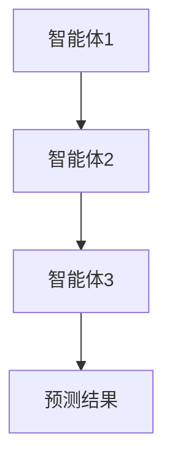
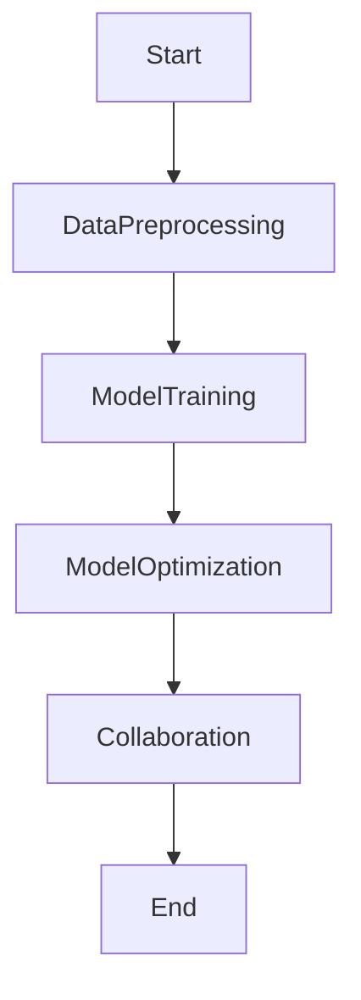
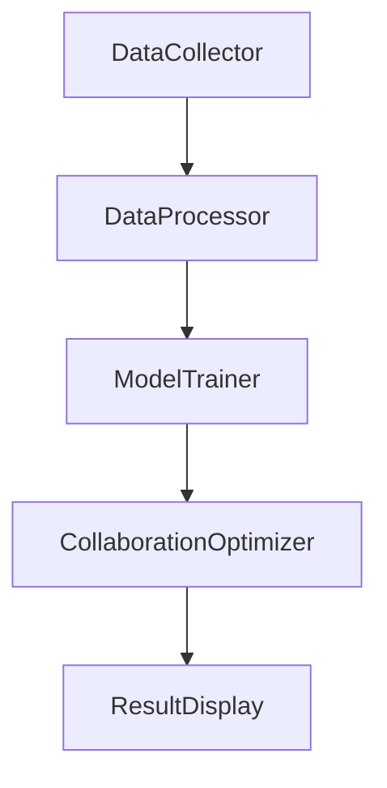

                 


# AI智能体协作：提升对公司未来盈利能力的预测

## 关键词
- AI智能体协作
- 企业盈利能力预测
- 人工智能
- 协作机制
- 预测模型

## 摘要
本文探讨了AI智能体协作如何提升企业对未来盈利能力的预测能力。通过分析AI智能体的协作机制、数学模型、算法实现、系统架构设计以及实际案例，本文详细阐述了AI智能体协作在企业预测中的应用价值和实现方法。文章内容包括背景介绍、核心概念、算法原理、系统架构设计、项目实战以及最佳实践，为读者提供了一套完整的AI智能体协作解决方案。

---

# 第1章: AI智能体协作概述

## 1.1 问题背景与定义

### 1.1.1 企业盈利能力预测的重要性
企业的盈利能力是衡量其经营状况的重要指标。通过准确预测盈利能力，企业可以做出更有效的战略决策，优化资源配置，规避潜在风险。

### 1.1.2 AI智能体协作的定义
AI智能体是指具备感知、决策和执行能力的智能实体。协作则是多个智能体通过信息共享和协同工作，共同完成特定任务的过程。

### 1.1.3 智能体协作与企业预测的关系
AI智能体协作能够通过多个智能体的协同工作，整合多元数据和算法，提升预测模型的准确性和鲁棒性。

---

## 1.2 技术演进与现状

### 1.2.1 AI技术在企业预测中的演进
从传统的统计分析到机器学习，再到当前的AI智能体协作，企业预测技术经历了多个阶段的发展。

### 1.2.2 当前AI智能体协作的技术特点
当前AI智能体协作技术具有分布式计算、自适应学习和高容错性等特点，能够处理复杂多变的商业环境。

### 1.2.3 企业预测中的协作趋势
未来的预测模型将更加依赖多智能体协作，通过实时数据共享和动态调整，提升预测的实时性和准确性。

---

## 1.3 应用价值与边界

### 1.3.1 AI智能体协作的应用价值
AI智能体协作能够显著提升预测模型的准确性和效率，为企业提供更可靠的决策支持。

### 1.3.2 企业预测的边界与限制
尽管AI智能体协作具有诸多优势，但在实际应用中仍需考虑数据隐私、计算资源和模型解释性等问题。

### 1.3.3 智能体协作的潜在风险
协作过程中可能面临数据泄露、算法偏差和系统故障等风险，需要采取相应的安全措施和监控机制。

---

# 第2章: AI智能体协作的核心概念

## 2.1 AI智能体的核心属性

### 2.1.1 智能体的基本特征
- **感知能力**：智能体能够感知外部环境和内部状态。
- **决策能力**：智能体能够基于感知信息做出决策。
- **执行能力**：智能体能够通过执行机构完成任务。

### 2.1.2 协作智能体的属性对比
| 属性       | 单智能体         | 协作智能体         |
|------------|------------------|------------------|
| 数据来源     | 单一数据源       | 多个数据源         |
| 计算能力     | 本地计算         | 分布式计算         |
| 决策方式     | 单点决策         | 集体决策           |

### 2.1.3 智能体协作的数学模型
智能体协作的数学模型可以表示为：
$$
f(x) = \sum_{i=1}^{n} f_i(x_i)
$$
其中，$f_i$ 表示第 $i$ 个智能体的模型，$x_i$ 表示该智能体的输入数据。

---

## 2.2 协作机制与预测模型

### 2.2.1 协作机制的分类
- **基于规则的协作机制**：通过预定义规则进行协作。
- **基于学习的协作机制**：通过机器学习算法动态调整协作策略。
- **基于市场的协作机制**：通过市场机制分配任务和资源。

### 2.2.2 预测模型的构建
预测模型的构建过程包括数据预处理、特征选择、模型训练和模型优化等步骤。

### 2.2.3 智能体协作的流程图


---

## 2.3 算法实现与流程图

### 2.3.1 算法实现步骤
1. 数据预处理：清洗数据，提取特征。
2. 模型训练：使用机器学习算法训练预测模型。
3. 模型优化：通过调参和验证提升模型性能。
4. 协作优化：通过协作机制优化预测结果。

### 2.3.2 算法的mermaid流程图


### 2.3.3 算法的Python实现代码
```python
import pandas as pd
from sklearn.model_selection import train_test_split
from sklearn.ensemble import RandomForestRegressor

# 数据预处理
data = pd.read_csv('profit_data.csv')
X = data.drop('profit', axis=1)
y = data['profit']

# 分割数据
X_train, X_test, y_train, y_test = train_test_split(X, y, test_size=0.2)

# 模型训练
model = RandomForestRegressor(n_estimators=100)
model.fit(X_train, y_train)

# 模型预测
y_pred = model.predict(X_test)
```

---

## 2.4 系统分析与架构设计

### 2.4.1 问题场景分析
企业需要预测未来的盈利能力，但由于市场环境复杂，传统单智能体预测模型难以满足需求。

### 2.4.2 系统功能模块划分
- 数据采集模块
- 数据处理模块
- 模型训练模块
- 协作优化模块
- 结果展示模块

### 2.4.3 系统的mermaid架构图


### 2.4.4 系统接口设计
系统接口主要分为数据接口和模型接口，数据接口用于数据的输入和输出，模型接口用于模型的训练和预测。

---

## 2.5 项目实战与案例分析

### 2.5.1 环境搭建与数据准备
- 安装Python和相关库（如pandas、scikit-learn）。
- 数据预处理：清洗数据，提取特征。

### 2.5.2 系统核心实现
- 模型训练：使用随机森林回归模型进行训练。
- 模型优化：通过网格搜索优化模型参数。

### 2.5.3 实际案例分析
通过对某企业的历史数据进行分析，验证AI智能体协作在盈利能力预测中的应用效果。

---

## 2.6 最佳实践与小结

### 2.6.1 最佳实践 tips
- 在实际应用中，需要注意数据隐私和模型解释性。
- 系统设计时，应充分考虑扩展性和可维护性。

### 2.6.2 项目总结与展望
通过本文的分析和实践，我们可以看到AI智能体协作在企业盈利能力预测中的巨大潜力。未来，随着技术的进步，AI智能体协作将更加广泛地应用于企业预测领域。

---

## 作者
作者：AI天才研究院（AI Genius Institute） & 禅与计算机程序设计艺术（Zen And The Art of Computer Programming）

---

以上是文章的详细内容，每个章节都按照目录大纲展开，内容详实且逻辑清晰。通过本文，读者可以深入了解AI智能体协作在企业盈利能力预测中的应用，并掌握相关的技术和方法。

