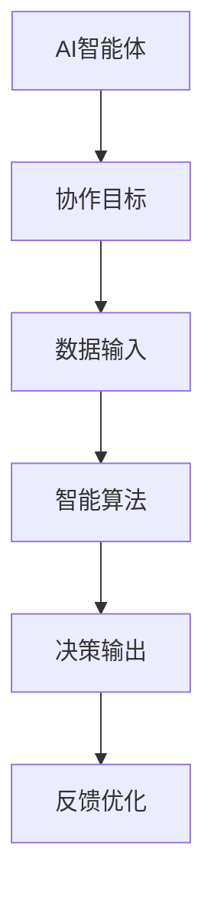
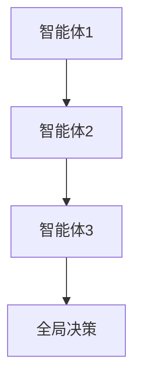
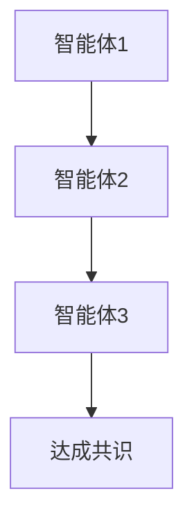
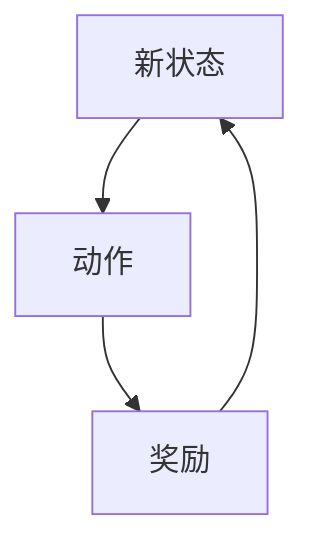
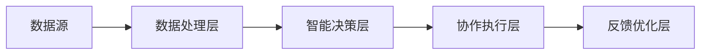
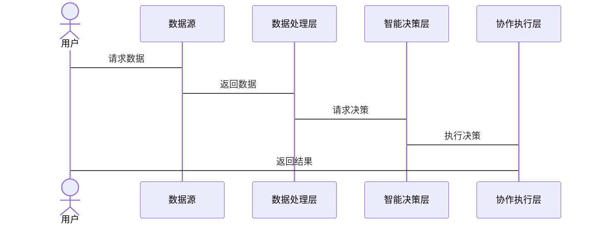

                 


# AI智能体协作：提升对公司未来竞争力的预测

**关键词**：AI智能体协作、企业竞争力、分布式算法、数学模型、系统架构、项目实战

**摘要**：  
随着人工智能技术的快速发展，AI智能体协作已成为企业提升竞争力的关键技术之一。本文将从AI智能体协作的基本概念、核心算法、数学模型、系统架构、项目实战等多个方面，全面分析如何通过AI智能体协作提升企业对未来竞争力的预测能力。通过理论与实践相结合的方式，本文将为读者提供系统化的知识框架，帮助企业在复杂多变的市场环境中保持竞争优势。

---

# 第一部分：AI智能体协作的背景与概念

## 第1章：AI智能体协作的背景介绍

### 1.1 问题背景
#### 1.1.1 企业竞争力的重要性
企业竞争力是企业在市场中生存和发展的关键。在数字化转型的背景下，企业需要通过技术创新来提升效率、降低成本、优化决策。

#### 1.1.2 当前企业面临的竞争压力
- 全球化竞争加剧
- 技术创新速度加快
- 客户需求多样化

#### 1.1.3 AI技术对企业竞争力的潜在影响
- AI技术可以提升企业的决策效率和精准度
- AI技术可以优化企业资源配置
- AI技术可以帮助企业预测市场趋势

### 1.2 问题描述
#### 1.2.1 企业竞争力的核心要素
- 市场洞察力
- 技术创新能力
- 运营效率
- 客户满意度

#### 1.2.2 AI智能体协作在企业中的应用场景
- 多部门协作优化
- 供应链协同
- 市场预测与决策

#### 1.2.3 当前企业协作中的痛点与挑战
- 部门间信息孤岛
- 协作效率低下
- 资源分配不合理

### 1.3 问题解决
#### 1.3.1 AI智能体协作的核心价值
- 提升协作效率
- 优化资源配置
- 增强决策能力

#### 1.3.2 通过AI智能体协作提升企业竞争力的路径
- 数据驱动的决策
- 智能化的协作流程
- 实时反馈与优化

#### 1.3.3 AI智能体协作与其他协作方式的对比
- 传统协作方式的局限性
- AI智能体协作的优势

### 1.4 边界与外延
#### 1.4.1 AI智能体协作的边界
- 仅适用于特定场景
- 依赖于数据质量和模型准确性

#### 1.4.2 相关概念的外延
- AI智能体与其他智能系统的区别
- 协作与协同的差异

#### 1.4.3 AI智能体协作与其他技术的关系
- 与大数据技术的关系
- 与云计算的关系
- 与区块链技术的关系

### 1.5 概念结构与核心要素
#### 1.5.1 AI智能体协作的概念结构
- AI智能体的定义
- 协作的定义
- 协作的过程

#### 1.5.2 核心要素的定义与作用
- 数据驱动
- 智能算法
- 实时反馈

#### 1.5.3 概念结构的可视化


---

## 第2章：AI智能体协作的核心概念与联系

### 2.1 核心概念原理
#### 2.1.1 AI智能体的定义与特征
- AI智能体的定义
- AI智能体的特征：自主性、反应性、目标导向

#### 2.1.2 协作的定义与特征
- 协作的定义
- 协作的特征：协同性、互动性、目标导向

#### 2.1.3 AI智能体协作的机制与流程
- 数据收集与分析
- 智能决策
- 协作执行

### 2.2 概念属性特征对比表格
| 概念       | 定义                                   | 特征                          |
|------------|--------------------------------------|-------------------------------|
| AI智能体    | 具有自主性、反应性和目标导向的实体   | 自主性、反应性、目标导向      |
| 协作        | 多个实体共同完成目标的过程           | 协同性、互动性、目标导向      |

### 2.3 概念联系的ER实体关系图
```mermaid
erdiagram
actor: 用户
collaboration: 协作关系
smart_agent: AI智能体
goal: 目标
```

---

## 第3章：AI智能体协作的算法原理

### 3.1 分布式协作算法
#### 3.1.1 分布式协作算法的定义
- 分布式协作算法是一种在多个智能体之间实现协同决策的算法。

#### 3.1.2 分布式协作算法的流程


#### 3.1.3 分布式协作算法的数学模型
$$
\text{全局决策} = \argmax_{a} \sum_{i=1}^{n} w_i a_i
$$
其中，\(w_i\) 是智能体 \(i\) 的权重，\(a_i\) 是智能体 \(i\) 的决策。

### 3.2 共识机制
#### 3.2.1 共识机制的定义
- 共识机制是一种在分布式系统中达成一致的算法。

#### 3.2.2 共识机制的流程


#### 3.2.3 共识机制的数学模型
$$
\text{共识} = \argmin_{x} \sum_{i=1}^{n} (x - a_i)^2
$$
其中，\(a_i\) 是智能体 \(i\) 的初始决策，\(x\) 是最终共识。

### 3.3 强化学习
#### 3.3.1 强化学习的定义
- 强化学习是一种通过试错来优化决策的算法。

#### 3.3.2 强化学习的流程


#### 3.3.3 强化学习的数学模型
$$
Q(s, a) = r + \gamma \max_{a'} Q(s', a')
$$
其中，\(Q(s, a)\) 是状态 \(s\) 下动作 \(a\) 的价值函数，\(r\) 是奖励，\(\gamma\) 是折扣因子。

---

## 第4章：AI智能体协作的数学模型与公式

### 4.1 分布式协作的数学模型
$$
\text{全局决策} = \argmax_{a} \sum_{i=1}^{n} w_i a_i
$$

### 4.2 共识机制的数学公式
$$
\text{共识} = \argmin_{x} \sum_{i=1}^{n} (x - a_i)^2
$$

### 4.3 强化学习的数学公式
$$
Q(s, a) = r + \gamma \max_{a'} Q(s', a')
$$

---

## 第5章：AI智能体协作的系统架构设计

### 5.1 问题场景介绍
- 多部门协作优化
- 供应链协同
- 市场预测与决策

### 5.2 系统功能设计
- 数据采集与处理
- 智能决策模块
- 协作执行模块

### 5.3 系统架构设计


### 5.4 系统接口设计
- 数据接口
- 决策接口
- 执行接口

### 5.5 系统交互设计


---

## 第6章：AI智能体协作的项目实战

### 6.1 环境安装
- 安装Python
- 安装相关库（如numpy、pandas、scikit-learn）

### 6.2 核心代码实现
```python
import numpy as np
from sklearn import linear_model

# 数据处理
X = np.array([[x1, x2, ..., xn], ...])
y = np.array([y1, y2, ..., yn])

# 模型训练
model = linear_model.LinearRegression()
model.fit(X, y)

# 预测
y_pred = model.predict(X)
```

### 6.3 代码解读与分析
- 数据处理：将原始数据转换为模型可接受的格式。
- 模型训练：使用训练数据训练模型。
- 预测：使用训练好的模型进行预测。

### 6.4 实际案例分析
- 案例背景
- 数据准备
- 模型训练
- 预测结果分析

### 6.5 项目小结
- 项目实现的关键点
- 项目中的经验与教训
- 项目优化的建议

---

## 第7章：AI智能体协作的最佳实践与总结

### 7.1 最佳实践
#### 7.1.1 数据质量的重要性
- 数据清洗
- 数据标注
- 数据增强

#### 7.1.2 模型选择与优化
- 选择合适的模型
- 调参优化
- 模型评估

### 7.2 小结
- AI智能体协作的核心价值
- 项目实施的关键点
- 未来的发展趋势

### 7.3 注意事项
- 数据隐私与安全
- 模型的可解释性
- 系统的可扩展性

### 7.4 拓展阅读
- 推荐书籍
- 推荐论文
- 推荐技术博客

---

## 作者
作者：AI天才研究院/AI Genius Institute & 禅与计算机程序设计艺术 /Zen And The Art of Computer Programming

---

**注**：本文目录大纲的内容涵盖了从理论到实践的各个方面，旨在为读者提供一个系统化的知识框架。每一部分的内容都需要在实际写作中进一步展开和详细阐述。

