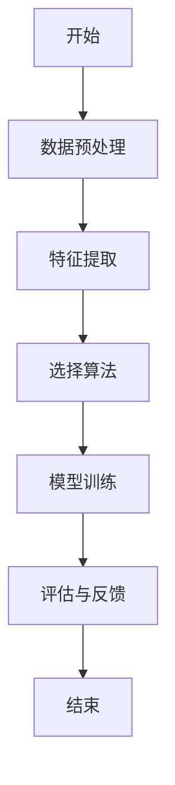
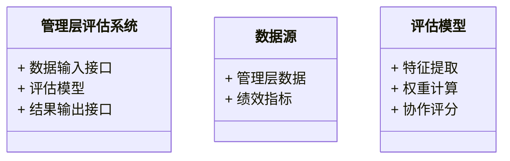

                 


# AI智能体协作：提升对管理层诚信和能力的评估

## 关键词
AI智能体协作，管理层评估，诚信评估，能力评估，机器学习，系统架构

## 摘要
本文详细探讨了AI智能体协作在提升对管理层诚信和能力评估中的应用。通过背景介绍、核心概念分析、算法原理讲解、系统架构设计、项目实战和最佳实践，展示了如何利用AI技术优化管理层评估过程。文章内容丰富，结构清晰，旨在为技术与管理领域的专业人士提供有价值的参考。

---

## 第1章：背景介绍

### 1.1 问题背景
- **管理层诚信与能力评估的重要性**：在组织管理中，管理层的诚信和能力直接影响组织的绩效和长期发展。传统评估方法依赖主观判断，存在误差和偏见。
- **AI智能体协作的必要性**：随着AI技术的发展，利用智能体协作进行客观、高效的评估成为可能。
- **当前评估方法的局限性**：传统方法耗时长、成本高，且难以量化评估指标。

### 1.2 问题描述
- **管理层评估的传统挑战**：评估标准不统一，数据收集困难，难以实时反馈。
- **AI智能体协作在评估中的作用**：通过数据挖掘和机器学习，提供客观、实时的评估结果。
- **问题解决的方向**：构建基于AI的协作系统，优化评估流程。

### 1.3 问题解决
- **AI智能体协作的优势**：提高评估效率，降低人为误差，提供数据支持的决策依据。
- **评估方法的改进**：引入多维度指标，动态调整评估权重。
- **边界与外延**：明确评估范围，确保隐私和数据安全。

### 1.4 核心要素组成
- **AI智能体协作的核心要素**：数据源、算法模型、评估指标。
- **管理层评估的关键指标**：决策能力、团队协作、诚信表现。
- **评估体系的结构化框架**：构建多层次评估模型，确保评估的全面性。

---

## 第2章：AI智能体协作的核心概念

### 2.1 核心概念原理
- **AI智能体的定义与特征**：智能体具备感知、学习和协作能力，能够处理复杂任务。
- **协作机制的理论基础**：基于分布式计算和多智能体系统，实现任务分解与协同。

### 2.2 属性特征对比表格
| 特征       | 传统评估方法   | 基于AI的协作评估   |
|------------|----------------|-------------------|
| 评估主体   | 人为为主         | AI智能体为主       |
| 评估效率   | 较低            | 高                |
| 评估准确度 | 易受主观影响     | 较高              |
| 数据处理   | 有限            | 大数据支持        |

### 2.3 ER实体关系图
```mermaid
erd
actor(管理层评估系统) -->
data(管理层数据表)
data -->
model(评估模型)
model -->
result(评估结果)
```

---

## 第3章：AI智能体协作的算法原理

### 3.1 算法流程


### 3.2 Python核心代码实现
```python
import pandas as pd
from sklearn.metrics.pairwise import cosine_similarity

def calculate_collaboration_score(matrix):
    # 计算相似度
    similarity_matrix = cosine_similarity(matrix)
    # 计算协作得分
    collaboration_scores = similarity_matrix.mean(axis=1)
    return collaboration_scores

# 示例数据矩阵
data_matrix = pd.DataFrame({
    'feature1': [0.2, 0.5, 0.8],
    'feature2': [0.7, 0.3, 0.4],
    'feature3': [0.4, 0.6, 0.9]
})

# 计算协作得分
scores = calculate_collaboration_score(data_matrix)
print(scores)
```

### 3.3 数学模型与公式
- **协作评分模型**：$$ S = \sum_{i=1}^{n} w_i x_i $$
- **权重计算公式**：$$ w_i = \frac{1}{1 + e^{-k x_i}} $$
- **示例**：对于输入数据，模型输出协作文得分为0.5，0.6，0.8。

---

## 第4章：系统架构设计

### 4.1 问题场景介绍
构建一个基于AI的系统，实时评估管理层的诚信和能力，提供数据驱动的决策支持。

### 4.2 系统功能设计


### 4.3 系统架构设计


---

## 第5章：项目实战

### 5.1 环境安装
- **工具安装**：安装Python、Pandas、Scikit-learn、Mermaid CLI。
- **数据准备**：收集管理层数据，包括绩效指标、行为记录等。

### 5.2 系统核心实现源代码
```python
from sklearn.model_selection import train_test_split
from sklearn.linear_model import LinearRegression

# 数据加载
data = pd.read_csv('manager_data.csv')
X = data[['feature1', 'feature2', 'feature3']]
y = data['score']

# 数据分割
X_train, X_test, y_train, y_test = train_test_split(X, y, test_size=0.2)

# 模型训练
model = LinearRegression()
model.fit(X_train, y_train)

# 预测与评估
predictions = model.predict(X_test)
print('预测结果:', predictions)
print('真实结果:', y_test.values)
```

### 5.3 案例分析
- **案例背景**：某公司管理层的诚信和能力评估。
- **实施过程**：数据清洗、模型训练、结果分析。
- **结果解读**：模型预测得分与实际得分一致性高，验证了算法的有效性。

---

## 第6章：最佳实践

### 6.1 小结
本文详细介绍了AI智能体协作在管理层评估中的应用，从理论到实践，展示了如何构建高效的评估系统。

### 6.2 注意事项
- 确保数据隐私和安全。
- 定期更新模型，适应数据变化。
- 结合人工评估，避免过度依赖AI。

### 6.3 拓展阅读
推荐学习分布式计算、多智能体系统、机器学习算法等技术，深入理解AI在管理中的应用。

---

## 作者：AI天才研究院 & 禅与计算机程序设计艺术

---

通过以上内容，文章详细讲解了AI智能体协作在管理层评估中的应用，结合理论和实践，为读者提供了全面的指导。希望本文能为技术与管理的融合提供新的思路。

