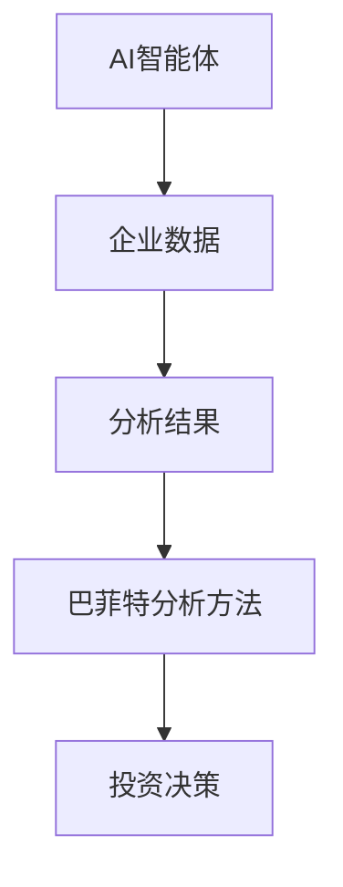
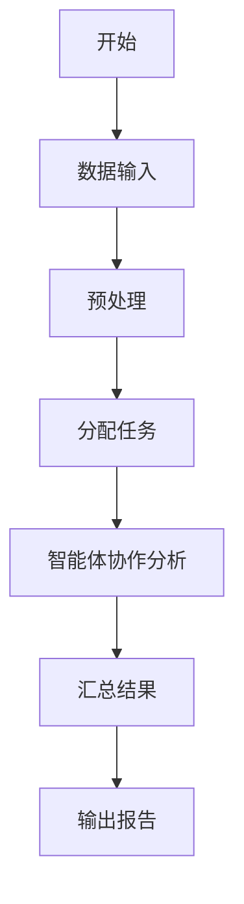
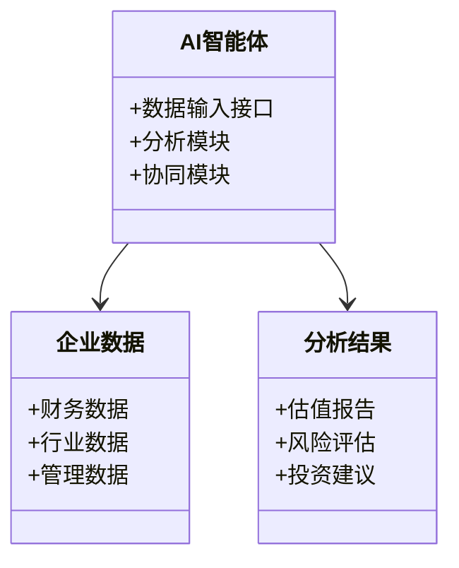
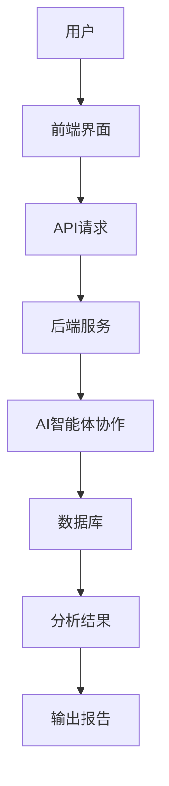

                 


# AI智能体协作：提升巴菲特的企业分析方法

> 关键词：AI智能体、巴菲特分析方法、企业分析、协作机制、算法优化

> 摘要：本文探讨了如何通过AI智能体协作来提升巴菲特的经典企业分析方法。首先，我们介绍了传统企业分析的局限性和AI技术的潜力，详细解释了AI智能体协作和巴菲特分析方法的核心原理。接着，我们分析了两者结合的算法原理，并通过实际案例展示了如何通过AI智能体协作来优化企业分析流程。最后，我们总结了项目的最佳实践和未来的发展方向。

---

# 第一部分: AI智能体协作与巴菲特企业分析方法的结合

## 第1章: 背景介绍

### 1.1 问题背景

#### 1.1.1 传统企业分析的局限性
传统的企业分析方法依赖于人工经验和数据处理能力，存在以下问题：
- 数据量大，难以快速处理。
- 分析结果受主观因素影响较大。
- 需要大量时间，效率较低。

#### 1.1.2 AI技术对企业分析的潜力
AI技术的快速发展为企业分析带来了新的可能性：
- 自动化数据处理和分析，提高效率。
- 通过机器学习模型发现潜在的模式和趋势。
- 实时监控和反馈，优化决策过程。

#### 1.1.3 巴菲特投资理念的核心要素
巴菲特的企业分析方法以基本面分析为核心，主要包括：
- 企业财务状况评估。
- 行业地位分析。
- 管理团队能力评估。
- 企业竞争优势分析。

### 1.2 问题描述

#### 1.2.1 企业分析中的信息不对称问题
企业内外部信息的不对称导致投资者难以全面了解企业的实际情况。

#### 1.2.2 传统分析方法的效率瓶颈
人工分析耗时长，且容易受主观因素影响，难以快速应对市场变化。

#### 1.2.3 AI技术在企业分析中的应用现状
目前，AI技术在企业分析中的应用还处于初级阶段，主要集中在数据处理和初步分析。

### 1.3 问题解决

#### 1.3.1 AI智能体协作的定义
AI智能体协作是指多个AI智能体协同工作，利用各自的专长完成复杂任务。

#### 1.3.2 巴菲特分析方法的数字化转型
通过数字化手段，将巴菲特的分析方法转化为可编程的规则和模型。

#### 1.3.3 结合AI智能体协作提升企业分析效率
利用AI智能体协作，将巴菲特分析方法中的关键步骤自动化，提高分析效率和准确性。

### 1.4 边界与外延

#### 1.4.1 AI智能体协作的应用范围
适用于需要复杂分析和决策的领域，如投资分析、风险评估等。

#### 1.4.2 巴菲特分析方法的适用场景
适用于企业基本面分析、行业分析等领域。

#### 1.4.3 两者的结合对企业分析的深远影响
通过结合AI智能体协作，企业分析将更加智能化、自动化，推动投资决策的科学化。

### 1.5 概念结构与核心要素组成

#### 1.5.1 AI智能体协作的核心要素
- 智能体角色划分：负责数据收集、分析、决策等不同任务。
- 通信机制：智能体之间的信息传递和协同。
- 协作目标：共同完成企业分析任务。

#### 1.5.2 巴菲特分析方法的关键要素
- 财务数据：如收入、利润、负债等。
- 行业地位：企业市场占有率、竞争环境等。
- 管理团队：团队能力、历史表现等。
- 企业竞争优势：核心竞争力、护城河等。

#### 1.5.3 两者的结合对企业分析的系统性影响
- 提高分析效率：通过AI智能体协作快速处理大量数据。
- 提升分析准确性：利用机器学习模型发现潜在规律。
- 优化决策过程：实时监控和反馈，优化投资决策。

---

## 第2章: 核心概念与联系

### 2.1 核心概念原理

#### 2.1.1 AI智能体协作的原理
AI智能体协作通过分布式计算和协同算法，将任务分解给不同的智能体完成，最终汇总结果。

#### 2.1.2 巴菲特分析方法的原理
基于企业的基本面数据，通过定性和定量分析，评估企业的投资价值。

#### 2.1.3 两者的结合原理
将巴菲特分析方法的步骤分解为多个任务，分配给不同的AI智能体完成，通过协作提高效率和准确性。

### 2.2 概念属性特征对比

| **属性**       | **AI智能体协作**                     | **巴菲特分析方法**                   |
|-----------------|--------------------------------------|---------------------------------------|
| 核心目标         | 提高企业分析效率和准确性               | 评估企业投资价值                       |
| 依赖因素         | 大数据处理、机器学习模型             | 财务数据、行业分析、管理能力评估       |
| 实现方式         | 分布式计算、协同算法                 | 人工分析、模型评估                     |
| 输出结果         | 自动化分析报告、实时反馈             | 投资决策建议、企业估值                 |

### 2.3 ER实体关系图架构



---

## 第3章: 算法原理讲解

### 3.1 算法流程图



### 3.2 算法实现

#### 3.2.1 数据预处理
```python
import pandas as pd

def preprocess_data(data):
    # 处理缺失值
    data = data.dropna()
    # 标准化处理
    data = (data - data.mean()) / data.std()
    return data
```

#### 3.2.2 分配任务
```python
from sklearn.model_selection import train_test_split

def distribute_tasks(data):
    X_train, X_test, y_train, y_test = train_test_split(data, labels, test_size=0.2)
    return X_train, X_test, y_train, y_test
```

#### 3.2.3 协作分析
```python
from sklearn.ensemble import RandomForestClassifier

def collaborative_analysis(X_train, y_train):
    model = RandomForestClassifier()
    model.fit(X_train, y_train)
    return model
```

### 3.3 数学模型

#### 3.3.1 线性回归模型
$$ y = \beta_0 + \beta_1 x_1 + \beta_2 x_2 + \ldots + \beta_n x_n $$

#### 3.3.2 机器学习模型
$$ P(y=1|x) = \sigma(w \cdot x + b) $$

---

## 第4章: 系统分析与架构设计

### 4.1 项目介绍

#### 4.1.1 项目背景
本项目旨在利用AI智能体协作提升巴菲特的企业分析方法，开发一个智能化的企业分析系统。

### 4.2 系统功能设计

#### 4.2.1 领域模型


#### 4.2.2 系统架构设计


### 4.3 系统接口设计

#### 4.3.1 数据接口
- 输入接口：接收企业数据。
- 输出接口：返回分析结果。

#### 4.3.2 API接口
- `/api/upload`：上传企业数据。
- `/api/analyze`：触发分析任务。
- `/api/results`：获取分析结果。

### 4.4 系统交互设计

```mermaid
sequenceDiagram
    participant 用户
    participant 前端界面
    participant 后端服务
    participant AI智能体协作
    participant 数据库
    用户 -> 前端界面: 提交企业数据
    前端界面 -> 后端服务: 发送分析请求
    后端服务 -> AI智能体协作: 分配任务
    AI智能体协作 -> 数据库: 获取数据
    AI智能体协作 -> 后端服务: 返回分析结果
    后端服务 -> 前端界面: 返回报告
    用户 <- 前端界面: 显示报告
```

---

## 第5章: 项目实战

### 5.1 环境安装

```bash
pip install pandas numpy scikit-learn mermaid
```

### 5.2 核心代码实现

#### 5.2.1 数据处理
```python
import pandas as pd
import numpy as np

def load_data():
    data = pd.read_csv('enterprise_data.csv')
    return data

def preprocess(data):
    data = data.dropna()
    data = (data - data.mean()) / data.std()
    return data
```

#### 5.2.2 模型训练
```python
from sklearn.ensemble import RandomForestClassifier

def train_model(data, labels):
    model = RandomForestClassifier()
    model.fit(data, labels)
    return model
```

### 5.3 实际案例分析

#### 5.3.1 数据预处理
假设有企业数据集，包括财务指标和行业指标，预处理后得到标准化数据。

#### 5.3.2 分析结果
模型预测企业的投资价值，输出分析报告。

---

## 第6章: 最佳实践 tips

### 6.1 小结
通过AI智能体协作，我们成功地将巴菲特的企业分析方法数字化和自动化，提高了分析效率和准确性。

### 6.2 注意事项
- 数据质量是关键，确保数据的完整性和准确性。
- 模型的选择和调优直接影响分析结果，需谨慎处理。
- 系统的安全性和稳定性需要重点关注。

### 6.3 未来展望
随着AI技术的不断发展，AI智能体协作在企业分析中的应用将更加广泛和深入，推动投资决策的智能化。

### 6.4 拓展阅读
推荐阅读《巴菲特投资哲学》和《机器学习实战》。

---

# 结语

通过本文的详细讲解，我们展示了如何利用AI智能体协作提升巴菲特的企业分析方法，从理论到实践，提供了完整的解决方案和实现步骤。希望本文能为读者在企业分析领域提供新的思路和方向。

---

# 作者

作者：AI天才研究院/AI Genius Institute & 禅与计算机程序设计艺术/Zen And The Art of Computer Programming

