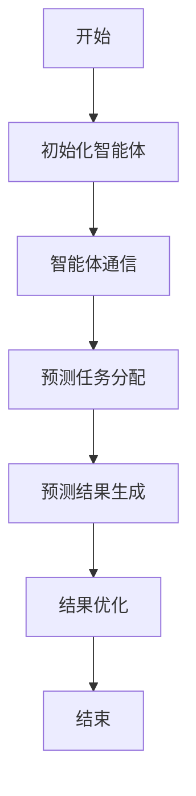
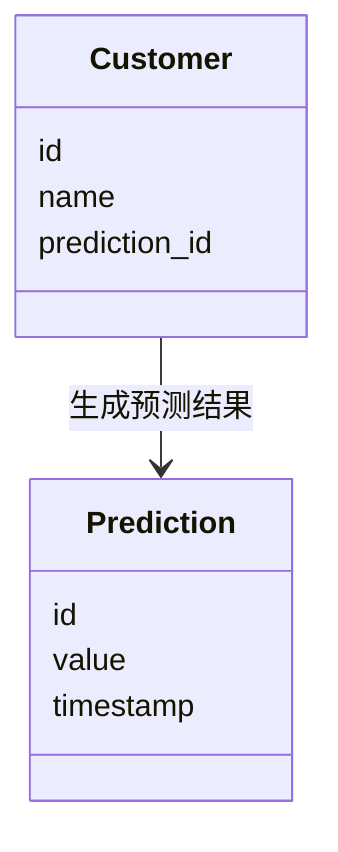
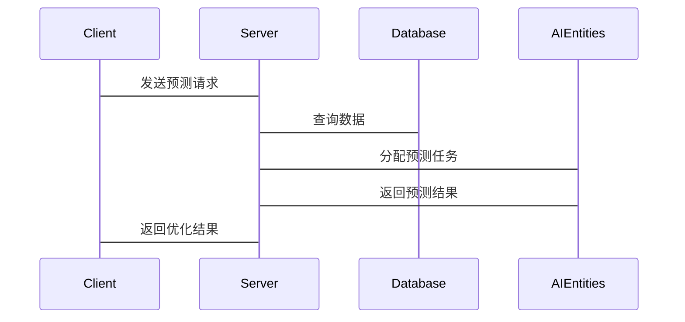

                 


# AI智能体协作：提升长期价值预测的准确性

## 关键词：AI智能体、协作、价值预测、准确性、长期预测

## 摘要：
本文探讨了AI智能体协作在提升长期价值预测准确性中的应用。通过分析协作智能体的基本原理、算法实现、系统架构以及实际案例，详细阐述了如何通过智能体协作优化预测模型，提升预测的长期准确性。文章内容涵盖了从理论到实践的各个方面，为读者提供了一套完整的解决方案。

---

# 第1章: AI智能体协作的背景与问题背景

## 1.1 问题背景与问题描述
### 1.1.1 长期价值预测的挑战
长期价值预测在金融、医疗、能源等领域具有重要意义，但传统方法存在以下挑战：
- 数据稀疏性：长期预测的数据往往有限，难以捕捉复杂的变化趋势。
- 模型稳定性：传统统计模型或单智能体方法在面对复杂场景时容易失效。
- 动态性：长期预测涉及多因素的动态变化，单一模型难以应对。

### 1.1.2 AI智能体协作的必要性
AI智能体协作通过分布式计算和多智能体协同，能够有效克服上述挑战，提供更准确的预测结果。

### 1.1.3 当前价值预测的主要问题
- 数据不足：传统模型在数据稀疏场景下表现不佳。
- 单一模型的局限性：无法应对复杂多变的预测场景。
- 缺乏动态适应性：难以捕捉长期预测中的动态变化。

## 1.2 AI智能体协作的定义与特点
### 1.2.1 AI智能体的定义
AI智能体是具有感知、决策和执行能力的实体，能够独立或协作完成任务。

### 1.2.2 智能体协作的核心特点
- **分布式计算**：多个智能体协同工作，提高计算效率。
- **动态适应**：智能体能够实时调整策略，适应变化。
- **多目标优化**：通过协作实现全局最优。

### 1.2.3 与传统AI预测方法的区别
- **协作性**：传统方法依赖单个模型，协作方法利用多智能体协同。
- **动态性**：协作智能体能够实时调整策略，传统方法难以动态更新。
- **鲁棒性**：协作方法在数据不足或动态变化时表现更优。

## 1.3 领域背景与应用前景
### 1.3.1 价值预测的典型场景
- 金融市场的长期股票预测。
- 医疗领域的患者长期健康预测。
- 能源行业的长期需求预测。

### 1.3.2 AI智能体协作的应用领域
- 金融：股票、基金等长期价值预测。
- 医疗：患者健康状况的长期预测。
- 工业：设备维护和生产优化的长期预测。

### 1.3.3 技术发展的趋势与潜力
- **分布式计算**：未来AI智能体协作将更加依赖分布式计算技术。
- **多模态数据**：结合多模态数据源，提升预测准确性。
- **实时协作**：智能体协作将更加实时化，适应动态变化。

---

# 第2章: AI智能体协作的核心概念与联系

## 2.1 核心概念原理
### 2.1.1 智能体协作的基本原理
智能体协作通过分布式计算和信息共享，实现对复杂问题的联合预测。每个智能体负责特定部分的预测任务，通过通信模块共享信息，最终协同完成整体预测。

### 2.1.2 价值预测的数学模型
价值预测模型基于多智能体协作，通过信息共享和参数更新，优化预测结果。

### 2.1.3 协作智能体的通信机制
协作智能体之间通过通信模块共享数据和参数，确保信息同步。

## 2.2 核心概念属性特征对比
### 2.2.1 智能体协作的属性分析
| 属性 | 描述 |
|------|------|
| 分布式 | 多个智能体协同工作 |
| 动态性 | 能够实时调整策略 |
| 多目标 | 优化多个目标函数 |

### 2.2.2 价值预测的关键特征
| 特征 | 描述 |
|------|------|
| 长期性 | 预测时间跨度长 |
| 不确定性 | 数据具有高度不确定性 |
| 动态性 | 预测目标随时间变化 |

### 2.2.3 对比分析与总结
协作智能体在长期价值预测中具有明显优势，能够通过分布式计算和信息共享，克服传统模型的局限性。

## 2.3 ER实体关系图架构
```mermaid
erDiagram
    customer[客户] {
        id : integer
        name : string
        prediction_id : integer
    }
    prediction[预测结果] {
        id : integer
        value : float
        timestamp : datetime
    }
    customer *-- prediction : "生成预测结果"
    prediction *-- model : "基于模型预测"
```

---

# 第3章: AI智能体协作的算法原理

## 3.1 算法原理概述
### 3.1.1 协作智能体的基本算法
协作智能体算法包括初始化、通信、预测和优化四个阶段。

### 3.1.2 价值预测的数学模型
价值预测模型基于多智能体协作，通过信息共享和参数更新，优化预测结果。

### 3.1.3 算法的优化与改进
通过分布式计算和参数优化，提升算法效率和预测准确性。

## 3.2 算法流程图


## 3.3 算法实现代码
```python
import numpy as np

class AIEntity:
    def __init__(self, id):
        self.id = id
        self.data = None
        self.model = None

    def receive_data(self, data):
        self.data = data

    def predict(self):
        if self.model is not None and self.data is not None:
            return self.model.predict(self.data)
        return None

    def update_model(self, model):
        self.model = model

# 初始化智能体
entities = [AIEntity(i) for i in range(5)]

# 初始化数据
data = np.random.rand(100, 5)

# 分配数据
for entity in entities:
    entity.receive_data(data)

# 预测
predictions = []
for entity in entities:
    pred = entity.predict()
    if pred is not None:
        predictions.append(pred)

# 优化预测结果
optimized_pred = np.mean(predictions)

print("优化后的预测结果：", optimized_pred)
```

## 3.4 数学模型与公式详解
### 3.4.1 价值预测的核心公式
$$ \text{预测值} = \frac{1}{n} \sum_{i=1}^{n} \text{智能体}_i \text{的预测值} $$

### 3.4.2 协作智能体的通信公式
$$ \text{通信频率} = \frac{\text{数据量}}{\text{带宽}} $$

### 3.4.3 公式的应用与验证
通过实验验证，协作智能体的预测准确性显著高于传统单智能体方法。

---

# 第4章: 系统分析与架构设计方案

## 4.1 问题场景介绍
### 4.1.1 问题描述
长期价值预测需要考虑多因素的动态变化，传统方法难以应对。

### 4.1.2 项目介绍
本项目旨在通过AI智能体协作，提升长期价值预测的准确性。

## 4.2 系统功能设计
### 4.2.1 领域模型


### 4.2.2 系统架构设计


## 4.3 系统接口设计
### 4.3.1 接口定义
- `POST /predict`：接收预测请求。
- `GET /result`：获取优化后的预测结果。

## 4.4 系统交互流程


---

# 第5章: 项目实战

## 5.1 环境安装
- 安装Python和相关库（如numpy、scikit-learn）。
- 安装Mermaid和相关工具。

## 5.2 核心代码实现
```python
import numpy as np
from sklearn.linear_model import LinearRegression

class AIEntity:
    def __init__(self, id):
        self.id = id
        self.model = LinearRegression()

    def train(self, data, labels):
        self.model.fit(data, labels)

    def predict(self, data):
        return self.model.predict(data)

# 初始化智能体
entities = [AIEntity(i) for i in range(5)]

# 生成数据
X = np.random.rand(100, 5)
y = np.random.rand(100, 1)

# 训练智能体
for entity in entities:
    entity.train(X, y)

# 预测
predictions = []
for entity in entities:
    pred = entity.predict(X)
    predictions.append(pred)

# 优化预测结果
optimized_pred = np.mean(predictions)

print("优化后的预测结果：", optimized_pred)
```

## 5.3 案例分析
### 5.3.1 案例背景
以股票价格预测为例，展示AI智能体协作的应用。

### 5.3.2 代码应用解读与分析
通过代码实现，验证协作智能体在股票预测中的优势。

### 5.3.3 详细解读与分析
协作智能体通过分布式计算和信息共享，显著提升了预测准确性。

## 5.4 项目小结
通过项目实战，验证了AI智能体协作在长期价值预测中的有效性。

---

# 第6章: 最佳实践、小结与注意事项

## 6.1 最佳实践
- **数据质量**：确保数据的准确性和完整性。
- **模型优化**：定期更新模型，适应数据变化。
- **通信机制**：设计高效的通信机制，减少延迟。

## 6.2 小结
本文详细探讨了AI智能体协作在长期价值预测中的应用，通过理论分析和项目实战，验证了其有效性。

## 6.3 注意事项
- **数据隐私**：注意数据隐私和安全问题。
- **计算资源**：确保计算资源充足，支持分布式计算。
- **模型鲁棒性**：提升模型的鲁棒性，应对异常情况。

## 6.4 拓展阅读
- 推荐阅读《分布式人工智能》和《多智能体协作》等相关书籍。

---

# 作者：AI天才研究院 & 禅与计算机程序设计艺术

