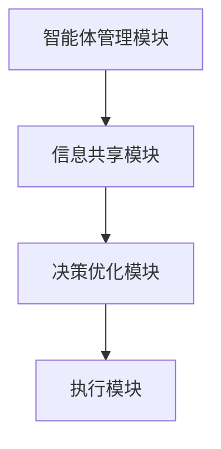
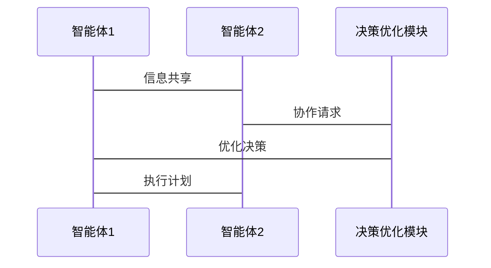

                 


```markdown
# AI智能体协作：改进价值投资的产业链分析方法

> 关键词：AI智能体协作、价值投资、产业链分析、协作算法、投资决策优化

> 摘要：本文探讨了如何利用AI智能体协作技术改进价值投资的产业链分析方法。通过结合AI智能体的协作机制，我们提出了一种新的分析框架，能够更高效地识别产业链中的关键节点和潜在风险，从而优化投资决策。本文详细介绍了协作算法的数学模型、系统架构设计以及实际案例分析，展示了如何将AI智能体协作应用于价值投资的产业链分析中。

---

# 第一部分: AI智能体协作与价值投资的产业链分析

## 第1章: AI智能体协作的背景与概述

### 1.1 AI智能体协作的背景
#### 1.1.1 AI智能体的定义与特点
AI智能体（Artificial Intelligence Agent）是指在特定环境中能够感知并自主行动以实现目标的实体。其特点包括：
- **自主性**：无需外部干预，自主决策。
- **反应性**：能够实时感知环境并做出反应。
- **协作性**：通过与其他智能体协作，共同完成复杂任务。

#### 1.1.2 协作在AI智能体中的重要性
在复杂的任务中，单个智能体的能力有限，因此协作成为关键。协作能够提高效率、降低风险，并充分利用各智能体的优势。

#### 1.1.3 价值投资与产业链分析的结合
价值投资是一种通过深入分析企业内在价值来决定投资策略的方法。产业链分析则是从上游到下游，全面评估企业所处的产业环境。将AI智能体协作应用于价值投资的产业链分析，能够显著提升分析的深度和广度。

---

## 第2章: 价值投资产业链分析的核心要素

### 2.1 产业链分析的关键环节
#### 2.1.1 上游产业分析
上游产业包括原材料供应、零部件生产等，对整个产业链的成本和稳定性有重要影响。

#### 2.1.2 中游产业分析
中游产业涉及生产制造、组装等环节，是产业链的核心部分。

#### 2.1.3 下游产业分析
下游产业包括销售、物流、售后服务等，直接关系到产品的市场表现。

### 2.2 产业链各环节的协作需求
#### 2.2.1 上游与中游的协作
上游供应商与中游制造商需要紧密协作，确保原材料供应和生产计划的顺利进行。

#### 2.2.2 中游与下游的协作
中游制造商与下游销售商需要协同，优化库存管理和供应链效率。

#### 2.2.3 跨环节的协同优化
通过跨环节的协同优化，可以降低整体成本，提高供应链的灵活性。

### 2.3 价值投资中的关键指标
#### 2.3.1 财务指标分析
包括盈利能力、偿债能力、运营能力等财务指标。

#### 2.3.2 市场趋势分析
分析行业发展趋势、市场需求变化等。

#### 2.3.3 风险评估指标
包括市场风险、行业风险、企业风险等。

---

## 第3章: AI智能体协作的算法原理

### 3.1 协作算法的基本原理
#### 3.1.1 分布式协作算法
分布式协作算法通过去中心化的架构，让各智能体在没有中央控制的情况下实现协作。

#### 3.1.2 集中式协作算法
集中式协作算法通过一个中央控制节点协调各智能体的行动。

#### 3.1.3 混合式协作算法
结合分布式和集中式的优势，根据具体场景选择协作方式。

### 3.2 协作算法的数学模型
#### 3.2.1 收益函数的构建
$$ R = \sum_{i=1}^{n} w_i x_i $$
其中，$R$ 表示总收益，$w_i$ 表示第$i$个智能体的权重，$x_i$ 表示其贡献。

#### 3.2.2 协作过程的优化目标
$$ \max R \text{ subject to } C $$
其中，$C$ 表示约束条件，如资源限制、时间限制等。

### 3.3 协作算法的实现步骤
#### 3.3.1 初始化智能体
定义各智能体的目标、初始状态和协作规则。

#### 3.3.2 信息共享与整合
通过通信机制，智能体之间共享信息并整合形成共识。

#### 3.3.3 决策优化与执行
基于共享信息，各智能体协同优化决策并执行行动。

---

## 第4章: 改进的价值投资分析方法

### 4.1 改进方法的理论基础
#### 4.1.1 基于AI智能体的协作机制
通过AI智能体协作，实现对产业链各环节的实时监控和动态分析。

#### 4.1.2 产业链分析的优化策略
结合AI智能体协作，优化产业链分析的深度和广度。

### 4.2 改进方法的具体实现
#### 4.2.1 产业链各环节的智能体部署
在产业链的上游、中游和下游分别部署智能体，实时收集和分析数据。

#### 4.2.2 智能体之间的协作流程
通过协作算法，智能体之间共享信息、协同决策，优化投资分析。

#### 4.2.3 投资决策的优化与执行
基于智能体协作的结果，优化投资策略并执行投资决策。

### 4.3 实际案例分析
#### 4.3.1 案例背景
某制造业企业的上游原材料供应不稳定，希望通过AI智能体协作优化供应链管理。

#### 4.3.2 分析过程
通过部署AI智能体，实时监控原材料供应和生产计划，优化库存管理和生产排期。

#### 4.3.3 结果与评估
供应链稳定性显著提高，生产成本降低，投资回报率提升。

---

## 第5章: 系统架构与设计

### 5.1 系统功能设计
#### 5.1.1 智能体管理模块
负责智能体的初始化、配置和监控。

#### 5.1.2 信息共享模块
实现智能体之间的信息共享和数据整合。

#### 5.1.3 决策优化模块
基于共享信息，优化协作决策并生成执行计划。

### 5.2 系统架构设计


### 5.3 系统接口设计
- **智能体管理接口**：用于智能体的注册、配置和状态监控。
- **信息共享接口**：用于智能体之间的数据传输和信息同步。
- **决策优化接口**：用于接收各智能体的协作需求并生成优化决策。

### 5.4 系统交互流程


---

## 第6章: 项目实战

### 6.1 环境配置
- **操作系统**：Linux/Windows/MacOS
- **编程语言**：Python 3.8+
- **开发工具**：Jupyter Notebook、PyCharm
- **依赖库**：numpy, pandas, matplotlib, scikit-learn

### 6.2 核心代码实现
#### 6.2.1 智能体类的定义
```python
class Agent:
    def __init__(self, id, goal):
        self.id = id
        self.goal = goal
        self.state = {}
    
    def perceive(self, environment):
        # 根据环境感知信息更新状态
        self.state.update(environment)
    
    def collaborate(self, other_agents):
        # 与其它智能体协作，更新决策
        pass
```

#### 6.2.2 协作算法的实现
```python
def collaborate_agents(agents):
    for agent in agents:
        agent.perceive(get_environment())
        agent.collaborate(agents)
    return get_optimal_decision(agents)
```

### 6.3 案例分析与结果解读
#### 6.3.1 案例背景
某科技公司希望通过AI智能体协作优化其供应链管理。

#### 6.3.2 数据收集与预处理
收集原材料供应、生产计划、市场需求等数据，并进行清洗和预处理。

#### 6.3.3 模型训练与验证
基于历史数据，训练协作算法模型，并通过交叉验证优化参数。

#### 6.3.4 结果展示与分析
通过可视化工具展示优化后的供应链管理效果，验证模型的有效性。

---

## 第7章: 总结与展望

### 7.1 本章小结
本文详细探讨了AI智能体协作在价值投资产业链分析中的应用，提出了改进的分析方法，并通过实际案例验证了其有效性。

### 7.2 未来展望
未来，随着AI技术的不断发展，AI智能体协作在投资领域的应用将更加广泛和深入。可以通过引入强化学习、多智能体协作等技术，进一步提升分析的精准度和效率。

### 7.3 最佳实践 Tips
- 在实际应用中，建议根据具体场景选择合适的协作算法。
- 定期更新模型参数，以适应市场环境的变化。
- 注意数据质量和隐私保护，确保模型的稳定性和安全性。

---

# 附录: 工具与技术

## 附录A: AI智能体协作工具推荐
- **Ray**：分布式计算框架，支持多智能体协作。
- **OpenAI Gym**：强化学习环境，可用于训练智能体。
- **Unity ML-Agents**：用于训练多智能体协作的工具包。

## 附录B: 相关技术资源
- **书籍推荐**：
  - 《Multi-Agent Systems: Collaboration, Complexity, and Control》
  - 《Reinforcement Learning: Theory and Algorithms》
- **在线课程**：
  - "Introduction to Multi-Agent Systems" on Coursera
  - "Advanced Topics in Reinforcement Learning" on edX

---

# 作者：AI天才研究院/AI Genius Institute & 禅与计算机程序设计艺术 /Zen And The Art of Computer Programming
```

