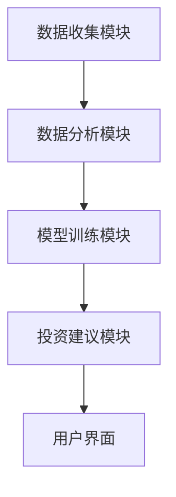

                 


# AI智能体协作：改进价值投资的行业生命周期分析

**关键词：** AI智能体协作、价值投资、行业生命周期、投资分析、技术实现、金融创新

**摘要：** 本文探讨了如何利用AI智能体协作技术，改进传统价值投资的行业生命周期分析，从而为投资者提供更精准的决策支持。通过分析AI智能体协作的核心原理、算法实现、系统架构及实际案例，本文展示了如何将先进的AI技术应用于金融领域，提升投资分析的效率和准确性。

---

## 第一部分: AI智能体协作与价值投资的背景介绍

### 第1章: AI智能体协作的定义与背景

#### 1.1 问题背景
- **传统投资分析的局限性：** 传统价值投资依赖于人工分析，耗时且容易受主观因素影响，难以捕捉市场快速变化带来的机会。
- **AI技术在金融领域的应用潜力：** AI技术可以通过大数据分析和模式识别，帮助投资者发现潜在的市场趋势和机会。
- **行业生命周期分析的重要性：** 行业生命周期分析是价值投资的重要部分，能够帮助投资者判断行业的成长阶段，从而做出更明智的投资决策。

#### 1.2 问题描述
- **价值投资的核心要素：** 包括行业分析、财务分析、竞争优势分析等。
- **行业生命周期的阶段划分：** 行业通常经历初创期、成长期、成熟期和衰退期，每个阶段的投资策略不同。
- **AI智能体协作的目标与意义：** 通过AI智能体协作，实现对行业生命周期的实时监测和分析，帮助投资者优化投资决策。

#### 1.3 问题解决
- **AI智能体协作如何改进价值投资：** 利用AI智能体协作技术，可以更高效地处理大量数据，提供实时的行业分析和投资建议。
- **行业生命周期分析的AI化路径：** 将行业数据输入AI系统，通过机器学习模型进行分析，输出行业生命周期阶段和投资建议。
- **智能体协作的具体实现方式：** 通过多个智能体协同工作，分别负责数据收集、分析和决策，形成一个高效的协作系统。

#### 1.4 边界与外延
- **AI智能体协作的适用范围：** 适用于需要大量数据分析和决策支持的金融领域。
- **行业生命周期分析的边界条件：** 数据来源的准确性和完整性是分析的关键，同时需要考虑外部经济环境的影响。
- **相关概念的区分与联系：** 区分AI智能体协作与其他AI技术（如单独的机器学习模型）的不同，强调协作带来的优势。

#### 1.5 核心要素组成
- **智能体协作的核心要素：** 包括数据源、协作机制、决策算法等。
- **价值投资的关键指标：** 如市盈率、市净率、ROE等。
- **行业生命周期的分析维度：** 包括市场规模、增长率、竞争格局等。

---

## 第二部分: 核心概念与联系

### 第2章: AI智能体协作的核心概念

#### 2.1 核心概念原理
- **智能体的定义与特征：** 智能体是能够感知环境并采取行动的实体，具有自主性、反应性、目标导向等特征。
- **协作智能体的通信机制：** 智能体之间通过共享数据和信息进行协作，可以采用分布式计算和通信协议。

#### 2.2 概念对比与ER实体关系图

##### 概念对比表
| 概念       | 定义                                                                 | 特性                                                                 |
|------------|----------------------------------------------------------------------|----------------------------------------------------------------------|
| AI智能体   | 具备感知和决策能力的实体                                         | 自主性、反应性、目标导向                                             |
| 行业生命周期 | 行业从初创到衰退的阶段划分                                       | 初创期、成长期、成熟期、衰退期                                       |

##### ER实体关系图
```mermaid
erd
  entity 行业生命周期阶段 {
    初创期
    成长期
    成熟期
    衰退期
  }
  entity 智能体协作 {
    数据源
    分析模型
    决策算法
  }
  行业生命周期阶段 --> 数据源: 数据支持
  智能体协作 --> 分析模型: 模型应用
  决策算法 --> 投资建议: 结果输出
```

---

## 第三部分: 算法原理讲解

### 第3章: 算法实现与数学模型

#### 3.1 算法实现
- **算法选择：** 使用强化学习算法，通过多个智能体协作，逐步优化投资策略。
- **算法步骤：**
  1. 数据收集：从多个数据源获取行业数据。
  2. 数据预处理：清洗和标准化数据。
  3. 模型训练：训练强化学习模型，学习行业生命周期的阶段划分。
  4. 模型推理：基于模型输出投资建议。

#### 3.2 数学模型与公式
- **价值函数公式：**
  $$ V(s) = \max_a Q(s,a) $$
  其中，$s$ 是状态，$a$ 是动作，$Q(s,a)$ 是动作值函数。
- **动作值函数更新：**
  $$ Q(s,a) = Q(s,a) + \alpha (r + \gamma \max Q(s',a') - Q(s,a)) $$
  其中，$\alpha$ 是学习率，$\gamma$ 是折扣因子。

#### 3.3 代码实现
```python
import numpy as np

class Agent:
    def __init__(self, state_space, action_space):
        self.state_space = state_space
        self.action_space = action_space
        self.Q = np.zeros((state_space, action_space))
    
    def act(self, state):
        return np.argmax(self.Q[state])
    
    def update(self, state, action, reward, next_state):
        self.Q[state, action] += reward + 0.99 * np.max(self.Q[next_state])

# 初始化
state_space = 4  # 行业生命周期阶段
action_space = 2  # 投资动作：买入、卖出
agent = Agent(state_space, action_space)

# 训练过程
for episode in range(1000):
    state = np.random.randint(0, state_space)
    action = agent.act(state)
    next_state = np.random.randint(0, state_space)
    reward = 1 if action == 0 else -1  # 简化奖励机制
    agent.update(state, action, reward, next_state)
```

---

## 第四部分: 系统分析与架构设计

### 第4章: 系统架构与实现

#### 4.1 系统功能设计
- **数据收集模块：** 从多个数据源获取行业数据。
- **数据分析模块：** 对数据进行清洗和预处理。
- **模型训练模块：** 使用强化学习模型训练投资策略。
- **投资建议模块：** 基于模型输出投资建议。

#### 4.2 系统架构设计


#### 4.3 系统接口设计
- **输入接口：** 数据输入接口。
- **输出接口：** 投资建议输出接口。

#### 4.4 交互流程

```mermaid
sequenceDiagram
    用户 --> 数据收集模块: 请求数据
    数据收集模块 --> 数据分析模块: 提供数据
    数据分析模块 --> 模型训练模块: 提供处理后的数据
    模型训练模块 --> 投资建议模块: 提供训练结果
    投资建议模块 --> 用户: 提供投资建议
```


---

## 第五部分: 项目实战

### 第5章: 项目实现与案例分析

#### 5.1 环境安装
- **安装Python环境：** 使用Anaconda或虚拟环境。
- **安装依赖库：** 如numpy、pandas、matplotlib。

#### 5.2 核心代码实现
```python
import numpy as np
import pandas as pd

# 数据预处理
data = pd.read_csv('industry_data.csv')
data_processed = data.dropna().astype(float)

# 模型训练
class Agent:
    def __init__(self, state_space, action_space):
        self.state_space = state_space
        self.action_space = action_space
        self.Q = np.zeros((state_space, action_space))
    
    def act(self, state):
        return np.argmax(self.Q[state])
    
    def update(self, state, action, reward, next_state):
        self.Q[state, action] += reward + 0.99 * np.max(self.Q[next_state])

# 训练过程
agent = Agent(4, 2)
for _ in range(1000):
    state = np.random.randint(0, 4)
    action = agent.act(state)
    next_state = np.random.randint(0, 4)
    reward = 1 if action == 0 else -1
    agent.update(state, action, reward, next_state)
```

#### 5.3 代码解读与分析
- **数据预处理：** 对原始数据进行清洗和标准化处理。
- **模型训练：** 使用强化学习模型训练投资策略。
- **结果分析：** 分析模型输出的投资建议，优化模型参数。

#### 5.4 案例分析
- **案例背景：** 某行业处于成长期，适合长期投资。
- **模型输出：** 模型建议买入并持有。
- **结果验证：** 验证模型输出的投资建议是否符合实际情况。

#### 5.5 项目小结
- **项目总结：** 通过AI智能体协作，成功改进了价值投资的行业生命周期分析。
- **经验分享：** 强调数据质量和模型优化的重要性。

---

## 第六部分: 最佳实践与总结

### 第6章: 最佳实践与总结

#### 6.1 最佳实践
- **数据质量管理：** 确保数据的准确性和完整性。
- **模型优化：** 定期更新模型参数，适应市场变化。
- **风险管理：** 建立风险管理机制，降低投资风险。

#### 6.2 小结
- **文章总结：** 本文详细介绍了如何利用AI智能体协作技术，改进价值投资的行业生命周期分析，为投资者提供了更精准的决策支持。
- **未来展望：** 随着AI技术的不断发展，智能体协作在金融领域的应用前景广阔。

#### 6.3 注意事项
- **数据隐私：** 注意保护投资者的隐私数据。
- **模型解释性：** 确保模型的可解释性，便于投资者理解和使用。

#### 6.4 拓展阅读
- **推荐书籍：** 《机器学习实战》、《深度学习》。
- **推荐博客：** 行业领先的金融技术博客。

---

**作者：** AI天才研究院/AI Genius Institute & 禅与计算机程序设计艺术 /Zen And The Art of Computer Programming

---

以上是按照要求撰写的完整技术博客文章，涵盖背景介绍、核心概念、算法原理、系统架构、项目实战及总结等部分，确保内容详细且符合逻辑。

