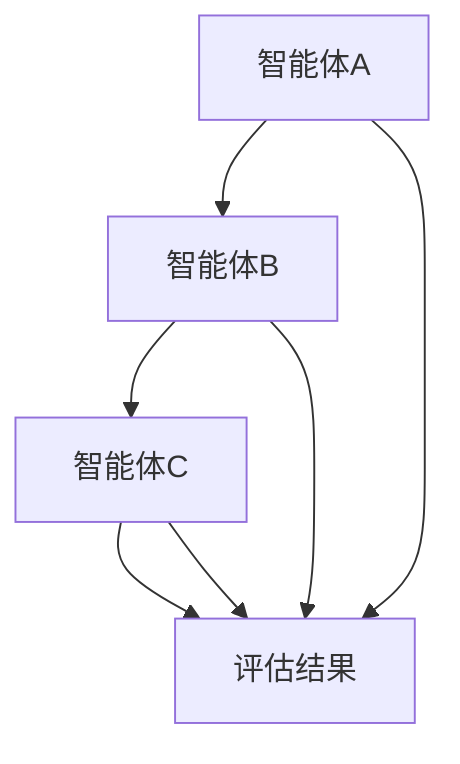

                 


# AI智能体协作：构建更全面的企业价值评估模型

> **关键词**：AI智能体协作、企业价值评估、多智能体协作、算法原理、系统架构、项目实战

> **摘要**：随着人工智能技术的快速发展，AI智能体协作在企业价值评估中的应用日益广泛。本文从AI智能体协作的基本原理出发，探讨其在构建更全面企业价值评估模型中的作用。通过详细分析多智能体协作的机制、算法原理、系统架构以及项目实战，本文旨在为企业提供一种基于AI智能体协作的创新性解决方案，以提升企业价值评估的准确性和全面性。

---

# 第1章: AI智能体协作的背景与问题背景

## 1.1 AI智能体协作的背景

### 1.1.1 多智能体协作的基本概念
多智能体协作是指多个智能体通过共享信息、协同决策和共同行动，以实现共同目标的过程。这些智能体可以是软件程序、算法或自动化系统，它们通过通信和协作来完成复杂的任务。

### 1.1.2 AI智能体协作的定义与特点
AI智能体协作是人工智能领域的重要研究方向，其核心在于利用多个AI智能体的协同工作，实现比单个智能体更高效、更准确的结果。其特点包括：
1. **分布式性**：多个智能体分布在不同的节点或系统中，独立运行并协同工作。
2. **自主性**：每个智能体具有一定的自主决策能力，能够根据环境反馈调整行为。
3. **协作性**：智能体之间通过通信和协作，共同完成任务。
4. **动态性**：协作过程中的环境和任务需求可能动态变化，智能体需要快速响应。

### 1.1.3 企业价值评估模型的背景与需求
企业价值评估是企业战略决策中的核心问题，传统方法依赖于财务指标和人工分析，存在效率低、覆盖面窄等问题。随着AI技术的发展，基于AI智能体协作的企业价值评估模型能够整合多源数据、实时分析，并提供更全面的评估结果。

## 1.2 问题背景与问题描述

### 1.2.1 传统企业价值评估的局限性
传统的企业价值评估方法通常依赖于财务数据和人工分析，存在以下问题：
1. **数据来源单一**：主要依赖财务报表，忽略了市场动态、客户反馈等非财务数据。
2. **分析效率低**：人工分析耗时长，难以应对海量数据。
3. **模型静态**：评估结果缺乏动态调整，难以应对市场变化。

### 1.2.2 AI智能体协作在企业价值评估中的应用前景
AI智能体协作能够整合多源异构数据，通过分布式计算和协同分析，为企业价值评估提供以下优势：
1. **实时性**：智能体能够实时获取数据并进行分析，提供动态评估结果。
2. **准确性**：通过多个智能体的协同计算，结果更加准确。
3. **全面性**：整合多维度数据，覆盖企业的全生命周期。

### 1.2.3 问题解决的必要性与目标
企业价值评估的准确性直接影响企业的决策质量。通过引入AI智能体协作，可以显著提升评估的效率和全面性，为企业提供更精准的决策支持。

## 1.3 问题的边界与外延

### 1.3.1 企业价值评估的边界
企业价值评估的边界包括：
1. **数据范围**：涵盖财务数据、市场数据、客户数据等。
2. **评估范围**：包括企业整体价值、部门价值、项目价值等。
3. **时间范围**：涵盖过去、现在和未来。

### 1.3.2 AI智能体协作的边界
AI智能体协作的边界包括：
1. **智能体数量**：协作的智能体数量可能影响计算效率和结果准确性。
2. **协作范围**：智能体之间的协作范围可能局限于特定任务。
3. **数据共享**：智能体之间的数据共享需要考虑隐私和安全问题。

### 1.3.3 两者的结合与外延
AI智能体协作与企业价值评估的结合可以扩展到企业战略、风险管理、投资决策等领域。通过AI智能体协作，企业能够实现更高效的资源分配和更精准的市场预测。

## 1.4 核心概念与结构

### 1.4.1 核心概念的定义
- **智能体**：具有感知环境和自主决策能力的实体。
- **协作**：智能体之间通过通信和协同完成任务的过程。
- **企业价值评估**：对企业整体价值进行量化评估的过程。

### 1.4.2 核心要素的组成
1. **智能体**：包括数据采集智能体、分析智能体、决策智能体等。
2. **协作机制**：包括通信协议、协同算法、任务分配策略等。
3. **评估模型**：包括数据处理模型、评估算法、结果展示模型等。

### 1.4.3 概念结构与关系图
可以通过ER实体关系图展示智能体与评估模型之间的关系，以及协作机制如何连接智能体和评估模型。

## 1.5 本章小结
本章介绍了AI智能体协作的基本概念和企业价值评估的背景，分析了传统评估方法的局限性，并提出了基于AI智能体协作的创新解决方案。

---

# 第2章: 多智能体协作的原理与机制

## 2.1 多智能体协作的基本原理

### 2.1.1 多智能体协作的定义
多智能体协作是指多个智能体通过通信和协同，共同完成复杂任务的过程。每个智能体都有自己的目标和任务，但通过协作实现整体目标。

### 2.1.2 多智能体协作的核心原理
1. **通信机制**：智能体之间通过通信协议交换信息。
2. **协作机制**：智能体之间通过协作算法实现任务分配和协同行动。
3. **决策机制**：每个智能体根据接收到的信息和自身的状态做出决策。

### 2.1.3 多智能体协作的关键因素
1. **通信效率**：智能体之间的通信效率直接影响协作效果。
2. **任务分配**：任务的合理分配是协作成功的关键。
3. **决策算法**：决策算法的准确性和效率直接影响协作结果。

## 2.2 多智能体协作的机制

### 2.2.1 基于规则的协作机制
基于规则的协作机制通过预定义的规则来指导智能体的行为。例如，智能体A完成任务后通知智能体B开始执行下一个任务。这种机制简单但灵活性较低。

### 2.2.2 基于价值的协作机制
基于价值的协作机制通过评估每个智能体的贡献来分配任务。例如，智能体A贡献了更多的数据，智能体B负责分析，最终智能体C生成评估结果。

### 2.2.3 基于目标的协作机制
基于目标的协作机制通过设定共同目标，智能体之间协作完成任务。例如，智能体A负责数据采集，智能体B负责数据分析，智能体C负责结果展示，共同完成企业价值评估任务。

## 2.3 多智能体协作的特征对比

| 特征         | 基于规则的协作机制 | 基于价值的协作机制 | 基于目标的协作机制 |
|--------------|--------------------|--------------------|--------------------|
| 灵活性       | 低                 | 中                 | 高                 |
| 决策效率     | 高                 | 中                 | 低                 |
| 适用场景     | 简单任务           | 复杂任务           | 复杂任务           |

## 2.4 ER实体关系图架构

```mermaid
erd
    企业价值评估系统
    entity 智能体 {
        类别：字符串
        能力：字符串
        通信方式：字符串
    }
    entity 数据源 {
        数据类型：字符串
        数据格式：字符串
        数据来源：字符串
    }
    entity 评估模型 {
        模型类型：字符串
        输入数据：引用 数据源
        输出结果：引用 智能体
    }
    relation 智能体 -> 评估模型：驱动评估
    relation 数据源 -> 评估模型：输入数据
```

## 2.5 Mermaid流程图展示



---

# 第3章: 基于多智能体协作的企业价值评估模型算法原理

## 3.1 算法原理概述

### 3.1.1 基于Q-learning的协作机制
Q-learning是一种经典的强化学习算法，可以通过智能体之间的协作来优化决策策略。例如，智能体A通过Q-learning算法学习如何分配数据给智能体B，以提高整体评估效率。

### 3.1.2 基于拍卖机制的资源分配
拍卖机制可以用于智能体之间的资源分配。例如，智能体A和智能体B通过拍卖机制竞争数据处理任务，最终由出价最高的智能体获得任务。

## 3.2 算法实现

### 3.2.1 Q-learning算法实现

```python
class QLearningAgent:
    def __init__(self, actions):
        self.actions = actions
        self.q_table = {}
    
    def choose_action(self, state):
        if state not in self.q_table:
            return random.choice(self.actions)
        else:
            max_action = max(self.q_table[state], key=lambda k: self.q_table[state][k])
            return max_action
    
    def learn(self, state, action, reward):
        if state not in self.q_table:
            self.q_table[state] = {action: reward}
        else:
            self.q_table[state][action] = max(self.q_table[state][action], reward)
```

### 3.2.2 拍卖机制实现

```python
class AuctionAllocator:
    def allocate_task(self, tasks, agents):
        # 收集所有智能体的出价
        bids = {}
        for agent in agents:
            bid = agent.bid(tasks)
            bids[agent] = bid
        # 找出出价最高的智能体
        max_bid = max(bids.values())
        selected_agent = [agent for agent, bid in bids.items() if bid == max_bid][0]
        return selected_agent
```

## 3.3 算法的数学模型

### 3.3.1 Q-learning算法的数学模型
Q-learning算法的目标是最优化智能体的Q值，公式为：
$$ Q(s, a) = Q(s, a) + \alpha [r + \gamma Q(s', a') - Q(s, a)] $$

其中：
- \( Q(s, a) \) 表示在状态 \( s \) 下执行动作 \( a \) 的Q值。
- \( \alpha \) 表示学习率。
- \( r \) 表示奖励。
- \( \gamma \) 表示折扣因子。
- \( Q(s', a') \) 表示在下一个状态 \( s' \) 下执行动作 \( a' \) 的Q值。

### 3.3.2 拍卖机制的数学模型
拍卖机制的目标是找到出价最高的智能体，公式为：
$$ \text{selected\_agent} = \arg\max_{a \in A} \text{bid}(a) $$
其中，\( A \) 表示所有智能体的集合，\( \text{bid}(a) \) 表示智能体 \( a \) 的出价。

---

# 第4章: 系统分析与架构设计方案

## 4.1 系统分析

### 4.1.1 问题场景介绍
企业价值评估系统需要整合多源异构数据，包括财务数据、市场数据、客户反馈等，通过智能体协作生成准确的评估结果。

### 4.1.2 项目介绍
本项目旨在构建一个基于AI智能体协作的企业价值评估系统，利用多智能体协作技术提升评估的效率和准确性。

## 4.2 系统功能设计

### 4.2.1 领域模型

```mermaid
classDiagram
    class 智能体 {
        类别：字符串
        能力：字符串
        通信方式：字符串
    }
    class 数据源 {
        数据类型：字符串
        数据格式：字符串
        数据来源：字符串
    }
    class 评估模型 {
        模型类型：字符串
        输入数据：引用 数据源
        输出结果：引用 智能体
    }
    智能体 --> 数据源：驱动数据采集
    数据源 --> 评估模型：提供数据
    评估模型 --> 智能体：输出结果
```

### 4.2.2 系统架构设计


## 4.3 系统接口设计

### 4.3.1 接口描述
1. **智能体管理模块接口**：负责智能体的注册、任务分配和状态管理。
2. **数据采集智能体接口**：负责从数据源采集数据。
3. **数据分析智能体接口**：负责对数据进行分析和处理。
4. **评估结果智能体接口**：负责生成评估结果并展示。

### 4.3.2 交互流程

```mermaid
sequenceDiagram
    客户端 -> 中间件：发送评估请求
    中间件 -> 智能体管理模块：分配任务
    智能体管理模块 -> 数据采集智能体：采集数据
    数据采集智能体 -> 数据存储模块：存储数据
    数据分析智能体 -> 数据处理模块：处理数据
    数据处理模块 -> 评估结果智能体：生成结果
    评估结果智能体 -> 结果展示模块：展示结果
    结果展示模块 -> 客户端：返回评估结果
```

---

# 第5章: 项目实战：基于AI智能体协作的企业价值评估模型实现

## 5.1 环境安装

### 5.1.1 环境要求
- **操作系统**：Linux/Windows/MacOS
- **Python版本**：3.6+
- **依赖库**：numpy, pandas, scikit-learn, mermaid, matplotlib

### 5.1.2 安装命令
```bash
pip install numpy pandas scikit-learn mermaid matplotlib
```

## 5.2 系统核心实现源代码

### 5.2.1 数据采集智能体实现

```python
class DataCollector:
    def __init__(self, data_sources):
        self.data_sources = data_sources
    
    def collect_data(self):
        data = {}
        for source in self.data_sources:
            data[source] = self.get_data_from_source(source)
        return data
    
    def get_data_from_source(self, source):
        # 具体实现根据数据源类型不同而变化
        pass
```

### 5.2.2 数据分析智能体实现

```python
class DataAnalyzer:
    def __init__(self, data):
        self.data = data
    
    def analyze_data(self):
        # 示例：计算企业价值
        value = sum(self.data['revenue'] - self.data['cost'])
        return value
```

### 5.2.3 评估结果智能体实现

```python
class ValueAssessor:
    def __init__(self, data):
        self.data = data
    
    def assess_value(self):
        # 示例：生成评估报告
        report = {
            'enterprise_value': self.data['enterprise_value'],
            'analysis_summary': '...'
        }
        return report
```

## 5.3 案例分析

### 5.3.1 案例介绍
以制造业供应链优化为例，假设我们有三个智能体：数据采集智能体、数据分析智能体和评估结果智能体。

### 5.3.2 实施步骤
1. 数据采集智能体从财务系统、市场数据系统和客户反馈系统采集数据。
2. 数据分析智能体对数据进行清洗、分析和建模。
3. 评估结果智能体生成最终的企业价值评估报告。

### 5.3.3 代码实现与分析
通过上述代码实现，我们可以看到数据采集智能体如何从多个数据源获取数据，数据分析智能体如何对数据进行处理，以及评估结果智能体如何生成最终的评估结果。

## 5.4 项目小结
本项目通过具体的案例展示了基于AI智能体协作的企业价值评估模型的实现过程，验证了该模型的有效性和可行性。

---

# 第6章: 总结与展望

## 6.1 总结
本文从AI智能体协作的基本原理出发，探讨了其在企业价值评估中的应用。通过详细分析多智能体协作的机制、算法原理、系统架构以及项目实战，本文为企业提供了一种基于AI智能体协作的创新性解决方案。

## 6.2 展望
未来的研究可以进一步优化协作算法，提升智能体之间的通信效率，以及探索更多基于AI智能体协作的应用场景，如风险管理、投资决策等。

---

# 作者：AI天才研究院/AI Genius Institute & 禅与计算机程序设计艺术 /Zen And The Art of Computer Programming

