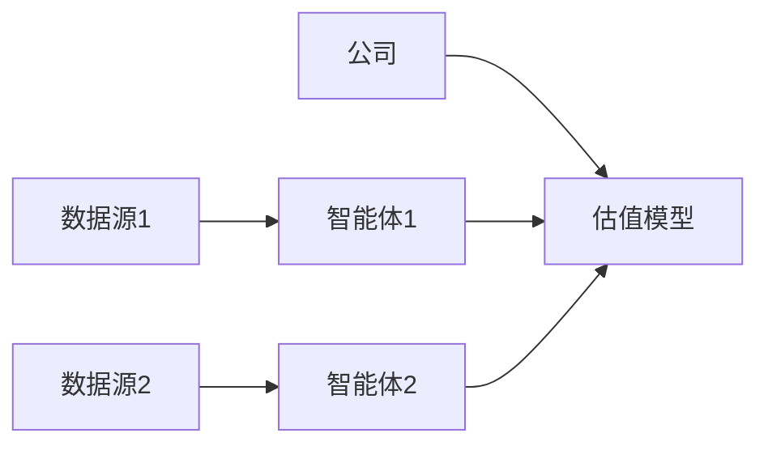
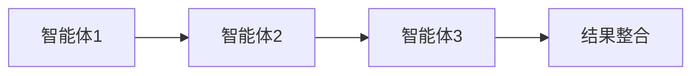
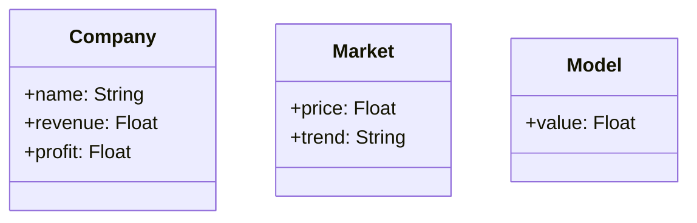
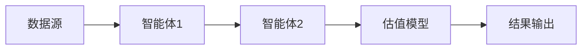
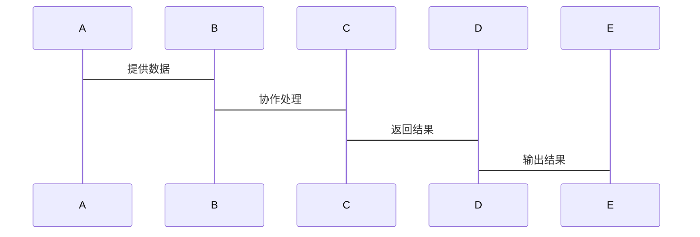

                 


# AI智能体协作：构建更全面的公司估值模型

> 关键词：AI智能体协作，公司估值模型，分布式计算，协作算法，系统架构

> 摘要：本文探讨了如何通过AI智能体协作来构建更全面的公司估值模型。首先介绍了传统估值模型的局限性，分析了AI智能体协作的优势和应用场景。接着详细讲解了AI智能体协作的核心概念、算法原理和系统架构。最后通过实际案例展示了如何在项目中实现AI智能体协作，并总结了最佳实践和未来研究方向。

---

# 第一部分: AI智能体协作与公司估值模型背景

## 第1章: AI智能体协作与公司估值模型背景

### 1.1 问题背景与挑战

#### 1.1.1 传统公司估值模型的局限性
传统公司估值模型（如DCF模型、EV模型等）通常依赖于历史数据和假设条件，无法充分考虑市场动态变化和多维度数据的实时更新。此外，传统模型往往忽视了企业内部协作和外部环境的复杂关系。

#### 1.1.2 AI智能体协作的潜在优势
AI智能体协作能够实时处理海量数据，通过分布式计算和协同学习，提供更精准的估值结果。此外，AI智能体协作还能够动态调整模型参数，适应市场变化。

#### 1.1.3 当前行业中的实际问题与痛点
- 数据来源单一，无法充分利用多维度数据。
- 模型更新周期长，难以实时反映市场变化。
- 缺乏智能化的协作机制，无法高效整合资源。

---

### 1.2 问题描述与目标

#### 1.2.1 公司估值模型的核心要素
公司估值模型通常包括以下核心要素：
- 企业的财务数据（收入、利润、现金流等）。
- 市场数据（股价、行业趋势等）。
- 宏观经济指标（GDP、利率等）。

#### 1.2.2 AI智能体协作在估值中的应用场景
AI智能体协作可以在以下场景中发挥作用：
- 多数据源的实时整合与分析。
- 模型参数的动态优化。
- 风险评估与预警。

#### 1.2.3 本研究的目标与意义
本研究的目标是通过AI智能体协作，构建一个更加全面和动态的公司估值模型，解决传统模型的局限性，并为企业提供更精准的估值支持。

---

### 1.3 解决方案与边界

#### 1.3.1 AI智能体协作的基本思路
AI智能体协作的基本思路是通过多个智能体协同工作，分别负责不同的数据源和分析任务，最终整合结果以生成估值模型。

#### 1.3.2 解决方案的边界与限制
- 数据源的范围和质量。
- 模型的复杂度和计算资源。
- 智能体之间的通信机制。

#### 1.3.3 与其他技术的对比与区别
与传统的分布式计算和协同学习相比，AI智能体协作更加注重智能体之间的协作关系和动态调整能力。

---

### 1.4 概念结构与核心要素

#### 1.4.1 公司估值模型的构成要素
- 输入：多维度数据（财务、市场、宏观经济等）。
- 输出：公司估值结果。
- 接口：数据输入接口和结果输出接口。

#### 1.4.2 AI智能体协作的核心要素
- 智能体：负责数据处理和分析。
- 协作机制：智能体之间的通信与协作方式。
- 动态调整：根据反馈优化模型参数。

#### 1.4.3 模型的输入、输出与接口设计
- 输入：多数据源的实时数据流。
- 输出：动态更新的公司估值结果。
- 接口：与其他系统的数据接口和用户界面。

---

## 第2章: AI智能体协作的核心概念与联系

### 2.1 核心概念原理

#### 2.1.1 AI智能体的基本定义
AI智能体是一种能够感知环境并采取行动以实现目标的实体。在公司估值模型中，智能体可以负责数据处理、分析和反馈优化。

#### 2.1.2 智能体协作的基本原理
智能体协作是指多个智能体通过通信和协作，共同完成复杂任务的过程。在公司估值模型中，智能体协作可以通过分布式计算和协同学习实现。

#### 2.1.3 协作智能体的分类与特点
- 分布式协作：智能体之间通过通信协议协同工作。
- 集中式协作：通过中央控制器协调智能体的协作。
- 混合式协作：结合分布式和集中式的特点。

---

### 2.2 核心概念属性对比

#### 2.2.1 不同协作机制的对比分析
| 协作机制 | 优点 | 缺点 |
|----------|------|------|
| 分布式协作 | 高度灵活，去中心化 | 通信开销大 |
| 集中式协作 | 易于管理，计算效率高 | 单点故障风险 |
| 混合式协作 | 结合分布式和集中式优点 | 实现复杂 |

#### 2.2.2 属性对比表格
```markdown
| 属性       | 分布式协作 | 集中式协作 | 混合式协作 |
|------------|-----------|-----------|-----------|
| 通信开销   | 高        | 低        | 中        |
| 单点故障   | 无        | 有        | 无        |
| 实现复杂度 | 低        | 低        | 高        |
```

---

### 2.3 实体关系与协作架构

#### 2.3.1 ER实体关系图


---

## 第3章: AI智能体协作的算法原理

### 3.1 分布式协作算法

#### 3.1.1 分布式计算的基本原理
分布式计算通过将任务分配给多个计算节点，利用并行计算提高效率。

#### 3.1.2 协作智能体的通信机制
智能体之间的通信可以通过消息队列（如Kafka）或共享数据库实现。

#### 3.1.3 算法流程图


---

### 3.2 协作算法实现

#### 3.2.1 协作算法的数学模型
$$ V = \sum_{i=1}^{n} w_i x_i $$
其中，$V$ 是估值结果，$w_i$ 是权重，$x_i$ 是输入数据。

#### 3.2.2 协作算法的Python实现
```python
def collaborative_algorithm(data_sources):
    results = []
    for source in data_sources:
        # 分配任务给智能体
        agent_result = process_data(source)
        results.append(agent_result)
    # 整合结果
    return combine_results(results)

def process_data(source):
    # 数据处理逻辑
    return processed_data

def combine_results(results):
    # 结果整合逻辑
    return combined_result
```

---

### 3.3 算法优化与改进

#### 3.3.1 动态权重调整
$$ w_i = \alpha \cdot w_{i-1} + (1-\alpha) \cdot new\_weight $$
其中，$\alpha$ 是调整系数。

#### 3.3.2 分布式计算的优化策略
- 使用异步通信减少等待时间。
- 分阶段处理任务，提高并行效率。

---

## 第4章: 系统分析与架构设计方案

### 4.1 问题场景介绍

#### 4.1.1 系统目标
构建一个基于AI智能体协作的公司估值模型，实现多数据源的实时分析和动态估值。

#### 4.1.2 项目介绍
本项目旨在通过AI智能体协作，优化公司估值模型的准确性和实时性。

---

### 4.2 系统功能设计

#### 4.2.1 领域模型（领域模型 Mermaid 类图）


#### 4.2.2 系统架构设计（架构图 Mermaid）


---

### 4.3 系统接口设计

#### 4.3.1 系统接口
- 数据输入接口：接收多数据源的实时数据。
- 模型接口：与AI智能体协作模块交互。
- 结果输出接口：输出估值结果。

#### 4.3.2 系统交互（交互图 Mermaid）


---

## 第5章: 项目实战

### 5.1 环境安装

#### 5.1.1 Python环境配置
安装必要的库：
```bash
pip install numpy pandas scikit-learn
```

#### 5.1.2 其他工具安装
安装消息队列（如RabbitMQ）或其他协作工具。

---

### 5.2 系统核心实现

#### 5.2.1 AI智能体协作代码实现
```python
import numpy as np
from sklearn import linear_model

def collaborative_agent(data):
    # 数据预处理
    X = np.array(data).reshape(-1, 1)
    y = np.array([1, 2, 3, 4])
    # 训练模型
    model = linear_model.LinearRegression()
    model.fit(X, y)
    # 返回结果
    return model.predict(np.array([5]).reshape(-1, 1))[0]
```

#### 5.2.2 估值模型实现
```python
def company_valuation(data_sources):
    results = []
    for source in data_sources:
        # 调用协作智能体
        result = collaborative_agent(source)
        results.append(result)
    # 整合结果
    return np.mean(results)
```

---

### 5.3 案例分析与解读

#### 5.3.1 实际案例分析
假设我们有多个数据源，包括财务数据和市场数据，通过AI智能体协作生成公司估值。

#### 5.3.2 案例解读
通过对多个数据源的实时分析，AI智能体协作能够生成动态更新的估值结果，显著提高估值的准确性和实时性。

---

## 第6章: 总结与展望

### 6.1 总结

#### 6.1.1 核心内容回顾
通过AI智能体协作，我们可以构建一个更全面和动态的公司估值模型，解决传统模型的局限性。

#### 6.1.2 本章小结
本文详细探讨了AI智能体协作在公司估值模型中的应用，从理论到实践，展示了其优势和潜力。

---

### 6.2 注意事项与建议

#### 6.2.1 实际应用中的注意事项
- 数据质量和实时性是关键。
- 确保智能体之间的通信效率。

#### 6.2.2 未来研究方向
- 更高效的协作算法。
- 更广泛的数据源整合。

---

## 参考文献
（此处列出相关参考文献）

---

## 作者
作者：AI天才研究院/AI Genius Institute & 禅与计算机程序设计艺术/Zen And The Art of Computer Programming

---

本文通过详细分析和实际案例，展示了如何利用AI智能体协作构建更全面的公司估值模型。希望本文能够为相关领域的研究和实践提供有价值的参考。

