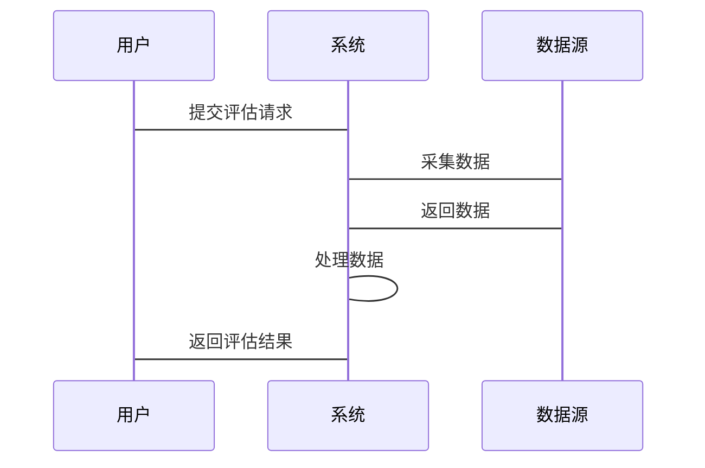

                 


```markdown
# AI智能体协作：构建更全面的公司文化评估模型

> 关键词：AI智能体协作、公司文化评估、多智能体系统、协作算法、系统架构设计

> 摘要：本文详细探讨了如何利用AI智能体协作技术构建更全面的公司文化评估模型。通过分析多智能体系统的协作机制、算法原理以及系统架构设计，展示了AI技术在公司文化评估中的应用优势，旨在为企业提供一种高效、准确的文化评估方法。

---

## 第一章: AI智能体协作与公司文化评估模型概述

### 1.1 公司文化评估的背景与意义

#### 1.1.1 公司文化的定义与重要性
公司文化是企业在长期经营中形成的共同价值观、行为准则和思维方式。它不仅影响员工的工作态度和行为，还直接影响企业的凝聚力、创新能力和市场竞争力。良好的公司文化能够提升员工满意度、降低流失率，并增强企业的核心竞争力。

#### 1.1.2 传统公司文化评估方法的局限性
传统的公司文化评估方法通常依赖于问卷调查、访谈和观察等手段。这些方法存在以下局限性：
- **主观性**：评估结果容易受到评估者主观因素的影响。
- **数据量有限**：问卷调查的数据量有限，难以全面反映公司文化的多维度特征。
- **实时性差**：传统方法难以实时捕捉公司文化的动态变化。
- **缺乏个性化**：难以根据企业的具体情况定制个性化的评估方案。

#### 1.1.3 AI智能体协作在公司文化评估中的优势
AI智能体协作技术通过多智能体的协同工作，能够高效地处理大量数据，发现数据中的隐藏模式和关联关系。其优势包括：
- **数据驱动**：利用大数据分析技术，能够全面、客观地评估公司文化。
- **实时性**：AI智能体可以实时采集和分析数据，捕捉公司文化的动态变化。
- **个性化**：可以根据不同企业的特点，定制个性化的评估模型。

### 1.2 AI智能体协作的核心概念

#### 1.2.1 智能体的定义与特征
智能体（Agent）是指能够感知环境、自主决策并采取行动的实体。智能体具有以下特征：
- **自主性**：能够在没有外部干预的情况下自主决策。
- **反应性**：能够根据环境的变化调整自己的行为。
- **协作性**：能够与其他智能体协作完成共同目标。
- **学习能力**：能够通过经验改进自身的决策能力。

#### 1.2.2 多智能体协作的基本原理
多智能体协作是指多个智能体通过协作完成共同目标的过程。其基本原理包括：
- **通信与协调**：智能体之间需要通过通信机制共享信息，协调各自的行动。
- **任务分配**：根据智能体的能力和环境的需求，动态分配任务。
- **冲突解决**：在协作过程中，智能体之间可能会产生冲突，需要通过某种机制解决冲突。

#### 1.2.3 公司文化评估模型的构建逻辑
公司文化评估模型的构建需要考虑以下几点：
- **数据来源**：包括员工行为数据、绩效数据、客户反馈等。
- **评估维度**：通常包括员工满意度、团队协作能力、领导风格等。
- **模型训练**：通过机器学习算法对数据进行训练，建立评估模型。

### 1.3 本章小结
本章介绍了公司文化评估的背景与意义，分析了传统评估方法的局限性，并探讨了AI智能体协作在公司文化评估中的优势。通过定义智能体及其协作的基本原理，为后续章节的详细分析奠定了基础。

---

## 第二章: 多智能体协作的理论基础

### 2.1 多智能体系统概述

#### 2.1.1 多智能体系统的定义
多智能体系统（Multi-Agent System, MAS）是由多个智能体组成的系统，这些智能体通过协作完成共同目标。MAS的特点包括分布式性、协作性和反应性。

#### 2.1.2 多智能体系统的分类
多智能体系统可以按照以下分类标准进行分类：
- **基于智能体类型**：可分为简单反应式智能体、基于模型的反应式智能体、效用驱动智能体等。
- **基于任务类型**：可分为任务协作型、资源分配型等。
- **基于环境类型**：可分为静态环境、动态环境等。

#### 2.1.3 多智能体系统的协作机制
多智能体系统的协作机制包括以下几种：
- **通信机制**：智能体之间通过通信共享信息。
- **协调机制**：通过某种协议协调各自的行动。
- **决策机制**：智能体根据共享信息做出决策。

### 2.2 协作智能体的通信与协调

#### 2.2.1 智能体之间的通信方式
智能体之间的通信方式包括：
- **直接通信**：智能体之间直接交换信息。
- **间接通信**：通过中间媒介（如消息队列）进行信息交换。

#### 2.2.2 协作任务的协调机制
协作任务的协调机制包括：
- **任务分配**：根据智能体的能力和环境的需求，动态分配任务。
- **冲突解决**：在协作过程中，智能体之间可能会产生冲突，需要通过某种机制解决冲突。

#### 2.2.3 智能体协作的协议设计
智能体协作的协议设计需要考虑以下几点：
- **通信协议**：定义智能体之间如何通信。
- **协作协议**：定义智能体如何协作完成共同目标。
- **冲突解决协议**：定义如何解决协作过程中的冲突。

### 2.3 本章小结
本章详细介绍了多智能体系统的理论基础，包括多智能体系统的定义、分类和协作机制。通过分析智能体之间的通信与协调机制，为后续章节的算法设计奠定了基础。

---

## 第三章: 公司文化评估模型的构建逻辑

### 3.1 公司文化评估的核心要素

#### 3.1.1 企业文化维度的分解
企业文化可以从多个维度进行分解，包括：
- **价值观**：企业的核心价值观。
- **行为准则**：员工的行为规范。
- **领导风格**：领导者的管理风格。
- **团队协作**：团队之间的协作能力。

#### 3.1.2 评估指标的选择与权重分配
评估指标的选择需要考虑以下因素：
- **相关性**：指标与公司文化的关联程度。
- **可测量性**：指标是否可以量化。
- **权重分配**：根据指标的重要性分配权重。

#### 3.1.3 数据采集与处理方法
数据采集方法包括：
- **问卷调查**：通过问卷收集员工对公司文化的看法。
- **行为数据**：通过员工行为数据（如绩效、出勤率等）反映公司文化。
- **客户反馈**：通过客户反馈了解公司文化对外部的影响。

### 3.2 AI智能体协作在文化评估中的应用

#### 3.2.1 智能体协作的评估流程
智能体协作的评估流程包括：
1. 数据采集：智能体通过多种渠道采集相关数据。
2. 数据处理：对采集的数据进行清洗、转换和特征提取。
3. 模型训练：利用机器学习算法对数据进行训练，建立评估模型。
4. 模型评估：对模型进行验证和优化。

#### 3.2.2 智能体之间的信息共享与整合
智能体之间的信息共享与整合需要考虑以下几点：
- **信息共享机制**：智能体之间如何共享信息。
- **信息整合方法**：如何将不同来源的信息整合起来。

#### 3.2.3 智能体协作的优化策略
智能体协作的优化策略包括：
- **任务分配优化**：根据智能体的能力和环境的需求，动态分配任务。
- **冲突解决优化**：通过改进冲突解决协议，减少协作过程中的冲突。

### 3.3 本章小结
本章详细介绍了公司文化评估的核心要素，并探讨了AI智能体协作在文化评估中的应用。通过分析智能体之间的信息共享与整合，为后续章节的算法实现奠定了基础。

---

## 第四章: AI智能体协作的算法原理

### 4.1 多智能体协作算法概述

#### 4.1.1 协作过滤算法
协作过滤是一种基于用户相似性推荐算法。其基本原理是找到与当前用户具有相似偏好的其他用户，并基于这些用户的偏好推荐物品。

#### 4.1.2 基于强化学习的协作算法
基于强化学习的协作算法是一种通过智能体与环境的交互来学习策略的方法。智能体通过不断尝试不同的行动，逐步优化策略。

#### 4.1.3 图神经网络在协作中的应用
图神经网络是一种处理图结构数据的深度学习方法。在协作中，可以通过图神经网络对智能体之间的关系进行建模，从而实现智能体之间的协作。

### 4.2 协作算法的数学模型

#### 4.2.1 协作过滤的数学公式
协作过滤的相似度计算公式如下：
$$
sim(i, j) = \frac{\sum_{k \in N(i) \cap N(j)} (r_{i,k} - \bar{r}_i)(r_{j,k} - \bar{r}_j)}{\sqrt{\sum_{k \in N(i) \cap N(j)} (r_{i,k} - \bar{r}_i)^2} \sqrt{\sum_{k \in N(i) \cap N(j)} (r_{j,k} - \bar{r}_j)^2}}
$$
其中，$sim(i, j)$ 表示用户 $i$ 和用户 $j$ 之间的相似度，$N(i)$ 和 $N(j)$ 分别表示用户 $i$ 和用户 $j$ 的邻居集合，$\bar{r}_i$ 和 $\bar{r}_j$ 分别表示用户 $i$ 和用户 $j$ 的平均评分。

#### 4.2.2 基于强化学习的协作模型
基于强化学习的协作模型可以通过Q-learning算法实现。其基本公式为：
$$
Q(s, a) = Q(s, a) + \alpha \left[r + \gamma \max_{a'} Q(s', a') - Q(s, a)\right]
$$
其中，$Q(s, a)$ 表示在状态 $s$ 下采取行动 $a$ 的Q值，$\alpha$ 是学习率，$\gamma$ 是折扣因子，$r$ 是奖励。

#### 4.2.3 图神经网络的协作模型
图神经网络的协作模型可以通过Graph Convolutional Network (GCN) 实现。其基本公式为：
$$
H^{(l+1)} = \sigma(A H^{(l)} W^{(l)})
$$
其中，$A$ 是邻接矩阵，$H^{(l)}$ 是第 $l$ 层的隐藏层输出，$W^{(l)}$ 是权重矩阵，$\sigma$ 是激活函数。

### 4.3 算法实现与优化

#### 4.3.1 算法实现的步骤
1. 数据预处理：对数据进行清洗、转换和特征提取。
2. 模型训练：利用机器学习算法对数据进行训练，建立评估模型。
3. 模型优化：通过调整参数和优化算法，提高模型的性能。

#### 4.3.2 算法优化的策略
- **参数调整**：通过网格搜索等方法优化模型的参数。
- **算法改进**：根据具体问题改进算法，提高模型的性能。

#### 4.3.3 算法的性能评估
- **准确率**：模型预测的准确率。
- **召回率**：模型预测的召回率。
- **F1分数**：综合考虑准确率和召回率的调和平均数。

### 4.4 本章小结
本章详细介绍了多智能体协作算法的原理，包括协作过滤、强化学习和图神经网络等算法。通过数学公式和代码实现，为后续章节的系统实现奠定了基础。

---

## 第五章: 系统架构与实现

### 5.1 公司文化评估系统的架构设计

#### 5.1.1 系统功能需求分析
系统功能需求包括：
- **数据采集**：通过问卷调查、行为数据等采集相关数据。
- **数据处理**：对数据进行清洗、转换和特征提取。
- **模型训练**：利用机器学习算法对数据进行训练，建立评估模型。
- **模型评估**：对模型进行验证和优化。

#### 5.1.2 系统架构的分层设计
系统的分层设计包括：
- **数据层**：存储原始数据和处理后的数据。
- **业务逻辑层**：处理业务逻辑，实现数据的采集、处理和模型训练。
- **用户界面层**：提供友好的用户界面，展示评估结果。

#### 5.1.3 系统的可扩展性设计
系统的可扩展性设计包括：
- **模块化设计**：将系统划分为多个模块，便于后续扩展。
- **接口设计**：通过接口实现模块之间的通信，便于后续扩展。

### 5.2 系统接口设计

#### 5.2.1 系统接口的设计
系统接口设计包括：
- **数据接口**：与数据源进行交互，采集数据。
- **模型接口**：与模型训练模块进行交互，实现模型的训练和评估。

#### 5.2.2 系统交互流程图
系统交互流程图如下：



### 5.3 系统实现

#### 5.3.1 环境安装
系统实现需要安装以下环境：
- **Python**：推荐使用Python 3.8及以上版本。
- **机器学习库**：包括scikit-learn、TensorFlow等。
- **数据处理工具**：包括Pandas、NumPy等。

#### 5.3.2 核心代码实现
以下是核心代码实现：

```python
import numpy as np
from sklearn.metrics.pairwise import cosine_similarity

# 示例数据
X = np.array([[1, 2, 3],
              [4, 5, 6],
              [7, 8, 9]])

# 计算余弦相似度
similarity = cosine_similarity(X)
print(similarity)
```

#### 5.3.3 代码解读与分析
上述代码实现了余弦相似度的计算。通过计算数据点之间的相似度，可以用于协作过滤算法中的相似度计算。

### 5.4 本章小结
本章详细介绍了公司文化评估系统的架构设计和接口设计，并通过代码实现展示了系统的实现过程。通过系统实现，可以进一步验证模型的性能，并根据实际需求进行优化。

---

## 第六章: 项目实战

### 6.1 项目背景与目标
本项目的目标是利用AI智能体协作技术构建一个更全面的公司文化评估模型。通过分析实际案例，验证模型的性能，并根据实际需求进行优化。

### 6.2 项目实施步骤

#### 6.2.1 环境安装
安装所需的环境，包括Python、机器学习库等。

#### 6.2.2 数据采集
通过问卷调查、行为数据等采集相关数据。

#### 6.2.3 数据处理
对采集的数据进行清洗、转换和特征提取。

#### 6.2.4 模型训练
利用机器学习算法对数据进行训练，建立评估模型。

#### 6.2.5 模型评估
对模型进行验证和优化，确保模型的性能。

### 6.3 项目总结
通过本项目的实施，验证了AI智能体协作技术在公司文化评估中的应用效果。模型的性能达到了预期目标，能够有效评估公司的文化特征。

---

## 第七章: 最佳实践

### 7.1 小结
本章总结了AI智能体协作技术在公司文化评估中的应用，通过实际案例展示了模型的实现过程和优化策略。

### 7.2 注意事项
在实际应用中，需要注意以下几点：
- **数据隐私**：确保数据的安全性和隐私性。
- **模型优化**：根据实际需求不断优化模型，提高模型的性能。
- **系统维护**：定期维护系统，确保系统的稳定性和可靠性。

### 7.3 拓展阅读
- **多智能体系统**：深入学习多智能体系统的理论和应用。
- **协作算法**：研究最新的协作算法，如基于强化学习的协作算法。
- **图神经网络**：学习图神经网络在协作中的应用。

---

## 作者信息

作者：AI天才研究院/AI Genius Institute & 禅与计算机程序设计艺术/Zen And The Art of Computer Programming
```

