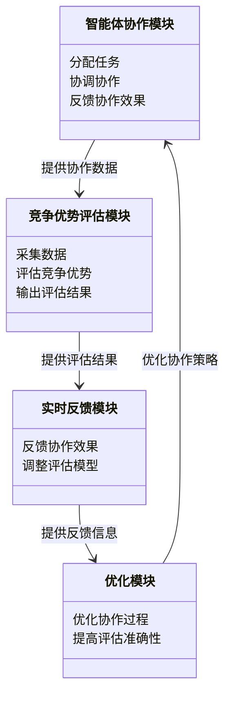

                 


# AI智能体协作：构建更全面的公司竞争优势评估模型

> 关键词：AI智能体协作、竞争优势评估模型、企业战略管理、系统架构设计、分布式协作

> 摘要：随着人工智能技术的快速发展，企业竞争优势的评估不再局限于传统的财务指标和市场份额，而是需要从更全面的角度考虑企业的核心竞争力。本文将探讨如何通过AI智能体协作构建一个更全面的公司竞争优势评估模型，以帮助企业更好地应对市场竞争和优化内部管理。通过分析AI智能体协作的核心原理、竞争优势评估模型的构建方法以及系统的实际应用，本文将为读者提供一个全新的视角来审视企业的竞争优势。

---

# 第一部分: AI智能体协作与竞争优势评估模型背景介绍

## 第1章: 问题背景与问题描述

### 1.1 问题背景

#### 1.1.1 当前企业竞争优势的核心要素
企业竞争优势的核心要素包括：
1. **市场地位**：企业在市场中的份额和品牌影响力。
2. **资源能力**：企业的技术、资金、人才等资源。
3. **运营效率**：企业内部流程的效率和灵活性。
4. **创新能力**：企业的研发能力和产品创新能力。
5. **客户关系**：与客户之间的关系和忠诚度。

#### 1.1.2 AI智能体协作对企业竞争优势的影响
AI智能体的协作能够提升企业的：
- **决策效率**：通过智能体的协作，企业可以更快地做出决策。
- **资源优化**：智能体能够协调资源，提高资源利用率。
- **创新能力**：智能体可以通过协作生成新的想法和解决方案。

#### 1.1.3 现有竞争优势评估模型的局限性
现有的竞争优势评估模型主要依赖于定量分析，忽视了：
- **动态变化**：市场环境和企业内部状况的动态变化。
- **协作效应**：企业内部不同部门或系统之间的协作效应。
- **实时反馈**：实时评估企业竞争优势的能力。

### 1.2 问题描述

#### 1.2.1 企业竞争优势的多维度特征
企业竞争优势的评估需要考虑：
1. **市场竞争力**：企业在市场中的竞争力。
2. **运营效率**：企业的运营效率和灵活性。
3. **创新能力**：企业的创新能力和技术领先性。
4. **客户满意度**：客户的满意度和忠诚度。

#### 1.2.2 AI智能体协作在竞争优势中的作用
AI智能体协作能够：
- **优化资源分配**：通过协作，智能体可以更好地分配资源。
- **提升决策效率**：智能体可以通过协作更快地做出决策。
- **增强创新能力**：智能体可以通过协作生成新的创新想法。

#### 1.2.3 当前竞争优势评估模型的不足
当前的评估模型主要依赖于：
- **静态分析**：无法实时评估企业的竞争优势。
- **单维度评估**：无法全面评估企业的竞争优势。
- **缺乏协作性**：无法考虑企业内部协作对竞争优势的影响。

---

## 第2章: 问题解决与边界定义

### 2.1 问题解决思路

#### 2.1.1 引入AI智能体协作的核心思想
引入AI智能体协作的核心思想是：
- **动态协作**：智能体能够动态调整协作策略。
- **实时反馈**：智能体能够实时反馈协作效果。
- **自我优化**：智能体能够自我优化协作过程。

#### 2.1.2 构建全面竞争优势评估模型的目标
构建全面竞争优势评估模型的目标是：
- **全面评估**：从多个维度评估企业的竞争优势。
- **实时反馈**：能够实时评估企业的竞争优势。
- **动态调整**：能够根据市场变化动态调整评估策略。

#### 2.1.3 解决现有模型不足的具体措施
解决现有模型不足的具体措施包括：
- **引入动态评估机制**：能够实时评估企业的竞争优势。
- **考虑协作效应**：能够考虑企业内部协作对竞争优势的影响。
- **优化评估模型**：能够根据反馈不断优化评估模型。

### 2.2 边界与外延

#### 2.2.1 竞争优势评估的范围界定
竞争优势评估的范围界定包括：
- **市场竞争力**：评估企业在市场中的竞争力。
- **运营效率**：评估企业的运营效率。
- **创新能力**：评估企业的创新能力。

#### 2.2.2 AI智能体协作的应用边界
AI智能体协作的应用边界包括：
- **企业内部协作**：企业内部各部门之间的协作。
- **外部协作**：与外部合作伙伴的协作。
- **市场环境**：市场环境的变化对协作的影响。

#### 2.2.3 相关概念的外延扩展
相关概念的外延扩展包括：
- **协作机制**：协作的机制和流程。
- **协作效果**：协作的效果和影响。
- **协作优化**：协作的优化和改进。

---

## 第3章: 核心概念结构与组成要素

### 3.1 核心概念结构

#### 3.1.1 AI智能体协作的系统架构
AI智能体协作的系统架构包括：
1. **智能体**：负责执行具体任务的智能体。
2. **协作机制**：智能体之间的协作机制。
3. **反馈系统**：实时反馈协作效果的系统。
4. **优化模块**：优化协作过程的模块。

#### 3.1.2 竞争优势评估模型的组成要素
竞争优势评估模型的组成要素包括：
1. **评估指标**：评估竞争优势的指标。
2. **评估方法**：评估的具体方法。
3. **反馈机制**：反馈评估结果的机制。
4. **优化模块**：优化评估模型的模块。

#### 3.1.3 两者的关联关系
AI智能体协作与竞争优势评估模型的关联关系是：
- **协作机制**：智能体之间的协作机制直接影响竞争优势评估的结果。
- **反馈系统**：实时反馈协作效果，能够动态调整评估模型。
- **优化模块**：优化协作过程，提高评估模型的准确性。

### 3.2 核心要素详细分析

#### 3.2.1 AI智能体的协作机制
AI智能体的协作机制包括：
1. **通信协议**：智能体之间的通信协议。
2. **任务分配**：任务的分配和协调。
3. **协作规则**：协作的规则和流程。

#### 3.2.2 竞争优势的多维度评估
竞争优势的多维度评估包括：
1. **市场竞争力**：评估企业在市场中的竞争力。
2. **运营效率**：评估企业的运营效率。
3. **创新能力**：评估企业的创新能力。

#### 3.2.3 模型的动态更新与优化
模型的动态更新与优化包括：
1. **实时反馈**：实时反馈评估结果。
2. **动态调整**：根据反馈动态调整评估模型。
3. **持续优化**：持续优化评估模型的准确性。

---

# 第二部分: AI智能体协作与竞争优势评估模型的核心概念与联系

## 第4章: AI智能体协作的核心原理

### 4.1 协作机制

#### 4.1.1 分布式协作原理
分布式协作原理是指：
- 每个智能体独立执行任务。
- 智能体之间通过通信协议进行协作。

#### 4.1.2 多智能体间的通信协议
多智能体间的通信协议包括：
1. **请求-响应机制**：智能体请求协作任务，其他智能体响应。
2. **事件驱动机制**：通过事件驱动协作。

#### 4.1.3 协作任务的分配与协调
协作任务的分配与协调包括：
1. **任务分解**：将任务分解为子任务。
2. **任务分配**：根据智能体的能力分配任务。
3. **任务协调**：协调智能体的任务执行。

### 4.2 智能体的属性与特征

#### 4.2.1 智能体的主动性与响应性
智能体的主动性与响应性包括：
1. **主动性**：智能体主动发起协作。
2. **响应性**：智能体对其他智能体的请求做出响应。

#### 4.2.2 智能体的自主性与协作性
智能体的自主性与协作性包括：
1. **自主性**：智能体能够自主决策。
2. **协作性**：智能体能够与其他智能体协作。

#### 4.2.3 智能体的可扩展性与适应性
智能体的可扩展性与适应性包括：
1. **可扩展性**：智能体能够扩展协作范围。
2. **适应性**：智能体能够适应环境的变化。

---

### 4.2.4 使用 Mermaid 绘制的概念属性特征对比表格

```mermaid
tableflip
| 智能体属性 | 描述 |
|------------|------|
| 主动性     | 智能体主动发起协作 |
| 响应性     | 智能体对请求做出响应 |
| 自主性     | 智能体能够自主决策 |
| 协作性     | 智能体能够与其他智能体协作 |
| 可扩展性   | 智能体能够扩展协作范围 |
| 适应性     | 智能体能够适应环境变化 |
```

---

## 第5章: 竞争优势评估模型的核心原理

### 5.1 竞争优势评估模型的组成

#### 5.1.1 评估指标
评估指标包括：
1. **市场占有率**：企业在市场中的份额。
2. **客户满意度**：客户的满意度和忠诚度。
3. **创新速度**：企业的创新速度和能力。
4. **运营效率**：企业的运营效率和灵活性。

#### 5.1.2 评估方法
评估方法包括：
1. **定量分析**：基于数据的定量分析。
2. **定性分析**：基于主观判断的定性分析。
3. **综合评估**：结合定量和定性分析的综合评估。

### 5.2 模型的动态更新与优化

#### 5.2.1 实时反馈机制
实时反馈机制包括：
1. **数据采集**：实时采集企业的各项数据。
2. **反馈评估**：根据数据实时评估企业的竞争优势。
3. **动态调整**：根据反馈动态调整评估模型。

#### 5.2.2 模型的优化策略
模型的优化策略包括：
1. **参数调整**：调整评估模型的参数。
2. **算法优化**：优化评估模型的算法。
3. **数据更新**：更新评估模型的数据。

---

### 5.2.3 使用 Mermaid 绘制的ER实体关系图架构

```mermaid
er
actor 竞争优势评估系统, 智能体协作系统, 竞争优势评估结果
```

---

## 第6章: 竞争优势评估模型与AI智能体协作的结合

### 6.1 协作机制与评估模型的关联

#### 6.1.1 协作任务的分配与评估指标
协作任务的分配与评估指标的关联包括：
1. **任务分解**：任务分解与评估指标的细化。
2. **任务分配**：任务分配与评估指标的权重。
3. **任务协调**：任务协调与评估指标的动态调整。

#### 6.1.2 协作效果与评估结果的关系
协作效果与评估结果的关系包括：
1. **协作效率**：协作效率影响评估结果。
2. **协作质量**：协作质量影响评估结果。
3. **协作成本**：协作成本影响评估结果。

### 6.2 竞争优势评估模型的动态更新

#### 6.2.1 实时反馈机制
实时反馈机制包括：
1. **数据采集**：实时采集企业的各项数据。
2. **反馈评估**：根据数据实时评估企业的竞争优势。
3. **动态调整**：根据反馈动态调整评估模型。

#### 6.2.2 模型的优化策略
模型的优化策略包括：
1. **参数调整**：调整评估模型的参数。
2. **算法优化**：优化评估模型的算法。
3. **数据更新**：更新评估模型的数据。

---

## 第7章: 竞争优势评估模型的系统架构设计

### 7.1 系统功能设计

#### 7.1.1 领域模型设计
领域模型设计包括：
1. **智能体协作模块**：负责智能体之间的协作。
2. **竞争优势评估模块**：负责竞争优势的评估。
3. **实时反馈模块**：负责实时反馈协作效果。
4. **优化模块**：负责优化协作过程。

#### 7.1.2 使用 Mermaid 绘制的领域模型类图



---

## 第8章: 竞争优势评估模型的算法原理

### 8.1 算法概述

#### 8.1.1 算法核心思想
算法核心思想包括：
1. **动态协作**：智能体能够动态调整协作策略。
2. **实时反馈**：智能体能够实时反馈协作效果。
3. **自我优化**：智能体能够自我优化协作过程。

### 8.2 算法实现步骤

#### 8.2.1 数据采集
数据采集包括：
1. **采集企业数据**：采集企业的各项数据。
2. **处理数据**：对数据进行预处理。
3. **存储数据**：将数据存储到数据库中。

#### 8.2.2 竞争优势评估
竞争优势评估包括：
1. **选择评估指标**：选择合适的评估指标。
2. **计算评估结果**：计算竞争优势的评估结果。
3. **输出评估结果**：输出评估结果。

### 8.3 算法的数学模型和公式

#### 8.3.1 竞争优势评估的数学模型
竞争优势评估的数学模型如下：

$$
\text{竞争优势} = \sum_{i=1}^{n} w_i \cdot x_i
$$

其中，$w_i$ 是评估指标 $x_i$ 的权重。

#### 8.3.2 动态协作的优化算法
动态协作的优化算法如下：

$$
\text{优化策略} = \arg \min_{\theta} \sum_{i=1}^{m} (y_i - f(\theta))^2
$$

其中，$\theta$ 是优化参数，$y_i$ 是目标值，$f(\theta)$ 是预测值。

---

## 第9章: 项目实战与案例分析

### 9.1 项目背景介绍

#### 9.1.1 项目目标
项目目标包括：
1. **构建竞争优势评估模型**：构建一个全面的竞争优势评估模型。
2. **实现AI智能体协作**：实现AI智能体的协作。
3. **优化评估模型**：优化竞争优势评估模型。

#### 9.1.2 项目环境
项目环境包括：
1. **开发工具**：Python、Jupyter Notebook。
2. **数据存储**：MySQL数据库。
3. **协作框架**：使用特定的协作框架。

### 9.2 核心代码实现

#### 9.2.1 数据采集与处理
数据采集与处理的代码如下：

```python
import pandas as pd

# 数据采集
data = pd.read_csv('企业数据.csv')

# 数据处理
data = data.dropna()
data = data.drop_duplicates()
```

#### 9.2.2 竞争优势评估
竞争优势评估的代码如下：

```python
def calculate_competitive_edge(data, weights):
    return pd.Series(data) * weights
```

#### 9.2.3 实时反馈与优化
实时反馈与优化的代码如下：

```python
def optimize_model(feedback):
    # 根据反馈优化模型
    pass
```

### 9.3 实际案例分析

#### 9.3.1 案例背景
案例背景包括：
1. **企业A**：一家科技公司。
2. **企业B**：一家传统制造公司。

#### 9.3.2 案例分析
案例分析包括：
1. **数据采集与处理**：采集企业A和企业B的数据。
2. **竞争优势评估**：评估两家企业在市场中的竞争优势。
3. **实时反馈与优化**：根据反馈优化评估模型。

#### 9.3.3 案例结果
案例结果包括：
1. **企业A**：竞争优势显著。
2. **企业B**：竞争优势较弱。
3. **优化模型**：优化后的模型更准确。

---

## 第10章: 最佳实践与注意事项

### 10.1 小结

#### 10.1.1 核心要点回顾
核心要点回顾包括：
1. **AI智能体协作的核心思想**：动态协作、实时反馈、自我优化。
2. **竞争优势评估模型的构建方法**：多维度评估、动态更新、优化策略。
3. **系统架构设计**：模块化设计、协作机制、反馈系统。

#### 10.1.2 项目成功的关键因素
项目成功的关键因素包括：
1. **数据质量**：数据的质量直接影响评估结果。
2. **协作效率**：协作效率影响评估模型的优化。
3. **模型优化**：模型的优化直接影响评估结果的准确性。

### 10.2 注意事项

#### 10.2.1 项目实施中的常见问题
项目实施中的常见问题包括：
1. **数据不足**：数据不足影响评估结果。
2. **协作失败**：协作失败影响评估模型的优化。
3. **模型过拟合**：模型过拟合影响评估结果的泛化能力。

#### 10.2.2 解决方案与建议
解决方案与建议包括：
1. **数据增强**：通过数据增强技术增加数据量。
2. **协作优化**：通过协作优化提高协作效率。
3. **模型优化**：通过正则化技术防止过拟合。

### 10.3 拓展阅读

#### 10.3.1 相关技术领域
相关技术领域包括：
1. **多智能体协作**：研究多智能体协作的最新技术。
2. **动态评估模型**：研究动态评估模型的最新进展。
3. **实时反馈系统**：研究实时反馈系统的最新技术。

#### 10.3.2 进一步学习方向
进一步学习方向包括：
1. **分布式协作算法**：深入学习分布式协作算法。
2. **动态评估模型**：深入学习动态评估模型的构建方法。
3. **实时反馈机制**：深入学习实时反馈机制的设计与实现。

---

## 作者信息

作者：AI天才研究院/AI Genius Institute & 禅与计算机程序设计艺术/Zen And The Art of Computer Programming

---

通过以上思考和分析，我们逐步构建了《AI智能体协作：构建更全面的公司竞争优势评估模型》的技术博客文章。接下来，我们将按照上述目录和结构，撰写完整的文章内容，以帮助读者更好地理解和应用这些概念。

