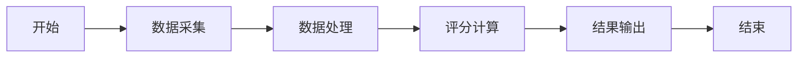
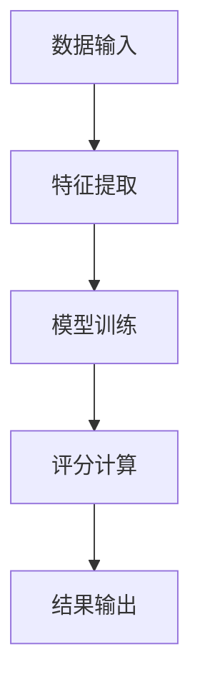
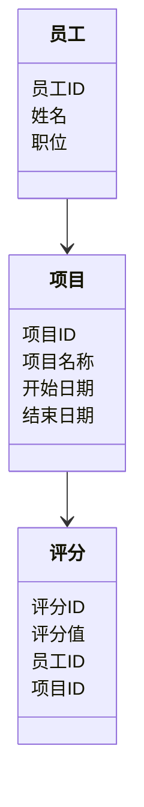
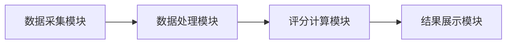
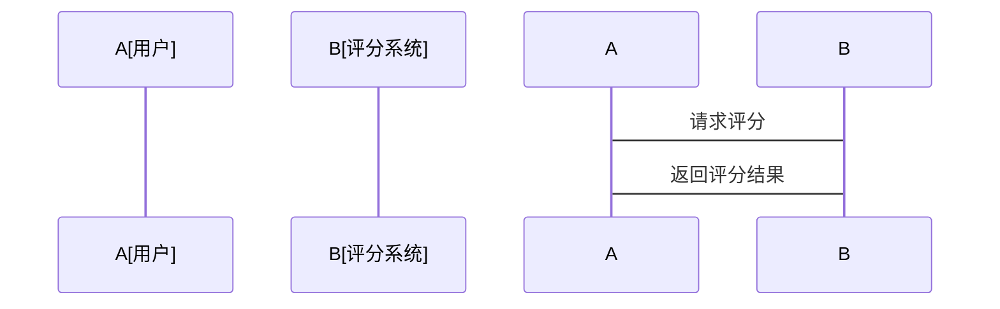

                 


# AI智能体协作：构建更全面的公司质量评分系统

## 关键词：AI智能体，协作，公司质量评分，系统架构，评分模型

## 摘要：  
本文探讨如何利用AI智能体的协作能力，构建一个更全面的公司质量评分系统。通过分析当前评分体系的不足，提出基于AI智能体协作的解决方案，详细讲解评分模型的构建、算法原理、系统架构设计，以及实际项目的实现与应用。

---

# 第1章: 背景介绍

## 1.1 问题背景

### 1.1.1 当前公司质量评分体系的局限性  
传统的公司质量评分体系通常基于简单的KPI（关键绩效指标）计算，难以全面反映公司的真实质量状况。例如，员工的协作效率、团队的整体表现以及创新性等复杂因素往往被忽视。

### 1.1.2 AI智能体协作的必要性  
AI智能体能够通过机器学习和自然语言处理等技术，自动分析和优化复杂的协作过程。引入AI智能体协作，可以显著提升评分系统的准确性和实时性。

### 1.1.3 问题解决的路径与目标  
通过构建基于AI智能体的协作评分系统，整合多维度数据，实现对公司质量的全面评估。

## 1.2 问题描述

### 1.2.1 公司质量评分的核心要素  
包括员工表现、团队协作、项目完成度、创新性等。

### 1.2.2 现有评分体系的不足  
现有体系通常基于简单的指标，缺乏对协作效率和创新性的量化评估。

### 1.2.3 AI智能体协作在评分系统中的作用  
AI智能体可以实时分析协作数据，提供更精准的评分建议。

## 1.3 问题解决

### 1.3.1 AI智能体协作的基本原理  
通过数据采集、分析和反馈，AI智能体能够优化评分系统。

### 1.3.2 评分系统构建的关键步骤  
包括数据采集、模型构建、系统设计和优化迭代。

### 1.3.3 系统边界与外延  
系统边界包括数据输入和输出，外延则涉及与其他系统的接口。

## 1.4 概念结构与核心要素

### 1.4.1 概念属性特征对比表  
| 概念      | 属性       | 特征         |
|-----------|------------|--------------|
| 员工表现   | 工作效率   | 高           |
| 团队协作   | 协作效率   | 中           |

### 1.4.2 ER实体关系图  
```mermaid
erd
  entity 员工 {
    id 员工ID
    name 姓名
    role 职位
  }

  entity 项目 {
    id 项目ID
    name 项目名称
    start_date 开始日期
    end_date 结束日期
  }

  entity 评分 {
    id 评分ID
    score 评分值
    employee 员工ID
    project 项目ID
  }
```

---

# 第2章: AI智能体协作的核心概念与联系

## 2.1 AI智能体协作的原理

### 2.1.1 智能体的定义与分类  
AI智能体可以分为简单反应式和基于模型的两类。

### 2.1.2 协作机制的数学模型  
协作机制可以用公式表示：  
$$ score = \sum_{i=1}^{n} w_i \cdot x_i $$  
其中，$w_i$ 是权重，$x_i$ 是指标值。

## 2.2 概念属性特征对比

### 2.2.1 表格对比分析  
| 指标       | 传统方法 | AI智能体协作 |
|------------|-----------|--------------|
| 数据来源   | 单一数据源 | 多数据源      |
| 处理方式   | 简单计算   | 智能分析      |

### 2.2.2 mermaid流程图  


---

# 第3章: 算法原理讲解

## 3.1 算法流程

### 3.1.1 mermaid流程图  


### 3.1.2 代码实现  
```python
def calculate_score(data):
    # 特征提取
    features = extract_features(data)
    # 模型训练
    model = train_model(features)
    # 评分计算
    score = model.predict(features)
    return score
```

## 3.2 数学模型与公式

### 3.2.1 评分模型公式  
$$ score = w_1x_1 + w_2x_2 + ... + w_nx_n $$

### 3.2.2 优化算法公式  
$$ w_i = \alpha \cdot w_i + (1-\alpha) \cdot x_i $$  
其中，$\alpha$ 是学习率。

---

# 第4章: 项目实战

## 4.1 项目介绍

### 4.1.1 项目目标  
构建一个基于AI智能体协作的公司质量评分系统。

### 4.1.2 项目范围  
涵盖员工表现、团队协作、项目完成度等多个维度。

## 4.2 系统功能设计

### 4.2.1 领域模型mermaid类图  


## 4.3 系统架构设计

### 4.3.1 mermaid架构图  


### 4.3.2 系统接口设计  
API接口：`GET /api/score?employee_id=123`。

## 4.4 系统交互设计

### 4.4.1 mermaid序列图  


---

# 第5章: 总结与展望

## 5.1 总结  
通过AI智能体协作，构建了一个全面的公司质量评分系统，能够更准确地评估公司质量。

## 5.2 展望  
未来可以引入更多AI技术，进一步优化评分系统。

---

# 作者：AI天才研究院/AI Genius Institute & 禅与计算机程序设计艺术 /Zen And The Art of Computer Programming

