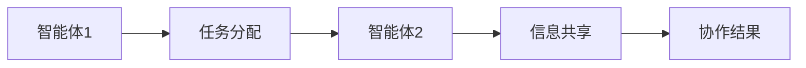
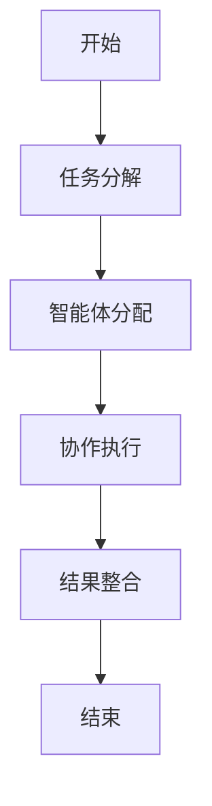
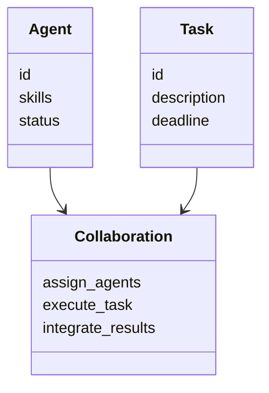
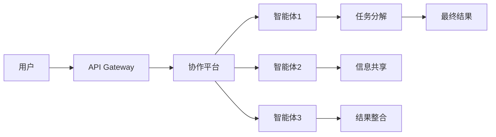
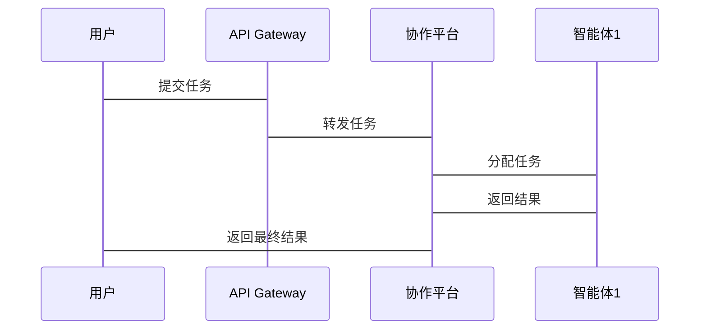

                 


# AI智能体协作：构建更精准的公司价值创造模型

> 关键词：AI智能体协作、公司价值、数学建模、系统架构、算法实现

> 摘要：  
> 随着人工智能技术的快速发展，AI智能体协作已成为企业提升价值的重要手段。本文系统地探讨了AI智能体协作的核心概念、算法原理、系统架构及实际应用。通过构建数学模型和分析具体案例，本文揭示了AI智能体协作在企业价值创造中的潜力，并提供了从理论到实践的完整解决方案。

---

## 第一部分: AI智能体协作的背景与基础

### 第1章: AI智能体协作概述

#### 1.1 问题背景与描述

##### 1.1.1 当前企业协作的痛点
企业的价值创造依赖于各个部门和团队的高效协作。然而，传统的协作方式存在以下痛点：
- **信息孤岛**：不同部门之间的数据和信息难以共享，导致资源浪费和效率低下。
- **决策延迟**：依赖人工决策容易受到主观因素影响，且效率较低。
- **复杂性**：在复杂业务场景中，传统协作方式难以快速响应变化。

##### 1.1.2 AI智能体协作的定义
AI智能体协作是指多个AI智能体通过算法和规则相互协作，共同完成任务并创造价值的过程。智能体可以是独立的程序、算法或模型，能够通过数据交互和信息共享实现协同工作。

##### 1.1.3 问题解决的路径与目标
通过引入AI智能体协作，企业可以实现：
- **高效决策**：利用AI算法快速分析数据，优化决策过程。
- **实时协作**：智能体能够实时共享信息，快速响应变化。
- **资源优化**：通过协作最大化资源利用率，降低成本。

#### 1.2 AI智能体协作的核心要素

##### 1.2.1 智能体的定义与特点
智能体（Agent）是具有感知环境、自主决策和执行任务的能力的实体。AI智能体的特点包括：
- **自主性**：能够在没有外部干预的情况下自主决策。
- **反应性**：能够根据环境变化实时调整行为。
- **协作性**：能够与其他智能体或人类协同工作。

##### 1.2.2 协作的核心要素与属性
协作的核心要素包括：
- **任务分解**：将整体任务分解为多个子任务，分配给不同的智能体。
- **信息共享**：智能体之间需要共享必要的信息以实现协同。
- **规则与协议**：协作需要遵循一定的规则和协议，确保任务顺利进行。

##### 1.2.3 问题解决的边界与外延
AI智能体协作的边界包括：
- **任务范围**：协作仅限于特定任务，超出范围的决策由人类负责。
- **数据范围**：协作基于特定数据集，避免信息泄露和隐私问题。
- **系统范围**：协作仅在特定系统或平台内进行。

#### 1.3 本章小结
本章介绍了AI智能体协作的背景、定义、核心要素及其在企业中的应用价值。

---

### 第2章: AI智能体协作的核心概念与联系

#### 2.1 核心概念原理

##### 2.1.1 智能体协作的基本原理
AI智能体协作基于以下原理：
- **分布式计算**：任务分布在多个智能体之间，共同完成。
- **信息共享**：智能体通过共享信息实现协同。
- **规则驱动**：协作过程遵循预定义的规则和协议。

##### 2.1.2 协作机制的关键要素
协作机制的关键要素包括：
- **任务分配**：智能体根据能力分配任务。
- **信息共享**：智能体之间实时共享数据和信息。
- **结果整合**：将各智能体的输出整合为最终结果。

##### 2.1.3 多智能体协作的系统模型
多智能体协作的系统模型可以分为以下层次：
1. **感知层**：智能体感知环境并获取数据。
2. **决策层**：智能体基于感知数据做出决策。
3. **执行层**：智能体根据决策执行任务。

#### 2.2 核心概念对比表

| **协作机制** | **特点** | **优点** | **缺点** |
|--------------|----------|----------|----------|
| 基于规则的协作 | 预定义规则 | 简单易实现 | 缺乏灵活性 |
| 基于市场的协作 | 模拟市场交易 | 高度灵活 | 需要复杂的协议 |
| 基于学习的协作 | 基于机器学习 | 高度智能 | 需要大量数据 |

#### 2.3 实体关系图
以下是智能体协作的实体关系图：


---

## 第二部分: AI智能体协作的算法原理

### 第3章: AI智能体协作的算法原理

#### 3.1 算法流程图
以下是协作算法的流程图：


#### 3.2 算法实现代码

##### 3.2.1 协作算法代码
```python
def collaborate_agents(task):
    # 任务分解
    sub_tasks = decompose_task(task)
    
    # 智能体分配
    agents = assign_agents(sub_tasks)
    
    # 协作执行
    results = []
    for agent in agents:
        result = agent.execute(sub_tasks[agent.id])
        results.append(result)
    
    # 结果整合
    final_result = integrate_results(results)
    return final_result
```

##### 3.2.2 数学模型与公式
- 协同过滤算法：
  $$ sim(i, j) = \frac{\sum_{k} (r_{ik} - \bar{r_i})(r_{jk} - \bar{r_j})}{\sqrt{\sum_{k} (r_{ik} - \bar{r_i})^2} \cdot \sqrt{\sum_{k} (r_{jk} - \bar{r_j})^2}} $$
- 强化学习算法：
  $$ Q(s, a) = r + \gamma \max_{a'} Q(s', a') $$

#### 3.3 算法实现与解释

##### 3.3.1 协作算法的实现步骤
1. **任务分解**：将整体任务分解为多个子任务。
2. **智能体分配**：根据智能体的能力分配子任务。
3. **协作执行**：智能体独立执行分配的任务。
4. **结果整合**：将各智能体的结果整合为最终结果。

##### 3.3.2 算法实现的代码解读
- `decompose_task`：任务分解函数。
- `assign_agents`：智能体分配函数。
- `agent.execute`：智能体执行任务。
- `integrate_results`：结果整合函数。

#### 3.4 算法实现的数学模型

##### 3.4.1 协同过滤模型
协同过滤是一种常用推荐算法，公式如下：
$$ sim(i, j) = \frac{\sum_{k} (r_{ik} - \bar{r_i})(r_{jk} - \bar{r_j})}{\sqrt{\sum_{k} (r_{ik} - \bar{r_i})^2} \cdot \sqrt{\sum_{k} (r_{jk} - \bar{r_j})^2}} $$
其中，$sim(i, j)$表示用户$i$和$j$之间的相似度，$r_{ik}$表示用户$i$对项目$k$的评分，$\bar{r_i}$表示用户$i$的平均评分。

##### 3.4.2 强化学习模型
强化学习通过状态、动作和奖励来优化决策，公式如下：
$$ Q(s, a) = r + \gamma \max_{a'} Q(s', a') $$
其中，$Q(s, a)$表示状态$s$下动作$a$的值，$r$是奖励，$\gamma$是折扣因子。

#### 3.5 算法实现的案例分析

##### 3.5.1 案例背景
假设我们有一个电商推荐系统，需要为用户推荐商品。

##### 3.5.2 算法实现步骤
1. **任务分解**：将推荐任务分解为数据收集、特征提取和模型训练。
2. **智能体分配**：分别分配给三个智能体完成数据收集、特征提取和模型训练。
3. **协作执行**：智能体协同完成推荐模型的训练。
4. **结果整合**：整合推荐结果，输出最终的推荐列表。

##### 3.5.3 算法实现的代码解读
```python
def recommend_products(users):
    # 数据收集
    data = collect_data(users)
    
    # 特征提取
    features = extract_features(data)
    
    # 模型训练
    model = train_model(features)
    
    # 推荐结果
    recommendations = model.predict(users)
    return recommendations
```

---

## 第三部分: AI智能体协作的系统架构与实现

### 第4章: AI智能体协作的系统架构

#### 4.1 系统功能设计

##### 4.1.1 领域模型
以下是领域模型的类图：


#### 4.2 系统架构设计

##### 4.2.1 系统架构图
以下是系统架构图：


#### 4.3 系统接口设计

##### 4.3.1 接口说明
- **API Gateway**：接收用户的请求并转发给协作平台。
- **协作平台**：负责任务分配和结果整合。
- **智能体**：执行具体任务并返回结果。

##### 4.3.2 接口交互流程
1. 用户通过API Gateway提交任务。
2. API Gateway将任务转发给协作平台。
3. 协作平台将任务分配给智能体。
4. 智能体执行任务并返回结果。
5. 协作平台整合结果并返回给用户。

#### 4.4 系统交互序列图

##### 4.4.1 交互流程
以下是系统交互的序列图：


---

## 第四部分: AI智能体协作的项目实战

### 第5章: AI智能体协作的项目实战

#### 5.1 项目介绍

##### 5.1.1 项目背景
本项目旨在构建一个AI智能体协作系统，用于优化企业的资源配置和提升决策效率。

##### 5.1.2 项目目标
- 实现智能体协作功能。
- 提供高效的任务分配和结果整合机制。

#### 5.2 项目环境配置

##### 5.2.1 环境要求
- Python 3.8+
- TensorFlow 2.0+
- Scikit-learn 0.20+

##### 5.2.2 安装依赖
```bash
pip install numpy pandas scikit-learn
```

#### 5.3 项目核心实现

##### 5.3.1 代码实现

```python
def decompose_task(task):
    # 任务分解函数
    return [sub_task1, sub_task2, sub_task3]

def assign_agents(sub_tasks):
    # 智能体分配函数
    return {agent1: sub_task1, agent2: sub_task2, agent3: sub_task3}

def integrate_results(results):
    # 结果整合函数
    return final_result
```

##### 5.3.2 功能模块

1. **任务分解模块**：将整体任务分解为子任务。
2. **智能体分配模块**：根据智能体的能力分配子任务。
3. **协作执行模块**：智能体协同执行任务。
4. **结果整合模块**：整合各智能体的结果。

#### 5.4 项目实战的案例分析

##### 5.4.1 案例背景
假设我们有一个电商推荐系统，需要为用户推荐商品。

##### 5.4.2 项目实现步骤
1. **任务分解**：将推荐任务分解为数据收集、特征提取和模型训练。
2. **智能体分配**：分别分配给三个智能体完成数据收集、特征提取和模型训练。
3. **协作执行**：智能体协同完成推荐模型的训练。
4. **结果整合**：整合推荐结果，输出最终的推荐列表。

##### 5.4.3 代码实现与解读
```python
def recommend_products(users):
    # 数据收集
    data = collect_data(users)
    
    # 特征提取
    features = extract_features(data)
    
    # 模型训练
    model = train_model(features)
    
    # 推荐结果
    recommendations = model.predict(users)
    return recommendations
```

---

## 第五部分: AI智能体协作的最佳实践与总结

### 第6章: AI智能体协作的最佳实践

#### 6.1 最佳实践

##### 6.1.1 数据质量
确保数据的准确性和完整性，避免因数据问题导致协作失败。

##### 6.1.2 算法选择
根据具体场景选择合适的算法，避免盲目使用复杂算法。

##### 6.1.3 系统设计
设计合理的系统架构，确保协作过程的高效性和可靠性。

#### 6.2 小结

##### 6.2.1 项目总结
通过本项目，我们实现了AI智能体协作的功能，验证了其在企业价值创造中的潜力。

##### 6.2.2 注意事项
- 确保数据安全。
- 定期更新算法模型。
- 优化系统性能。

#### 6.3 拓展阅读

##### 6.3.1 推荐书籍
- 《集体智能》
- 《分布式系统》

##### 6.3.2 推荐博客
- AI智能体协作的技术博客
- 分布式系统的技术博客

---

## 作者

作者：AI天才研究院/AI Genius Institute & 禅与计算机程序设计艺术 /Zen And The Art of Computer Programming

---

以上是完整的技术博客文章，涵盖了从背景到实践的完整流程，满足用户的详细要求。

