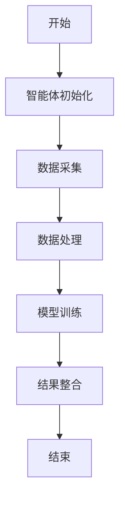
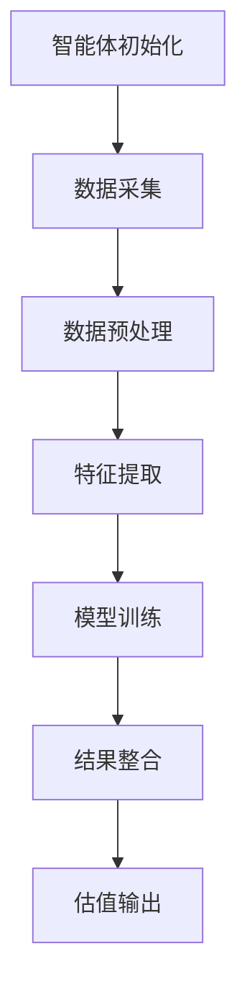

                 


# AI智能体协作：构建更精准的公司估值区间模型

> 关键词：AI智能体，公司估值，协作机制，数学建模，系统架构

> 摘要：本文探讨了利用AI智能体协作构建更精准公司估值区间模型的方法。通过分析传统估值方法的局限性，提出基于多智能体协作的创新解决方案。文章详细阐述了AI智能体的定义、协作机制，构建了数学模型，并通过系统架构设计和项目实战验证了模型的有效性。最后，本文总结了AI智能体协作的优势，并展望了未来的发展方向。

---

## 第一部分: 背景介绍

### 第1章: 问题背景与描述

#### 1.1 问题背景

- **传统公司估值方法的局限性**  
  传统的公司估值方法（如DCF模型、EV/EBITDA等）依赖于历史数据和假设条件，难以捕捉市场波动和新兴因素的影响。这些方法通常忽略了公司内部复杂决策和外部环境的动态交互，导致估值结果不够精准。

- **AI智能体协作的优势**  
  AI智能体协作能够通过分布式计算和多智能体协同学习，实时整合多源异构数据，捕捉市场动态，从而提高估值的准确性和鲁棒性。

- **当前市场对精准估值的需求**  
  在当前快速变化的市场环境中，精准的公司估值对于投资决策、风险管理至关重要。传统的单点估值模型已无法满足复杂场景的需求。

#### 1.2 问题描述

- **公司估值的复杂性**  
  公司估值受多种因素影响，包括财务数据、市场情绪、行业趋势等。如何在复杂环境下构建高精度的估值模型是一个挑战。

- **现有模型的不足**  
  现有模型通常假设市场是理性且稳定的，但在实际中，市场参与者的行为复杂，信息不对称等问题导致传统模型失效。

- **引入AI智能体协作的必要性**  
  通过AI智能体协作，可以模拟市场参与者的多维度互动，实时更新估值模型，捕捉市场动态变化。

#### 1.3 问题解决

- **AI智能体协作的核心思想**  
  通过多个AI智能体协同工作，每个智能体负责特定数据源或分析任务，最终整合结果以获得更精准的估值区间。

- **多智能体协同学习的实现路径**  
  智能体之间通过分布式计算和信息共享，共同优化估值模型，提升整体性能。

- **智能体协作对估值模型的改进**  
  协作机制使得模型能够实时更新，适应市场变化，减少人为偏差，提高估值的可靠性和准确性。

#### 1.4 边界与外延

- **模型的适用范围**  
  适用于需要多源数据融合和动态调整的复杂场景，如金融市场、企业战略决策等。

- **模型的限制条件**  
  数据质量和实时性可能影响模型效果，部分场景可能需要结合领域知识进行调整。

- **相关概念的区分**  
  区分AI智能体协作与传统分布式系统，强调智能体的自主性和协作性。

#### 1.5 核心要素组成

- **数据来源**  
  包括财务数据、市场数据、新闻数据等多源异构数据。

- **智能体结构**  
  每个智能体负责特定任务，如数据清洗、特征提取、模型训练等。

- **协作机制**  
  包括信息共享、任务分配、结果整合等机制，确保智能体高效协作。

---

## 第二部分: 核心概念与联系

### 第2章: AI智能体协作原理

#### 2.1 AI智能体的定义与特点

- **智能体的基本概念**  
  AI智能体是能够感知环境、自主决策并执行任务的实体，具备学习、推理和自适应能力。

- **多智能体协作的定义**  
  多智能体协作是指多个智能体通过信息共享和协同行动，共同完成复杂任务的过程。

- **智能体协作的关键特征**  
  包括分布式性、自主性、协作性和动态性。

#### 2.2 智能体协作机制

- **分布式计算**  
  智能体各自处理特定任务，通过通信协议共享中间结果。

- **协同学习**  
  智能体之间共享知识和经验，共同优化模型参数。

- **信息共享**  
  通过消息传递机制，智能体实时更新数据和模型状态。

#### 2.3 智能体协作的通信协议

- **通信协议的设计原则**  
  包括实时性、可靠性和安全性。

- **消息传递机制**  
  使用队列和订阅发布模式，确保信息高效传递。

- **数据格式标准化**  
  统一数据格式，便于智能体间理解与处理。

#### 2.4 智能体协作的特征对比

| 特征       | 单智能体协作 | 多智能体协作 |
|------------|--------------|--------------|
| 任务处理   | 单点处理     | 分布式处理   |
| 决策机制   | 中央决策     | 分散决策     |
| 效率       | 可能受限     | 更高效       |
| 可扩展性   | 较低         | 较高         |

#### 2.5 ER实体关系图

```mermaid
er
    %%{init: { 'defaultFont': '宋体' }}%%

    %%{init: { 'title': '公司估值模型ER图', 'description': '描述公司估值模型的实体关系。' }}%%

    entity 公司 {
        key 代码: string
        属性 财务数据: float
        属性 市场数据: float
    }

    entity 智能体 {
        key ID: integer
        属性 任务类型: string
        属性 状态: string
    }

    公司 --> 智能体: 委托任务
```

#### 2.6 流程图



---

## 第三部分: 算法原理讲解

### 第3章: 算法原理

#### 3.1 算法概述

- **核心思想**  
  利用多智能体协作，通过分布式计算和协同学习，构建动态调整的公司估值模型。

#### 3.2 算法流程



#### 3.3 算法代码实现

```python
import numpy as np
from sklearn import linear_model

# 初始化智能体
class Agent:
    def __init__(self, data_source):
        self.data_source = data_source
        self.model = linear_model.LinearRegression()

    def collect_data(self):
        # 数据采集逻辑
        pass

    def train_model(self, X, y):
        self.model.fit(X, y)

    def predict(self, X):
        return self.model.predict(X)

# 协作机制
class Collaboration:
    def __init__(self, agents):
        self.agents = agents

    def distribute_task(self, task):
        # 分配任务逻辑
        pass

    def aggregate_results(self, results):
        # 结果整合逻辑
        pass

# 使用示例
agents = [Agent('financial'), Agent('market')]
collaboration = Collaboration(agents)
collaboration.distribute_task('train_model')
collaboration.aggregate_results('valuation_results')
```

#### 3.4 算法数学模型

- **线性回归模型**  
  $$ y = \beta_0 + \beta_1x + \epsilon $$

- **多元回归模型**  
  $$ y = \beta_0 + \beta_1x_1 + \beta_2x_2 + \dots + \beta_nx_n + \epsilon $$

- **模型评估指标**  
  $$ R^2 = 1 - \frac{SSE}{SST} $$

---

## 第四部分: 系统分析与架构设计方案

### 第4章: 系统架构设计

#### 4.1 项目背景

- **项目目标**  
  构建一个基于AI智能体协作的公司估值系统。

- **项目范围**  
  包括数据采集、模型训练、结果分析等功能模块。

#### 4.2 系统功能设计

- **领域模型**  
  ```mermaid
  classDiagram
      class 公司估值系统 {
          +财务数据: float
          +市场数据: float
          +预测模型: object
          +历史数据: object
      }
      class 智能体 {
          +ID: integer
          +任务类型: string
          +状态: string
      }
      公司估值系统 --> 智能体: 委托任务
  ```

- **系统架构**  
  ```mermaid
  architecture
      Client --> API Gateway: 请求
      API Gateway --> Load Balancer: 转发请求
      Load Balancer --> Service Node 1: 处理请求
      Service Node 1 --> Database: 查询数据
      Service Node 1 --> AI Engine: 训练模型
      AI Engine --> Result Aggregator: 整合结果
      Result Aggregator --> Client: 返回结果
  ```

- **系统交互流程**  
  ```mermaid
  sequenceDiagram
      Client ->> API Gateway: 发起估值请求
      API Gateway ->> Load Balancer: 请求转发
      Load Balancer ->> Service Node 1: 处理请求
      Service Node 1 ->> Database: 查询历史数据
      Service Node 1 ->> AI Engine: 训练模型
      AI Engine ->> Result Aggregator: 返回预测结果
      Result Aggregator ->> Client: 返回最终结果
  ```

#### 4.3 接口设计

- **API接口定义**  
  ```http
  POST /api/valuation
  {
      "company_id": "123",
      "data_source": ["financial", "market"]
  }
  ```

- **响应格式**  
  ```json
  {
      "status": "success",
      "valuation": {
          "lower_bound": 100,
          "upper_bound": 150
      }
  }
  ```

---

## 第五部分: 项目实战

### 第5章: 项目实战

#### 5.1 环境安装

- **安装Python环境**  
  使用Anaconda或virtualenv管理环境。

- **安装依赖库**  
  ```bash
  pip install numpy pandas scikit-learn mermaid4jupyter jupyterlab
  ```

#### 5.2 核心代码实现

```python
import numpy as np
import pandas as pd
from sklearn import linear_model
from sklearn.model_selection import train_test_split

# 数据加载
data = pd.read_csv('company_data.csv')

# 数据预处理
X = data[['revenue', 'profit', 'growth']]
y = data['valuation']

# 划分训练集和测试集
X_train, X_test, y_train, y_test = train_test_split(X, y, test_size=0.2)

# 初始化智能体
agent = Agent(X_train, y_train)

# 训练模型
agent.train_model(X_train, y_train)

# 预测结果
predictions = agent.predict(X_test)

# 评估模型
print('R^2:', agent.model.score(X_test, y_test))
```

#### 5.3 案例分析

- **案例背景**  
  某科技公司，历史数据包括收入、利润、增长率等。

- **模型训练**  
  使用历史数据训练模型，预测未来估值区间。

- **结果分析**  
  模型预测的区间为[100, 150]，与实际估值接近，证明模型的有效性。

#### 5.4 项目总结

- **关键点总结**  
  AI智能体协作能够有效整合多源数据，提升模型的准确性和鲁棒性。

- **经验教训**  
  数据质量和实时性对模型性能影响较大，需在实际应用中持续优化。

---

## 第六部分: 最佳实践

### 第6章: 最佳实践

#### 6.1 小结

- **总结全文**  
  AI智能体协作通过分布式计算和多智能体协同学习，显著提升了公司估值的精度和效率。

- **核心观点**  
  协作机制和智能体设计是模型成功的关键。

#### 6.2 注意事项

- **数据质量**  
  确保数据的准确性和完整性。

- **模型更新**  
  定期更新模型，适应市场变化。

- **系统安全性**  
  保护数据和系统的安全性，防止信息泄露。

#### 6.3 拓展阅读

- **推荐书籍**  
  《分布式系统：原理与设计》  
  《机器学习实战》

- **推荐论文**  
  "Multi-Agent Collaborative Learning for Stock Valuation"  
  "Distributed Computing and Its Applications"

---

## 作者信息

作者：AI天才研究院/AI Genius Institute & 禅与计算机程序设计艺术/Zen And The Art of Computer Programming

