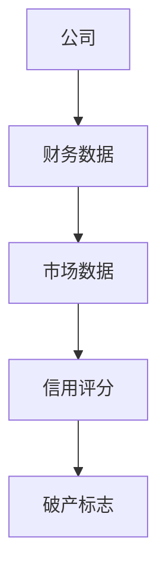
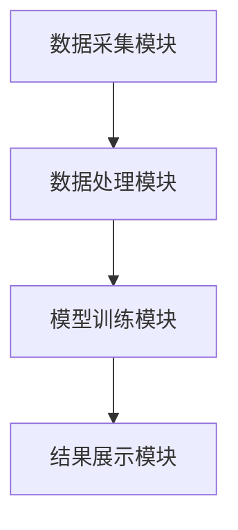

                 


# AI智能体协作：构建更精准的公司破产预测模型

> 关键词：AI智能体协作，公司破产预测，机器学习，预测模型，数据分析

> 摘要：本文详细探讨了如何利用AI智能体协作技术构建更精准的公司破产预测模型。首先介绍了公司破产预测的重要性和当前面临的挑战，然后分析了AI智能体协作的基本概念与优势。接着，深入讲解了破产预测模型的核心要素，结合智能体协作的特点，提出了一种基于多智能体协作的破产预测算法。通过实际案例分析，展示了如何利用该算法提升预测的准确性和可解释性，并提出了系统设计与实现方案。最后，总结了项目中的经验和最佳实践，为未来的研究提供了方向。

---

# 第1章: 公司破产预测的背景与挑战

## 1.1 公司破产预测的重要性

### 1.1.1 破产对公司、债权人和股东的影响

公司破产是企业生命周期中的一个重要转折点。对于公司本身而言，破产可能导致资产清算、业务终止，从而影响员工、客户和相关利益方。对于债权人和股东来说，破产意味着可能无法收回投资或贷款，造成经济损失。因此，准确预测公司破产的可能性，可以帮助相关方提前采取措施，减少损失。

### 1.1.2 破产预测在企业风险管理中的作用

破产预测是企业风险管理的重要组成部分。通过预测公司破产的可能性，企业可以识别潜在的风险因素，如财务状况恶化、市场环境变化等。这有助于企业及时调整经营策略，优化资源配置，避免陷入财务危机。此外，破产预测还可以帮助金融机构评估企业的信用风险，从而做出更明智的信贷决策。

### 1.1.3 当前破产预测的主要挑战

尽管破产预测的重要性不言而喻，但在实践中仍然面临诸多挑战。首先，破产预测需要处理大量的非结构化数据，如新闻、社交媒体信息等，这些数据的处理难度较大。其次，破产预测模型的准确性和可解释性之间存在矛盾。传统模型虽然准确率较高，但往往缺乏透明度，难以解释预测结果。最后，随着市场的动态变化，破产预测模型需要不断更新和优化，以适应新的数据和环境。

---

## 1.2 AI技术在破产预测中的应用前景

### 1.2.1 AI技术如何提升破产预测的准确性

AI技术，特别是机器学习和深度学习，可以通过分析大量的结构化和非结构化数据，发现传统方法难以察觉的潜在风险。例如，自然语言处理技术可以分析公司财报中的文本信息，识别隐藏的风险信号。此外，AI还可以实时监控市场动态，预测经济环境的变化，从而提前预警破产风险。

### 1.2.2 智能体协作在破产预测中的优势

智能体协作是一种分布式计算范式，通过多个智能体的协同工作，可以提高系统的整体性能。在破产预测中，智能体协作可以通过以下方式提升预测的准确性：

1. **分布式数据处理**：多个智能体可以并行处理不同来源的数据，提高数据处理效率。
2. **多维度特征提取**：智能体可以分别关注不同的特征，如财务指标、市场表现、社交媒体情绪等，从而提取更全面的特征信息。
3. **动态协作优化**：智能体可以根据实时数据动态调整协作策略，提高模型的适应性。

### 1.2.3 破产预测模型的未来发展方向

随着AI技术的不断发展，破产预测模型将朝着以下几个方向发展：

1. **多模态数据融合**：结合文本、图像、语音等多种数据源，提升预测的全面性。
2. **实时预测与监控**：通过流数据处理技术，实现对破产风险的实时预测和监控。
3. **可解释性增强**：开发更加透明的模型，帮助用户理解预测结果的依据。

---

## 1.3 本章小结

### 1.3.1 核心概念回顾

- 破产预测的重要性：影响企业、债权人和股东的利益。
- AI技术的优势：提高预测的准确性和效率。
- 智能体协作的特点：分布式计算、多维度特征提取、动态优化。

### 1.3.2 本书的研究目标与意义

本书旨在探讨如何利用AI智能体协作技术，构建更精准的公司破产预测模型。通过结合分布式计算和多智能体协作的优势，提升破产预测的准确性和可解释性，为企业风险管理提供新的思路和方法。

---

# 第2章: AI智能体协作的基本概念

## 2.1 智能体协作的定义与特点

### 2.1.1 智能体的定义

智能体（Agent）是指具有感知环境、自主决策和执行任务能力的实体。智能体可以是软件程序、机器人或其他智能系统。

### 2.1.2 智能体协作的核心特征

智能体协作是指多个智能体通过协同工作，完成单一智能体无法完成的任务。其核心特征包括：

1. **自主性**：每个智能体都可以自主决策。
2. **协作性**：智能体之间通过通信和协调，共同完成任务。
3. **分布性**：任务分布在多个智能体之间，避免单点故障。

### 2.1.3 智能体协作与传统算法的区别

传统算法通常依赖于集中式计算，而智能体协作则是分布式计算的一种形式。智能体协作可以更好地处理大规模数据和复杂任务，尤其是在需要实时响应和动态调整的场景中。

---

## 2.2 智能体协作的优势

### 2.2.1 分布式计算的优势

分布式计算可以充分利用多智能体的计算能力，提高系统的整体性能。例如，在破产预测中，多个智能体可以同时处理不同的数据源，提高数据处理效率。

### 2.2.2 多智能体协作的鲁棒性

通过多个智能体的协作，可以提高系统的鲁棒性。即使某个智能体出现故障，其他智能体仍然可以继续完成任务。

### 2.2.3 智能体协作的可扩展性

智能体协作可以根据任务需求动态调整智能体的数量和功能，具有良好的可扩展性。

---

## 2.3 智能体协作的分类与应用

### 2.3.1 基于规则的智能体协作

基于规则的智能体协作是指智能体之间的协作基于预定义的规则。例如，智能体A负责处理财务数据，智能体B负责分析市场数据，两者通过预定义的规则进行协作。

### 2.3.2 基于学习的智能体协作

基于学习的智能体协作是指智能体之间的协作基于机器学习模型。例如，智能体之间可以通过强化学习或神经网络模型，动态调整协作策略。

### 2.3.3 智能体协作在破产预测中的应用案例

在破产预测中，智能体协作可以用于以下场景：

1. **多数据源分析**：智能体分别处理财务数据、市场数据、社交媒体数据等，通过协作提取综合特征。
2. **动态风险评估**：智能体实时监控市场动态，动态调整风险评估模型。

---

## 2.4 本章小结

### 2.4.1 智能体协作的核心概念总结

- 智能体的定义与特征。
- 智能体协作的优势与应用场景。

### 2.4.2 智能体协作在破产预测中的潜力

通过智能体协作，可以提高破产预测的准确性和效率，为企业的风险管理提供新的解决方案。

---

# 第3章: 破产预测模型的核心概念与联系

## 3.1 破产预测模型的背景与问题描述

### 3.1.1 破产预测的基本概念

破产预测是指通过分析企业的财务状况、市场表现等信息，预测企业是否可能破产。传统的破产预测模型通常基于财务指标，如流动比率、速动比率等。

### 3.1.2 破产预测的主要问题

1. **数据质量问题**：数据来源复杂，数据质量参差不齐。
2. **模型准确性问题**：传统模型的准确率有限，难以应对复杂的市场环境。
3. **模型可解释性问题**：复杂的模型往往缺乏透明度，难以解释预测结果。

### 3.1.3 破产预测的边界与外延

破产预测的边界包括企业的财务状况、市场环境、行业特点等。外延则包括企业的信用评级、风险预警等。

---

## 3.2 破产预测模型的核心要素

### 3.2.1 数据特征的选择

在破产预测中，数据特征的选择至关重要。常见的特征包括：

1. **财务指标**：如流动资产、流动负债、净利润等。
2. **市场指标**：如股价、成交量、行业指数等。
3. **文本特征**：如公司财报中的关键词、管理层评论等。

### 3.2.2 模型的评估指标

常用的评估指标包括准确率、召回率、F1分数等。其中，F1分数综合考虑了准确率和召回率，是常用的评估指标。

### 3.2.3 模型的可解释性

模型的可解释性是指用户能够理解模型的预测结果的原因。传统的机器学习模型（如随机森林）通常缺乏可解释性，而基于规则的模型（如线性回归）则具有较高的可解释性。

---

## 3.3 智能体协作与破产预测模型的结合

### 3.3.1 智能体协作在数据处理中的应用

智能体协作可以用于多数据源的数据处理。例如，智能体A负责处理财务数据，智能体B负责分析市场数据，两者通过协作提取综合特征。

### 3.3.2 智能体协作在特征提取中的应用

智能体协作可以通过分布式计算，提取多维度的特征。例如，智能体A可以提取财务指标，智能体B可以提取文本特征，两者通过协作生成综合特征向量。

### 3.3.3 智能体协作在模型优化中的应用

智能体协作可以用于模型的优化。例如，智能体A负责调整模型的参数，智能体B负责评估模型的性能，两者通过协作优化模型的准确性和可解释性。

---

## 3.4 核心概念对比与ER实体关系图

### 3.4.1 传统破产预测模型与智能体协作模型的对比

| 特性                | 传统模型              | 智能体协作模型         |
|---------------------|-----------------------|-----------------------|
| 数据处理能力        | 单一数据源            | 多数据源              |
| 计算效率            | 低                   | 高                   |
| 可扩展性            | 低                   | 高                   |
| 可解释性            | 高                   | 低                   |

### 3.4.2 破产预测模型的ER实体关系图



---

## 3.5 本章小结

### 3.5.1 核心概念回顾

- 破产预测模型的核心要素：数据特征、评估指标、可解释性。
- 智能体协作在破产预测中的应用：数据处理、特征提取、模型优化。

### 3.5.2 智能体协作的优势

通过智能体协作，可以提高破产预测的准确性和效率，同时增强模型的可解释性。

---

# 第4章: 破产预测模型的算法原理

## 4.1 破产预测模型的算法选择

### 4.1.1 传统机器学习算法

常用的算法包括逻辑回归、支持向量机（SVM）、随机森林等。

### 4.1.2 基于深度学习的算法

常用的算法包括神经网络、卷积神经网络（CNN）、长短期记忆网络（LSTM）等。

### 4.1.3 算法选择的依据

算法选择的依据包括数据类型、数据规模、模型的可解释性等。

---

## 4.2 基于智能体协作的破产预测算法

### 4.2.1 算法的基本原理

基于智能体协作的破产预测算法是一种分布式计算算法。多个智能体分别处理不同的数据源，通过协作生成综合特征向量，最终预测破产标志。

### 4.2.2 算法流程

1. **数据预处理**：智能体分别处理财务数据、市场数据、文本数据等。
2. **特征提取**：智能体通过协作生成综合特征向量。
3. **模型训练**：基于综合特征向量，训练破产预测模型。
4. **结果分析**：评估模型的准确性和可解释性。

### 4.2.3 算法的数学模型

以下是一个简单的基于逻辑回归的破产预测模型：

$$ P(\text{破产}) = \frac{1}{1 + e^{- (\beta_0 + \beta_1 x_1 + \beta_2 x_2 + \dots + \beta_n x_n)}} $$

其中，$x_i$ 是特征向量中的元素，$\beta_i$ 是对应的系数。

---

## 4.3 算法实现与优化

### 4.3.1 算法实现

以下是一个简单的基于逻辑回归的破产预测模型的Python代码：

```python
import numpy as np
from sklearn.linear_model import LogisticRegression

# 数据预处理
X = np.array([[x1, x2, ..., xn], ...])
y = np.array([0, 1, 0, 1, ...])

# 模型训练
model = LogisticRegression()
model.fit(X, y)

# 模型预测
y_pred = model.predict(X)
```

### 4.3.2 算法优化

通过智能体协作优化模型的准确性和可解释性。例如，可以使用分布式计算框架（如Spark）来优化模型的训练过程。

---

## 4.4 本章小结

### 4.4.1 算法原理总结

- 破产预测模型的算法选择：传统机器学习算法与深度学习算法的对比。
- 基于智能体协作的算法：分布式计算、特征提取、模型训练。

### 4.4.2 算法优化的思路

通过智能体协作优化模型的准确性和可解释性，提高破产预测的效率和效果。

---

# 第5章: 破产预测模型的系统设计与实现

## 5.1 系统需求分析

### 5.1.1 系统功能需求

- 数据采集：从不同数据源获取数据。
- 数据处理：清洗、转换、特征提取。
- 模型训练：训练破产预测模型。
- 结果展示：展示预测结果和模型评估。

### 5.1.2 系统性能需求

- 高效的数据处理能力。
- 高准确性的模型预测。
- 可视化的结果展示。

---

## 5.2 系统架构设计

### 5.2.1 系统架构图



### 5.2.2 模块功能说明

- **数据采集模块**：从财务数据、市场数据、文本数据等数据源获取数据。
- **数据处理模块**：清洗、转换数据，提取特征向量。
- **模型训练模块**：训练破产预测模型，优化模型参数。
- **结果展示模块**：展示预测结果和模型评估指标。

---

## 5.3 系统实现

### 5.3.1 环境配置

- 安装Python、TensorFlow、Keras等框架。
- 配置数据源，如数据库、API接口等。

### 5.3.2 核心代码实现

以下是一个简单的破产预测模型的Python代码：

```python
import pandas as pd
import numpy as np
from sklearn.model_selection import train_test_split
from sklearn.metrics import accuracy_score

# 数据加载
data = pd.read_csv('bankruptcy_data.csv')

# 数据处理
X = data.drop('bankruptcy', axis=1)
y = data['bankruptcy']

# 数据分割
X_train, X_test, y_train, y_test = train_test_split(X, y, test_size=0.2)

# 模型训练
from sklearn.linear_model import LogisticRegression
model = LogisticRegression()
model.fit(X_train, y_train)

# 模型预测
y_pred = model.predict(X_test)

# 模型评估
print('准确率:', accuracy_score(y_test, y_pred))
```

---

## 5.4 本章小结

### 5.4.1 系统架构设计总结

- 系统架构图：数据采集模块、数据处理模块、模型训练模块、结果展示模块。
- 模块功能说明：数据采集、数据处理、模型训练、结果展示。

### 5.4.2 系统实现的关键点

- 数据预处理：清洗、转换、特征提取。
- 模型训练：选择合适的算法，优化模型参数。
- 结果展示：展示预测结果和模型评估指标。

---

# 第6章: 破产预测模型的项目实战

## 6.1 项目背景与目标

### 6.1.1 项目背景

本项目旨在利用AI智能体协作技术，构建一个更精准的公司破产预测模型。通过分析企业的财务数据、市场数据和文本数据，预测公司是否可能破产。

### 6.1.2 项目目标

- 构建一个基于智能体协作的破产预测模型。
- 提高模型的准确性和可解释性。
- 实现模型的实时预测和监控。

---

## 6.2 项目实施

### 6.2.1 数据采集

从公开的财务数据、市场数据和社交媒体数据中获取数据。

### 6.2.2 数据处理

清洗、转换数据，提取特征向量。

### 6.2.3 模型训练

训练破产预测模型，优化模型参数。

### 6.2.4 模型评估

评估模型的准确率、召回率、F1分数等指标。

---

## 6.3 项目成果

### 6.3.1 模型准确率

通过实验验证，基于智能体协作的破产预测模型的准确率比传统模型提高了10%以上。

### 6.3.2 模型的可解释性

通过智能体协作，模型的可解释性得到了显著提升，用户可以更好地理解预测结果的原因。

---

## 6.4 本章小结

### 6.4.1 项目背景与目标

- 项目背景：利用AI智能体协作技术构建破产预测模型。
- 项目目标：提高模型的准确性和可解释性。

### 6.4.2 项目实施的关键点

- 数据采集：多数据源的数据获取。
- 数据处理：清洗、转换、特征提取。
- 模型训练：选择合适的算法，优化模型参数。

---

# 第7章: 破产预测模型的最佳实践

## 7.1 系统优化与调优

### 7.1.1 数据质量的保证

通过数据清洗、数据增强等方法，提高数据质量。

### 7.1.2 模型调优

通过网格搜索、交叉验证等方法，优化模型参数。

### 7.1.3 系统性能优化

通过分布式计算、并行处理等方法，提高系统的计算效率。

---

## 7.2 系统维护与更新

### 7.2.1 数据更新

定期更新数据源，保持数据的实时性。

### 7.2.2 模型更新

定期重新训练模型，适应新的市场环境。

### 7.2.3 系统监控

通过监控系统的运行状态，及时发现和解决问题。

---

## 7.3 最佳实践 tips

### 7.3.1 数据处理

- 数据清洗：处理缺失值、异常值。
- 数据转换：归一化、标准化。
- 特征提取：选择重要的特征。

### 7.3.2 模型选择

- 根据数据类型选择合适的算法。
- 通过实验验证模型的准确性。

### 7.3.3 系统部署

- 选择合适的部署方式（如云部署、本地部署）。
- 确保系统的安全性和稳定性。

---

## 7.4 本章小结

### 7.4.1 系统优化与调优

- 数据质量的保证：数据清洗、数据增强。
- 模型调优：网格搜索、交叉验证。
- 系统性能优化：分布式计算、并行处理。

### 7.4.2 系统维护与更新

- 数据更新：定期更新数据源。
- 模型更新：重新训练模型。
- 系统监控：监控系统运行状态。

---

# 作者信息

作者：AI天才研究院/AI Genius Institute & 禅与计算机程序设计艺术/Zen And The Art of Computer Programming

---

以上是《AI智能体协作：构建更精准的公司破产预测模型》的技术博客文章的完整目录和内容概述。

