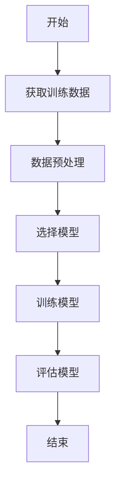
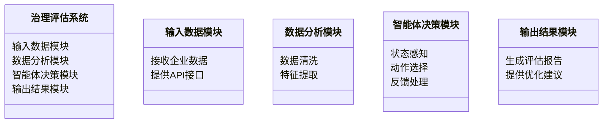

                 


# AI智能体在公司治理评估中的应用

## 关键词：AI智能体、公司治理评估、强化学习、系统架构、企业决策支持

## 摘要：  
随着人工智能技术的快速发展，AI智能体在企业管理中的应用日益广泛。本文将探讨AI智能体在公司治理评估中的应用，从理论基础到实际案例，详细分析其核心原理、算法实现、系统架构及应用场景。通过结合强化学习、监督学习等算法，AI智能体能够高效地对公司治理结构、风险管理、决策优化等方面进行评估与优化，为企业提供智能化的决策支持。

---

## 第一部分：AI智能体与公司治理评估的背景

### 第1章：AI智能体与公司治理评估的背景

#### 1.1 AI智能体的定义与核心概念  
AI智能体（Artificial Intelligence Agent）是指能够感知环境、做出决策并采取行动的智能系统。与传统的AI系统不同，智能体具有更强的自主性和适应性，能够根据环境反馈动态调整行为。  
- **智能体的基本特征**：自主性、反应性、目标导向性、社会性。  
- **智能体的分类**：基于任务类型可分为工具型智能体、服务型智能体、自主型智能体等。  

#### 1.2 公司治理评估的定义与重要性  
公司治理是指公司内部和外部利益相关者之间的关系管理，包括董事会结构、管理层决策、股东权益保护、风险管理等方面。治理评估则是通过量化指标对公司治理的健康状况进行评价。  
- **治理评估的常见指标**：透明度、合规性、股东权益保护、管理层责任、风险管理能力等。  
- **治理评估的重要性**：良好的公司治理是企业长期发展的基石，直接影响企业的信用评级、投资者信心和市场表现。  

#### 1.3 AI智能体在公司治理评估中的应用背景  
传统公司治理评估依赖人工分析，存在效率低、主观性强、覆盖面有限等问题。AI智能体的引入能够通过大数据分析、机器学习算法，实现对公司治理的智能化评估与优化。  
- **技术驱动**：AI技术的快速发展为治理评估提供了新的工具和方法。  
- **场景需求**：企业面临日益复杂的监管环境和市场压力，需要更高效的治理评估解决方案。  

---

## 第二部分：AI智能体的核心原理与公司治理评估的结合

### 第2章：AI智能体的核心原理

#### 2.1 智能体的感知与决策机制  
AI智能体通过感知环境、分析数据、制定决策并执行动作来完成任务。  
- **感知模块**：负责数据的采集与特征提取，例如从企业财报、新闻、监管报告中提取关键信息。  
- **决策模块**：基于感知到的信息，利用算法生成决策，例如选择最优的治理结构或风险应对策略。  
- **执行模块**：将决策转化为具体动作，例如调整董事会结构或优化风险管理流程。  

#### 2.2 智能体的算法基础  
AI智能体的决策过程依赖于多种算法，包括强化学习、监督学习和无监督学习。  
- **强化学习**：通过试错机制不断优化决策策略，适用于动态变化的环境。  
- **监督学习**：基于标注数据进行模式识别，适用于已知任务的分类与预测。  
- **无监督学习**：通过数据聚类发现潜在规律，适用于复杂场景下的异常检测。  

#### 2.3 智能体的数学模型与算法实现  
以下是强化学习中常用的Q-learning算法公式：  
$$ Q(s, a) = Q(s, a) + \alpha \cdot (r + \max_{a'} Q(s', a') - Q(s, a)) $$  
其中，$s$表示当前状态，$a$表示动作，$r$表示奖励，$\alpha$表示学习率。  

---

## 第三部分：公司治理评估的基础

### 第3章：公司治理评估的核心指标与方法

#### 3.1 公司治理的核心指标  
公司治理评估通常涉及以下关键指标：  
- **透明度**：企业信息披露的完整性与及时性。  
- **合规性**：企业是否遵守相关法律法规。  
- **风险管理**：企业对潜在风险的识别与应对能力。  
- **董事会结构**：董事会的独立性、专业性和决策效率。  

#### 3.2 治理评估的常见方法  
常用的治理评估方法包括：  
1. **定量分析**：基于财务数据、KPI等指标进行量化评估。  
2. **定性分析**：通过专家访谈、案例分析等方式进行主观评价。  
3. **混合方法**：结合定量与定性分析，综合评估治理状况。  

#### 3.3 治理评估的挑战与改进方向  
- **挑战**：数据获取难度大、评估指标体系不统一、动态调整能力不足。  
- **改进方向**：引入AI技术，构建动态、实时的治理评估系统。  

---

## 第四部分：AI智能体在公司治理评估中的应用场景

### 第4章：AI智能体在公司治理评估中的应用场景

#### 4.1 治理结构优化  
AI智能体可以通过分析企业组织结构、董事会构成等信息，提出优化建议。例如，通过强化学习算法优化董事会成员的组合，以提高决策效率。  

#### 4.2 风险管理与预警  
智能体可以通过实时监控企业内外部风险因素（如舆情、财务数据），识别潜在风险并发出预警。例如，基于自然语言处理技术分析新闻数据，预测企业声誉风险。  

#### 4.3 决策支持与合规性评估  
AI智能体可以通过分析企业的历史决策数据，评估决策的合规性和科学性，为企业提供决策支持。例如，基于监督学习算法识别违规决策的模式特征。  

---

## 第五部分：AI智能体的算法实现与优化

### 第5章：AI智能体的算法实现

#### 5.1 强化学习算法的实现  
以下是强化学习算法的流程图：  
```mermaid
graph TD
    A[开始] --> B[初始化状态s]
    B --> C[选择动作a]
    C --> D[执行动作a，得到奖励r]
    D --> E[更新Q表：Q(s,a) = Q(s,a) + α(r + max Q(s',a') - Q(s,a))]
    E --> F[判断是否达到终止条件]
    F --> G[结束]
```

#### 5.2 监督学习算法的实现  
以下是监督学习算法的流程图：  


---

## 第六部分：系统架构与设计

### 第6章：系统架构与设计

#### 6.1 问题场景分析  
- **问题场景**：企业需要实时监控治理状况，动态调整治理策略。  
- **目标**：构建一个基于AI智能体的治理评估与优化系统。  

#### 6.2 系统功能设计  
以下是系统功能模块的类图：  


---

## 第七部分：项目实战与优化

### 第7章：项目实战与优化

#### 7.1 项目环境搭建  
- **工具安装**：安装Python、TensorFlow、Keras等框架。  
- **数据准备**：收集企业治理相关的数据，包括财务数据、舆情数据等。  

#### 7.2 系统核心代码实现  
以下是基于强化学习的治理评估代码示例：  
```python
import numpy as np
import gym
from gym import spaces

class GovernanceEnv(gym.Env):
    def __init__(self):
        self.action_space = spaces.Discrete(3)  # 动作空间：调整董事会结构、优化风险管理、保持现状
        self.observation_space = spaces.Box(low=0, high=1, shape=(5,))  # 状态空间：5个治理指标的评分

    def step(self, action):
        # 根据动作计算奖励
        if action == 0:
            reward = 0.8
        elif action == 1:
            reward = 0.9
        else:
            reward = 0.7
        return self.observation_space.sample(), reward, False, {}

    def reset(self):
        return self.observation_space.sample()
```

#### 7.3 代码应用解读与分析  
- **代码功能**：定义一个治理评估环境，模拟不同动作对治理指标的影响。  
- **实际意义**：通过强化学习训练智能体，选择最优的治理调整策略。  

---

## 第八部分：总结与展望

### 第8章：总结与展望

#### 8.1 总结  
本文详细介绍了AI智能体在公司治理评估中的应用，从理论基础到实际案例，展示了其在治理结构优化、风险管理、决策支持等方面的优势。通过强化学习和监督学习算法的结合，AI智能体能够显著提升治理评估的效率与准确性。

#### 8.2 未来展望  
随着AI技术的不断发展，公司治理评估将更加智能化和动态化。未来的研究方向包括：  
1. **多智能体协作**：构建分布式智能体网络，实现企业内外部治理的协同优化。  
2. **实时评估与反馈**：开发实时监控系统，实现治理评估的动态调整。  
3. **结合区块链技术**：利用区块链的可信性，提升治理评估数据的安全性和透明度。  

---

## 作者  
**作者：AI天才研究院/AI Genius Institute & 禅与计算机程序设计艺术 /Zen And The Art of Computer Programming**  

--- 

感谢您的阅读！希望本文能为AI智能体在公司治理评估中的应用提供有价值的见解与启发。

